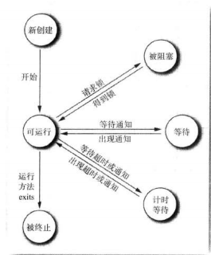

<h1>Java学习笔记</h1>
[TOC]

## 概念、环境、基本结构

下载和安装JDK，配置环境变量（略）

HelloWorld程序

```java
public class Main{
    public static void main(String[] args){
        System.out.println("Hello World!");
    }
}
```

注释：单行注释、多行注释、类/方法注释

数据类型：

- 基本类型：
  - 整型：byte、short、int、long
  - 浮点型：float、double
  - 字符型：char
  - 布尔型：boolean
- 引用类型：数组、对象、枚举

代码点由一至多个代码单元构成

常量与变量：常量分为字面值常量与final修饰的符号常量，变量的值可以改变

运算符与优先级：注意逻辑运算符的短路求值

类型转换：隐式类型转换（低精度=>高精度）、显式类型转换

字符串：

- 字符串不可变性
- 字符串拼接
- 空串与Null
- length与codePointCount()
- 字符串函数：

```java
char charAt(int index);
int codePointAt(int index);
int compareTo(String other);
boolean endsWith(String suffix);
boolean equals(Object other);
boolean equalsIgnoreCase(String other);
int indexOf(String str[,int fromIndex]);
int indexOf(int codePoint[,int fromIndex]);
int lastIndexOf(String str[,int fromIndex]);
int lastIndexOf(int codePoint[,int fromIndex]);
int length();
int codePointCount(int startIndex,int endIndex);
String substring(int beginIndex[,int endIndex]);
String toLowerCase();
String toUpperCase();
String trim();
```

String、StringBuilder、StringBuffer的区别：String不可变，StringBuilder可以多次修改且高效、StringBuffer线程安全。

输入、输出：

```java
Scanner in = new Scanner(System.in);
while(in.hasNext()){
    System.out.println(in.nextLine());
    //in.next();
    //in.nextInt();
}

System.out.println();
System.out.print();
System.out.printf();
```

控制流程：

- 块作用域：嵌套块不允许重名
- 分支语句：if-else、switch，switch语句支持整型、字符型、字符串常量
- 循环语句：while、for循环、通用for循环（实现迭代器接口）
- 中断控制语句：break、continue，支持标签

大数类型——BigInteger和BigDecimal

数组：

- 实现了Iterable接口
- 匿名数组
- 数组工具类Arrays
- 数组的数组

## 面向对象

### 对象与类

访问控制类型：

- public：公有
- private：私有
- **protected：保护，只能被子类或者同一个包内访问**
- **default：默认，只能被同一个包访问**

this：指代对象本身、调用其他构造器、访问类成员

final：常量、最终类、最终方法

static：专属于类的成员

方法参数：值传递，对象传递的是引用变量的值

签名：方法名及其参数类型

重载：方法名相同，签名不同

重写：签名相同，一个是父类方法，一个是子类方法

对象构造：

- 重载构造器
- 默认无参构造器：没有定义任何构造器时自动生成
- 有参构造器
- 类内初始化
- 初始化块与静态初始化块
- **构造顺序：默认初始化、初始化语句与初始化块、构造器**

对象析构：垃圾回收器、finalize

包：import、import static、package、

类路径：CLASSPATH、-classpath、当前目录(.)

### 继承

Java使用extends关键字完成类的继承，且仅支持单继承，被继承的类是超类，继承超类的是子类

子类扩展超类的手段：增加域、增加方法、覆盖方法，但无法删除继承的任何域和任何方法

> 区别覆盖与重载

多态：变量引用多种实际类型的对象，超类变量可以引用子类对象，超类变量必须强转才能赋值给子类变量

> 子类数组可以隐式转换为超类数组，必须牢记数组元素的实际类型

super关键字：调用超类构造器、访问超类成员（不能指代自身）

方法调用过程：

- 查找本类及其超类中特定名称的方法
- 重载解析，找到参数类型最佳匹配的方法
- 静态绑定：private、static、final、构造器；动态绑定：可以被重写的方法动态绑定
- 调用与引用对象的实际类型最合适的那个类的方法

最终类、最终方法：不允许继承的类和方法，使用final关键字

继承中的类型转换：超类变量可以引用子类对象，子类对象赋值给超类对象要强转，使用instanceof运算符可以判断继承关系

> instanceof不支持泛型

抽象类：

- 使用abstract修饰
- 可以包含抽象方法或具体方法，也可以只包含具体方法，具体方法可以调用抽象方法
- 抽象类不能实例化
- 子类必须实现抽象方法或者声明为抽象类

Object类：

- Object是其他所有引用类型（类、数组、枚举、String）的超类，即便没有extends

- equals与hashcode方法：进行相等性比较和散列操作，一般地，重写equals必须同时修改hashcode，要保证不相等的对象的hashcode也不同。设置hashcode的目的就是提高散列结构如HashMap、HashSet中的查找效率。

- equals与`==`的区别：`==`基本类型判断值相等，引用类型判断引用相等，不能被重载。equals在不同继承层级上语义不同，Object类的equals方法作用与`==`相同，而String类比较的则是值相等，作用与`==`不同。

- 重写equals的方法：自反性校验=>null校验=>类型相同校验（类型兼容校验、转型）=>调用super.equals()=>对每一个域调用equals方法

- 重写hashcode方法：

  ```java
  @Override
  public int hashcode(){
      return Objects.hash(name,salary,hireDay);
  }
  ```

- 其他方法：toString、clone、finalize

ArrayList

- 常见方法：add、ensureCapacity、size、trimToSize、get、set、toArray、remove
- 注意泛型与原生类型之间的交互，必要时使用@SuppressWarnings("uncheck")

包装类

- 常见的包装类：Integer、Character、Void，其余均是基本类型首字母大写
- 自动装箱与自动拆箱：包装类\==自动拆箱\==>基本类型，基本类型\==自动装箱\==>包装类型
- 对于包装类型应当使用equals进行值的比较
- 包装类常见方法（以Integer为例）:intValue、toString、parseInt、valueOf

可变参数：

```java
public static void sayHello(Object...args){
    for(Object obj:args){
        System.out.println(obj);
    }
}

public static void main(String[] args){
    sayHello("123",456,new Date())
}
```

枚举类

```java
public enum Size{
    SMALL,
    MEDIUM,
    LARGE,
    EXTRA_LARGE
}

public enum Size{
    SMALL("sm"),
    MEDIUM("md"),
    LARGE("l"),
    EXTRA_LARGE("xl");
    private String abbr;
    //只能定义私有构造器
    private Size(String abbr){
        this.abbr = abbr;
    }
    public String getAbbr(){
        return abbr;
    }
}
```

- 所有枚举都是Enum的子类
- Enum的常见方法：toString、valueOf、values、ordinal

### 反射

反射：能够分析类能力的程序称为反射

反射的作用：

- 在运行中分析类的能力
- 在运行中查看对象
- 实现通用的数组操作代码
- 利用Method对象

Class类：

- 获得class对象：`对象.getClass()`、`类型.class`、`Class.forName(classname)`
- 创建实例对象：`newInstance`
- 获得域：`getFields`、`getField`、`getDeclaredFields`、`getDeclaredField`
- 获得方法：`getMethods`、`getMethod`、`getDeclaredMethods`、`getDeclaredMethod`
- 获得构造器：`getConstructors`、`getConstructor`、`getDeclaredConstructors`、`getDeclaredConstructor`
- 获得类名：`getName`
- 获得类修饰符：`getModifiers`
- 获得超类：`getSuperClass`
- 获得接口：`getInterfaces`
- 获得类加载器：`getClassLoader`

利用反射分析类：

- Field：描述类的域
  - `equals`：相等性比较
  - `get/set等方法`：获取/设置值
  - `getName`：获得域名
  - `getModifiers`：获得修饰符
  - `getType`：获得类型
  - `setAccessible`：设置访问权限
- Method：描述类的方法
  - `equals`：相等性比较
  - `invoke`：调用方法
  - `getName`：获得方法名
  - `getReturnType`：获得返回值类型
  - `setAccessible`：设置访问权限
- Constructor：描述类的构造器
  - `equals`：相等性比较
  - `newInstance`：根据构造器创建一个对象
  - `getName`：获得构造方法名
  - `setAccessible`：设置访问权限
- Modifier：修饰符

利用反射访问类成员：

```java
public class Main{
    public static void main(String[] args){
        User user = new User();
        Class<? extends User> userClass = user.getClass();
        Field username = userClass.getDeclaredField("username");
        username.setAccessible(true);
        username.set(user,"ljh");
        Field password = userClass.getDeclaredField("password");
        password.setAccessible(true);
        password.set(user, "123");
        Field uid = userClass.getDeclaredField("uid");
        uid.setAccessible(true);
        uid.set(user,123);
    }
}
```

### 接口与内部类

接口

- 接口不是类，是对类的一组需求描述，对类的格式进行约束
- 接口不能实例化，只能被实现类实现，一个类可以实现多个接口
- 接口没有实例域，所有域自动被public static final修饰，一般没有方法的实现。但java 8新特性允许使用default关键字定义方法的默认实现，允许使用static关键字定义静态方法。default方法可以调用接口的其他方法。
- 接口之间可以相互继承
- 接口的实现类必须实现接口的所有非default方法，否则必须声明为abstract
- 接口方法修饰符只能是public，不能是private、final
- 接口不允许定义构造器和初始化块

> Comparable\<T>接口：声明了compareTo方法，调用Arrays.sort方法时必须保证所有元素实现了该接口
>
> Cloneable接口：实现该接口就能通过调用Object.clone实现拷贝

接口与回调：事件发生时指定执行某个方法，c++一般会传入一个函数指针，而Java中可以考虑定义一个接口

内部类：

- 成员内部类：作为类成员的类
- 静态内部类：作为类静态成员的类
- 局部内部类：定义在局部作用域的类
- 匿名内部类：不具名的局部内部类
- 成员内部类能够访问外围类所有成员，静态内部类可以访问外围类所有静态成员，局部内部类可以访问外部类成员和**被final修饰**的局部变量；内部类对外是隐藏的
- 成员内部类和静态内部类可以像其他成员一样添加访问控制修饰符：`public`、`private`、`protected`、`default`
- 内部类特殊的语法规则：`OuterClass.InnerClass`

  ```java
  Outer.Inner inner = new Outer.Inner();//静态内部类
  Outer.Inner inner = outer.new Inner();//普通内部类
  Outer.this;//普通内部类
  ```

### 代理

代理：在运行时创建实现某些接口的类的实例，该类具有接口定义的全部方法和Object类的全部方法。

创建代理：

- 提供一个调用处理器，调用处理器是实现了InvocationHandler接口的对象，这个接口中只有一个方法

  ```java
  class InvocationHandlerImpl implements InvocationHandler{
      private Object target;
  
      public InvocationHandlerImpl(Object target) {
          this.target = target;
      }
  
      @Override
      public Object invoke(Object proxy, Method method, Object[] args) throws Throwable {
          System.out.println("call invoke");
          return method.invoke(target,args);
      }
  }
  ```

- 提供一个或多个接口并给出实现类，实例化

  ```java
  interface HelloInterface{
      void sayHello();
  }
  
  class Person implements HelloInterface{
      @Override
      public void sayHello() {
          System.out.println("hello world");
      }
  }
  ```

- 使用Proxy类的newInstance方法创建一个代理对象，这个方法有三个参数，分别是一个类加载器、一个Class对象数组、一个调用处理器

  ```java
  InvocationHandlerImpl handler = new InvocationHandlerImpl(new Person());//调用处理器
  Class[] clazzes = new Class[]{HelloInterface.class};//Class对象数组
  ClassLoader classLoader = Person.class.getClassLoader();//类加载器
  //创建代理对象
  Object proxy = Proxy.newProxyInstance(Person.class.getClassLoader(),clazzes,handler);
  ((HelloInterface)proxy).sayHello();//调用代理对象方法
  ```

- 代理对象的sayHello方法被调用时，会转而执行调用处理器中的invoke方法，该方法利用反射去调用原始对象的sayHello方法

## 事件处理与GUI

### 图形程序设计

框架（JFrame）：顶层窗口

- 设置退出：`setDefaultCloseOperation(JFrame.EXIT_ON_CLOSE);`
- 显示窗口：`setVisible(true);`
- 获得屏幕大小：`Toolkit.getDefaultToolkit().getScreenSize();`
- 将框架设置为最大：`frame.setExtendedState(Frame.MAXMIZED_BOTH);`
- 根据内部元素确定大小：`frame.pack();`
- 四层面板：根面板、层级面板、玻璃面板、内容面板，其中内容面板用来容纳其他元素

组件（JComponent）/容器（JPanel）：

- 绘制组件：paintComponent
- 添加元素：add

绘制图形：

- 设备上下文：Graphics、Graphics2D
- 图形：Shape接口、Line2D、Rectangle2D、Ellipse2D
- 颜色：Color
- 文本：Font，理解上坡度、下坡度、行高、行间距
- 图像：Image

### 事件处理

- AWT事件处理机制
  - 事件监听器：监听特定事件发生的部件，是一个实现了特定监听器接口的类的实例，监听器根据事件对象决定对事件的响应

  - 事件源：事件发生的来源，能够注册事件监听器并发送事件对象，当事件发生时，事件源将事件对象发送给所有注册的监听器

  - 事件对象：java语言将事件相关信息封装在对象中，所有事件对象最终都派生于`EventObject`

```java
JFrame frame = new JFrame();
frame.setSize(300,300);
frame.setDefaultCloseOperation(JFrame.DISPOSE_ON_CLOSE);
JButton button = new JButton("click");
frame.setContentPane(button);
//为按钮注册事件监听器
button.addActionListener(new ActionListener() {
    private int flag=0;
    @Override
    public void actionPerformed(ActionEvent e) {
        JButton button = (JButton)e.getSource();//返回事件对象的引用
        if(flag==0){
            button.setBackground(Color.RED);
        }
        else if(flag==1){
            button.setBackground(Color.GREEN);
        }
        else{
            button.setBackground(Color.BLUE);
        }
        flag=(flag+1)%3;
    }
});
frame.setVisible(true);
```

- 观感（LookAndFeel）

- 适配器类：WindowListener => WindowAdapter

- 动作：

  - Action接口：
    - actionPerformed：执行动作
    - setEnabled：设置动作使能
    - isEnabled：获得动作使能
    - putValue/getValue：添加、获得键值对，可以使用预定义的动作名称
    - addPropertyChangeListener/removePropertyChangeListener：动作对象的属性发生变化时响应事件监听者
  - 使用动作：
    - 按钮：JButton
    - 按键：KeyStroke

- 常见事件总结：

  | 接口                | 方法                                                         | 事件对象/访问方法                                            | 事件源                                             |
  | ------------------- | ------------------------------------------------------------ | ------------------------------------------------------------ | -------------------------------------------------- |
  | ActionListener      | actionPerformed                                              | **ActionEvent**<br>getActionCommand<br>getModifiers          | AbstractButton<br>JComboBox<br>JTextField<br>Timer |
  | AdjustmentListener  | adjustmentValueChanged                                       | **AdjustmentEvent**<br>getAdjustable<br>getAdjustmentType<br>getValue | JScrollBar                                         |
  | ItemListener        | itemStateChanged                                             | **ItemEvent**<br>getItem<br>getItemSelectable<br>getStateChange | AbstractButton<br>JComboBox                        |
  | FocusListener       | focusGained<br>focusLost                                     | **FocusEvent**<br>isTemporary                                | Component                                          |
  | KeyListner          | keyPressed<br>keyReleased<br>keyTyped                        | **KeyEvent**<br>getKeyChar<br>getKeyCode<br>getKeyModifiersText<br>getKeyText<br>isActionKey | Component                                          |
  | MouseListener       | mousePressed<br>mouseReleased<br>mouseEntered<br>mouseExited<br>mouseClicked | **MouseEvent**<br>getClickCount<br>getX<br>getY<br>getPoint<br>translatePoint | Component                                          |
  | MouseMotionListener | mouseDragged<br>mouseMoved                                   | **MouseEvent**                                               | Component                                          |
  | MouseWheelListener  | mouseWheelMoved                                              | **MouseWheelEvent**<br>getWheelRotation<br>getScrollAmount   | Component                                          |
  | WindowListener      | windowClosing<br>windowOpened<br>windowIconified<br>windowDeiconified<br>windowClosed<br>windowActivated<br>windowDeactivated | **WindowEvent**<br>getWindow                                 | Window                                             |
  | WindowFocusListener | windowGainedFocus<br>windowLostFocus<br>                     | **WindowEvent**<br>getOppositeWindow                         | Window                                             |
  | WindowStateListener | windowStateChanged                                           | **WindowEvent**<br>getOldState<br>getNewState                | Window                                             |

  

### Swing GUI程序设计

布局管理：

- FlowLayout：流布局
- BorderLayout：边框布局，分为五大区域（NORTH、SOUTH、LEFT、RIGHT、CENTER）
- GridLayout：网格布局
- GridBagLayout：网格组布局，配合GridBagConstraints使用。GridBagConstraints包含weightx、weighty、gridx、gridy、gridwidth、gridheight、fill、anchor、insets等属性
- GroupLayout：组布局

组件：

| 组件                 | 描述                                                         |
| -------------------- | ------------------------------------------------------------ |
| JTextComponent       | 文本输入组件的基类，可以设置和获取文本值、设置文本输入组件能否允许编辑 |
| JTextField           | 文本输入域，可以设置文本输入域的宽度，但要调用revalidate重新渲染 |
| JLabel               | 标签组件，可以设置文本、图标以及对齐方式（SwingConstants中定义的常量） |
| JPasswordField       | 密码输入域                                                   |
| JTextArea            | 文本区，可以设置宽度、高度和折行，可以设置或追加文本         |
| JScrollPane          | 滚动窗格，文本区中没有滚动条，可以将文本区添加到滚动窗格中   |
| JCheckBox            | 复选框，可以设置和获取标签和选中状态                         |
| JRadioButton         | 单选按钮，可以设置和获取标签和选中状态                       |
| ButtonGroup          | 可以将互斥的单选按钮放在同一个按钮组中，按钮组只控制按钮的行为 |
| Border               | 边框，通过工厂对象BorderFactory创建不同风格的边框            |
| TitledBorder         | 添加了标题的边框，传入一个Border对象，并添加标题，通过工厂对象BorderFactory完成创建 |
| CompoundBorder       | 将两个边框合并为一个新的边框，通过BorderFactory完成创建      |
| SoftBevelBorder      | 柔和边角的斜面边框，通过构造器完成创建                       |
| LineBorder           | 直线边框，可以添加圆角                                       |
| JComboBox\<T\>       | 组合框                                                       |
| JSlider              | 滑动条，垂直滑动条添加SwingConstants.VERTICAL，滑动条滑动时会创建ChangeEvent对象 |
| JMenuBar             | 容纳菜单的容器                                               |
| JMenu                | 菜单，可以添加菜单项、分隔符                                 |
| JMenuItem            | 菜单项，可以为菜单项绑定Action动作                           |
| JCheckBoxMenuItem    | 复选菜单项，配合ButtonGroup使用                              |
| JRadioButtonMenuItem | 单选菜单项，配合ButtonGroup使用                              |
| JPopupMenu           | 弹出菜单，调用show方法显示弹出菜单，通过setComponentPopupMenu将弹出菜单绑定到框架上 |
| JToolBar             | 工具栏，与菜单栏类似，添加Action                             |

对话框：

| 对话框        | 描述                                                         |
| ------------- | ------------------------------------------------------------ |
| JOptionPane   | 显示消息、确认、选项、输入对话框，左侧图标由五种消息类型决定，指定的消息类型包括String、Icon、Component、Object[]、Object，四种按钮类型，五种返回类型 |
| JDialog       | 普通对话框                                                   |
| JFileChooser  | 建立对象、设置当前目录、设置默认选择、设置是否允许选择多文件、设置文件过滤器（FileFilter接口）、设置文件选择模式（文件/目录）、显示对话框、获得文件 |
| JColorChooser | 颜色选择对话框                                               |

## 部署应用程序、异常、断言、调试、日志

1、jar文件：

- 使用jar命令进行打包

  ```java
  jar cvf CalculatorClasses.jar *.class icon.gif
  ```

- 清单文件：命名为MANIFEST.MF，位于Jar文件的META-INF，清单条目被分为若干节，第一节称为主节，作用于整个JAR文件，随后的条目用来指定已命名条目的属性。编辑清单文件使用jar cfm命令

- 可运行JAR文件：
  创建：jar cvfe jar文件 入口类
  运行：java -jar jar文件

2、资源：

- 常见资源文件：多媒体文件、文本文件、二进制数据文件

- 搜索资源文件：

  获得具有资源的class文件，多媒体文件调用getResouce获得资源位置后再利用getImage或getAudioClip方法进行读取，其他资源可以利用getResourceAsStream方法读取文件数据
  
  定位类并在同一位置找到资源
  
  ```java
  URL url = HelloWorld.class.getReource("about.gif");
  Image img = new ImageIcon(url).getImage();
  InputStream stream = HelloWorld.class.getResourceAsStream("about.txt");
  Scanner in = new Scanner(stream);
  ```
  

3、密封：

java包密封可以保证不会其他类加入到特定的包中

在清单文件的主节中加入下面一行：

  ```txt
  Sealed: true
  ```

如果希望针对单独的包进行密封，那么可以在清单文件中增加一节

  ```txt
  Name: cn/edu/chd/controller/
  Sealed: true  
  ```

4、Java Web Start

基本特性：

- 浏览器发布，运行不依赖浏览器
- 不在浏览器窗口内运行
- 不使用浏览器的java实现
- 数字签名应用程序可以被赋予访问本地机器的任意权限

使用：

- 编译程序：javac *.java

- 创建一个jar文件：jar cvfe Main Main *.class

- 准备启动文件Main.jnlp

  ```xml
  <?xml version="1.0" encoding="utf-8"?>
  <jnlp spec="1.0+" codebase="http://localhost:8080/helloJava_war_exploded/" href="Main.jnlp">
  	<information>
      	<title>Main Application</title>
          <vendor>CHDLJH</vendor>
          <description>Main Application</description>
          <offline-allowed/>
      </information>
      <resources>
      	<java version="1.8.0+"/>
          <jar href="Main.jar"/>
      </resources>
      <application-desc/>
      <!--创建快捷方法-->
      <shortcut>
      	<desktop/>
      </shortcut>
      <icon href="icon.png" width="32" height="32"/>
  </jnlp>
  ```

- 将jar文件与启动文件部署在web服务器上

- 通过检查application/x-java-jnlp-file MIME类型与javaws应用程序的关联情况确保浏览器已经为Java Web Start进行了配置。如果安装了JDK，配置将自动完成。

- 启动Tomcat

- 浏览器访问`http://localhost:8080/Main.jnlp`

沙箱：为了安全，JWS应用程序只能够在受限制的执行环境中运行，这个执行环境就是沙箱。

签名代码：如果想让jws应用程序无限制运行，就必须进行数字签名。无限制的运行代码需要在jnlp文件中添加以下内容：

```xml
<security>
	<all-permissions/>
</security>
```

JNLP API：略

5、配置文件

属性映射：存储key-value值对的数据结构，属性映射经常用来存放配置信息。属性映射具有三个特性：键和值都是字符串，键值对很容易写入文件或从文件读出，用二级表存放默认值。

Properties：Java实现属性映射的类，该类继承了`Hashtable<Object,Object>`类

常见方法：put、store、load、setProperty、getProperty

Preferences API：略

6、异常


常见的RuntimeException：

- ArithmeticException
- ClassCastException
- NullPointerException
- StringIndexOutOfBoundsException
- NegativeArraySizeException
- IllegalArgumentException
- NumberFormatException
- ArrayIndexOutOfBoundsException
- ClassNotFoundException
- ArrayStoreException
- NoSuchMethodException
- FileNotFoundException

处理异常的两种策略：

- 抛出异常：throw抛出异常，throws声明异常
- 捕获异常：try-catch-finally语句，try块内return后finally也会执行，finally内的return会覆盖try块中return

创建异常类的方法：继承Exception或子类

带资源的try块：资源对象必须实现了Closeable接口

打印堆栈跟踪元素：e.printTraceStack();

7、断言

assert cond: expr;

如果cond为false，抛出AssertionError异常，表达式将被传入AssertionError的构造器中。

8、日志（略）

## 泛型

泛型类：

```java
class Hello<T>{
    //...
}
```

泛型方法：

```java
public void sayHello<T>(){
    //...
}
```

类型变量的限定：

```java
T extends Comparable
E extends Comparable & Serializable
```

泛型代码与虚拟机：

- 翻译泛型表达式：虚拟机没有泛型，所有泛型都对应一个原始类型，类型变量经过擦除会变成限定类型。

- 翻译泛型方法：

  ```java
  class DateInterval extends Pair<Date>{
      public void setSecond(Date second){
          //...
      }
  }
  ```

  擦除后会得到两个方法，一个是擦除后的方法，一个继承Pair类的方法

  ```java
  public void setSecond(Date second);
  public void setSecond(Object second);
  ```

  解决方法：添加桥方法

  ```java
  public void setSecond(Object second){
      setSecond((Date)second);//桥方法
  }
  ```

  但对于下面的问题，桥方法就变得比较复杂：

  ```java
  class DateInterval extends Pair<Date>{
      public Date getSecond(){
          //...
      }
  }
  ```

  擦除后会得到两个方法，但只有返回值不同：

  ```java
  public Date getSecond();
  public Object getSecond();
  ```

  这两个方法的方法签名完全一样，语法上无法区分，但在JVM中可以根据返回值进行区分。

- 调用遗留代码：原始类型与泛型之间转换会报警告。

约束与局限性：

- 不能用基本类型实例化类型参数

- instanceof运算符不支持泛型，只能检查是否属于原始类型；getClass()返回的也是原始类型

- 不允许创建参数化类型的数组，但可以声明变量

- 泛型可变参数会报Varargs警告

- 不能实例化类型变量，诸如new T(...)、new T[...]、T.class的写法是错误的

  可以通过反射创建泛型对象：

  ```java
  public static <T> Pair<T> makePair(Class<T> clazz){
      try{
          return new Pair<>(clazz.newInstance(),clazz.newInstance());
      }
      catch(Exception e){
          return null;
      }
  }
  ```

  如果要创建一个泛型数组，不能使用new T[...]，而应该使用Object[...]，然后再通过反射创建数组

  ```java
  public static <T extends Comparable> T[] minmax(T...a){
      //...
      T[] arr = (T[])Arrays.newInstance(a.getClass().getComponentType(),2);
  }
  ```

- 泛型类的静态上下文中类型变量无效

- 不能抛出或捕获泛型类的实例

- 当泛型类型被擦除后，无法创建引发冲突的条件：

  - 如果类型擦除后会导致冲突，那么必须重新给方法命名
  - 一个类不能实现以自己为类型参数的接口

泛型类型的继承规则：

- 无论S与T有什么样的联系，`Pair<S>`与`Pair<T>`一般没有任何联系
- 永远可以将参数化类型转换为原始类型，但转换成原始类型后可能会产生类型错误
- 泛型类可以继承其他泛型类或实现其他泛型接口

通配符类型：

- 为什么要引入通配符类型：固定的参数类型无法满足泛型程序设计的要求

- 通配符的几种形式：

  - 无限定通配符：`Pair<?>`
  - 上限定通配符：`Pair<? extends Test>`
  - 下限定通配符：`Pair<? super Test>`

- 通配符捕获：swap方法包含Pair<?>类型的形参，交换过程中要使用“？”类型中间变量，这时可以写一个泛型方法swapHelper（假设参数类型为T），swap方法调用swapHelper方法，则称T捕获了通配符。

  一般情况下，不需要使用参数类型变量的情况下可以考虑使用通配符，否则就考虑用泛型方法。

反射与泛型：

- Class类是一个泛型类
- 泛型类的特性之一是类型擦除，但是使用反射API能够确定泛型相关信息。
- 为表达泛型类型声明，提供了新的接口Type，该接口的子类型（extends）有：
  - Class：描述具体类型
  - TypeVariable：描述类型变量
  - WildcardType：描述通配符
  - ParameterizedType：描述泛型类或接口类型
  - GenericArrayType：描述泛型数组

## 集合


集合的接口：

- Iterable：表示接口能够进行迭代

  | 方法名                                     | 描述                                                         |
  | ------------------------------------------ | ------------------------------------------------------------ |
  | `Iterator<T> iterator()`                   | 返回迭代器                                                   |
  | `void forEach(Consumer<? super T> action)` | 对集合中的每一个元素执行给定的操作直到遍历完集合或者抛出异常 |

- Iterator：迭代器，用于对集合进行遍历操作。不同于c++迭代器，<span style="font-weight:bold;color:red;">应该将Java迭代器理解为两个元素之间的位置</span>

  | 方法名                                              | 描述                                                         |
  | :-------------------------------------------------- | ------------------------------------------------------------ |
  | `boolean hasNext()`                                 | 判断是否是否有下一个没有遍历的元素                           |
  | `E next()`                                          | 返回下一个元素，如果没有下一个元素则抛出`NoSuchElementException` |
  | `void remove()`                                     | 从底层集合中移除迭代器所指向的元素，调用该方法之前必须先调用next方法，否则就会抛出`IllegalStateException` |
  | `void forEachRemaining(Consumer<? super E> action)` | 对集合中的每一个元素执行给定的操作直到遍历完集合或者抛出异常 |

- ListIterator：列表的迭代器，继承了Iterator接口，不仅能够向后遍历，还能够向前遍历，向序列中添加元素

  | 方法名                  | 描述                                             |
  | ----------------------- | ------------------------------------------------ |
  | `boolean hasPrevious()` | 判断列表迭代器还能向前移动吗                     |
  | `E previous()`          | 迭代器向前移动                                   |
  | `int nextIndex()`       | 返回位于迭代器之后的元素下标，0 <= index <= n    |
  | `int previousIndex()`   | 返回位于迭代器之前的元素下标，-1 <= index <= n-1 |
  | `void set(E e);`        | 设置位于迭代器之前的元素的值                     |
  | `void add(E e)`         | 在迭代器之后添加元素                             |

- Enumeration：遗留的迭代器接口

  | 方法名                    | 描述                         |
  | ------------------------- | ---------------------------- |
  | boolean hasMoreElements() | 判断是否有更多的元素         |
  | E nextElement()           | 返回下一个元素并将迭代器后移 |
  
- Collection：集合体系中最基本的接口，继承了Iterable接口

  | 方法名                                               | 描述                                                         |
  | ---------------------------------------------------- | ------------------------------------------------------------ |
  | `int size()`                                         | 返回集合的元素个数                                           |
  | `boolean isEmpty()`                                  | 判断集合是否为空                                             |
  | `boolean contains(Object object)`                    | 判断集合是否与object相等的元素                               |
  | `boolean containsAll(Collection<? extends E> other)` | 判断集合是否包含other集合中的所有元素                        |
  | `boolean add(Object element)`                        | 添加元素，如果成功返回true                                   |
  | `boolean addAll(Collection<? extends E> c)`          | 添加c中的所有元素到集合中，如果有改变集合返回true            |
  | `boolean remove(Object o)`                           | 移除与o相等的元素，如果有改变集合则返回true                  |
  | `boolean removeAll(Collection<?> c)`                 | 移除与集合c中任意一个元素相等的元素，如果有改变集合则返回true |
  | `void clear()`                                       | 删除所有的元素                                               |
  | `boolean retainAll(Collection<?> c)`                 | 移除与集合c中所有元素都不相等的元素，如果有改变集合则返回true |
  | `Object[] toArray()`                                 | 返回集合的对象数组                                           |
  | `<T> T[] toArray(T[] a)`                             | 返回集合的泛型数组，如果传入的数组不够大将分配一个新数组     |

- Map：映射体系中最基本的接口

  | 方法名                                           | 描述                                                         |
  | ------------------------------------------------ | ------------------------------------------------------------ |
  | `int size()`                                     | 返回映射表的大小                                             |
  | `boolean isEmpty()`                              | 判断集合是否为空                                             |
  | `boolean containsKey(Object key)`                | 判断映射表是否包含给定的键                                   |
  | `boolean containsValue(Object value)`            | 判断映射表是否包含给定的值                                   |
  | `V get(Object key)`                              | 根据键获得值                                                 |
  | `V put(K key, V value)`                          | 添加键值对，返回原来的值                                     |
  | `V remove(Object key)`                           | 根据键移除键值对，返回值                                     |
  | `void putAll(Map<? extends K, ? extends V> m)`   | 对另外一个集合中的每一个键值对调用put方法                    |
  | `void clear()`                                   | 清空映射表                                                   |
  | `Set<K> keySet()`                                | 返回键的集合                                                 |
  | `Collection<V> values()`                         | 返回值的集合                                                 |
  | `Set<Map.Entry<K, V>> entrySet()`                | 返回键值对的集合                                             |
  | `V getOrDefault(Object key, V defaultValue)`     | 根据键获得值或者默认值                                       |
  | `V putIfAbsent(K key, V value)`                  | get方法返回null时执行put操作                                 |
  | `boolean remove(Object key, Object value)`       | 根据键和值移除键值对，如果不匹配不进行移除返回false，如果移除成功返回true |
  | `boolean replace(K key, V oldValue, V newValue)` | 替换键值对的值，如果当前值与oldvalue的值不相等就不进行替换，替换成功返回true，替换失败返回false |
  | `V replace(K key, V value)`                      | 替换键值对，返回旧值                                         |

  Map.Entry：

  | 方法名              | 描述   |
  | ------------------- | ------------------- |
  | K getKey()          | 返回键 |
  | V getValue()        | 返回值 |
  | V setValue(V value) | 设置值 |

- List：有序容器，元素可以重复，继承了Collection接口，允许出现多个null值

  | 方法名                                                 | 描述                                                         |
  | :----------------------------------------------------- | ------------------------------------------------------------ |
  | `boolean addAll(int index, Collection<? extends E> c)` | 将集合c中的元素插入到列表中，其中index是插入第一个元素的位置 |
  | `void sort(Comparator<? super E> c)`                   | 对列表进行排序，传入一个Comparator接口的实现                 |
  | `E get(int index)`                                     | 按下标访问列表元素                                           |
  | `E set(int index, E element)`                          | 按下标设置列表元素                                           |
  | `void add(int index, E element)`                       | 按下标添加元素                                               |
  | `E remove(int index)`                                  | 按下标移除元素                                               |
  | `int indexOf(Object o)`                                | 查找列表中第一个等于o的元素下标，查找失败返回-1              |
  | `int lastIndexOf(Object o)`                            | 查找列表中最后一个等于o的元素下标，查找失败返回-1            |
  | `ListIterator<E> listIterator()`                       | 返回列表迭代器                                               |
  | `ListIterator<E> listIterator(int index)`              | 给定下标元素之前的迭代器                                     |
  | `List<E> subList(int fromIndex, int toIndex)`          | 返回给定区间的子列表（不是子序列），区间<span style="color:red">左闭右开 </span> |

- Set：无序容器，元素一般不能重复，继承了Collection接口，只允许出现一个null值元素

  Set接口没有扩展新的方法，只有继承自Collection接口的方法，与Collection只有语义上的区别

- Queue：队列接口，继承自Collection接口，扩展方法如下

  | 方法名               | 描述                                                         |
  | -------------------- | ------------------------------------------------------------ |
  | `boolean add(E e)`   | 队尾添加元素，如果添加成功返回true，否则抛出IllegalStateException |
  | `boolean offer(E e)` | 队尾添加元素，如果添加成功返回true，否则返回false，不抛出异常 |
  | `E remove()`         | 队头删除元素，返回删除的元素，否则抛出NoSuchElementException |
  | `E poll()`           | 队头删除元素，返回删除的元素，否则返回null                   |
  | `E element()`        | 返回队头元素，如果队空抛出NoSuchElementException异常         |
  | `E peek()`           | 返回队头元素，如果队空返回null                               |

- Deque：双端队列接口，继承Deque接口，Deque又继承Collection接口

  | 方法名                                    | 描述                                                         |
  | ----------------------------------------- | ------------------------------------------------------------ |
  | `void addFirst(E e)`                      | 队头插入，插入失败抛出IllegalStateException                  |
  | `void addLast(E e)`                       | 队尾插入，插入失败抛出IllegalStateException                  |
  | `boolean offerFirst(E e)`                 | 队头插入，插入成功返回true，插入失败返回false                |
  | `boolean offerLast(E e)`                  | 队尾插入，插入成功返回true，插入失败返回false                |
  | `E removeFirst()`                         | 队头移除，返回移除的元素，否则抛出NoSuchElementException     |
  | `E removeLast()`                          | 队尾移除，返回移除的元素，否则抛出NoSuchElementException     |
  | `E pollFirst()`                           | 队头移除，返回移除的元素，否则返回null                       |
  | `E pollLast()`                            | 队尾移除，返回移除的元素，否则返回null                       |
  | `E getFirst()`                            | 获得队头元素，否则抛出NoSuchElementException                 |
  | `E getLast()`                             | 获得队尾元素，否则抛出NoSuchElementException                 |
  | `E peekFirst()`                           | 获得队头元素，否则返回null                                   |
  | `E peekLast()`                            | 获得队尾元素，否则返回null                                   |
  | `boolean removeFirstOccurrence(Object o)` | 移除等于o的第一个元素，如果集合有改变返回true，如果集合没有改变返回false |
  | `boolean removeLastOccurrence(Object o`   | 移除等于o的第一个元素，如果集合有改变返回true，如果集合没有改变返回false |
  | `void push(E e)`                          | 压栈，栈顶在队头，压栈失败抛出IllegalStateException          |
  | `E pop()`                                 | 出栈，栈顶在队头，出栈失败抛出NoSuchElementException         |
  | `Iterator<E> descendingIterator()`        | 返回反向遍历的迭代器                                         |

集合的实现：

| 集合            | 描述                                                         |
| --------------- | ------------------------------------------------------------ |
| ArrayList       | 实现了List接口，底层实现是一个数组                           |
| LinkedList      | 实现了List接口，一种可以在任何位置进行高效地插入和删除操作的有序序列 |
| Vector          | <span style="color:red;">线程安全</span>的顺序表，底层实现是一个数组 |
| ArrayDeque      | 循环数组实现的双端队列                                       |
| HashSet         | HashMap实现的没有重复元素的无序集合，只允许插入一个null      |
| TreeSet         | TreeMap实现的没有重复元素的无序集合，不允许插入null值        |
| EnumSet         | 使用位向量和位运算实现的枚举类型没有重复元素的无序集合       |
| LinkedHashSet   | LinkedHashMap实现的没有重复元素的无序集合，能够以插入的顺序进行遍历 |
| PriorityQueue   | 使用<span style="color:red">堆</span>实现的优先级队列，无论以什么样的方式插入元素都能按照顺序排列 |
| HashMap         | 使用<span style="color:red">散列表</span>技术实现的映射表，能够自适应保持合适的装填因子，只允许出现一个null值 |
| Hashtable       | 使用<span style="color:red">散列表</span>技术实现的映射表，类似于HashMap，但是保证了线程安全，不允许出现null值，注意t是小写 |
| TreeMap         | 使用<span style="color:red">红黑树</span>实现的映射表，不允许出现null值 |
| EnumMap         | 使用数组实现的针对枚举类型的映射表，不允许出现null值         |
| LinkedHashMap   | 使用双链表对HashMap进行索引，维护其插入的顺序                |
| WeakHashMap     | 使用弱引用引用对象，如果哈希表中的键值对没有其他引用，就会被移除，同时资源被回收 |
| IdentityHashMap | 与HashMap相比，散列值的计算不使用重写的hashcode方法，而是按照最原始的Object的hashcode方法 |
| Stack           | <span style="color:red">线程安全</span>的栈                  |
| Properties      | <span style="color:red">线程安全</span>的属性映射器          |
| BitSet          | 位集                                                         |

> 红黑树参考：https://www.jianshu.com/p/e136ec79235c
>
> fail-fast与fail-safe的区别

视图与包装器：

- Arrays.asList方法能够将数组当成一个列表看待，使用列表的接口访问数组（不允许修改），底层实现仍旧是一个数组
- Collections.nCopies能够返回一个实现了List接口的不可修改的对象，给人一种包含多个元素，每个元素都是一个对象的假象
- Collections.singleton方法能够返回一个不可修改的单元素集
- 子元素集：使用各种subXXX、headXXX、tailXXX创建的视图
- 同步视图：大多数集合都是线程不安全的，但是调用Collections.synchronizedXXX方法能够以线程同步的方式访问这些集合
- 检查视图：Collections.checkedXXX能够检查集合元素的类型

批操作：removeAll，addAll，retainAll

集合与数组的转换：asList、toArray

算法（体现在Collections中的方法）：

- 排序：采用的是归并排序，一种稳定排序方法，调用reverseOrder可以得到一个逆序的比较器
- 混排：
- 二分查找：仅支持顺序表，链表自动退化为普通查找
- 常用算法：交换、逆置、旋转、计数、公共结点判断

## 多线程

创建线程的步骤：

- 创建一个任务对象：Runnable、Callable
- 创建一个线程对象：Thread
- 启动线程

线程状态：

- New：新创建
- Runnable：可运行（就绪）
- Blocked：阻塞，线程试图获取其它线程持有的内部对象锁时
- Waiting：等待，线程等待其它线程通知调度器一个条件时
- TimedWaiting：计时等待，线程等待其他线程通知调度器一个条件或计时耗尽
- Running：运行
- Terminated：被终止



Thread：

| `实例域/方法名`                                              | 描述                                                         |
| ------------------------------------------------------------ | ------------------------------------------------------------ |
| `volatile String name`                                       | 线程名                                                       |
| `int priority`                                               | 优先级，1~10                                                 |
| `boolean daemon`                                             | 守护线程，为其他线程提供服务，一般不能访问固有资源           |
| `Runnable target`                                            | 线程执行的目标Runnable对象                                   |
| `ThreadGroup group`                                          | 线程组                                                       |
| `Thread.State state`                                         | 线程状态                                                     |
| `volatile UncaughtExceptionHandler defaultUncaughtExceptionHandler` | 未捕获异常默认处理器                                         |
| `volatile UncaughtExceptionHandler uncaughtExceptionHandler` | 通过get/set取得和设置异常处理器                              |
| `long getId()`                                               | 获得线程ID                                                   |
| `static Thread currentThread()`                              | 获得当前运行线程                                             |
| `static void yield()`                                        | 导致当前执行线程处于让步状态，其它同等优先级的可运行线程将被调度，注意这是一个静态方法 |
| `static void sleep(long millis, int nanos)`                  | 休眠，线程进入计时等待状态，计时耗尽后恢复可运行状态         |
| `static void sleep(long millis) throws InterruptedException` | 休眠，线程进入计时等待状态，计时耗尽后恢复可运行状态         |
| `synchronized void start()`                                  | 启动线程，线程由新创建状态变为可运行状态                     |
| `void run()`                                                 | 把Runnable中的方法当作普通的方法执行                         |
| `@Deprecated void stop()`                                    | 停止线程                                                     |
| `void interrupt()`                                           | 设置中断标志                                                 |
| `static boolean interrupted()`                               | 清除中断标志，成功返回true                                   |
| `boolean isInterrupted()`                                    | 获得中断标志                                                 |
| `@Deprecated void suspend()`                                 | 暂停线程                                                     |
| `@Deprecated void resume()`                                  | 恢复线程                                                     |
| `static int activeCount()`                                   | 返回当前线程的线程组及其子线程组中活跃的线程数               |
| `static int enumerate(Thread tarray[])`                      | 将当前线程组中的线程对象的引用拷贝到数组中                   |
| `synchronized void join(long millis)`                        | 等待终止指定的线程或者经过指定的毫秒数                       |
| `void join() throws InterruptedException`                    | 等待终止指定的线程                                           |
| `static void dumpStack()`                                    | 打印当前线程的堆栈追踪信息到错误输出                         |
| `void checkAccess()`                                         | 决定当前正在运行的线程是否有修改本线程的许可                 |

ThreadGroup：

| 实例域/方法名                     | 描述                                         |
| --------------------------------- | -------------------------------------------- |
| `boolean daemon`                  | 是否守护线程组                               |
| `boolean destroyed`               | 线程组是否被销毁                             |
| `int maxPriority`                 | 线程组最高优先级，1~10                       |
| `String name`                     | 线程组名                                     |
| `ThreadGroup parent`              | 父线程组引用                                 |
| `int activeCount()`               | 活跃线程数                                   |
| `int activeGroupCount()`          | 活跃线程组数                                 |
| `void checkAccess()`              | 决定当前正在运行的线程是否有修改本线程的许可 |
| `void destroy()`                  | 销毁线程组及其子线程组                       |
| `int enumerate(Thread list[])等`  | 将线程组中的线程对象的引用拷贝到数组中       |
| `void interrupt()`                | 线程组中所有线程interrupt                    |
| `void list()`                     | 列举线程组中线程信息并打印                   |
| `boolean parentOf(ThreadGroup g)` | 判断是否某个线程组的父线程组                 |
| <del>void resume() </del>         | 线程组中所有线程resume                       |
| <del>void stop()</del>            | 线程组中所有线程stop                         |
| <del>void suspend()</del>         | 线程组中所有线程suspend                      |

可重入锁（ReentrantLock）：

- 加锁和解锁语句，注意解锁语句必须放在finally子块中
- 可重入：线程可以重复获得已经持有的锁，所保持一个引用计数
- 公平锁：公平锁钟爱等待时间最长的线程，但是会降低性能
- 锁测试方法：
  - `boolean tryLock()`：尝试获得锁而没有发生阻塞，如果成功返回真。这个方法会抢夺可用的锁，即使这个锁是一个公平锁
  - `boolean tryLock(long time, TimeUnit unit)`：尝试获得锁，设置最长等待时间，time表示时间值，unit表示时间单位
  - `void lockInterruptibly()`：获得锁，但是会不确定地发生阻塞。如果线程被中断，抛出一个InterruptedException异常

```java
mylock.lock();//加锁
try{
    //critical section
}
finally{
    mylock.unlock();//把解锁语句放在finally子句中是至关重要的，否则可能会导致死锁
}
```

条件对象（条件变量，Condition）：

- `void newCondition()`：返回一个新的条件变量
- `void await()`：阻塞当前线程
- `void signal()`：从阻塞队列中唤醒一个线程
- `void signalAll()`：唤醒阻塞队列中所有线程
- `void await(long time,TimeUnit unit)`：进入该条件的等待集，直到线程从等待集中移出或等待了指定的时间后才解除阻塞。如果因为等待时间到了而返回就返回false，否则返回true
- `void awaitUniterruptibly()`：进入该条件的等待集，直到线程从等待集移出才解除阻塞。如果线程被中断，该方法不会抛出InterruptedException

```java
class MyThread extends Thread{
    private static Lock lock = new ReentrantLock();//可重入锁，多个线程共享一个锁
    private Condition cond = lock.newCondition();//条件对象，一把锁对应多个条件对象
    private static int num = 2;//临界资源

    @Override
    public void run() {
        try{
            while(true){
                lock.lock();//上锁，临界区开始
                try{
                    //P操作，如果num够减就减1，不够减就阻塞
                    while(num<=0)
                        cond.await();
                    num--;
                    
                    //业务代码
                    System.out.println(this);
                    sleep((long) (Math.random()*3000));
                    
                    //V操作，num加1，从阻塞队列中唤醒一个被阻塞的线程，如果没有阻塞的线程就什么也不做
                    num++;
                    cond.signal();
                }
                finally{
                    lock.unlock();//解锁，临界区结束
                }
                sleep((long) (Math.random()*3000));
            }

        }
        catch(Exception e){
            e.printStackTrace();
        }
    }
}
```

锁与条件变量的关系：

- 锁用来保护临界区代码，任何时刻只能有一个线程执行临界区代码，锁能够实现临界资源的互斥访问
- 锁可以管理试图进入临界区代码段的线程
- 锁可以拥有一至多个相关的条件对象
- 每个条件对象管理那些已经进入临界区代码段的但还不能运行的线程

synchronized关键字：

- 内部锁：Java语言中每个对象都有一个对象锁，如果一个方法用synchronized关键字声明，内部锁将保护该方法，要想访问该方法就必须获得内部锁。
  - 如果给同一个类的两个方法都添加synchronized关键字，两个线程调用该类同一对象的不同方法，这两个方法也是同步执行的，而非异步执行。也就是说，synchronized关键字的保护粒度是对象而不是方法。
- 相关条件：内部对象锁只有一个相关条件，wait方法添加一个线程到等待队列中，notify/notifyAll方法解除等待线程的阻塞状态
- 内部锁与条件的局限性：
  - 不能中断一个正在试图获得锁的线程
  - 试图获得锁时不能设定超时
  - 每个锁仅有单一的条件，可能是不够的
  - 最好既不使用Lock/Condition也不使用synchronized关键字，许多情况下可以使用java并发包中的一种机制
  - 如果特别需要Lock/Condition结构独有特性时，才使用Lock/Condition

```java
public class Main{
    private int amount=0;//临界资源
    public synchronized void p(){
        try {
            while (amount <= 0) wait();//将当前线程加入等待队列
            amount--;
            System.out.println("amount = " + amount);
            Thread.sleep((long) (Math.random()*1000));
            notifyAll();//唤醒等待队列的所有线程
        } catch (InterruptedException e) {
            e.printStackTrace();
        }
    }

    public synchronized void v(){
        try{
            while(amount >= 3) wait();//将当前线程加入等待队列
            amount++;
            System.out.println("amount = " + amount);
            Thread.sleep((long) (Math.random()*3000));
            notifyAll();//唤醒等待队列的所有线程
        } catch (InterruptedException e) {
            e.printStackTrace();
        }
    }
    public static void main(String[] args) throws Exception {
        Main m = new Main();
        for(int i=0;i<5;i++){
            new Thread(){
                @Override
                public void run() {
                    while(true)
                        m.p();
                }
            }.start();
            new Thread(){
                @Override
                public void run() {
                    while(true)
                        m.v();
                }
            }.start();
        }
    }
}
```

同步阻塞：同步方法可以获得锁，同步阻塞也可以获得锁

```java
private int amount=0;
    private final Object obj = new Object();//特殊的“锁”，必须定义为final
    public void p(){
        //同步块
        synchronized (obj) {
            try {
                while (amount <= 0) obj.wait();//线程等待
                amount--;
                System.out.println("amount = " + amount);
                Thread.sleep((long) (Math.random() * 1000));
                obj.notifyAll();//唤醒其它
            } catch (InterruptedException e) {
                e.printStackTrace();
            }
        }
    }

    public void v(){
        //同步块
        synchronized (obj) {
            try {
                while (amount >= 3) obj.wait();//线程等待
                amount++;
                System.out.println("amount = " + amount);
                Thread.sleep((long) (Math.random() * 3000));
                obj.notifyAll();//唤醒其它
            } catch (InterruptedException e) {
                e.printStackTrace();
            }
        }
    }
```

监视器：

- 监视器的特性：只包含私有域的类、每个监视器类的对象有一个相关的锁、使用该锁对所有的方法进行加锁、锁可以有多个相关条件

volatile域：为实例域的同步访问提供了一种免锁机制，声明volatile域可以通知编译器与虚拟机该域可能欸被另一个线程并发访问。volatile不能提供原子性

final变量：final限定也能安全地访问域

原子性：同时成功或同时失败，不可中断

死锁：略

ThreadLocal：为每个线程提供了独立的空间

```java
public class Main{
    private static final ThreadLocal<String> message = new ThreadLocal<>();
    //...
}
```

读/写锁（ReenterantReadWriteLock）：

```java
class User{
    private final ReentrantReadWriteLock rwLock = new ReentrantReadWriteLock();
    private final Lock readLock = rwLock.readLock();
    private final Lock writeLock = rwLock.writeLock();
    private String username;

    public String getUsername() {
        readLock.lock();
        try{
            Thread.sleep(1000);
            return username;
        } catch (InterruptedException e) {
            e.printStackTrace();
        } finally{
            readLock.unlock();
        }
        return null;
    }

    public void setUsername(String username) {
        writeLock.lock();
        try{
            Thread.sleep(5000);
            this.username = username;
        } catch (InterruptedException e) {
            e.printStackTrace();
        } finally{
            writeLock.unlock();
        }
    }
}
```

自定义suspend、resume、stop：

- 为什么不能使用suspend、resume、stop？

  这三个方法的共同特点是都试图控制一个给定线程的行为，stop方法天生就不安全，经验证明suspend方法会经常导致死锁。stop方法立即停止并释放锁，不能保证停止的时机是安全的。suspend方法挂起一个线程，但并不释放锁，如果suspend的调用者也在尝试获得锁，就发生了死锁。

- 模拟suspend、resume、stop：

  ```java
  import javax.swing.*;
  import java.awt.*;
  import java.awt.event.ActionEvent;
  import java.awt.event.ActionListener;
  import java.util.Date;
  
  class MyThread extends Thread{
      private boolean suspend = false;
      private volatile boolean stop = false;
  
      @Override
      public void run() {
          try{
              while(!stop){
                  task();
                  sleep(100);
              }
          }catch(Exception e){
              e.printStackTrace();
          }
      }
  
      public synchronized void task() throws InterruptedException {
          while(suspend) wait();
          System.out.println(new Date());
          sleep(1000);
      }
  
      public void suspend_(){
          suspend = true;
      }
  
      public synchronized void resume_(){
          suspend = false;
          notify();
      }
  
      public void stop_(){
          stop = true;
      }
  }
  
  public class Main{
      public static void main(String[] args) throws Exception {
          MyThread t = new MyThread();
          t.start();
          JButton btn = new JButton("暂停");
          btn.addActionListener(new ActionListener() {
              @Override
              public void actionPerformed(ActionEvent e) {
                  t.suspend_();
              }
          });
          JButton btn1 = new JButton("继续");
          btn1.addActionListener(new ActionListener() {
              @Override
              public void actionPerformed(ActionEvent e) {
                  t.resume_();
              }
          });
          JButton btn2 = new JButton("停止");
          btn2.addActionListener(new ActionListener() {
              @Override
              public void actionPerformed(ActionEvent e) {
                  t.stop_();
              }
          });
          JFrame f = new JFrame();
          f.setBounds(200,200,400,300);
          f.setDefaultCloseOperation(JFrame.EXIT_ON_CLOSE);
          Container pane = f.getContentPane();
          pane.setLayout(new FlowLayout());
          pane.add(btn);
          pane.add(btn1);
          pane.add(btn2);
          f.setVisible(true);
     }
  }
  ```

阻塞队列：

- 使用阻塞队列能够解决“生产者消费者问题”，生产者向已满的阻塞队列中添加元素时会被阻塞，消费者从队空的阻塞队列中取出元素时也会被阻塞。
- 阻塞队列的常见方法：如果将队列当作线程管理工具来使用，就要用到put和take方法；试图向满队列中添加或从空队列中取出元素时，add、remove和element方法会抛出异常，而offer、poll、peek不会抛出异常而是返回空
- 常见的阻塞队列：
  - BlockingDeque：LinkedBlockingDeque
  - BlockingQueue：ArrayBlockingQueue、LinkedBlockingQueue、PriorityBlockingQueue
  - Delayed：DelayQueue
  - TransferQueue：LinkedTransferQueue

线程安全的集合：

- 高效的映射表、集合、队列

  - 线程安全的集合：ConcurrentHashMap、ConcurrentSkipListMap、ConcurrentSkipListSet、ConcurrentLinkedQueue

  - 允许并发地使用数据结构的不同部分

  - size方法需要遍历整个集合，时间复杂度为线性阶

  - 集合返回弱一致性的迭代器，这意味着迭代器不一定反映被构造之后的所有的修改，但是，它们不会将同一个值返回两次，也不会抛出并发修改异常

  > 如果有一个线程正在遍历集合，另一个线程正在前者刚刚遍历的位置上插入一个元素，那么这个元素将不会被遍历到。

- 写数组的拷贝：CopyOnWriteArrayList和CopyOnWriteArraySet是线程安全的集合，其中所有的修改线程对底层数组进行复制。迭代器仍然引用旧的数组，但是集合的数组已经被替换了。
- 较早的线程安全集合：
  - 同步包装器：任何集合能够通过同步包装器变成线程安全的集合
  - 应该确保没有任何线程通过非同步方法访问数据结构，最便利的方法是确保不存在任何指向原始对象的引用
  - 如果有另一个线程在对集合进行修改时进行迭代，仍然需要添加客户端锁定

Callable与Future：

- Callable：与Runnable相似，但是call方法可以携带一个返回值

- Future：

  - get：取得Callable对象的返回值，如果计算没有完成将被阻塞，如果计算中断将抛出中断异常
  - cancel：取消计算，如果计算还没有开始则取消之，如果计算已经开始设置中断标记
  - isCancelled/isDone：判断线程是否取消或者完成

- FutureTask：可将Callable转换为Future和Runnable

  ```java
  import java.util.concurrent.*;
  
  public class Main{
      public static void main(String[] args) throws Exception {
          //创建Callable对象
          Callable<String> c = new Callable<String>() {
              @Override
              public String call() throws Exception {
                  System.out.println("call method start ...");
                  Thread.sleep(4000);
                  System.out.println("call method done");
                  return "ok";
              }
          };
          //创建FutureTask对象
          FutureTask<String> task = new FutureTask<>(c);
          //创建线程
          Thread t = new Thread(task);
          //启动线程
          t.start();
          //获得返回的结果
          Object res = task.get();
          System.out.println("res = " + res);
     }
  }
  ```

执行器：

- 线程池：构建一个线程是有代价的，如果程序中创建了大量生命周期很短的线程，应该使用线程池；使用线程池能够减少并发线程的数目。

- Executors：提供了许多方法创建线程池，返回ThreadPoolExecutor对象

  | 方法                             | 描述                                                 |
  | -------------------------------- | ---------------------------------------------------- |
  | newCachedThreadPool              | 必要时创建新线程，空闲线程会被保留60秒               |
  | newFixedThreadPool               | 包含固定数量的线程，空闲线程会一直被保留             |
  | newSingleThreadExcutor           | 只有一个线程的线程池，该线程顺序执行每一个提交的任务 |
  | newScheduledThreadPool           | 用于预定执行而构建的线程池                           |
  | newSingleThreadScheduledExecutor | 用于预定执行而构建的单线程池                         |

- ExecutorService接口：

  - newCachedThreadPool、newFixedThreadPool、newSingleThreadExecutor三个方法返回实现了该接口的ThreadPoolExecutor对象

  - 通过submit方法将Runnable或Callable对象提交给ExecutorService：

    `Future<?> submit(Runnable task)`：get方法单纯地返回null

    `Future<?> submit(Runnable task, T result)`：get方法在完成的时候返回result对象

    `Future<?> submit(Callable<T> task)`：get方法在完成的时候正常返回

  - 当用完一个线程池的时候，应该调用shutdown

  - 总结：调用工厂方法创建线程池、调用submit提交Runnable或Callable、注意保存好返回的Future对象以便取消任务或提交Callable、保存返回后的Future对象、当不再提交任何任务时调用shutdown

- ScheduledExecutorService接口：具有为预定方法或重复执行任务而设计的方法，是一种允许使用线程池机制的java.util.Timer的泛化，可以预定Runnable或Callable在初始的延迟之后只运行一次，也可以预定一个Runnable对象周期性地运行。

- 控制任务组：

  - shutdownNow：取消所有的任务
  - invokeAny：提交所有对象到一个Callable对象的集合中，并返回某个已经完成了的任务结果。只要其中一个任务已经完成，其它任务就可以停止。
  - invokeAll：提交所有对象到一个Callable对象的集合中，并返回一个Future对象的列表

- Fork-Join框架：

  - 该框架用于支持计算密集型任务，如图像和视频任务

  - 递归计算：提供一个扩展RecursiveTask\<T\>的类（如果计算会生成一个类型为T的结果）或提供一个扩展RecursiveAction的类（如果不生成任何结果），再覆盖compute方法来生成并调用子任务，然后合并其结果。

    ```java
    import java.util.concurrent.*;
    class MyTask extends RecursiveTask<Integer> {
        private int x;
    
        public MyTask(int x) {
            this.x = x;
        }
    
        @Override
        protected Integer compute() {
            if(x <= 0) return -1;
            else if(x == 1 || x == 2){
                return 1;
            }
            else{
                MyTask t1 = new MyTask(x - 1);
                MyTask t2 = new MyTask(x - 2);
                System.out.println("x = "+x);
                invokeAll(t1,t2);
                return t1.join()+t2.join();
            }
        }
    }
    
    public class Main{
        public static void main(String[] args) throws Exception {
            MyTask myTask = new MyTask(40);
            ForkJoinPool fjpool = new ForkJoinPool();
            fjpool.invoke(myTask);
            System.out.println(myTask.join());
        }
    }
    ```

同步器：

- 常见的同步器

  | 类               | 它能做什么                                                   | 何时使用                                                     |
  | ---------------- | ------------------------------------------------------------ | ------------------------------------------------------------ |
  | CyclicBarrier    | 允许线程集等待直至其中预定数目的线程到达一个公共障栅（barrier），然后可以选择执行一个处理障栅的动作 | 当大量的线程需要在它们的结果可用之前完成时                   |
  | CountDownLatch   | 允许线程集等待直到计数器减为0                                | 当一个或多个线程需要等待直到指定数目的事件发生               |
  | Exchanger        | 允许两个线程在要交换的对象准备好时交换对象                   | 当两个线程工作在同一数据结构的两个实例上的时候，一个向实例添加数据而另一个从实例清除数据 |
  | Semaphore        | 允许线程集等待直到被允许继续运行为止                         | 限制访问资源的线程总数，如果许可数是1，常常阻塞线程直到另一个线程给出许可为止 |
  | SynchronousQueue | 允许一个线程把对象交给另一个线程                             | 在没有显示同步的情况下，当两个线程准备好将一个对象从一个线程传递到另一个时 |

  1、同步量：

  ```java
  import java.util.concurrent.Semaphore;
  public class Main{
      private static Semaphore sa = new Semaphore(3);//定义信号量
      private static Semaphore sb = new Semaphore(3);//定义信号量
  
      static class Producer implements Runnable{
          @Override
          public void run() {
              try {
                  while(true){
                      sa.acquire();//对信号量sa调用p操作
                      Thread.sleep(3000);
                      System.out.println("produce");
                      sb.release();//对信号量sb调用v操作
                      Thread.sleep(1000);
                  }
              } catch (InterruptedException e) {
                  e.printStackTrace();
              }
          }
      }
  
      static class Consumer implements Runnable{
          @Override
          public void run() {
              try{
                  while (true){
                      sb.acquire();//对信号量sb调用v操作
                      System.out.println("consume");
                      sa.release();//对信号量sa调用p操作
                      Thread.sleep(1000);
                  }
              }catch(InterruptedException e){
                  e.printStackTrace();
              }
          }
      }
  
      public static void main(String[] args) throws Exception {
          new Thread(new Producer()).start();
          new Thread(new Consumer()).start();
      }
  }
  ```

  2、倒计时门栓

  ```java
  import java.util.concurrent.CountDownLatch;
  public class Main{
      //定义一个倒计时门栓
      private static CountDownLatch cdl = new CountDownLatch(2);
  
      public static void prepareComponent(){
          try {
              System.out.println("preparing the component");
              Thread.sleep(2000);
              cdl.countDown();//计数器减一
          } catch (InterruptedException e) {
              e.printStackTrace();
          }
      }
  
      public static void assemble(){
          try {
              cdl.await();//等待计数器归零
              System.out.println("assembling");
          } catch (InterruptedException e) {
              e.printStackTrace();
          }
      }
  
      public static void main(String[] args) throws Exception {
          new Thread(){
              @Override
              public void run() {
                  assemble();
              }
          }.start();
          new Thread(){
              @Override
              public void run() {
                  prepareComponent();
              }
          }.start();
          new Thread(){
              @Override
              public void run() {
                  prepareComponent();
              }
          }.start();
      }
  }
  ```

  3、障栅

  ```java
  public class Main{
      public static void main(String[] args) throws Exception {
          //定义障栅，每5个放行，设置动作为打印"assembling..."
          CyclicBarrier cb = new CyclicBarrier(5,()->{
              System.out.println("assembling ...");
          });
  
          //创建五个线程
          for(int i=0;i<5;i++){
              new Thread(()->{
                  try{
                      while(true){
                          System.out.println("preparing component ...");
                          Thread.sleep(2000);
                          cb.await();//等待5个线程都await后再放行
                      }
                  } catch (InterruptedException | BrokenBarrierException e) {
                      e.printStackTrace();
                  }
              }).start();
          }
      }
  }
  ```

  4、交换器

  ```java
  import java.util.concurrent.Exchanger;
  
  public class Main{
      public static void main(String[] args) throws Exception {
          Exchanger<String> xchr = new Exchanger<>();
  
          new Thread(()->{
              try{
                  while (true) {
                      System.out.println("生产者收到消息："+xchr.exchange("生产者生产了一件产品"));
                      Thread.sleep(2000);
                  }
              }catch(Exception e){
                  e.printStackTrace();
              }
          }).start();
  
          new Thread(()->{
              try{
                  while (true) {
                      System.out.println("消费者收到消息："+xchr.exchange("消费者消耗了一件产品"));
                  }
              }catch(Exception e){
                  e.printStackTrace();
              }
          }).start();
      }
  }
  ```

  5、同步队列：

  ```java
  import java.util.concurrent.*;
  public class Main{
      public static void main(String[] args) throws Exception {
          SynchronousQueue<String> sq = new SynchronousQueue<>();
  
          new Thread(()->{
              try{
                  while(true){
                      System.out.println("正在发送消息给消费者");
                      sq.put("hello");//向同步队列中put元素
                      Thread.sleep(2000);
                  }
              }catch(Exception e){
                  e.printStackTrace();
              }
          }).start();
  
          new Thread(()->{
              try{
                  while(true){
                      String result = sq.take();//从同步队列中take元素
                      System.out.println("收到生产者的消息："+result);
                  }
              }catch(Exception e){
                  e.printStackTrace();
              }
          }).start();
      }
  }
  ```

线程与Swing

- 运行耗时的任务：

  - 两个原则：在独立的工作线程中执行一个耗时的任务而不是在事件分配线程中完成；除了事件分配线程，不要在任何线程中接触Swing组件。

  - 使用EventQueue类的invokeLater方法和invokeAndWait方法使所调用的方法在事件分配线程中运行。

    ```java
    JFrame f = new JFrame();
    f.setBounds(100, 100, 600, 400);
    f.setDefaultCloseOperation(JFrame.EXIT_ON_CLOSE);
    Container container = f.getContentPane();
    container.setLayout(new FlowLayout());
    
    JButton btn = new JButton("Say Hello");
    JTextArea ta = new JTextArea(5,40);
    ta.setBorder(BorderFactory.createLineBorder(Color.BLACK));
    ta.setLineWrap(true);
    container.add(btn);
    container.add(ta);
    
    btn.addActionListener(new ActionListener() {
        @Override
        public void actionPerformed(ActionEvent e) {
            EventQueue.invokeLater(()->{
                ta.append("hello");
            });
        }
    });
    
    f.setVisible(true);
    ```

- 使用Swing工作线程：

  ```java
  import javax.swing.*;
  import java.awt.*;
  import java.util.List;
  import java.util.concurrent.*;
  
  /**
   * Swing工作线程，继承SwingWorker&lt;T,F&gt;，其中T表示最后结果的类型，F表示过程数据类型
   */
  class SwingWorkerEx extends SwingWorker<String,Integer>{
      /**
       * doInBackground中调用publish，publish会调用process，将过程数据传递出来
       * @param chunks 过程数据的集合
       */
      @Override
      protected void process(List<Integer> chunks) {
          System.out.println("process the chunks: " + chunks);
      }
  
      /**
       * doInBackground完成后调用，使用get方法得到doInBackground方法的返回值
       */
      @Override
      protected void done() {
          try {
              System.out.println("all done, result:" + get());//get方法获得返回值
          } catch (InterruptedException | ExecutionException e) {
              e.printStackTrace();
          }
      }
  
      /**
       * 执行耗时任务的方法，调用publish方法传递过程数据，publish方法会调用process
       * @return 计算结果，通过get方法获得
       * @throws Exception 抛出异常
       */
      @Override
      protected String doInBackground() throws Exception {
          System.out.println("step 1");
          publish(1);//publish方法，传递过程数据
          Thread.sleep(1000);
          System.out.println("step 2");
          publish(2);//publish方法，传递过程数据
          Thread.sleep(1000);
          System.out.println("step 3,4");
          publish(3,4);//publish方法，传递过程数据
          Thread.sleep(1000);
          System.out.println("step 5");
          publish(5);//publish方法，传递过程数据
          Thread.sleep(1000);
          return "ok";
      }
  }
  
  public class Main {
      public static void main(String[] args) throws Exception {
          EventQueue.invokeLater(()->{
              SwingWorkerEx sw = new SwingWorkerEx();
              sw.execute();
          });
      }
  }
  ```

- 单一线程规则：

  - 可在任一个线程中添加或移除事件监听器
  - 只有很少Swing方法是线程安全的：JTextComponent.setText、JTextArea.insert、JTextArea.append、JTextArea.replaceRange、JComponent.repaint、JComponent.revalidate

## 流与文件

流：

- 输入流：可以从其中读入一个字节序列的对象称为输入流

- 输出流：可以向其中写入一个字节序列的对象称为输出流

- 字节流：以字节为基本单位的流是字节，字节流的超类是InputStream和OutputStream

- 字符流：以Unicode字符为基本单元的流是字符流，字符流的超类是Reader和Writer

- InputStream

  | 方法                                   | 描述                                                         |
  | -------------------------------------- | ------------------------------------------------------------ |
  | `abstract int read()`                  | 从数据中读入一个字节，并返回该字节。遇到结尾时返回-1         |
  | `int read(byte b[])`                   | 读入一个字节数组，并返回实际读入的字节数，或者在碰到流的结尾时返回-1 |
  | `int read(byte b[], int off, int len)` | 读入一个字节数组，这个read方法返回实际读入的字节数，或者在碰到流的结尾时返回-1 |
  | `long skip(long n)`                    | 在输入流中跳过n个字节，返回实际跳过的字节数                  |
  | `int available()`                      | 返回在不阻塞的情况下可获得的字节数                           |
  | `void close()`                         | 关闭这个输入流                                               |
  | `void mark(int readlimit)`             | 在输入流的当前位置做标记，如果已经读入的字节数多于readlimit个，则这个流允许忽略这个标记 |
  | `void reset()`                         | 返回到最后一个标记，随后对read的调用将重新读入这些字节。如果当前没有任何标记则这个流不被重置 |
  | `boolean markSupported()`              | 如果这个流支持标记，则返回true                               |

- OutputStream：

  | 方法                                   | 描述                                           |
  | -------------------------------------- | ---------------------------------------------- |
  | `abstract void write(int n)`           | 写出一个字节的数据                             |
  | `void write(byte[] b)`                 | 写出数组的所有字节                             |
  | `void write(byte[] b,int off,int len)` | 写出数组在给定区间上的所有字节                 |
  | `void close()`                         | 冲刷并关闭输出流                               |
  | `void flush()`                         | 冲刷输出流，也就是将所有缓冲的数据发送到目的地 |

- 完整的流家族：

  - 字节流：音频流、字节数组流、文件流、管道流、过滤器流、序列流、StringBuffer流、对象流
  - 过滤器流：缓冲流、检查流、密码流、消息摘要流、行号流、压缩流、进度监视器流、回退流、数据流
  - 文件随机访问流实现了数据IO接口，对象IO接口继承了数据IO接口，对象流实现了对象IO接口，数据流实现了数据IO接口
  - 字符流：缓冲流、char数组流、过滤器流、字节转换流、管道流、字符串流；行号流继承缓冲流，回退流继承过滤器流，文件流继承字节转换流
  - 附加接口：流关闭接口、流刷新接口、流读取接口、流附加接口

文本输入与输出：

- 如何写出文本输出：使用PrintWriter，这个类有以文本格式打印字符串和数字的方法，也能够接受一个文件字符流，使用print、println和printf方法能够打印多种类型的值。可以设置自动刷新模式，该模式下只要调用print方法，就会刷新缓冲区。print方法不会抛出异常，可以通过checkError检查流错误。
- 如何读入文本输入：以二进制形式写出数据需要使用数据流（DataOutputStream），以文本格式写出数据，需要使用PrintWriter。Java SE 5.0之前可以使用BufferedReader类读取输入，现在可以使用Scanner
- 以文本格式存储对象：使用竖线或者冒号作为分隔符，将各个字段拼接成一个字符串
- 字符集：java.nio.Charset类统一了字符集的转换，使用forName获得Charset对象，调用availableCharsets方法获得可用字符集，encode/decode方法进行字符串的编码与解码

读写二进制数据：

- DataOutput接口定义了writeXXX方法用于以二进制格式写多种类型的数据，Java中采用大端模式
- DataInput接口定义了readXXX方法用于以二进制格式读入多种类型的数据
- RandomAccessFile实现了文件随机访问，传入参数包括文件名和选项字符串，”r”表示只读，“rw”表示读写。seek方法设置文件指针，getFilePointer返回文件指针的当前位置。RandomAccessFile类实现了DataOutput和DataInput接口，能够读写多种类型的数据。length方法返回文件的字节数。

ZIP文档：

- ZipInputStream：zip压缩文件输入流
  - 每一个zip文件都有多个ZipEntry入口，可以使用getNextEntry方法遍历zip文件（末尾返回null）
  - 每一趟末尾都需要调用closeEntry关闭入口，当遍历完所有的入口时，就要调用close方法关闭流。
  - 使用Scanner类能够更加方便地读取ZIP文件的内容。
  - 警告：在读入单个zip后，不要关闭Zip输入流，也不要将其传递给任何可能关闭它的方法，否则就不能读取后续的zip项了
- ZipOutputStream：zip压缩文件输出流
  - 每一个压缩项都应该放到一个ZipEntry对象中
  - 调用putNextEntry将ZipEntry对象添加到zip文件中，完成时需要调用closeEntry。当所有的ZipEntry被添加完毕时，调用close方法关闭zip流

对象流与序列化：

- 对象序列化：

  - 使用ObjectInputStream和ObjectOutputStream写入和读取对象

  - 被写入和读取的对象必须实现Serializable接口，这个接口没有任何方法

  - 对象序列化算法：

    - 遇到的每一个对象引用都关联一个序列号
    - 对于每一个对象，如果是第一次遇到就将其保存到流中
    - 对于每一个对象，如果不是第一次遇到就写入“与之前保存过的序列号为x的对象相同

    读回对象时：

    - 对于流中的对象，第一次遇到其序列号时，构建对象，并使用流中数据初始化，将序列号与对象关联起来
    - 遇到”与之前保存过的序列号为x的对象相同“的标记时，根据序列号找到创建的对象

- 理解对象序列化的文件格式：

  - ACED魔幻数字

  - 版本号（2字节）

  - 对象序列的文件格式

    1、字符串
    
    ```
    74
    字符串长度2字节
    字符串内容
    ```
    
    2、对象
    
    类标识符：
    
    ```
    72
    类名长度2字节
    类名
    指纹8字节
    标志1字节
    数据域描述符的数量2字节
    数据域描述符
    78（结束标记）
    超类类型（没有就是70）
    ```
    
    数据域描述符：
    
    ```
    类型编码1字节
    域名长度2字节
    域名
    类名
    ```
    
    类型编码：
    
    ```
    B  byte
    C  char
    D  double
    F  float
    I  int
    J  long
    L  对象
    S  short
    Z  boolean
    [  数组
    ```
    
    描述符比较长，如果文件中再次需要可以用序列号代替
    
    ```
    71
    序列号4字节
    ```
    
    对象将被存储为
    
    ```
    73
    类描述符
    对象数据
    ```
    
    3、数组
    
    ```
    75
    类描述符
    数组项的数量4字节
    数组项
    ```
    
    在类描述符中的数组类名的格式为[L开头，以分号结束
  
- 修改默认的序列化机制：

  - transient标记：防止域被序列化

  - 自定义序列化方法：

    ```java
    private void readObject(ObjectInputStream in)
        throws IOException,ClassNotFoundException;
    private void writeObject(ObjectOutputStream out)
        throws IOException;
    ```

  - 默认序列化方法：defaultWriteObject、defaultReadObject

  - Externalizable接口：该接口定义了两个方法，readExternal和writeExternal方法。这些方法对包括超类数据在内的整个对象的存储和恢复负全责，而序列化机制在流中仅仅只是记录该对象所属的类。

    ```java
    public void readExternal(ObjectInputStream in) 
        throws IOException,ClassNotFoundException;
    public void writeExternal(ObjectOutputStream out)
        throws IOException;
    ```

- 序列化单例和类型安全的枚举

  - 序列化与反序列化过程中，如果目标对象是唯一的，就要加倍小心，这通常体现在单例模式和类型安全的枚举中。

  - 序列化机制能够破坏单例模式，将单例保存到文件中，再从文件中读出来，那么就相当于创建了一个新的对象

  - 为了解决这一问题需要定义一种称为readResolve的特殊序列化方法，对象被序列化之后会调用它。该方法必须返回一个对象，而该对象之后会成为readObject的返回值。一般地，在readResolve方法将检查对象域的值，返回单件或枚举类型的常量。

    ```java
    protected Object readResolve() throws ObjectStreamException{
        if(value==1) return Orientation.HORIZONTAL;
        if(value==2) return Orientation.VERTIVAL;
        return null;
    }
    ```

    向遗留代码中所有类型安全的枚举以及向所有支持单例设计模式的类中添加readResolve方法。

  - 序列号：idea中File->Settings->Code Style->Inspections->java->Serialization issues

- 为克隆使用序列化

  序列化机制提供了对象克隆的用法，只要对应的类是可序列化的即可。具体做法是直接将对象序列化到输出流中，然后将其读回，这样得到的对象是现有对象的深拷贝。

操作文件：

- Path：
  - 表示一个目录名序列，其后还可以跟着一个文件名，路径中的第一个部件可以是根部件，最终的路径可以是绝对路径或相对路径
  - Paths.get用来获得路径对象，接受一个或多个字符串，并用默认分隔符分割，如果路径无效会抛出InvalidPathException
  - resolve：将接收的路径作为子结点插入。如果接受一个绝对路径，直接返回；如果接受一个相对路径，返回拼接后的结果；该方法还可以接受一个字符串
  - resolveSibling：将接收的路径作为兄弟结点插入。
  - relativize：得到相对于给定路径的相对路径，p.relativize(q)，则p、q要么都是绝对路径，要么都是相对路径
  - normalize：移除冗余部件（如.和..）
  - toAbsolutePath：得到绝对路径
  - 与File的交互：Path类有一个toFile方法，File有一个toPath方法
- Files：
  - readAllBytes：读取文件所有字节
  - readAllLines：读取文件所有行
  - write：默认覆盖写文件，APPEND给文件附加内容
  - copy：复制文件
  - move：移动文件，REPLACE_EXISTING覆盖已有文件，COPY_ATTRIBUTES复制文件所有属性，ATOMIC_MOVE原子性移动
  - delete：删除文件
  - createDirectory：创建一个目录文件，不能创建路径
  - createDirectories：创建路径，包括中间目录
  - createFile：新建文件
  - createTempFile/createTempDirectory：创建临时文件/目录
  - exists/isXXX/size/getOwner等方法：获取文件信息
  - readAttributes：返回BasicFileAttributes接口或者PosixFileAttributes接口的一个实例，将接口的Class对象作为第二个参数传入
  - 迭代目录中的方法：使用newDirectoryStream得到一个可迭代对象，使用for语句遍历，可以使用glob模式过滤文件
  - 遍历文档树：调用walkFileTree方法，传入一个FileVistor接口的实例，SimpleFileVisitor
- Zip文件系统：使用FileSystems.newFileSystem方法创建一个Zip文件系统，第二个参数可以简单设为null。由文件系统可以得到文件路径，再使用上面的方法进行操作

内存映射文件：

- 原理：大多数操作系统都能够实现将一个文件映射到内存中，像访问内存一样对文件进行访问

- 步骤：

  - 使用FileChannel的工厂方法获得一个文件通道
  - 使用map方法获得一个字节缓冲，可以指定映射模式为只读、可写、私有
  - 使用字节缓冲ByteBuffer和超类Buffer的方法进行读写操作，支持随机访问，使用put和get方法

- 缓冲区数据结构：

  

  - 每个缓冲区都具有一个容量、一个读写位置、一个界限、一个可选的标记，0≤标记≤位置≤界限≤容量	
  - put/get：添加/读取值，推进读写位置
  - flip：将界限设置到当前位置
  - remaining：返回“界限-读写位置”，表示还有多少未读/写
  - mark/reset：标记与返回标记
  - rewind：重读

- 文件加锁机制：

  - 多个进程/线程访问文件，需要给文件加锁，使用FileChannel类的lock与tryLock方法
  - 调用release方法或者关闭通道时释放锁
  - 如果操作系统支持（调用isShared判断），可以在加锁时设置共享锁
  - 文件锁是操作系统相关的，并且在一些系统上仅仅是建议性的，最终仍旧由操作系统决定是否能够访问文件
  - 文件锁是由整个Java虚拟机持有的，同一Java虚拟机的程序获得文件锁是互斥的

正则表达式（java.util.regex包）

​                                                                                                                                                                                                                                                                                                                                                                                                                                                                                                                                                                                                                                                                                                                                                                                                                                                                                                                                                                                                                                                                                                                                                                                                                                                                                                                                                                                                                                                                                                                                                                                                                                                                                                                                                                                                                                                                                                                                                                                                                                                                                                             