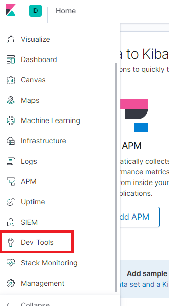

# ElasticSearch学习笔记

## 一、基本概念

es  存储、搜索、分析海量数据

es的几个核心概念：

- 接近实时（NRT）
- 集群
- 节点
- 索引：动词，将数据存储到es中的过程称为索引；名词，相当于mysql中的database
- 类型：相当于MySQL数据库中的table
- 文档：相当于mysql数据库中的记录，json格式
- 属性：每一个文档是由若干属性和属性值组成的
- 分片和复制：单个节点的空间有限，索引可以通过分片存放在多个节点上；为了提供高可用性，可以将分片复制多份保存
- 映射：相当于关系型数据库中的schema，用于定义一个索引的某个类型的数据结构

倒排索引：


检索时，对关键字进行分词，根据倒排索引表找到相关的记录，根据每一条记录出现的次数形成相关性得分，最终得到最符合的查询结果

mapping：

- 字段名
- 字段类型：字符串、整数、浮点数、布尔类型、Date
- 索引类型：analyzed、not_analyzed、no

## 二、安装运行

### 从tar文件安装

### 从docker安装

1. 下载镜像文件

   ```shell
   docker pull elasticsearch:7.4.2
   docker pull kibana:7.4.2
   ```

2. 查看虚拟机可用内存

   ```
   free -m
   ```

3. 创建es配置文件和数据的目录

   ```
   mkdir -p /data/elasticsearch/config
   mkdir -p /data/elasticsearch/data
   ```

4. 创建elasticsearch.yml文件

   ```
   echo "http.host: 0.0.0.0">>/data/elasticsearch/config
   ```

5. 创建es实例

   ```shell
   docker run --name elasticsearch -p 9200:9200 -p 9300:9300 \
   -e "discovery.type=single-node" -e ES_JAVA_OPTS="-Xms64m -Xmx128m" \
   -v /data/elasticsearch/config/elasticsearch.yml:/usr/share/elasticsearch/conf/elasticsearch.yml \
   -v /data/elasticsearch/data:/usr/share/elasticsearch/data \
   -v /data/elasticsearch/plugins:/usr/share/elasticsearch/plugins \
   --privileged=true \
   -d elasticsearch:7.4.2
   ```

   -p 指定容器对外暴露的端口：访问es的默认端口 9200  es节点之间通信的端口 9300

   -e 指定容器运行的环境变量

   discovery.type = single-node  以单节点方式运行

   ES_JAVA_OPTS  指定ES服务启动后内存初始占用64M，极限占用128M，这一点非常重要，如果不设置就会导致虚拟机的内存被用完

   -v 挂载容器卷，即便容器被删除，保存在容器卷中的数据还在

   配置文件的位置：$ES_HOME/config/elasticsearch.yml

   --privileged=true  赋予容器内的root用户以宿主机的root权限，这里如果不加这一个参数，容器就无法访问容器数据卷中的内容

   -d detach，后台运行

6. 查看es是否正常运行

   ```
   # 查看容器运行的状态
   docker ps
   # 查看es容器日志
   docker logs elasticsearch -ft --tail 100
   # 查看容器卷挂载是否成功
   # "Mounts"下就是挂载的容器卷的信息
   docker inspect elasticsearch
   # 查看es节点和集群信息
   GET /
   GET /_cat/nodes?v
   ```
7. 启动kibana可视化运行环境

   ```
   docker run --name kibana -e ELASTICSEARCH_HOSTS=http://192.168.0.100:9200 \
   -p 5601:5601 \
   -d kibana:7.4.2
   ```
   
8. 查看kibana是否启动成功，访问kibana主页http://192.168.0.100:5601/

## 三、初步检索

### 1. _cat

curl命令：

```shell
curl 请求类型 url -d 'body'
```

查看系统健康信息：

```shell
GET /_cat/health?v
# 查看健康信息指定字段
GET /_cat/health?h=cluster,status&v
# 查看健康信息的帮助信息
GET /_cat/health?help

# 查看主节点信息
GET /_cat/master

# 查看集群中的索引信息
GET /_cat/nodes?v

# 查看集群中的索引信息
GET /_cat/indices?v
```

返回的信息：

```txt
epoch  timestamp cluster status node.total node.data shards pri relo init unassign pending_tasks
```


### 2. 索引文档（保存文档）

PUT带ID保存

```shell
# 创建/更新文档
PUT /customer/external/1
{
	"name":"Li Hua"
}

# 返回的结果
# 其中带下划线的属性是元数据
{
    "_index": "customer", # 文档所在的索引
    "_type": "external",  # 文档所在的类型
    "_id": "1",           # 文档的ID
    "_version": 1,        # 文档的版本，每更新一次数据版本数加1
    "result": "created",  # 操作的结果，初始创建是created，再次创建是updated
    "_shards": {          # 分片信息
        "total": 2,
        "successful": 1,
        "failed": 0
    },
    "_seq_no": 0,
    "_primary_term": 1
}

```

POST不带ID保存

```shell
# 创建文档（不带ID）
POST /customer/external
{
	"name":"Li Hua"
}

# 返回结果
{
    "_index": "customer",
    "_type": "external",
    "_id": "KQzf53cBUVh50TDckxK3",
    "_version": 1,
    "result": "created",
    "_shards": {
        "total": 2,
        "successful": 1,
        "failed": 0
    },
    "_seq_no": 1,
    "_primary_term": 1
}

```

POST请求索引一个文档时也可以指定ID，用法与PUT请求是类似

### 3. 查询文档

```shell
GET /customer/external/1

# 返回结果——查询成功
{
    "_index": "customer",
    "_type": "external",
    "_id": "1",
    "_version": 1,
    "_seq_no": 0,               # 并发控制字段，每次更新就会+1
    "_primary_term": 1,         # 并发控制字段，主分片重新分配，如重启，就会发生变化
    "found": true,              # 表示本次查询成功
    "_source": {                # 查询结果
        "name": "Li Hua"
    }
}

# 返回结果——查询失败
{
    "_index": "customer",
    "_type": "external",
    "_id": "2",
    "found": false              # 表示本次查询失败
}

```

利用seq_no和primary_term字段可以实现更新操作的并发控制

```shell
PUT /customer/external/1?if_seq_no=0&if_primary_term=1
{
	name:"李华"
}

# 执行修改操作时，如果seq_no和primary_term与传入的参数不匹配，则会报错如下
{
    "error": {
        "root_cause": [
            {
                "type": "version_conflict_engine_exception",
                "reason": "[1]: version conflict, required seqNo [4], primary term [1]. current document has seqNo [5] and primary term [1]",
                "index_uuid": "CBfkBX3xQyOxuvc-HA9xvg",
                "shard": "0",
                "index": "customer"
            }
        ],
        "type": "version_conflict_engine_exception",
        "reason": "[1]: version conflict, required seqNo [4], primary term [1]. current document has seqNo [5] and primary term [1]",
        "index_uuid": "CBfkBX3xQyOxuvc-HA9xvg",
        "shard": "0",
        "index": "customer"
    },
    "status": 409
}

```

### 4. 更新文档

（1）使用POST更新

```shell
# 使用POST请求更新文档
POST /customer/external/1/_update
{
	"doc":{                           # 使用POST请求更新文档时，doc字段是不能省略的
		"name":"Li Si"
	}
}

# 返回结果
{
    "_index": "customer",
    "_type": "external",
    "_id": "1",
    "_version": 6,
    "result": "updated",
    "_shards": {
        "total": 2,
        "successful": 1,
        "failed": 0
    },
    "_seq_no": 6,
    "_primary_term": 1
}

# 执行更新操作前进行比对，如果没有发生变化，则不进行更新
{
    "_index": "customer",
    "_type": "external",
    "_id": "1",
    "_version": 5,         # 版本不发生变化
    "result": "noop",      # 没有变化，不执行更新操作，result字段为noop
    "_shards": {
        "total": 0,
        "successful": 0,
        "failed": 0
    },
    "_seq_no": 5,          # 序列号也不发生变化
    "_primary_term": 1
}

```


创建一个新的索引：

```shell
PUT "http://127.0.0.1:9200/index_test"
PUT "http://127.0.0.1:9200/index_test" -d '
{
	"settings":{
		"number_of_replicas":"1", # 设置复制数
		"number_of_shards":"5", # 设置主分片数
	},
	"mappings":{
		"test_type":{
			"properties":{
				"name":{
					"type":"string",
					"index":"not_analyzed"
				},
				"age":{
					"type":"integer"
				}
			}
		}
	}
}
'
```

（2）使用POST和PUT请求不带_update也能进行更新操作，但不会检查更新的内容与原来的内容是否发生变化

### 5. 删除文档和索引

（1）删除指定ID的文档

```shell
# 删除指定ID的文档
DELETE /customer/external/1

# 返回结果
{
    "_index": "customer",
    "_type": "external",
    "_id": "1",
    "_version": 7,
    "result": "deleted",   # 操作结果为deleted
    "_shards": {
        "total": 2,
        "successful": 1,
        "failed": 0
    },
    "_seq_no": 7,
    "_primary_term": 1
}

```

（2）删除整个索引

```shell
DELETE /customer
```

ES中只提供了针对文档和索引的删除，没有提供针对类型的删除

### 6. 批量API

语法格式：

```shell
POST <prefix>/_bulk
{<action>:{<metadata>}}
{<request body>}
{<action>:{<metadata>}}
{<request body>}
```

eg：

```shell
POST /customer/external/_bulk
{"index":{"_id":"1"}}
{"name":"Li Ming"}
{"index":{"_id":"2"}}
{"name":"Zhang San"}

POST /_bulk
{"delete":{"_index":"website","_type":"blog","_id":"123"}}
{"create":{"_index":"website","_type":"blog","_id":"123"}}
{"title":"人类的赞歌是勇气的赞歌，人类的伟大是勇气的伟大！"}
{"index":{"_index":"website","_type":"blog"}}
{"title":"宁教我负天下人，不教天下人负我！"}
{"update":{"_index":"website","_type":"blog","_id":"123"}
{"doc":{"title":"惟贤惟德，能服于人！"}}

# 在talend API Test中进行测试的时候，会报错，原因是json字符串中出现了换行符
# 所以需要在kibana中进行测试
```



返回的结果1：

```shell
#! Deprecation: [types removal] Specifying types in bulk requests is deprecated.
{
  "took" : 70,                    # 花费的时间
  "errors" : false,               # 是否发生ERROR
  "items" : [                     # 批量操作各自的返回结果
    {
      "index" : {
        "_index" : "customer",
        "_type" : "external",
        "_id" : "1",
        "_version" : 1,
        "result" : "created",
        "_shards" : {
          "total" : 2,
          "successful" : 1,
          "failed" : 0
        },
        "_seq_no" : 10,
        "_primary_term" : 1,
        "status" : 201
      }
    },
    {
      "index" : {
        "_index" : "customer",
        "_type" : "external",
        "_id" : "2",
        "_version" : 1,
        "result" : "created",
        "_shards" : {
          "total" : 2,
          "successful" : 1,
          "failed" : 0
        },
        "_seq_no" : 11,
        "_primary_term" : 1,
        "status" : 201
      }
    }
  ]
}

```

### 7. 样本测试数据

https://github.com/elastic/elasticsearch/blob/master/docs/src/test/resources/accounts.json?raw=true

```shell
POST /bank/account/_bulk
...
```

## 四、进阶检索

### 1. Search API

（1）将所有的检索条件都放到url后面

```shell
GET /bank/_search?q=*&sort=account_number:asc
```

（2）将所有的检索条件放到请求的body中

```shell
GET /bank/_search
{
	"query":{
		"match_all":{}
	},
	"sort":[
		{"account_number":"asc"},
		{"balance":"desc"}
	]
}
```

### 2. Query DSL

（1）语法结构：

如果是针对某个文档的查询：

```shell
{
	<query_name>:{
		<argument1>:<value1>,
		<argument2>:<value2>,
		...
	}
}
```

如果是针对某个字段：

```shell
{
	<query_name>:{
		<field_name>:{
			<argument1>:<value1>,
			<argument2>:<value2>
		}
	}
}
```

常见的查询操作`<query_name>`：query、sort、from、size、_source

eg

```shell
GET bank/_search
{
	"query":{"match_all":{}},
	"sort":{"balance":{"order":"desc"}},
	"from":5,
	"size":5,
	"_source":["balance","firstname"]
}
```

（2）返回结果

```shell
{
  "took" : 5,
  "timed_out" : false,
  "_shards" : {
    "total" : 1,
    "successful" : 1,
    "skipped" : 0,
    "failed" : 0
  },
  "hits" : {
    "total" : {
      "value" : 1000,
      "relation" : "eq"
    },
    "max_score" : null,
    "hits" : [
      {
        "_index" : "bank",            # 所在的索引
        "_type" : "account",          # 所在的类型
        "_id" : "168",                # ID
        "_score" : null,              # 全文检索匹配分值
        "_source" : {                 # 数据
          "firstname" : "Carissa",
          "balance" : 49568
        },
        "sort" : [                    # 排序
          49568
        ]
      },
      # ...
    ]
  }
}

```

（3）match全文检索：

先对关键字进行分词处理，然后按照分词的结果进行匹配

```shell
GET /bank/_search
{
	"query":{
		"match":{
			"address":"mill lane"
		}
	}
}

# 全文检索会按照评分进行排序，会对检索条件进行分词匹配
```

（4）match_phrase匹配：把短语作为一个整体进行匹配，而不是先进行分词处理

```shell
GET /bank/_search
{
	"query":{
		"match_phrase":{
			"address":"mill lane"
		}
	}
}
```

（5）multi_match匹配：多个字段任意一个字段匹配

```shell
GET /bank/_search
{
	"query":{
		"multi_match":{
			"query":"mill",
			fields:["address","city"]
		}
	}
}
```

（6）bool查询：复合多个查询条件

```shell
GET /bank/_search
{
	"query":{
		"bool":{
			"must":[ # 必须满足的条件
				{"match":{"address":"mill"}},
				{"match":{"age":"M"}}
			],
			"must_not":[ # 必须不满足的条件
				{"match":{"state":"ID"}}
			],
			"should":[ # 满足条件能够提升score，不满足条件也能查出来结果
				{"match":{"lastName":"wallance"}}
			]
		}
	}
}
```

过滤：

```shell
GET /bank/_search
{
	"query":{
		"bool":{
			"filter":{
				"range":{
					"gte":18,
					"lte":30
				}
			}
		}
	}
}
```

must、should会贡献相关性得分，但是filter、must_not不会贡献相关性得分

（7）term查询

用于非文本字段的精确检索，文本字段一般不使用term

```shell
GET /bank/_search
{
	"query":{
		"term":{
			"age":20
		}
	}
}
```

对于文本字段的等值查询可以使用keyword关键字：

```shell
GET /bank/_search
{
	"query":{
		"match":{
			"address.keyword":"mill lane" # 相当于address = 'mill lane'
		}
	}
}
```

（8）aggregation聚合

```shell

```


创建索引的映射：

```shell
PUT "localhost:9200/index_test/_mapping/test_type" -d '
	"test_type":{
        "properties":{
            "name":{
                "type":"string",
                "index":"not_analyzed"
            },
            "age":{
            	"type":"integer"
            }
        }
    }
'
```

可以config/mappings/索引名/下创建映射的json文件，然后在调用创建映射的接口，就可以省略body部分

删除索引的映射：

```shell
DELETE "localhost:9200/index_test/_mapping/test_type"
```

查看索引的映射：

```shell
GET "localhost:9200/index_test/_mapping/test_type"
```


文档的操作：

新增文档：

```shell
POST "localhost:9200/index_test/test_type/12345?pretty" -d '
{
	"name":"zhangsan",
	"age":"12"
}'
```

更新一个文档：

```shell
PUT "localhost:9200/index_test/test_type/12345?pretty" -d '
{
	"name":"lisi",
	"age":"50"
}'
```

删除一个文档：

```shell
DELETE "localhost:9200/index_test/test_type/12345?pretty"
```

查询单个文档：

```shell
GET "localhost:9200/index_test/test_type/12345?pretty"
```


查询所有：

