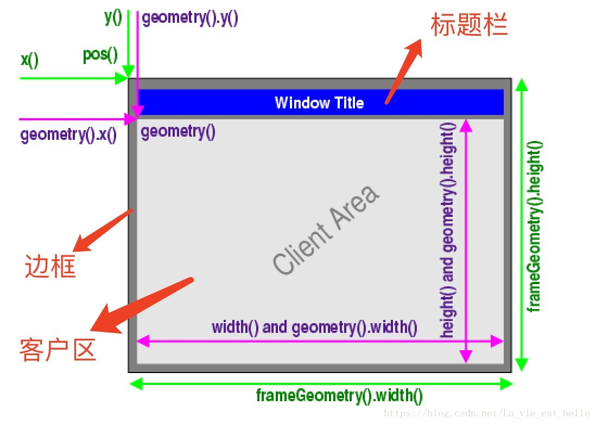

[TOC]

## 开发第一个项目

必须使用两个类：QApplication和QWidget，都在PyQt5.QtWidgets包下面。

```python
import sys

from PyQt5.QtWidgets import QApplication, QWidget

if __name__ == '__main__':
    # 创建QApplication的实例
    app = QApplication(sys.argv)
    # 创建一个窗口
    w = QWidget()
    # 设置窗口的尺寸
    w.resize(300, 200)
    # 设置窗口的位置
    w.move(300, 300)
    # 设置窗口的标题
    w.setWindowTitle('Hello World')
    # 显示窗口
    w.show()

    # 进入程序的主循环，并通过exit函数保证安全退出
    sys.exit(app.exec_())

```

## QT Designer的使用

在PC的设置中添加external tools，找到Anaconda下Designer.exe的路径并设置工作路径为\$ProjectFileDir​\$

打开PC->tools->external tools->Qt Designer(你自己命名的)，新建Main Window或者其他窗口

在窗体菜单中可以预览和查看代码，在属性编辑器中可以查看和修改属性

## 将.ui文件转换为.py文件

将UI文件保存到项目目录中

方法一：python -m PyQt5.uic.pyuic demo.ui -o demo.py

方法二：直接调用pyuic5

将命令添加在扩展工具中：

Program：`python的全路径`

Arguments：`-m PyQt5.uic.pyuic $FileName$ -o $FileNameWithoutExtension$.py`

Working Directory：`$FileDir$`

## 四种布局

水平布局、垂直布局、栅格布局、表单布局

选中多个组件然后右键选择布局，或者先选择一种布局，然后将其他组件添加到布局之中。

## 容器布局与绝对布局

可以设置容器的布局类型，也可将布局变形为容器。

绝对布局的位置与宽高都是固定的，不会随着父容器的变化而变化。

## 间隔与分割线

## 尺寸策略

sizeHint（期望尺寸）：控件的建议尺寸，一般不能被修改，每种控件都有特定的期望尺寸

```python
self.pushButton.sizeHint().width()
self.pushButton.sizeHint().height()
```

最小期望尺寸：控件建议的最小尺寸，一般不能被修改

```python
self.pushButton.minimumSize().width()
self.pushButton.minimumSize().height()
```

水平策略/垂直策略

- Fixed：固定值
- Minimum：最小尺寸不能小于期望尺寸
- Maximum：最大尺寸不能超过期望尺寸
- Preferred
- MinimumExpanding
- Expanding：根据水平/垂直伸展配合使用
- Ignored

水平/垂直伸展：组件宽度/高度占总宽度/高度的权重

## 设置控件的伙伴关系

快捷键、热键

添加热键的方法：在标签的内容中加入“&A”，“&B”，“&C”……

选择工具栏的编辑伙伴，拖动鼠标从组件A到组件B

```python
self.label1.setBuddy(self.textEdit1)
```

## 设置控件的Tab顺序

工具栏切换到编辑Tab顺序，逐个点击控件，或者右键打开制表符顺序列表

## 初识信号与槽

信号：事件源发出的消息

槽：接收信号的方法

信号可以理解为事件，槽可以理解为事件处理函数

一个信号可以与多个槽绑定

绑定信号与槽的方法：切换到编辑信号/槽模式，拖动鼠标从控件A到控件B，然后配置连接，左边框选择信号，右边框选择槽。

范例1——鼠标控制窗口关闭：拖动鼠标从按钮到空白处，选择单击信号和关闭窗口的槽

范例2——复选框控制文本输入行的显示与隐藏：拖动鼠标从复选框到文本输入行，信号选择toggled(bool)，槽选择setVisible(bool)

范例3——复选框控制文本输入行可用不可用：拖动鼠标从复选框到文本输入行，信号选择toggled(bool)，槽选择setEnable(bool)

## 添加或移除菜单栏、工具栏

动作编辑器：不能把按钮拖到菜单上，使用动作编辑器创建一个动作然后拖动到菜单上

工具条与菜单的操作是类似的，并且工具栏和菜单栏可以共用action

在信号与槽编辑器中可以为action的信号绑定槽

## 主窗口类型

三种窗口：

- QWidget：窗口类的基类

- QMainWindow：基于单文档，可以包含菜单栏、工具栏、状态栏、标题栏，是最常见的窗口形式

- QDialog：基于对话框。没有菜单栏、工具栏、状态栏

 直接使用源代码创建一个窗口，并在状态栏显示一个消息5秒钟：

```python
import sys
from PyQt5.QtWidgets import QMainWindow, QApplication


class MainWin(QMainWindow):
    def __init__(self):
        super(MainWin, self).__init__()

        # 设置窗口的标题
        self.setWindowTitle('hello')
        # 设置窗口的尺寸
        self.resize(400, 300)
        self.status = self.statusBar()
        self.status.showMessage('只存在5秒的消息', 5000)


if __name__ == '__main__':
    app = QApplication(sys.argv)
    w = MainWin()
    w.show()
    sys.exit(app.exec_())

```

## 主窗口居中

计算窗口的左上角点的位置——通过QDesktopWidget得到屏幕的尺寸

```python
screen = QDesktopWidget().screenGeometry()
size = self.geometry()
newleft = (screen.width() - size.width()) / 2
newtop = (screen.height() - size.height()) / 2
self.move(int(newleft), int(newtop))
```

## 退出应用程序

```python
class MainWin(QMainWindow):
    def __init__(self):
        super(MainWin, self).__init__()
        self.resize(300, 120)
        self.setWindowTitle('退出应用程序')

        # 添加Button
        self.button1 = QPushButton('退出应用程序')

        # 将信号与槽关联
        self.button1.clicked.connect(self.on_button_click)

        layout = QHBoxLayout()
        layout.addWidget(self.button1)

        main_frame = QWidget()
        main_frame.setLayout(layout)

        self.setCentralWidget(main_frame)

    # 按钮单击事件的方法（自定义的一个槽）
    def on_button_click(self):
        sender = self.sender()
        print(sender.text() + '按钮被按下')
        app = QApplication.instance()
        # 退出应用程序
        app.quit()
```

## 屏幕坐标系

屏幕左上角为屏幕坐标系的原点，主窗口的位置是相对屏幕坐标系的原点而言的，主窗口的尺寸包括宽度和高度。对于同一个窗口有三种不同的位置与尺寸，需要加以区别。

```python
# 客户区的位置与尺寸，不包括标题栏和边框
x1 = widget.geometry().x()
y1 = widget.geometry().y()
w1 = widget.geometry().width()
h1 = widget.geometry().height()

# 整个框架的位置与尺寸，包括客户区、标题栏、边框
x2 = widget.frameGeometry().x()
y2 = wdiget.frameGeometry().y()
w2 = widget.frameGeometry().width()
h2 = widget.frameGeometry().height()

# 直接调用
x3 = widget.x() # 同widget.geometry().x()
y3 = widget.y() # 同widget.geometry().y()
w3 = widget.width() # 同widget.frameGeometry().width()
h3 = widget.height() # 同widget.frameGeometry().height()
```



注意，widget.resize()方法设置的是客户区的尺寸。

## 设置窗口和应用程序图标

`mainWin.setWindowIcon(QIcon("./icon.ico"))`

这个方法用于设置**窗口**的图标，在windows/linux下可用，在mac os下不可用

`app.setWindowIcon(QIcon("./icon.ico"))`

这个方法用于设置**应用程序**的图标，同时会调用窗口的`setWindowIcon`方法

## 为控件添加提示消息

鼠标悬停时会弹出提示信息，可以为窗口或者控件添加提示消息，提示消息可以是富文本

```python
QToolTip.setFont(QFont("SansSerif", 12))
mainWin.setToolTip("今天是<b>2019年10月27日</b>")
```

## 标签控件

QLabel控件常见的方法

```python
setAligment() # 设置文本的对齐方式
setIndent() # 设置文本缩进
text() # 获取文本内容
setBuddy() # 设置伙伴关系
setText() # 设置文本内容
selectedText() # 返回所选择的字符
setWordWrap() # 设置是否允许换行
...
```

QLabel常见的信号

```python
linkHovered # 当鼠标滑过QLabel控件时触发
linkActivated # 当鼠标单击QLabel控件时触发
```

QLabel控件的使用方法

```python
import sys

# 注意不要把把包导错了
from PyQt5.QtCore import Qt
from PyQt5.QtGui import QPalette, QPixmap
from PyQt5.QtWidgets import QApplication, QDesktopWidget, QLabel, QVBoxLayout, QWidget


class MainWin(QWidget):
    def __init__(self):
        super(MainWin, self).__init__()
        self.initUI()

    def initUI(self):
        # 设置窗口标题
        self.setWindowTitle("Hello World!")
        # 设置窗口居中
        desktop_geometry = QDesktopWidget().screenGeometry()
        self.resize(600, 400)
        self.move(int((desktop_geometry.width() - self.width()) / 2),
                  int((desktop_geometry.height() - self.height()) / 2))

        # QLabel控件的使用
        # 创建一个含有4个QLabel对象的列表
        labels = [QLabel(self) for _ in range(4)]
        
        # 设置第一个标签为文字标签，背景颜色为蓝色，居中放置
        labels[0].setText("<font color=yellow>这是一个文本标签</font>")
        labels[0].setAutoFillBackground(True)
        palette = QPalette()
        palette.setColor(QPalette.Window, Qt.blue)
        labels[0].setPalette(palette)
        labels[0].setAlignment(Qt.AlignCenter)

        # 设置第二个标签为超链接标签
        labels[1].setText("<a href='#'>欢迎使用python gui程序</a>")

        # 设置第三个标签为图片标签，居中放置
        labels[2].setAlignment(Qt.AlignCenter)
        labels[2].setToolTip('这是一个图片标签')
        labels[2].setPixmap(QPixmap("../resources/images/misakamikoto.jpeg"))

        # 设置第四个标签为超链接标签
        labels[3].setText("<a href='https://www.bilibili.com'>哔哩哔哩弹幕视频网</a>")
        labels[3].setAlignment(Qt.AlignLeft)
        labels[3].setToolTip("这是一个超级链接")
        # 设置打开外部链接，如果设置为True则打开外部链接，如果设置为False则执行槽函数
        # labels[3].setOpenExternalLinks(True)

        # 创建一个垂直布局，并将四个标签都加入到垂直布局之中
        vbox = QVBoxLayout()
        for l in labels:
            vbox.addWidget(l)
        
        # 给第二个标签和第四个标签配置信号与槽
        labels[1].linkHovered.connect(self.linkHovered)
        labels[3].linkActivated.connect(self.linkClicked)

        # 将Widget的布局设置为vbox
        self.setLayout(vbox)

    # 鼠标悬停信号的槽
    def linkHovered(self):
        print("鼠标指针滑过label2")

    # 鼠标单击信号的槽
    def linkClicked(self):
        print("单击了label4")


if __name__ == '__main__':
    app = QApplication(sys.argv)  # 创建一个应用程序
    w = MainWin()  # 创建一个窗口
    w.show()  # 显示窗口
    sys.exit(app.exec_())  # 执行程序并安全退出

```

## QLabel与伙伴控件、栅格布局

伙伴控件：可以为标签组件设置伙伴控件，从而实现诸如热键等功能。

```python
class MainDialog(QDialog):
    def __init__(self):
        super(MainDialog, self).__init__()
        self.initUI()

    def initUI(self):
        # 创建name标签和文本输入框并设置伙伴关系
        nameLabel = QLabel("&Name", self)
        nameLineEdit = QLineEdit(self)
        nameLabel.setBuddy(nameLineEdit)

        # 创建password标签和文本输入框并设置伙伴关系
        passwordLabel = QLabel("&Password", self)
        passwordLineEdit = QLineEdit(self)
        passwordLabel.setBuddy(passwordLineEdit)

        # 创建OK和CANCEL按钮并绑定至对应的槽函数
        self.btnOK = QPushButton("&OK", self)
        self.btnCancel = QPushButton("&Cancel", self)
        self.btnOK.clicked.connect(self.on_button_ok__clicked)
        self.btnCancel.clicked.connect(self.on_button_cancel_clicked)

        # 创建栅格布局并添加组件
        mainLayout = QGridLayout(self)
        mainLayout.addWidget(nameLabel, 0, 0)  # 0行0列
        mainLayout.addWidget(nameLineEdit, 0, 1, 1, 2)  # 0行1列起始，跨2列
        mainLayout.addWidget(passwordLabel, 1, 0)  # 1行0列
        mainLayout.addWidget(passwordLineEdit, 1, 1, 1, 2)  # 1行1列起始，跨2列
        mainLayout.addWidget(self.btnOK, 2, 1)  # 2行1列
        mainLayout.addWidget(self.btnCancel, 2, 2)  # 2行2列
        self.setLayout(mainLayout)  # 将栅格布局设置为对话框的布局

    # OK按钮单击事件槽函数
    def on_button_ok__clicked(self):
        print("OK")

    # CANCEL按钮单击事件槽函数
    def on_button_cancel_clicked(self):
        print("CANCEL")
```

## 文本输入框控件与回显模式、表单布局

4种回显模式

- Normal：正常模式，显示即输入
- NoEcho：不回显，如登录Linux系统
- Password：密码模式，输入字符显示*或者其他占位符
- PasswordEchoOnEdit：编辑时回显，编辑完成后会进入密码模式

范例：

```python
class MainDialog(QDialog):
    def __init__(self):
        super(MainDialog, self).__init__()
        self.initUI()

    def initUI(self):
        # 创建一个表单布局
        mainLayout = QFormLayout(self)
        # 创建4个文本输入框
        lineEdits = [QLineEdit(self) for _ in range(4)]
        # 对文本输入框的描述
        descriptions = ["Normal", "NoEcho", "Password", "PasswordEchoOnEdit"]
        # 文本输入框的模式
        modes = [QLineEdit.Normal, QLineEdit.NoEcho, QLineEdit.Password, QLineEdit.PasswordEchoOnEdit]
        
        for i, j, k in zip(descriptions, lineEdits, modes):
            j.setPlaceholderText(i)  # 设置文本输入框的占位符
            j.setEchoMode(k)  # 设置文本输入框的回显模式
            mainLayout.addRow(i, j)  # 将文本输入框加入到表单布局中

        # 设置对话框布局为表单布局
        self.setLayout(mainLayout)
```

## 文本输入框的校验器

校验器的功能：限制文本输入框的输入

常见的校验器：

- 整型校验器
- 浮点型校验器
- 正则表达式校验器

```python
class MainDialog(QDialog):
    def __init__(self):
        super(MainDialog, self).__init__()
        self.initUI()

    def initUI(self):
        mainLayout = QFormLayout(self)

        lineEdits = [QLineEdit(self) for _ in range(3)]
        validators = [QIntValidator(self), QDoubleValidator(self), QRegExpValidator(self)]
        descriptions = ["整型", "浮点型", "数字和字母"]

        validators[0].setRange(1, 99)  # 设置整型校验器的范围

        validators[1].setRange(-360, 360)  # 设置浮点型校验器的范围
        validators[1].setNotation(QDoubleValidator.StandardNotation)  # 设置标准的小数表示法
        validators[1].setDecimals(2)  # 设置小数位数

        validators[2].setRegExp(QRegExp("[a-zA-Z0-9]+$"))  # 创建正则表达式并与正则表达式校验器绑定

        for lineEdit, description, validator in zip(lineEdits, descriptions, validators):
            mainLayout.addRow(description, lineEdit)  # 添加组件到表单布局
            lineEdit.setPlaceholderText(description)  # 添加占位符
            lineEdit.setValidator(validator)  # 设置校验器

        self.setLayout(mainLayout)

```

## 用掩码限制文本输入框的输入

| 必须输入 | 允许输入但非必须 | 字符集/功能    |
| -------- | ---------------- | -------------- |
| A        | a                | [A-Za-z]       |
| N        | n                | [A-Za-z0-9]    |
| X        | x                | 任意字符       |
| 9        | 0                | [0-9]          |
| D        | d                | [1-9]          |
|          | #                | [1-9\\+\\-]    |
| H        | h                | [A-Fa-f0-9]    |
| B        | b                | [0-1]          |
| >        |                  | 所有字母都大写 |
| <        |                  | 所有字母都小写 |
| !        |                  | 关闭大小写转换 |
| \        |                  | 转义字符       |

使用：lineEdit.setInputMask(掩码)

范例：

```python
"000.000.000.000;_"  # 只能输入ip地址，没有输入的字符用_代替
"HH:HH:HH:HH:HH:HH;_"  # 只能输入Mac地址，没有输入的字符用_代替
"0000-00-00"  # 只能输入日期
">AAAAA-AAAAA-AAAAA-AAAAA-AAAAA;#"  # 只能输入序列号，没有输入的字符用#代替，并且将小写转换为大写
```

## 文本输入框的其他用法

- `setMaxLength(4)`
- `setAlignment(Qt.AlignRight)`
- `setFont(QFont("Arial",20))`
- `setReadOnly(True)`
- `textChanged`信号

## 文本域

QTextEdit

- `setPlainText("hello world")`
- `setHtml("<font color='blue' size=9>hello world</font>")`

- `toPlainText()`
- `toHtml()`

## 按钮

基类：`QAbstractButton`

派生类：`QPushButton`、`QToolButton`、`QRadioButton`、`QCheckBox`

QPushButton的其它方法：

- `text()`：获取文本内容

- `setCheckable()`：设置按钮不自动弹起，可以被check

- `toggle()`：按钮被设置为可以check后，按下按钮

- `setIcon()`：设置按钮的图标
- `setEnabled()`：设置按钮可用
- `setDefault()`：设置默认按钮

信号与槽连接的另一种方式：

```python
# 要想获得信号的发送者可以用sender()
# 或者直接传入参数，利用lambda表达式
self.button1.clicked.connect(lambda:self.whichButton(self.button1))
# 槽函数为 def whichButton(self, btn)
```

一个信号可以绑定多个槽函数，按照定义的先后顺序执行

## 单选按钮

`QRadioButton`

常用信号/方法：

- `setChecked()`：设置是否选中
- `isChecked()`：返回是否被选中
- `toggled`：选中状态变化信号

## 复选框控件

`QCheckBox`

三种状态：未选中（0）、半选中（1）、选中（2）

常用的信号/方法：

- `text()`：取得文本内容
- `setChecked()`：设置是否选中
- `setTristate()`：设置开启半选中状态
- `setCheckState()`：设置选中状态，三种状态为`Qt.Unchecked`、`Qt.PartiallyChecked`、`Qt.Checked`
- `stateChanged`：状态改变信号
- `isChecked()`：判断是否被选中
- `checkState()`：返回选中状态

## 下拉列表控件

`QComboBox`

常用信号/方法：

- `addItem(item)`：添加列表项目
- `addItems(items:list)`：添加多个列表项目
- `currentIndexChanged(self, i)`：列表选中项改变信号，传入参数i为选中项的下标
- `currentText()`：选中项的文本内容
- `count`()：列表项的个数
- `itemText(i)`：列表项的文本内容

## 滑块组件

水平滑块：`QSlider(Qt.Horizontal)`

垂直滑块：`QSlider(Qt.Vertical)`

常用信号/方法：

- `setMinimum(min)`：设置最小值
- `setMaximum(max)`：设置最大值
- `setSingleStep(step)`：设置步长
- `setValue(val)`：设置滑块值
- `setTickPostion(pos)`：设置刻度的位置，pos可以是`QSlider.TicksAbove`（`QSlider.TicksLeft`）、`QSlider.TicksBelow` （`QSlider.TicksRight` ）、`QSlider.TicksBothSides`
- `setTickInterval(interval)`：设置刻度的间隔
- `valueChanged(self)`：滑块值变化信号
- `value()`：返回滑块的值

## 计数器控件

`QSpinBox`

常见的信号/方法：

- `valueChanged(self)`
- `value()`
- `setValue(val)`
- `textFromValue()`
- `setRange(min, max)`
- `setMaximum(max)`
- `setMinimum(min)`
- `setSingleStep(step)`

## 对话框

基类：`QDialog`

派生类：`QMessageBox`、`QColorDialog`、`QFileDialog`、`QFontDialog`、`QInputDialog`

常用信号/方法：

- `close()`
- `setWindowTitle(title)`
- `setWindowModality(modality)`，设置窗口模态类型，modality可以是`Qt.NonModal`、`Qt.WindowModal`、`Qt.ApplicationModal`

## 消息对话框

种类：关于对话框、错误对话框、警告对话框、提问对话框、消息对话框

```python
QMessageBox.about(self,'关于','这是一个关于对话框')
reply = QMessageBox.information(self,'消息','这是一个消息对话框',QMessageBox.Yes|QMessageBox.No,QMessageBox.Yes)
reply = QMessageBox.warning(self,'警告','这是一个警告对话框',QMessageBox.Yes|QMessageBox.No,QMessageBox.Yes)
reply = QMessageBox.critical(self,'错误','这是一个错误对话框',QMessageBox.Yes|QMessageBox.No,QMessageBox.Yes)
reply = QMessageBox.question(self,'提问','这是一个提问对话框',QMessageBox.Yes|QMessageBox.No,QMessageBox.Yes)
```

## 输入对话框

`QInputDialog`

```python
items = ("C","C++","Ruby","Python","Java")
item, ok = QInputDialog.getItem(self,"请选择编程语言","语言列表",items)
text, ok = QInputDialog.getText(self,"文本输入框","输入姓名",items)
num, ok = QInputDialog.getInt(self,"整数输入框","输入数字",items)
```

## 字体对话框、颜色对话框、文件对话框

`QFontDialog`、`QColorDialog`、`QFileDialog`

```python
font, ok = QFontDialog.getFont()
color = QColorDialog.getColor()
fname, cancel = QFileDialog.getOpenFileName(self,"打开文件",".","图像文件(*.jpg *.png)")

dialog = QFileDialog()
dialog.setFileMode(QFileDialog.AnyFile)
dialog.setFilter(QDir.Files)
if dialog.exec():
    filenames = dialog.selectedFiles()
```

## 绘制文本

绘图API：1、文本；2、各种图形；3、图像；

`QPainter`

```python
painter = QPainter()  # 创建绘图上下文
painter.begin()  # 开始绘图
painter.drawText(...)  # 绘图过程
painter.end()  # 结束绘图
```

创建绘图上下文：必须在paintEvent事件方法中绘制各种元素

```python
painter = QPainter(self)
painter.begin(self)
painter.setPen(QColor(150,43,5))
painter.setFont(QFont('SimSun',25))
painter.drawText(event.rect(),Qt.AlignCenter,self,text)
painter.end()
```

## 绘制像素点、直线

`drawPoint(x,y)`

`drawLine(x0,y0,x1,y1)`

`drawLine(l)`

绘制不同类型的直线：

```python
pen = QPen(Qt.Red, 3, Qt.SolidLine)
painter.setPen(pen)
painter.drawLine(20,40,250,40)

pen.setStyle(Qt.DashLine)
painter.setPen(pen)
painter.drawLine(20,80,250,80)

pen.setStyle(Qt.DashDotDotLine)
painter.setPen(pen)
painter.drawLine(20,120,250,120)

pen.setStyle(Qt.DotLine)
painter.setPen(pen)
painter.drawLine(20,160,250,160)

pen.setStyle(Qt.CustomDashLine)
pen.setDashPattern([1,10,5,4])
painter.setPen(pen)
painter.drawLine(20,200,250,200)
```

## 绘制图形

```python
painter = QPainter(self)
painter.begin(self)

# 设置画笔和字体
painter.setPen(QColor(255, 0, 0))
painter.setFont(QFont('SimSun', 25))

# 绘制弧
rect = QRect(0, 10, 100, 100)
painter.drawArc(rect, 0, 50 * 16)
# 绘制圆
painter.drawArc(120,0,100,100, 0, 360 * 16)
# 绘制带弦的弧
painter.drawChord(400, 400, 600, 600, 0, 130 * 16)
# 绘制扇形
painter.drawPie(10, 240, 100, 100, 12, 130*16)
# 绘制椭圆
painter.drawEllipse(120, 120, 150, 100)
# 绘制5边形
polygon = QPolygon([QPoint(140,380),QPoint(270,420),QPoint(290,512),QPoint(290,588),QPoint(200,533)])
painter.drawPolygon(polygon)
# 绘制图像
image = QImage('../resources/images/flag.jpg')
rect = QRect(10, 400, int(image.width()/3), int(image.height()/3))
painter.drawImage(rect, image)

painter.end()
```

## 用画刷填充图形区域

```python
brush = QBrush(Qt.SolidPattern)  # 其他画刷参考源码
painter.setBrush(brush)
```

## 让控件支持拖拽

`setAcceptDrops(True)`：设置让控件支持拖拽

`setDragEnabled(True)`：设置控件可以被拖拽

`dragEnterEvent(self,e)`：控件被拖动到区域内触发的事件

`dropEvent(self,e)`：控件被放到区域内触发的事件

## 使用剪贴板

```python
clipboard = QApplication.clipboard()  # 获得剪贴板
clipboard.setText('hello world')  # 设置文字
print(clipboard.text())  # 获得文字
clipboard.setPixmap(QPixmap('../resources/images/flag.jpg'))  # 设置位图
image = clipboard.pixmap()  # 获得位图
mimeData = QMimeData()  # 设置html文本
mimeData.setHtml('<b>Bold and <font color=red>Red</font></b>')
clipboard.setMimeData(mimeData)
mimeData = clipboard.mimeData()  # 获得html文本
if mimeData.hasHtml():
    doSomething()
```

## 日历控件

`QCalenderWidget`

`setMinimumDate(QDate(1988,1,1))`：设置日期下限

`setMaximumDate(QDate(2088,1,1))`：设置日期上限

`setGridVisible(True)`：设置网格显示

`selectedDate()`：获得选中的日期

## 输入各种风格的日期和时间

`QDateTimeEdit`

`QDateTimeEdit()`：无参构造函数

`QDateTimeEdit(QDateTime.currentDateTime())`：有参构造函数

`setDisplayFormat('yyyy-MM-dd HH:mm:ss')`：设置日期风格

`setMinimumDate(date)`：设置时间下限

`setMaximumDate(date)`：设置时间上限

`setCalenderPopup(True)`：设置日历弹出

`dateChanged(self,date)`：日期变化信号

`timeChanged(self,date)`：时间改变信号

`dateTimeChanged(self,date)`：日期或时间改变信号

`dateTime()`：获得日期时间

`minimumDate()`：获得最小日期

`maximumDate()`：获得最大日期

`minimumDateTime()`：获得最小日期和时间

`maximumDateTime()`：获得最大日期和时间

## 创建和使用菜单

```python
class Menu(QMainWindow):
    def __init__(self):
        super(Menu, self).__init__()
        self.initUI()

    def initUI(self):
        bar = self.menuBar()  # 获得菜单栏
        
        file = bar.addMenu('文件')  # 添加菜单
        file.addAction('新建')  # 添加菜单项
        save = QAction("保存", self)  # 创建一个动作
        save.setShortcut('Ctrl + S')  # 设置快捷键
        file.addAction(save)  # 将动作添加到菜单中
        quit = QAction('退出', self)
        file.addAction(quit)

        edit = bar.addMenu("编辑")
        edit.addAction('复制')
        edit.addAction('粘贴')

        # 将动作的触发与槽函数绑定
        save.triggered.connect(self.process)
        quit.triggered.connect(self.close)

    def process(self):
        print(self.sender().text())
```

## 创建和使用工具栏

工具栏的默认只显示图标，文字只作为工具的提示

```python
class ToolBar(QMainWindow):
    def __init__(self):
        super(ToolBar, self).__init__()
        self.initUI()

    def initUI(self):
        toolbar = self.addToolBar('File')  # 添加一个工具栏
        new = QAction(QIcon('../resources/images/new.png'), "New", self)  # 创建一个动作
        toolbar.addAction(new)  # 添加一个工具
        open = QAction(QIcon('../resources/images/open.png'), 'Open', self)
        toolbar.addAction(open)
        save = QAction(QIcon('../resources/images/save.png'), 'Save', self)
        toolbar.addAction(save)

        toolbar.setToolButtonStyle(Qt.ToolButtonTextBesideIcon)  # 设置工具栏风格为文字显示在图标的旁边

        toolbar.actionTriggered.connect(self.on_action_triggered)  # 为工具绑定事件

    def on_action_triggered(self, a):
        print(a.text())
```

## 创建并使用状态栏

```python
class MyWindow(QMainWindow):
    def __init__(self):
        # ...
    
    def initUI(self):
        # ...
        self.statusBar = QStatusBar()  # 创建一个状态栏
        self.setStatusBar(self.statusBar)  # 设置窗口的状态栏
        
        self.btn = QPushButton('hello world')
        self.btn.clicked.connect(self.on_process_statusbar)
        # ...
    
    def on_process_statusbar(self):
        self.statusBar.showMessage('hello world')  # 在状态栏显示一条信息
```

## 使用打印机

```python
class Menu(QMainWindow):
    def __init__(self):
        # ...

    def initUI(self):
        # ...

        self.mainWidget = QWidget()
        vbox = QVBoxLayout()
        self.mainWidget.setLayout(vbox)
        self.setCentralWidget(self.mainWidget)

        # 创建一个文本输入框
        self.lineEdit = QLineEdit()
        vbox.addWidget(self.lineEdit)

        # 创建一个按钮用于触发打印事件
        self.btn1 = QPushButton('printer')
        self.btn1.clicked.connect(self.on_printer)
        vbox.addWidget(self.btn1)

    def on_printer(self):
        printer = QtPrintSupport.QPrinter()  # 创建一个打印机实例
        painter = QPainter()  # 创建一个绘图上下文
        painter.begin(printer)  # 将绘图上下文与打印机实例绑定
        screen = self.lineEdit.grab()  # 抓取文本输入框的截图
        painter.drawPixmap(10, 10, screen)  #绘制位图
        painter.end()  # 结束绘制
    
    # 其他方法...
```

## 显示打印对话框

```python
class MyWin(QMainWindow):
    def __init__(self):
        super(MyWin, self).__init__()
        self.printer = QtPrintSupport.QPrinter()  # 创建一个打印机实例
        self.initUI()

    def initUI(self):
        hb = QHBoxLayout()
        vb = QVBoxLayout()

        self.textEdit = QTextEdit()
        hb.addWidget(self.textEdit)

        widget = QWidget()
        widget.setLayout(vb)
        hb.addWidget(widget)

        self.btnOpen = QPushButton('Open')
        self.btnOpen.clicked.connect(self.on_btn_open_clicked)
        vb.addWidget(self.btnOpen)

        self.btnSettings = QPushButton('Settings')
        self.btnSettings.clicked.connect(self.on_btn_settings_clicked)
        vb.addWidget(self.btnSettings)

        self.btnPrint = QPushButton('Print')
        self.btnPrint.clicked.connect(self.on_btn_print_clicked)
        vb.addWidget(self.btnPrint)

        widget = QWidget()
        widget.setLayout(hb)
        self.setCentralWidget(widget)

    def on_btn_open_clicked(self):
        # 打开一个文件
        fname = QFileDialog.getOpenFileName(self, 'open a text file', './')
        if fname[0]:
            with open(fname[0], 'r', encoding='utf-8', errors='ignore') as f:
                self.textEdit.setText(f.read())

    def on_btn_settings_clicked(self):
        # 打开页面设置对话框
        printDialog = QPageSetupDialog(self.printer, self)
        printDialog.exec()

    def on_btn_print_clicked(self):
        # 打开打印对话框
        printDialog = QPrintDialog(self.printer, self)
        if QDialog.Accepted == printDialog.exec():
            self.textEdit.print(self.printer)  # QTextEdit控件可以直接调用本方法打印

```

## 显示二维表数据

`QTableView`

需要创建QTableView实例和一个数据源（Model），使用了MVC模式，将后端的数据与前端页面的耦合度降低

```python
class MyWin(QMainWindow):
    def __init__(self):
        super(MyWin, self).__init__()
        self.initUI()

    def initUI(self):
        self.model = QStandardItemModel(4, 3)  # 创建标准数据源
        self.model.setHorizontalHeaderLabels(['ID', 'Name', 'Age'])  # 设置列字段标签

        self.tableView = QTableView()  # 创建列表控件
        self.tableView.setModel(self.model)  # 关联QTableView控件和Model

        # 添加数据
        items = [[QStandardItem('10'), QStandardItem('雷神'), QStandardItem('2000')],
                 [QStandardItem('10'), QStandardItem('雷神'), QStandardItem('2000')],
                 [QStandardItem('10'), QStandardItem('雷神'), QStandardItem('2000')]]
        for i in range(len(items)):
            for j in range(len(items[i])):
                self.model.setItem(i, j, items[i][j])

        vb = QVBoxLayout()
        vb.addWidget(self.tableView)
        w = QWidget()
        w.setLayout(vb)
        self.setCentralWidget(w)
```

## 显示列数据

```python
class MyWin(QMainWindow):
    def __init__(self):
        super(MyWin, self).__init__()
        self.initUI()

    def initUI(self):
        listView = QListView()  # 控件
        listModel = QStringListModel()  # 数据源
        self.list = ['孙悟空', '猪八戒', '沙僧', '唐僧']  # 列表
        listModel.setStringList(self.list)  # 将列表与数据源关联
        listView.setModel(listModel)  # 设置数据源
        listView.clicked.connect(self.on_item_clicked)  # 绑定事件

        vb = QVBoxLayout()
        vb.addWidget(listView)
        w = QWidget()
        w.setLayout(vb)
        self.setCentralWidget(w)

    def on_item_clicked(self, item):
        QMessageBox.information(self, 'QListView', '您选择了'+self.list[item.row()])
```

## 扩展的列表控件

`QListWidget`

```python
class MyWin(QMainWindow):
    def __init__(self):
        super(MyWin, self).__init__()
        self.initUI()

    def initUI(self):
        self.listWidget = QListWidget()
        l = [str(i) for i in range(0,10)]
        for item in l:
            self.listWidget.addItem(item)  # 添加列表项

        self.setCentralWidget(self.listWidget)

        self.listWidget.itemClicked.connect(self.on_item_clicked)  # 绑定列表项被点击的事件

    def on_item_clicked(self, item):
        QMessageBox.information(self, 'QListView', '您选择了'+ item.text())
```

## 扩展的表格控件

```python
class MyWin(QMainWindow):
    def __init__(self):
        super(MyWin, self).__init__()
        self.initUI()

    def initUI(self):
        tw = QTableWidget()  # 创建
        tw.setRowCount(4)  # 设置行数
        tw.setColumnCount(3)  # 设置列数
        self.setCentralWidget(tw)
        tw.setHorizontalHeaderLabels(['姓名','年龄','籍贯'])  # 设置行标签
        info = ['小明','20','陕西']
        items = [QTableWidgetItem(item) for item in info]
        for i in range(len(items)):
            tw.setItem(0, i, items[i])  # 设置单元格

        # 禁止编辑
        tw.setEditTriggers(QAbstractItemView.NoEditTriggers)
        # 整行选择
        tw.setSelectionBehavior(QAbstractItemView.SelectRows)
        # 调整列和行
        tw.resizeColumnsToContents()
        tw.resizeRowsToContents()
        # 设置行标签、列标签可见性
        # tw.horizontalHeader().setVisible(False)
        # tw.verticalHeader().setVisible(False)
        # 设置列标签
        tw.setVerticalHeaderLabels(['a','b'])
        # 隐藏表格线
        tw.setShowGrid(False)
```

## 在单元格中放置控件

```python
class MyWin(QMainWindow):
    def __init__(self):
        super(MyWin, self).__init__()
        self.initUI()

    def initUI(self):
        tw = QTableWidget()
        tw.setRowCount(4)
        tw.setColumnCount(3)
        self.setCentralWidget(tw)

        textItem = QTableWidgetItem('小明')
        tw.setItem(0, 0, textItem)  # 将文本项添加到单元格中

        combox = QComboBox()
        combox.addItems(['男', '女'])
        combox.setStyleSheet('QComboBox{margin:3px};')  # 设置qss样式
        tw.setCellWidget(0, 1, combox)  # 将组件添加到单元格中

        btn = QPushButton('修改')
        btn.setDown(True)
        btn.setStyleSheet('QPushButton{margin:3px};')  # 设置qss样式
        tw.setCellWidget(0, 2, btn)  # 将组件添加到单元格中
```

## 在表格中快速定位到特定的行

1、数据的定位：`findItems`

2、如果找到了满足条件的单元格，会定位到单元格所在的行：`setSliderPosition(row)`

```python
class MyWin(QMainWindow):
    def __init__(self):
        super(MyWin, self).__init__()
        self.initUI()

    def initUI(self):
        tw = QTableWidget()
        tw.setRowCount(40)
        tw.setColumnCount(4)
        self.setCentralWidget(tw)

        for i in range(40):
            for j in range(4):
                tw.setItem(i, j, QTableWidgetItem('(%d, %d)' % (i, j)))

        text = '(10, 2)'
        items = tw.findItems(text, Qt.MatchExactly)  # 搜索满足条件的单元格，可以选择其他匹配模式
        if items:
            item = items[0]
            item.setBackground(QBrush(QColor(0, 255, 0)))
            item.setForeground(QBrush(QColor(255, 0, 0)))
            row = item.row()
            # 定位到指定的行
            tw.verticalScrollBar().setSliderPosition(row)
```

## 单元格操作

`tableWidget.sortItems(2, Qt.DescendingOrder)`：按第二列降序排列

`tableWidget.sortItems(2, Qt.AscendingOrder)`：按第二列升序排列

`item.setFont(QFont('Times', 14, QFont.Black))`：设置字体

`item.setForeground(QBrush(QColor(255, 0, 0)))`：设置前景色

`item.setBackground(QBrush(QColor(0, 0, 255)))`：设置背景色

`item.setTextAlignment(Qt.AlignRight|Qt.AlignBottom)`：设置右对齐和下对齐

`item.setSpan(row, col, rowspan, colspan)`：单元格合并

`tw.setRowHeight(1,80)`：设置第1行行高为80

`tw.setColumnWidth(2,120)`：设置第2列列宽为120

`tw.setItem(0, 3, QTableWidgetItem(QIcon('../resources/images/icon.png'), '文本'))`：设置图文混排的单元格

`item.setIconSize(QSize(w,h))`：设置单元格图片的尺寸

## 在表格中显示上下文菜单

```python
class MyWin(QMainWindow):
    def __init__(self):
        super(MyWin, self).__init__()
        self.initUI()

    def initUI(self):
        self.tw = QTableWidget()
        self.setCentralWidget(self.tw)
        self.tw.setRowCount(4)
        self.tw.setColumnCount(3)
        for i in range(4):
            for j in range(3):
                self.tw.setItem(i, j, QTableWidgetItem('(%d, %d)' % (i, j)))
        # 设置允许上下文菜单弹出
        self.tw.setContextMenuPolicy(Qt.CustomContextMenu)
        # 绑定事件
        self.tw.customContextMenuRequested.connect(self.generateMenu)

    def generateMenu(self, pos):
        print(pos)
        pos = self.tw.mapToGlobal(pos)  # 映射到屏幕坐标系
        for i in self.tw.selectionModel().selection().indexes():
            rowNum = i.row()
        # 如果选择的行索引小于2，弹出上下文菜单
        if rowNum < 2:
            menu = QMenu(self)  # 创建上下文菜单
            items = [menu.addAction(i) for i in ['hello', 'world', 'good', 'morning']]
            action = menu.exec(pos)  # 弹出菜单
            for i in range(len(items)):
                if items[i] == action:
                    print('选中了第%d个菜单项' % i)
                    break
```

## 树控件的基本用法

```python
def initUI(self):  
    self.tree = QTreeWidget()  # 创建一个树控件
    self.setCentralWidget(self.tree)
    self.tree.setColumnCount(2)  # 设置列数
    self.tree.setHeaderLabels(['Key','Value'])  # 设置列标签
    self.tree.setColumnWidth(0, 120)  # 设置某列列宽

    root = QTreeWidgetItem(self.tree)  # 创建一个子节点
    root.setText(0, '根节点')  # 设置子节点某列的文本值
    root.setIcon(0, QIcon('./resources/images/icon.png'))  # 设置子节点某列的图标

    childs = []

    child = QTreeWidgetItem(root)
    child.setText(0, '子节点1')
    child.setText(1, '子节点1的数据')
    child.setIcon(0, QIcon('../resources/images/icon.png'))
    childs.append(child)

    child = QTreeWidgetItem(root)
    child.setText(0, '子节点2')
    child.setText(1, '子节点2的数据')
    child.setIcon(0, QIcon('../resources/images/icon.png'))
    child.setCheckState(0, Qt.Checked)  # 设置子节点某列的可选
    childs.append(child)

    self.tree.expandAll()  # 展开树

    self.tree.clicked.connect(self.on_tree_clicked)  # 绑定事件

# 槽函数
def on_tree_clicked(self, index):
    item = self.tree.currentItem()  # 获得当前项
    print(index.row())
    print('key = %s, value = %s' % (item.text(0), item.text(1)))
```

## 树控件添加、删除、修改节点

```python
def on_btn_add_clicked(self):
    item = self.tree.currentItem()
    new_item = QTreeWidgetItem(item)
    new_item.setText(0, '新键')
    new_item.setText(1, '新值')

def on_btn_delete_clicked(self):
    root = self.tree.invisibleRootItem()
    for item in self.tree.selectedItems():
        (item.parent() or root).removeChild(item)
def on_btn_modify_clicked(self):
    item = self.tree.currentItem()
    item.setText(0, '修改键')
    item.setText(1, '修改值')
```

## QTreeView控件与系统定制模式

```python
if __name__ == '__main__':
    app = QApplication(sys.argv)
    model = QDirModel()
    view = QTreeView()
    view.setModel(model)
    view.setGeometry(100,100,600,400)
    view.show()
    sys.exit(app.exec_())
```

## 选项卡组件

`QTabWidget`

```python
def initUI(self):
    tabWidget = QTabWidget()  # 创建选项卡组件
    self.setCentralWidget(tabWidget)
    widgets = [QPushButton(str(i)) for i in range(3)]
    for i in range(len(widgets)):
        tabWidget.addTab(widgets[i], '选项卡'+str(i))  # 添加选项卡
    tabWidget.setTabText(0, 'hello world')  # 设置选项卡标题
```

## 堆栈窗口组件

`QStackedWidget`

```python
class MyWin(QMainWindow):
    def __init__(self):
        super(MyWin, self).__init__()
        self.initUI()

    def initUI(self):
        w = QWidget()
        self.setCentralWidget(w)
        hbox = QHBoxLayout()
        w.setLayout(hbox)

        # 创建列表组件
        self.listWidget = QListWidget()
        self.listWidget.addItems(['a', 'b', 'c'])
        self.listWidget.currentItemChanged.connect(self.onCurrentItemChanged)  # 绑定事件
        self.listWidget.setFixedWidth(100)
        hbox.addWidget(self.listWidget)

        # 创建堆栈组件
        self.stackedWidget = QStackedWidget()
        hbox.addWidget(self.stackedWidget)
        for i in range(3):
            self.stackedWidget.addWidget(QPushButton('按钮'+str(i)))  # 向堆栈组件添加面板

    # 槽函数
    def onCurrentItemChanged(self, current, previous):
        # 设置显示的面板
        self.stackedWidget.setCurrentIndex(self.listWidget.row(current))
```

## 停靠控件

`QDockWidget`

```python
class MyWin(QMainWindow):
    def __init__(self):
        super(MyWin, self).__init__()
        self.initUI()

    def initUI(self):
        self.mainWidget = QWidget()
        self.setCentralWidget(self.mainWidget)
        self.dockWidget = QDockWidget('这是一个停靠窗口', self)  # 创建一个停靠窗口
        self.listWidget = QListWidget()
        for i in range(3):
            self.listWidget.addItems([str(i) for i in range(100)])
        self.dockWidget.setWidget(self.listWidget)  # 设置停靠窗口的客户区
        self.dockWidget.setFloating(True)  # 设置停靠窗口默认悬浮状态
        self.addDockWidget(Qt.RightDockWidgetArea, self.dockWidget)  # 将停靠窗口添加到主窗口上
```

## 容纳多文档的窗口

`QMdiArea`、`QMdiSubWindow`

```python
class MyWin(QMainWindow):
    count = 0  # 记录一下当前有多少窗口

    def __init__(self):
        super(MyWin, self).__init__()
        self.setWindowTitle("容纳多文档的窗口")

        self.mdi = QMdiArea()  # 创建一个多文档窗口容器
        self.setCentralWidget(self.mdi)  # 将多文档窗口容器设置为中心组件
        bar = self.menuBar()  # 获得菜单栏的引用
        file = bar.addMenu("File")  # 添加一个菜单

        # 添加菜单项
        file.addAction("New")
        file.addAction("Cascade")
        file.addAction("Titled")

        # 将菜单项与事件绑定
        file.triggered.connect(self.window_action)

    def window_action(self, q):
        print(q.text())
        if q.text() == "New":
            MyWin.count = MyWin.count + 1
            sub = QMdiSubWindow()  # 添加一个子窗口
            sub.setWidget(QTextEdit("这是最后的斗争"))  # 设置子窗口的核心组件
            sub.setWindowTitle("这是一个子窗口，编号为" + str(MyWin.count))  # 设置子窗口的标题
            self.mdi.addSubWindow(sub)  # 将子窗口添加到多文档窗口容器中
            sub.show()  # 显示子窗口
        elif q.text() == "Cascade":
            self.mdi.cascadeSubWindows()  # 子窗口堆叠放置
        elif q.text() == "Titled":
            self.mdi.tileSubWindows()  # 子窗口平铺放置

```

## 滚动条控件

`QScrollBar`

作用：

1、通过滚动条值的变化控制其他控件状态的变化

2、通过滚动条的变化控制控件位置的变化

```python
class MyWin(QMainWindow):
    def __init__(self):
        super(MyWin, self).__init__()
        hbox = QHBoxLayout()
        self.label = QLabel("拖动滚动条去改变文字颜色")
        hbox.addWidget(self.label)

        # 创建滚动条1
        self.scroll_bar_1 = QScrollBar()
        self.scroll_bar_1.setMaximum(255)
        self.scroll_bar_1.sliderMoved.connect(self.on_scroll_bar_slider_moved)  # 将滑动滚动条的信号绑定

        # 创建滚动条2
        self.scroll_bar_2 = QScrollBar()
        self.scroll_bar_2.setMaximum(255)
        self.scroll_bar_2.sliderMoved.connect(self.on_scroll_bar_slider_moved)

        # 创建滚动条3
        self.scroll_bar_3 = QScrollBar()
        self.scroll_bar_3.setMaximum(255)
        self.scroll_bar_3.sliderMoved.connect(self.on_scroll_bar_slider_moved)

        # 创建滚动条4
        self.scroll_bar_4 = QScrollBar()
        self.scroll_bar_4.setMaximum(300)
        self.scroll_bar_4.sliderMoved.connect(self.on_scroll_bar_4_slider_moved)

        hbox.addWidget(self.scroll_bar_1)
        hbox.addWidget(self.scroll_bar_2)
        hbox.addWidget(self.scroll_bar_3)
        hbox.addWidget(self.scroll_bar_4)

        w = QWidget()
        w.setLayout(hbox)
        self.setCentralWidget(w)

    # 使用滚动条来控制文字的颜色
    def on_scroll_bar_slider_moved(self):
        # 获得滚动条的值
        r = self.scroll_bar_1.value()
        g = self.scroll_bar_2.value()
        b = self.scroll_bar_3.value()
        print("color =", r, g, b)
        palette = QPalette()
        c = QColor(r, g, b, 255)
        palette.setColor(QPalette.Foreground, c)
        self.label.setPalette(palette)

    # 使用滚动条来控制组件的位置
    def on_scroll_bar_4_slider_moved(self):
        self.label.move(self.label.x(), self.y() + self.scroll_bar_4.value())
```

## 动态显示当前时间

`QTimer`、`QThread`

多线程：用于同时完成多个任务，底层可以并发或并行

定时器：每隔一段时间会调用一次

```python
class MyWin(QMainWindow):
    def __init__(self):
        super(MyWin, self).__init__()
        self.setWindowTitle("Display the time dynamically")
        self.label = QLabel("Display the current time")
        self.start_btn = QPushButton("start")
        self.end_btn = QPushButton("end")
        layout = QGridLayout()

        # 创建一个定时器并绑定事件
        self.timer = QTimer()
        self.timer.timeout.connect(self.on_timer)

        layout.addWidget(self.label, 0, 0, 1, 2)
        layout.addWidget(self.start_btn, 1, 0)
        layout.addWidget(self.end_btn, 1, 1)

        self.start_btn.clicked.connect(self.on_start_btn_clicked)
        self.end_btn.clicked.connect(self.on_end_btn_clicked)
        
        w = QWidget()
        w.setLayout(layout)
        self.setCentralWidget(w)

    # 绑定了timeout信号的槽函数
    def on_timer(self):
        time = QDateTime.currentDateTime()
        time_display = time.toString("yyyy-MM-dd hh:mm:ss")
        self.label.setText(time_display)

    def on_start_btn_clicked(self):
        # 开启定时器，并且指明每1000毫秒产生一个timeout信号
        self.timer.start(1000)
        self.start_btn.setEnabled(False)
        self.end_btn.setEnabled(True)

    def on_end_btn_clicked(self):
        # 关闭定时器
        self.timer.stop()
        self.start_btn.setEnabled(True)
        self.end_btn.setEnabled(False)
```

## 让程序定时关闭

`QTimer.singleShot()`：让程序只执行一次而不是周期执行

```python
if __name__ == '__main__':
    app = QApplication(sys.argv)
    # w = MyWin()
    # w.show()
    label = QLabel("<font color=red size=140><b>hello world! The window will be closed in 5 seconds.</b></font>")
    label.show()
    QTimer.singleShot(5000, app.quit) # 设置5000毫秒后自动关闭
    sys.exit(app.exec_())
```

## 使用线程类编写计数器

`QThread`

继承QThread，实现run方法，使用sleep方法休眠若干时间

关键：`pyqtSingal()`、`emit()`、`connect()`、`run()`、`start()`

```python
import sys

from PyQt5.QtCore import *
from PyQt5.QtGui import *
from PyQt5.QtWidgets import *

sec = 0


# 继承QThread类
class WorkThread(QThread):
    timer = pyqtSignal()  # 每隔一秒发送一次信号
    end = pyqtSignal()  # 计数完成后发送一次信号

    # 实现run方法
    def run(self) -> None:
        while True:
            self.sleep(1)  # 休眠1秒
            if sec == 5:
                self.end.emit()  # 发送end信号
                break
            self.timer.emit()  # 发送timer信号


class Counter(QWidget):
    def __init__(self):
        super(Counter, self).__init__()
        self.setWindowTitle("use QThread to make a counter")
        self.resize(300, 120)

        layout = QVBoxLayout()
        self.lcdNumber = QLCDNumber()
        layout.addWidget(self.lcdNumber)

        button = QPushButton("start to count")
        layout.addWidget(button)

        self.workThread = WorkThread()  # 创建一个线程的实例
        
        # 绑定事件
        self.workThread.timer.connect(self.countTime)
        self.workThread.end.connect(self.end)
        button.clicked.connect(self.work)

        self.setLayout(layout)

    def countTime(self):
        global sec
        sec += 1
        self.lcdNumber.display(sec)

    def end(self):
        QMessageBox.information(self,"message","end counting",QMessageBox.Ok)

    def work(self):
        # 运行线程实例
        self.workThread.start()


if __name__ == '__main__':
    app = QApplication(sys.argv)
    w = Counter()
    w.show()
    sys.exit(app.exec_())

```

## 用web控件显示网页

`QWebEngineView`：用来显示web页面

```python
class WebEngineView(QMainWindow):
    def __init__(self):
        super(WebEngineView, self).__init__()
        self.setWindowTitle('open external web page example')
        self.setGeometry(5, 30, 1355, 730)

        self.browser = QWebEngineView()
        url = os.getcwd() + '/resources/static/pages/test.html'
        self.browser.load(QUrl(QUrl.fromLocalFile(url)))  # 可以是外部链接

        self.setCentralWidget(self.browser)
```

使用硬编码方式显示网页：

```python
class WebEngineView(QMainWindow):
    def __init__(self):
        super(WebEngineView, self).__init__()
        self.setWindowTitle('open external web page example')
        self.setGeometry(5, 30, 1355, 730)

        self.browser = QWebEngineView()
        self.browser.setHtml("""
            <!DOCTYPE html>
            <html lang="en">
            <head>
                <meta charset="UTF-8">
                <title>Test Page</title>
            </head>
            <body>
            <h1>Hello PyQt5</h1>
            <h2>Hello PyQt5</h2>
            <h3>Hello PyQt5</h3>
            <h4>Hello PyQt5</h4>
            </body>
            </html>
        """)

        self.setCentralWidget(self.browser)
```

## PyQt5和JS交互

python调用js函数

```html
<!DOCTYPE html>
<html lang="en">
<head>
    <meta charset="UTF-8">
    <title>Test Page</title>
    <script>
        function get_full_name(value){
            alert(value)
            var firstname = document.getElementById("firstname").value;
            var lastname = document.getElementById("lastname").value;
            var fullname = firstname + ' ' + lastname;
            document.getElementById('fullname').value = fullname;
            document.getElementById('submit-btn').style.display = 'block';
            return fullname;
        }
    </script>
</head>
<body>
    <form>
        <label>First Name: </label>
        <input type="text" name="firstname" id="firstname"/><br/>
        <label>Last Name: </label>
        <input type="text" name="lastname" id="lastname"/><br/>
        <label>Full Name:</label>
        <input type="text" name="fullname" id="fullname"/><br/>
        <input style="display: none;" type="submit" id="submit-btn" />
    </form>
</body>
</html>
```

```python
import os
import sys

from PyQt5.QtCore import *
from PyQt5.QtGui import *
from PyQt5.QtWebEngineWidgets import QWebEngineView
from PyQt5.QtWidgets import *


class WebEngineView(QMainWindow):
    def __init__(self):
        super(WebEngineView, self).__init__()
        self.setWindowTitle('run javascript')
        self.setGeometry(5, 30, 600, 400)

        self.layout = QVBoxLayout()

        # 创建一个Web引擎组件
        self.browser = QWebEngineView()
        # 加载html文件
        url = os.getcwd() + "/resources/static/pages/test.html"
        self.browser.load(QUrl.fromLocalFile(url))

        self.layout.addWidget(self.browser)

        self.button = QPushButton("set fullname")
        self.button.clicked.connect(self.on_button_clicked)
        self.layout.addWidget(self.button)

        w = QWidget()
        w.setLayout(self.layout)
        self.setCentralWidget(w)

    def on_button_clicked(self):
        value = "hello world"
        # python调用js函数，并绑定回调函数
        self.browser.page().runJavaScript('get_full_name("%s");' % value, self.js_callback)

    def js_callback(self, result):
        print(result)


if __name__ == '__main__':
    app = QApplication(sys.argv)
    w = WebEngineView()
    w.show()
    sys.exit(app.exec_())

```

js调用python：

方法：将python的一个对象映射到js中，将槽函数映射到js中

```python
import os
import sys
from PyQt5.QtCore import *
from PyQt5.QtGui import *
from PyQt5.QtWebChannel import QWebChannel
from PyQt5.QtWebEngineWidgets import QWebEngineView
from PyQt5.QtWidgets import *


# 要被映射到js的对象的类
class Factorial(QObject):
    # 参数类型为int，返回值类型int
    @pyqtSlot(int, result=int)
    def factorial(self, n):
        if n == 0 or n == 1:
            return 1
        else:
            return self.factorial(n - 1) * n


# 定义channel
channel = QWebChannel()
# 定义被映射对象
factorial = factorial.Factorial()


class PyFactorial(QWidget):
    def __init__(self):
        super(PyFactorial, self).__init__()
        self.setWindowTitle('Python Calculate Factorial')
        self.resize(600, 300)
        layout = QVBoxLayout()
        self.setLayout(layout)

        # 创建一个web浏览器控件
        self.browser = QWebEngineView()
        # 加载html文本
        url = os.getcwd() + '/resources/static/pages/test.html'
        self.browser.load(QUrl.fromLocalFile(url))

        # 使用channel注册一个对象
        channel.registerObject("obj", factorial)
        # 将channel与web浏览器控件关联
        self.browser.page().setWebChannel(channel)
        
        layout.addWidget(self.browser)


if __name__ == '__main__':
    app = QApplication(sys.argv)
    w = PyFactorial()
    w.show()
    sys.exit(app.exec_())

```

```html
<!DOCTYPE html>
<html lang="en">
<head>
    <meta charset="UTF-8">
    <title>A demo page</title>
    <!-- 引入qwebchannel.js文件 -->
    <script src="../js/qwebchannel.js"></script>
    <script>
        function callback(result){
            alert('result = ' + result);
        }

        // 在页面装载完成时获得python映射的对象
        document.addEventListener('DOMContentLoaded', function(){
            new QWebChannel(qt.webChannelTransport, function(channel){
                window.obj = channel.objects.obj;
            });
        });

        function onFactorial(){
            if (window.obj) {
                var n = parseInt(document.getElementById('n').value);
                // 使用映射的对象
                window.obj.factorial(n, callback);
            }
        }
    </script>
</head>
<body>
<form>
    <label>Please input N: </label>
    <input type="text" id="n"/><br />
    <input type="button" value="calculate factorial" onclick="onFactorial()"/>
</form>
</body>
</html>
```

## 布局

绝对布局：通过move确定位置

水平/垂直盒布局：

```python
hbox.addWidget(w)
hbox.setSpacing(40)
hbox.addWidget(w, 2, Qt.AlignLeft | Qt.AlignTop)  # 将w添加到水平盒布局中，水平权重为2，左上对齐
hbox.addStretch(2)  # 添加伸缩量，伸缩量设为0表示先排列，剩下的再按大于零伸缩量排
```

- 让按钮永远在右下角：将上方的widget的伸缩量设置为0，将本层的layout伸缩量设为大于0的值；将左侧的组件的伸缩量设置为0，将本按钮伸缩量设为大于0的值

栅格布局：

```python
grid.addWidget(w,i,j)
```

表单布局：

```python
formLayout.addRow(label,textEdit)
```

## 拖动控件之间的边界

`QSplitter`

```python
topLeft = QFrame()
topLeft.setFrameShape(QFrame, StyledPanel)
bottom = QFrame()
bottom.setFrameShape(QFrame, StyledPanel)

splitter1 = QSplitter(Qt.Horizontal)
textEdit = QTextEdit()
splitter1.addWidget(topLeft)
splitter1.addWidget(textEdit)

splitter2 = QSplitter(Qt.Vertical)
splitter2.addWidget(splitter1)
splitter2.addWidget(bottom)

hbox = QHBoxLayout(self)
hbox.addWidget(splitter2)
self.setLayout(hbox)
```

## 信号与槽

自定义信号：`pyqtSignal()`

```python
class MyTypeSignal(QObject):
    # 定义一个信号
    send_message = pyqtSignal(object)

    # 定义发送三个参数的信号
    send_message_1 = pyqtSignal(str,int,int)

    def run(self):
        self.send_message.emit('hello PyQt5')  # 发送信号

    def run_1(self):
        self.send_message_1.emit('hello',3,4)  # 发送信号


class MySlot(QObject):
    # 槽函数
    def get(self, msg):
        print("信息："+msg)

    # 槽函数
    def get_1(self,msg,a,b):
        print("msg =",msg,"a =",a,"b =",b)


if __name__ == '__main__':
    signal = MyTypeSignal()
    slot = MySlot()
    signal.send_message.connect(slot.get)  # 将信号与槽进行关联
    signal.run()
    signal.send_message.disconnect(slot.get)  # 将信号与槽断开关联
    signal.run()
    signal.send_message_1.connect(slot.get_1)  # 将信号与槽进行关联
    signal.run_1()
```

为类添加多个信号：

```python
class MultiSignal(QObject):
    signal_1 = pyqtSignal()
    signal_2 = pyqtSignal(int)
    signal_3 = pyqtSignal(int, str)
    signal_4 = pyqtSignal(list)
    signal_5 = pyqtSignal(dict)
    # 声明一个重载版本的信号，槽函数参数可以是int和str，也可以是单独的str
    signal_6 = pyqtSignal([int, str], [str])

    def __init__(self):
        super(MultiSignal, self).__init__()
        self.signal_1.connect(self.signal_call_1)
        self.signal_2.connect(self.signal_call_2)
        self.signal_3.connect(self.signal_call_3)
        self.signal_4.connect(self.signal_call_4)
        self.signal_5.connect(self.signal_call_5)
        self.signal_6[int, str].connect(self.signal_call_6)  # 显式关联到第一个重载版本
        # self.signal_6.connect(self.signal_call_6)  # 默认关联到第一个重载版本
        self.signal_6[str].connect(self.signal_call_7)  # 显式关联到第二个重载版本

        self.signal_1.emit()
        self.signal_2.emit(10)
        self.signal_3.emit(1, 'hello')
        self.signal_4.emit([1, 2, 3, 4, 5, 6])
        self.signal_5.emit({'name': 'bill', 'age': 30})
        self.signal_6[str].emit('test')  # 调用时也要显式指定参数类型
        self.signal_6[int, str].emit(1, 'test')  # 调用时也要显式指定参数类型

    def signal_call_1(self):
        print(1)

    def signal_call_2(self, val):
        print(2, val)

    def signal_call_3(self, val, text):
        print(3, val, text)

    def signal_call_4(self, val):
        print(4, val)

    def signal_call_5(self, val):
        print(5, val)

    def signal_call_6(self, val, text):
        print(6, val, text)

    def signal_call_7(self, val):
        print(7, val)


if __name__ == '__main__':
    multi_signal = MultiSignal()
```

信号槽n对n连接与断开连接：

- 同一个信号可以关联到多个槽函数上，按照绑定的顺序依次执行；
- 多个信号可以绑定到槽函数上；
- 信号可以绑定到槽函数上，也可以绑定到其他信号上

为一个窗口添加信号：

```python
self.btn.clicked.connect(self.close)
```

多线程更新UI数据：

```python
import os
import sys
import time

from PyQt5.QtCore import *
from PyQt5.QtGui import *
from PyQt5.QtWidgets import *

# 子线程，用于更新主线程中的控件的值
class BackendThread(QThread):
    update_date = pyqtSignal(str)  # 创建一个信号

    # 线程的主体部分
    def run(self) -> None:
        while True:
            # 获取时间并格式化为字符串
            data = QDateTime.currentDateTime()
            currentTime = data.toString('yyyy-MM-dd hh:mm:ss')
            self.update_date.emit(str(currentTime))  # 发送信号
            time.sleep(1)


# 对话框组件类
class ThreadUpdateUI(QDialog):
    def __init__(self):
        QDialog.__init__(self)
        self.setWindowTitle('Multiple threads to update UI data')
        self.resize(400, 100)
        self.input = QLineEdit(self)
        self.input.resize(400, 100)
        self.initUI()

    def initUI(self):
        self.backend = BackendThread()  # 创建一个子线程实例
        self.backend.update_date.connect(self.handleDisplay)  # 将子线程实例的信号与槽函数进行绑定
        self.backend.start()  # 运行子线程实例

    # 槽函数
    def handleDisplay(self, data):
        self.input.setText(data)


if __name__ == '__main__':
    app = QApplication(sys.argv)
    w = ThreadUpdateUI()
    w.show()
    sys.exit(app.exec_())

```

信号与槽自动连接：

```python
import sys
from PyQt5.QtCore import *
from PyQt5.QtGui import *
from PyQt5.QtWidgets import *


class MyWidget(QWidget):
    def __init__(self):
        super(MyWidget, self).__init__()
        self.setWindowTitle('Add signal for the window')
        self.resize(600, 400)
        hbox = QHBoxLayout()
        self.setLayout(hbox)

        okButton = QPushButton('OK')
        okButton.setObjectName('ok_button')  # 设置组件的对象名
        cancelButton = QPushButton('Cancel')
        cancelButton.setObjectName('cancel_button')  # 设置组件的对象名
        hbox.addStretch(1)
        hbox.addWidget(okButton)
        hbox.addWidget(cancelButton)
        QMetaObject.connectSlotsByName(self)  # 调用自动连接的函数

    # 添加槽函数的注解
    @pyqtSlot()
    # 槽函数命名要符合规范,on_组件对象名_信号名
    def on_ok_button_clicked(self):
        QMessageBox.information(self,'info','you clicked the button ok')

    # 添加槽函数的注解，on_组件对象名_信号名
    @pyqtSlot()
    # 槽函数命名要符合规范
    def on_cancel_button_clicked(self):
        QMessageBox.information(self,'info','you clicked the button cancel')


if __name__ == '__main__':
    app = QApplication(sys.argv)
    w = MyWidget()
    w.show()
    sys.exit(app.exec_())

```

lambda表达式：

```python
fun_1 = lambda :print('hello world')
fun_2 = lambda x,y:print(x,y)
```

使用lambda表达式为槽函数传递参数：

```python
btn.clicked.connect(lambda :self.on_btn_clicked(1,2))
btn.clicked.connect(lambda :print('hello world'))
```

使用Partial对象为槽函数传递参数：

```python
btn.clicked.connect(partial(self.on_btn_clicked,10,20))
btn.clicked.connect(partial(self.on_btn_clicked,x,y))
```

覆盖槽函数：直接覆盖，无需连接

## 多窗口交互

1、不使用信号与槽，强耦合

```python
import sys
from PyQt5.QtCore import *
from PyQt5.QtGui import *
from PyQt5.QtWidgets import *


class MultiWindow(QWidget):
    def __init__(self):
        super().__init__()
        self.setWindowTitle('MultiWindow Interaction: No use of signals and slots')
        self.lineEdit = QLineEdit(self)

        self.btn_1 = QPushButton('Popup the dialog 1')
        self.btn_1.clicked.connect(self.on_btn_1_clicked)

        self.btn_2 = QPushButton('Popup the dialog 2')
        self.btn_2.clicked.connect(self.on_btn_2_clicked)

        grid_layout = QGridLayout()
        grid_layout.addWidget(self.lineEdit)
        grid_layout.addWidget(self.btn_1)
        grid_layout.addWidget(self.btn_2)
        self.setLayout(grid_layout)

    def on_btn_1_clicked(self):
        dialog = DateDialog(self)  # 创建DateDialog的一个实例
        result = dialog.exec()  # 执行对话框实例
        date = dialog.dateTime()  # 调用实例方法获得日期时间
        self.lineEdit.setText(date.date().toString())  # 更新组件的值
        dialog.destroy()  # 销毁该实例

    def on_btn_2_clicked(self):
        date, time, result = DateDialog.getDateTime()  # 调用静态方法获得日期、时间、选择结果
        self.lineEdit.setText(date.toString())  # 更新组件的值
        if result == QDialog.Accepted:
            print('The button ok was clicked')
        else:
            print('The button cancel was clicked')


class DateDialog(QDialog):
    def __init__(self, parent=None):
        super(DateDialog, self).__init__(parent)
        self.setWindowTitle('Multiple windows interaction')

        layout = QVBoxLayout()
        self.datetime = QDateTimeEdit(self)
        self.datetime.setCalendarPopup(True)
        self.datetime.setDateTime(QDateTime.currentDateTime())

        layout.addWidget(self.datetime)

        buttons = QDialogButtonBox(QDialogButtonBox.Ok | QDialogButtonBox.Cancel, Qt.Horizontal, self)
        buttons.accepted.connect(self.accept)
        buttons.rejected.connect(self.reject)

        layout.addWidget(buttons)
        self.setLayout(layout)

    # 获得日期时间控件的值
    def dateTime(self):
        return self.datetime.dateTime()

    @staticmethod
    def getDateTime(parent=None):
        dialog = DateDialog(parent)  # 创建本类的一个实例
        result = dialog.exec()  # 执行该实例
        date = dialog.dateTime()  # 调用实例方法获得日期时间控件的值
        return date.date(), date.time(), result == QDialog.Accepted  # 返回日期、时间、对话框的值


if __name__ == '__main__':
    app = QApplication(sys.argv)
    w = MultiWindow()
    w.show()
    sys.exit(app.exec_())

```

2、使用信号与槽

```python
import sys
from PyQt5.QtCore import *
from PyQt5.QtGui import *
from PyQt5.QtWidgets import *


class MultiWindow(QWidget):
    def __init__(self):
        super().__init__()
        self.setWindowTitle('MultiWindow Interaction: No use of signals and slots')
        self.lineEdit = QLineEdit()
        self.btn = QPushButton('open dialog')
        self.btn.clicked.connect(self.on_btn_clicked)
        vbox = QVBoxLayout()
        vbox.addWidget(self.lineEdit)
        vbox.addWidget(self.btn)
        self.setLayout(vbox)

    def on_btn_clicked(self):
        dialog = DateDialog(self)
        dialog.date_time_message.connect(self.on_date_time_message)  # 绑定事件
        dialog.show()

    def on_date_time_message(self, dateTime: QDateTime):
        self.lineEdit.setText(dateTime.toString())


class DateDialog(QDialog):
    date_time_message = pyqtSignal(QDateTime)

    def __init__(self, parent=None):
        super(DateDialog, self).__init__(parent)
        self.setWindowTitle('Multiple windows interaction')

        layout = QVBoxLayout()
        self.datetime = QDateTimeEdit(self)
        self.datetime.setCalendarPopup(True)
        self.datetime.setDateTime(QDateTime.currentDateTime())
        self.datetime.dateTimeChanged.connect(self.on_date_time_changed)

        layout.addWidget(self.datetime)

        buttons = QDialogButtonBox(QDialogButtonBox.Ok | QDialogButtonBox.Cancel, Qt.Horizontal, self)
        buttons.accepted.connect(self.accept)
        buttons.rejected.connect(self.reject)

        layout.addWidget(buttons)
        self.setLayout(layout)

    def on_date_time_changed(self):
        self.date_time_message.emit(self.datetime.dateTime())  # 发送事件


if __name__ == '__main__':
    app = QApplication(sys.argv)
    w = MultiWindow()
    w.show()
    sys.exit(app.exec_())

```

- 窗口交互尽量采用信号槽交互，避免直接访问其他窗口的内部控件  

## 设置窗口中控件的风格

`QApplication.setStyle()`

`QStyleFactory.keys()`：pyqt支持的所有窗口风格

```python
import sys
from PyQt5.QtCore import *
from PyQt5.QtGui import *
from PyQt5.QtWidgets import *


class MainWidget(QWidget):
    def __init__(self):
        super().__init__()
        self.setWindowTitle('set window style')
        self.styleLabel = QLabel('set window style')
        self.styleComboBox = QComboBox()
        hbox = QHBoxLayout()
        self.styleComboBox.addItems(QStyleFactory.keys())  # 获取支持的风格名称列表

        print(QApplication.style().objectName())  # 得到当前应用的窗口风格名称
        index = self.styleComboBox.findText(QApplication.style().objectName())
        self.styleComboBox.setCurrentIndex(index)

        self.styleComboBox.activated[str].connect(self.handleStyleChanged)  # 绑定combobox的事件
        hbox.addWidget(self.styleLabel)
        hbox.addWidget(self.styleComboBox)
        self.setLayout(hbox)

    def handleStyleChanged(self, style):
        QApplication.setStyle(style)  # 设置窗口组件的风格


if __name__ == '__main__':
    app = QApplication(sys.argv)
    w = MainWidget()
    w.show()
    sys.exit(app.exec_())
```

## 设置窗口样式

```python
class MainWindow(QMainWindow):
    def __init__(self):
        super().__init__()
        self.resize(600, 400)
        self.setWindowTitle('set window style sheet')
        self.setWindowFlags(Qt.WindowMaximizeButtonHint |Qt.WindowMinimizeButtonHint | Qt.WindowCloseButtonHint| Qt.WindowStaysOnTopHint)  # 设置窗口风格
        self.setObjectName('mainWindow')  # 添加对象引用名称
        # 注意路径的写法
        self.setStyleSheet('#mainWindow{border-image:url(../resources/images/national_flag.jpg);}')  # 添加样式
```

## 设置窗口最大化和最小化

方法一：使用setGeometry()设置窗口尺寸

方法二：`showMaximized()`、`showMinimized()`

## 实现一个绘图应用

1、如何绘图：在paintEvent方法中绘图，通过调用update方法更新

2、在哪里绘图：在白色背景的QPixmap对象中绘图

3、如何通过移动鼠标进行绘图：三个事件——鼠标按下、鼠标移动、鼠标弹起，使用`event.button()`判断是鼠标左键还是右键，使用drawLine绘制直线

## QSS

Qt样式表：用于设计控件的样式

```python
app = QApplication(sys.argv)
w = MyWindow()
# 选择器
qssStyle = '''
	QPushButton{
		background-color: red
	}
'''
w.setStyleSheet(qssStyle)  # 为所有的button设置样式
w.show()
sys.exit(app.exec_())
```

QSS选择器：

- 根据属性选择

```python
# 设置属性
btn.setProperty('name','btn1')
# 选择器
'''
	QPushButton[name='btn1']{
		background-color: red;
		color: yellow;
		height: 120;
		font-size: 60px;
	}
'''
```

- 根据名称选择
- 子控件选择器

```python
'''
	QComboBox#myComboBox::drop-down{
		images:url(../resources/iamges/dropdown.png)
	}
'''
```

添加背景图：

```python
'''
	QLabel#label{
		border-image: url(...)
	}
	#btn1{
		border-radius: 4px;
		background-image: url(...);
	}
	#btn1:Pressed{
		background-image: url(...);
	}
'''
```

装载QSS文件：

```python
class CommonHelper:
    @staticmethod
    def readQSS(style):
        with open(style, 'r') as f:
            return f.read()
```


## 异形窗口和透明窗口

通过mask实现异形窗口，需要一张透明的png图，透明部分被扣出形成一个非矩形区域

```python
self.setMask(QBitmap('./images/mask.png'))
```

异形窗口的移动：通过鼠标事件来实现，计算移动后左上角点的坐标即可

异形窗口的动画：定时器事件，切换图片

设置透明度：`setWindowOpacity()`

## 装载动画和缩放图片

`QMovie`、`setMovie()`、`movie.start()`

`img.scaled(w,h,Qt.IgnoreAspectRatio,Qt.SmoothTransformation)`

用动画效果改变窗口组件：`QPropertyAnimation`

## 使用Pyinstaller打包PyQt5应用

pip3 install pyinstaller

```python
pyinstall Calc.py
pyinstall -Fw Calc.py  # 不显示命令行窗口，打包成单独一个包
```

## 数据库操作

```python
def createDB():
    db = QSqlDatabase.addDatabase('QSQLITE')
    db.setDatabaseName("...")
    if not db.open():
        # 无法连接
    query = QSqlQuery()
    query.exec('sql语句')
    # ...
    db.close()
    
```

`QTableView` + `QSqlTableModel`

```python
def initModel(model):
    model.setTable('people')
    model.setEditStrategy(QSqlTableModel.OnFieldChange)
    model.select()
    model.setHeaderData(0,Qt.Horizontal,'ID')
    model.setHeaderData(1,Qt.Horizontal,'姓名')
    model.setHeaderData(2,Qt.Horizontal,'地址')

def createView(title, model):
    view = QTableView()
    view.setModel(model)
    view.setWindowTitle(title)
    return view

def findrow(i):
    delrow = i.row()
    print('del row = %s' % str(delrow))

def addrow():
    ret = model.insertRows(model.rowCount(),1)
    print('insertRow = %s' % str(ret))
    
    
if __name__ == '__main__':
    app = QApplication(sys.argv)
    db = QSqlDatabase.addDatabase('QSQLITE')
    model = QSqlTableModel()
    delrow = -1
    initModel(model)
    view = createView('展示数据',model)
    view.clicked.connect(findrow)
    
    dlg = QDialog()
    layout = QVBoxLayout()
    layout.addWidget(view)
    addBtn = QPushButton('添加一行')
    addBtn.clicked.connect(addrow)
    
    delBtn = QPushButton('删除一行')
    delBtn.clicked.connect(lambda:model.removeRow(view.currentIndex().row()))
    
    layout.addWidget(addBtn)
    layout.addWidget(delBtn)
    dlg.setLayout(layout)
    dlg.resize(600,400)
    dlg.show()
    sys.exit(app.exec_())
```

分页显示数据：limit关键字

## 使用PyQtGraph绘图（略）