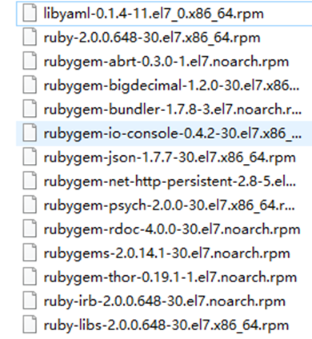

<h1>Redis学习笔记</h1>
[TOC]

## NoSQL数据库简介

技术的分类：

1、解决功能性问题：Java、JSP、RDMBS、Tomcat、HTML、Linux、JDBC、SVN

2、解决扩展性问题：ssh、ssm

3、解决性能的问题：NoSQL、Java线程、Hadoop、Nginx、MQ、ElasticSearch

session的存放位置：

方案一：存在cookie中。不安全，网络负担效率低

方案二：存在文件服务器或者数据库里。大量的IO效率问题

方案三：session复制。session数据冗余，节点越多浪费越大

方案四：缓存数据库。完全在内存中，速度快，数据结构简单

缓存数据库：减少IO的读操作

水平切分：把一张表的记录分为若干张表来存储

垂直切分：把一张表的字段分为若干张表来存储

读写分离：一部分服务器实现读的功能，一部分服务器实现写的功能

通过破坏一定的业务逻辑来换取性能

打破了传统关系型数据库以业务逻辑为依据的存储模式，而针对不同数据结构类型改为以性能为最优先的存储方式

NoSQL数据库概述：

1、NoSQL = Not Only SQL，意即“不仅仅是SQL”，泛指非关系型数据库。

2、NoSQL不依赖业务逻辑方式存储，而以简单的key-value模式存储。因此大大地增加了数据库的扩展能力

3、不遵循SQL标准

4、不支持ACID

5、远超于SQL的性能

NoSQL适用场景：

1、对数据高并发的读写

2、海量数据的读写

3、对数据高扩展性的

NoSQL不适用场景：

1、需要事务支持

2、基于SQL的结构化查询存储，处理复杂的关系，需要即席查询。

<span style=color:red>用不着SQL和用了SQL也不行的情况，考虑用NoSQL</span>

常见的NoSQL数据库：

Memcached：很早出现的NoSQL数据库；数据都在内存中，一般不持久化；支持简单的key-value模式；一般是作为缓存数据库辅助持久化的数据库；多线程+锁

Redis：几乎覆盖了Memcached的绝大部分功能；数据都在内存中，支持持久化，主要用作备份恢复；除了支持简单的key-value模式，还支持多种数据结构的存储，比如list、set、hash、zset等；一般是作为缓存数据库辅助持久化的数据库；单线程+多路IO复用

mongoDB：高性能、开源、模式自由的文档性数据库；数据都在内存中，如果内存不足支持环形队列先进先出；虽然是key-value模式，但是对value（尤其是json）提供把不常用的数据保存到硬盘的丰富的查询功能；支持二进制数据及大型对象；可以根据数据的特点替代RDMBS，成为独立的数据库，或者配合RDMBS。

列式数据库：列式数据库每次查询一列

行式数据库：行式数据库每次查询一行

OLAP分析型处理：处理的是统计数据

OLTP事务型处理：处理的是实际数据

HBase：Hadoop项目中的数据库，用于需要对大量的数据进行随机、实时的读写操作中的场景。HBase的目标就是处理数据量非常庞大的表。

Cassandra：Apache开发的非关系型数据库

Neo4j：主要描述社会关系、公共交通网络、地图及网络拓扑

## Redis基本概念

应用场景：

1、配合关系型数据库做高速缓存

高频次、热门访问的数据、降低数据库IO

分布式架构，做session共享

2、由于其拥有持久化能力，利用多样的数据结构存储特定的数据

（1）最新N个数据：通过List实现按自然时间排序的数据

（2）排行榜，Top N：利用zset

（3）时效性数据，比如手机验证码：Expire过期

（4）计数器、秒杀：原子性、自增方法INCR，DECR

（5）去除大量数据中的重复性数据：利用Set集合

（6）构建队列：利用List集合

（7）发布订阅消息系统：pub/sub模式

安装步骤：

1、下载获得redis安装包redis-x.x.x.tar.gz

2、解压：tar -zxvf redis-x.x.x.tar.gz

3、解压完成后进入目录：cd redis-x.x.x

4、保证gcc和gcc-c++已安装，如果没有安装可以使用

```shell
yum install gcc
yum install gcc-c++
```

5、在redis-x.x.x目录下执行make命令

6、如果安装失败重新安装，那么要先运行make distclean之后再make

7、执行完make命令之后，继续执行make install

查看默认安装目录：

1、redis-benchmark：性能测试工具（服务启动起来后执行）

2、redis-check-aof：修复有问题的AOF文件

3、redis-check-dump：修复有问题的dump.rdb

4、redis-sentinel：redis集群使用

5、redis-server：redis服务器启动命令

6、redis-cli：客户端，操作入口

启动：

1、备份redis.conf：拷贝一份redis.conf到其他目录

2、修改redis.conf文件将里面的daemonize no改成yes，让服务在后台启动

3、启动命令：执行redis-server /myredis/redis.conf

> 注意区分redis的版本，不同版本的redis.conf是不同的

4、用客户端访问：

```
redis-cli //默认使用的是127.0.0.1:6379
redis-cli -h 127.0.0.1 -p 6379 //显式指定主机与端口号
```

5、测试连接：ping，正常情况下返回PONG

6、单实例关闭：客户端输入shutdown或者命令行输入redis-cli shutdown

7、多实例关闭：redis-cli -p 6379 shutdown

默认端口号：6379

默认16个数据库，类似数组下标，初始默认使用0号库，使用`select <dbid>`来切换数据库。

统一密码管理，所有库都是同样的密码，要么都ok要么一个也连不上

redis是单线程+多路IO复用技术：

多路复用是指使用一个线程来检查多个文件描述符（Socket）的就绪状态，比如调用select和poll函数，传入多个文件描述符，如果有一个文件描述符就绪，则返回，否则线程阻塞直到超时。得到就绪状态后进行真正的操作可以在同一个线程中执行，可以刻启动线程执行（比如使用线程池）。

1、select模式：逐个询问，每次最多监视1024个

2、poll模式：逐个询问，不限制监视数量

3、epoll模式：不采取逐个询问的方式，设置标记

串行 vs 多线程+锁（memcached） vs 单线程+多路IO复用（redis）

redis五大数据类型：

key+string、set、list、hash、zset

基本指令：

```
keys *                     查询当前库的所有键
exists <key>               判断某个键是否存在
type <key>                 查看键的类型
del <key>                  删除某个键
expire <key> <seconds>     为键值设置过期时间，单位秒
ttl <key>                  查看还有多少时间过期，-1表示永不过期，-2表示已经过期
dbsize                     查看当前数据库键值对的数量
flushdb                    清空当前库
flushall                   删库跑路
```

## 五大数据类型

### String：

1、String是redis最基本的类型，你可以理解成与Memcached一模一样的类型，一个key对应一个value；

2、String类型是二进制安全的。意味着redis的string可以包含任何数据。比如jpg图片或者序列化的对象；

3、String类型是redis最基本的数据类型，一个redis中字符串value最多可以是512M。

```
get <key>                                       查询
set <key> <value>                               添加
append <key> <value>                            附加
strlen <key>                                    长度
setnx <key> <value>                             非空添加
incr <key>                                      自增，如果为空新增值为1
decr <key>                                      自减，如果为空新减值为-1
incrby/decrby <key> <step>                      将key中存储的数字值增减，自定义步长
mset <key1> <value1> <key2> <value2>            一次添加多个键值对
mget <key1> <value1> <key2> <value2>            一次查询多个键值对
msetnx <key1> <value1> <key2> <value2>          一次setnx多个值
getrange <key> <start> <end>                    获得值的范围（闭区间），类似java中的substring
setrange <key> <offset> <value>                 用给定值覆写<key>所存储的字符串值，从<offset>开始，如果起始位置超出原字符串范围，用\x00填充
setex <key> <seconds> <value>                   设置键值的同时，设置过期时间，单位秒
getset <key> <value>                            以新换旧，设置了新值同时获得旧值
```

原子性：

所谓原子操作是指不会被线程调度机制打断的操作，这种操作一旦开始，就一直运行到结束，中间不会有任何context switch（切换到另一个线程）。

（1）在单线程中，能够在单条指令中完成的操作都可以认为是“原子操作”，因为中断只能发生于指令之间。

（2）在多线程中，不能被其它进程（线程）打断的操作就叫原子操作。

Redis单命令的原子性主要得益于Redis的单线程

### List：

1、单键多值

2、Redis列表是简单的==字符串==列表，按照插入顺序排序，你可以添加一个元素到列表的头部或者尾部

3、底层实际上是一个双向链表，对两端的操作性能很高，通过索引下标的操作中间的节点性能会较差

```
lpush/rpush <key> <value1> <value2>   从左边/右边插入一个或多个值
lpop/rpop <key>                       从左边/右边弹出一个值，值在键在，值光键亡
rpoplpush <key1> <key2>               从key1右边弹出一个值插入到key2左边
lrange <key> <start> <stop>           按照索引下标获得元素（从左到右），支持负数下标表示倒数第几个元素
lindex <key> <index>                  按照索引下标获得元素（从左到右），支持负数下标表示倒数第几个元素
llen <key>                            获得列表长度
linsert <key> before|after <value> <newvalue>
                                      在<value>的前面|后面插入<newvalue>插入值
lrem <key> <n> <value>                从左边删除n个value（从左到右），如果n是负数就是从右向左，0表示删除所有                        
```

### Set：

Redis set对外提供的功能与list类似是一个列表的功能，特殊之处在于set是可以自动排重的，当你需要存储一个列表数据，又不希望出现重复数据时，set是一个很好的选择，并且set提供了判断某个成员是否在一个set集合内的重要接口，这个也是list所不能提供的。

redis的set是string类型的无序集合。它底层其实是一个value为null的hash表，所以添加、删除、查找的复杂度就是O(1)。

```
sadd <key> <value1> <value2>        将一个或多个member元素加入到集合key当中，已经存在于集合的member元素将被忽略
smembers <key>                      取出该集合的所有值
sismember <key> <value>             判断集合<key>是否为含有该<value>值，有返回1，没有返回0
scard <key>                         返回该集合的元素个数
srem <key> <value1> <value2>        删除集合中的某个元素
spop <key>                          随机从该集合中取出一个值
srandmember <key> <n>               随机从该集合中取出n个值，不会从集合中删除
sinter <key1> <key2>                返回两个集合的交集元素
sunion <key1> <key2>                返回两个集合的并集元素
sdiff <key1> <key2>                 返回两个集合的差集元素
```

### hash

redis hash是一个键值对的集合

redis hash是一个string类型的field和value的映射表，hash特别适合用于存储对象

类似Java里面的Map<String, String>

三种用法：

（1）实体类对象ID为键，实体类对象序列化为值

（2）用户ID数据冗余

（3）通过key（ID）+field（属性标签）可以操作对应属性数据了，既不需要重复存储数据，也不会带来序列化和判断修改控制的问题。

```
hset <key> <field> <value>         给<key>哈希表中的<field>键赋值<value>
hget <key> <field>                 从<key1>哈希表中的<field>取出value
hmset <key> <field1> <value1> <field2> <value2>
                                   批量设置hash的值
hexists <key> <field>              查看哈希表key中，给定域field是否存在
hkeys <key>                        列出该哈希表的所有field
hvals <key>                        列出该哈希表的所有value
hincrby <key> <field> <increment>  为哈希表key中的域field的值加上增量increment
hsetnx <key> <field> <value>       将哈希表key中的域field的值设置为value，当且仅当域field不存在
```

### zset：

redis有序集合zset与普通集合set非常相似，是一个没有重复元素的字符串集合。不同之处是有序集合的每个成员都关联了一个评分（score），这个评分（score）被用来按照从最低分到最高分的方式排序集合中的成员。集合的成员是唯一的，但是评分可以是重复了。

因为元素是有序的，所以你也可以很快地根据评分（score）或者次序（position）来获取一个范围的元素。访问有序集合的中间元素也是非常快的因此你能够使用有序集合作为一个没有重复成员的智能列表。

```
zadd <key> <score1> <value1> <score2> <value2>
                                   将一个或多个member元素及其score值
zrange <key> <start> <stop> [withscores]
                                   返回有序集key中，下标在<start>和<stop>之间的元素，带withscores，可以让分数一起和值返回到结果集中
zrangebyscore <key> <min> <max> [withscores] [limit <offset> <count>]
                                   返回有序集key中，所有score值介于min和max之间（闭区间）。有序集成员按score值递增（从小到大）次序排列
zrevrangebyscore <key> <max> <min> [withscores] [limit <offset> <count>]
                                   同上，改为从大到小排列
zincrby <key> <increment> <value>  为元素的score加上增量
zrem <key> <value>                 删除该集合下，指定值的元素
zcount <key> <min> <max>           统计该集合，分数区间内的元素个数
zrank <key> <value>                返回该值在集合中的排名，从0开始
```

## Redis相关配置

计量单位说明：

```
1k => 1000 bytes
1kb => 1024 bytes
1m => 1000000 bytes
1mb => 1024*1024 bytes
1g => 1000000000 bytes
1gb => 1024*1024*1024 bytes
```

大小写不敏感

include 引入其他的配置文件

IP地址的绑定：

- 默认情况bind = 127.0.0.1，只能接受本机的访问请求

- 不写的情况下，无限制接受任何IP地址的访问

- 生产环境肯定要写你应用服务器的地址

- 如果开启了protected-mode，那么在没有设定bind ip且没有设密码的情况下，redis只允许接受本机的响应

> centos 7要开启端口的外部访问
>
> 查询是否开启80端口则：firewall-cmd --query-port=6379/tcp
> 开启80端口：firewall-cmd --add-port=6379/tcp

tcp-backlog：

- 可以理解是一个请求到达后至到接受进程处理前的队列
- backlog队列总和 = 未完成三次握手队列 + 已经完成三次握手队列
- 高并发环境tcp-backlog设置值跟超时时限内的redis吞吐量决定

timeout：一个空闲客户端维持多少秒关闭，0为永不关闭

TCP keepalive：对访问客户端的一种心跳检测，每个n秒检测一次，官方推荐设为60秒

daemonize：是否为后台进程

pidfile：存放pid文件的位置，每个实例会产生一个不同的pid文件

loglevel：四个级别根据使用阶段来选择，生产环境选择notice或者warning

logfile：日志文件名称

syslog：是否将redis日志输送到linux系统日志服务中

syslog-ident：日志的标志

syslog-facility：输出日志的设备

database：设定库的数量，默认为16

security:

- 在命令行中设置密码：

  ```
  config get requirepass
  config set requirepass "123"
  auth 123456
  ```

- 在配置文件中设置永久密码，requirepass

maxclient：最大客户端连接数

maxmemory：设置redis可以使用的内存量，一旦达到内存使用上限，redis将会试图移除内部数据，移除规则可以通过maxmemory-policy来指定。如果redis无法依据移除规则来移除内存中的数据，或者设置了“不允许移除”，那么redis则会针对那些需要申请内存的指令返回错误信息，比如SET、LPUSH等。

maxmemory-policy：

1、volatile-lru：使用LRU（最近最少使用）算法移除key，只对设置了过期时间的键

2、allkeys-lru：使用LRU算法移除key

3、volatile-random：在过期集合中移除随机的key，只对设置了过期时间的键

4、allkeys-random：移除随机的key

5、volatile-ttl（即将过期）：移除那些TTL值最小的key，即那些最近要过期的key

6、noeviction：不进行移除，针对写操作，只是返回错误信息

maxmemory-samples：

- 设置样本数量，LRU算法和最小TTL算法都并非是精确的算法，而是估算值，所以你可以设置样本的大小
- 一般设置3到7的数字，数值越小样本越不准确，但是性能消耗也越小

## java连接redis

```java
Jedis jedis = new Jedis("192.168.65.101",6379);
System.out.println(jedis.ping());
System.out.println(jedis.set("message","hello world"));
jedis.close();
```

## redis的事务定义

redis事务是一个单独的隔离操作，事务中的所有命令都会序列化、按顺序地执行。事务在执行的过程中，不会被其它客户端发送来的命令请求所打断。

redis事务的主要作用就是串联多个命令防止别的命令插队。

multi:  开启事务

exec:  执行事务

discard:  丢弃事务

从输入multi命令开始，输入的命令都会依次进入命令队列中，但不会执行。直到输入exec后，redis会将之前的命令队列中命令依次执行。组队的过程中可以通过discard来放弃组队。

事务的错误处理：组队中的某个命令出现了报告错误（执行事务之前），执行时整个的所有队列会都会被取消。如果执行阶段某个命令报出了错误，则只有报错的命令不会被执行，而其它的命令都会执行，不会回滚。

悲观锁：顾名思义，每次去访问数据的时候，都认为别人会修改，所以每次在拿数据的时候都会上锁，这样别人想拿这个数据就会block直到它拿到锁。传统的关系型数据库里面就用到了很多这种锁机制，比如行锁、表锁、读写锁等，都是在做操作之前先上锁。

乐观锁：顾名思义，就是很乐观。每次去拿数据的时候都认为别人不会修改，所以不会上锁，但是在更新数据的时候会判断一下在此期间别人有没有去更新这个数据，可以使用版本号等机制。乐观锁适用于多读的应用类型，这样可以提高吞吐量。redis就是利用这种check-and-set机制实现事务的。

WATCH key [key ...]

在执行multi之前，先执行watch key1 [key2 ...]，可以监视一个（或多个）key，如果在事务执行之前这个（或这些）key被其他命令所改动，那么事务将被打断。

UNWATCH

取消监视

Redis事务三特性：

1、单独的隔离操作

事务中所有命令都会序列化、按顺序地执行，事务在执行的过程中，不会被其他客户端发送的命令请求所打断

2、没有隔离级别

队列中的命令没有提交之前都不会实际地被执行，因为事务提交前任何指令都不会实际执行，也就不存在。事务内的查询要看到事务里的更新，在事务外查询不能看到“这个让人万分头疼的问题

3、不保证原子性

redis同一个事务中如果有一条命令执行失败，其后的命令仍然会被执行，没有回滚。

安装和使用ab工具：

centos6 默认安装

centos7 需要手动安装

联网：yum install httpd-tools

无网络：

1、进入cd /run/media/root/CentOS 7x86_64/Packages

2、顺序安装

```
apr-1.4.8.el7.x86_64.rpm
apr-util-1.5.2-6.el7.x86_64.rpm
httpd-tools-2.4.6-67.el7.centos.x86_64.rpm
```

3、使用方法：`ab -n 请求数 -c 并发数 -p 指定请求数据文件 -T "application/x-www-form-urlencoded" 测试的请求`

```
ab -n 1000 -c 200 -p /boot/postfile -T "application/x-www-form-urlencoded" 192.168.65.1:8080/SecKill/hello
```

使用事务完成秒杀

1、测试页面：

```html
<form action="${pageContext.request.contextPath}/hello" method="post" enctype="application/x-www-form-urlencoded">
    <input type="hidden" id="prodid" name="prodid" value="0101">
    <input type="button" id="miaosha_btn" name="seckill_btn" value="秒杀点数">
</form>
<script src="${pageContext.request.contextPath}/plugins/jquery-3.4.1/jquery-3.4.1.js"></script>
<script>
    $('#miaosha_btn').click(function(){
        var url = $('body>form').attr('action');
        $.post(url,$('body>form').serialize(),function(data){
            if(data=="false"){
                alert("抢光了");
                $('#miaosha_btn').attr('disabled',true);
            }
        })
    })
</script>
```

2、Servlet：

```java
@WebServlet(urlPatterns = "/hello")
public class HelloServlet extends HttpServlet {
    @Override
    protected void doGet(HttpServletRequest req, HttpServletResponse resp) throws ServletException, IOException {
        String userid = String.valueOf(new Random().nextInt(50000));
        String prodid = req.getParameter("prodid");
        boolean if_success = doSecKill(userid,prodid);
        resp.getWriter().print(if_success);
    }

    private boolean doSecKill(String userid, String prodid) {
        //拼接key
        String kcKey = "SecKill:"+prodid+":kc";
        String userKey = "SecKill:"+prodid+":user";
        Jedis jedis = new Jedis("192.168.65.101", 6379);
        //获取库存
        String kc = jedis.get(kcKey);
        //秒杀还没开始
        if(kc == null){
            System.out.println("秒杀还没开始");
            jedis.close();
            return false;
        }
        //已经秒杀成功，表示为存储uid的set中已经有该用户的uid
        if(jedis.sismember(userKey,userid)){
            System.out.println("已经秒杀成功，不可重复秒杀");
            jedis.close();
            return false;
        }
        //判断库存，若大于0，减库存加人；若小于等于0，秒杀失败
        if(Integer.parseInt(kc) <= 0){
            System.out.println("秒杀已经结束");
            jedis.close();
            return false;
        }
        jedis.decr(kcKey);
        jedis.sadd(userKey,userid);
        System.out.println("秒杀成功");
        jedis.close();
        return true;
    }

    @Override
    protected void doPost(HttpServletRequest req, HttpServletResponse resp) throws ServletException, IOException {
        doGet(req,resp);
    }
}
```


redis连接池：

连接池参数：

MaxTotal：控制一个pool可分配多少个jedis实例，通过pool.getResource()来获取。如果赋值为-1，则表示不限制；如果pool已经分配了maxtotal个jedis实例，则此时pool的状态为exhausted

MaxIdle：控制一个pool最多有多少个状态为idle（空闲）的jedis实例

MaxWaitMillis：表示当borrow一个jedis实例时，最大的等待毫秒数，如果超过等待时间，则直接抛出JedisConnectionException

testOnBorrow：获得一个jedis实例的时候是否检验连接可用性（ping()），如果为true，则得到的jedis实例均是可用的。


LUA脚本：

一个小巧的脚本语言，LUA脚本可以很容易的被C/C++调用，也可以反过来调用C/C++的函数，LUA并没有提供强大的库，一个完整的LUA解释器不过200k，所以LUA不适合作为开发独立应用程序的语言，而是作为嵌入式脚本语言。

很多应用程序、游戏使用LUA作为自己的嵌入式脚本语言，以此来实现可配置性、可扩展性。

LUA脚本在Redis中的优势：

将复杂的或者多步的redis操作，写为一个脚本，一次提交给redis执行，减少反复连接redis的次数，提升性能。

LUA脚本是类似redis事务，有一定的原子性，不会被其他命令插队，可以完成一些redis事务性的操作。

但是注意redis的lua脚本功能，只有在redis 2.6+版本才能使用。


使用lua脚本完成秒杀事务的编写：

```lua
local userid = KEYS[1];
local prodid = KEYS[2];
local qtKey = "SecKill:"..prodid..":kc";
local usersKey = "SecKill:"..prodid..":user";
local userExists = redis.call("sismember",usersKey,userid);
if tonumber(userExists) == 1 then
    return 2;
end
local num = redis.call("get",qtkey);
if tonumber(num) <= 0 then
    return 0;
else
    redis.call("decr",qtkey);
    redis.call("sadd",usersKey,userid);
end
return 1;
```


使用连接池和LUA脚本完成秒杀业务逻辑：

配置连接池：

```java
private static JedisPool jedisPool;
    static{
        JedisPoolConfig cfg = new JedisPoolConfig();
        cfg.setMaxTotal(200);
        cfg.setMaxIdle(32);
        cfg.setMaxWaitMillis(100*1000);
        cfg.setBlockWhenExhausted(true);
        cfg.setTestOnBorrow(true);
        jedisPool = new JedisPool(cfg,"192.168.65.101",6379,60000);
    }
```

使用连接池：

```java
JedisPool jedisPool = JedisPoolUtil.getJedisPoolInstance();
Jedis jedis = jedisPool.getResource();
String sha1 = jedis.scriptLoad(secKillScript);
Object result = jedis.evalsha(sha1,2,uid,prodid);
String reString = String.valueOf(result);
if("0".equals(reString)){
    System.err.println("已经抢空！");
}
else if("1".equals(reString)){
    System.err.println("抢购成功！");
}
else if("2".equals(reString)){
    System.err.println("该用户已经抢过！");
}
else{
    System.err.println("抢购异常");
}
```

使用LUA脚本使得所有线程都能够将业务逻辑执行一遍，而不是中途失败，从而避免了并发线程中只能成功一个的情况。

## redis持久化

两种不同形式的持久化方式：

- RDB：在指定时间间隔内将内存中的数据集快照写入磁盘，也就是所谓的snapshot快照，它恢复时是将快照文件直接读到内存中。
- AOF：以日志形式来记录每一个写操作，将redis执行过的所有写指令记录下来（读操作不记录），只许追加文件但不可以改写文件，redis启动之初会读取该文件重新构建数据，换言之，redis重启的话就根据日志文件的内容将写指令从前到后执行一次以完成数据的恢复工作。


### RDB

备份是如何执行的：

redis会创建（fork）一个子进程来进行持久化，会先将数据写入到一个临时文件中，待持久化过程都结束了，再用这个临时文件替换上次持久化好的文件。整个过程中，主进程是不进行任何IO操作的，这就确保了极高的性能。如果需要进行大规模数据的恢复，且对于数据恢复的完整性不是非常敏感，那么RDB方式就要比AOF方式更加的高效。RDB的缺点是最后一次持久化后的数据可能丢失。


关于fork：

在linux程序中，fork函数会产生一个和父进程完全相同的子进程，但子进程在此后多会exec系统调用，处于效率考虑，linux中引入了”写时复制技术“，一般情况父进程和子进程会共用同一段物理内存，只有进程空间的各段内容要发生变化时才会将父进程的内容复制一份给子进程。


rdb的保存的文件：

在redis.conf中配置文件名称，默认为dump.rdb

```
dbfilename dump.rdb
```

rdb文件的保存路径，也可以修改，默认为redis启动时命令行所在的目录下

```
dir ./
```


rdb的保存策略：

```
save <seconds> <change>        # 在多少秒内完成多少次修改就进行rdb保存

save 900 1
save 300 10
save 60 10000
```

正常关闭也会导致rdb保存

手动保存快照：命令save，只管保存，其他不管，全部阻塞；save vs bgsave


stop-writes-on-bgsave-error yes

当redis无法写入磁盘的话，直接关掉redis的写操作

rdbcompression yes

进行rdb保存时，将文件压缩

rdbchecksum yes

在存储快照时，还可以让redis使用CRC64算法来进行数据校验，但是这样做会增加大约10%的性能消耗，如果希望获得到最大的性能提升，可以关闭此功能


rdb备份：

先通过config get dir查询rdb文件的目录

将*.rdb的文件拷贝到别的地方


rdb的恢复：

1、关闭redis

2、先把备份的文件拷贝到工作目录下

3、启动redis，备份数据会直接加载


rdb的优点：

节省磁盘空间，恢复速度快

rdb的缺点：

虽然redis在fork时使用了写时拷贝技术，但是如果数据庞大时还是比较消耗性能。

在备份周期在一定间隔时间做一次备份，所以如果redis意外宕机，就会丢失最后一次快照后的所有修改。


### AOF

AOF默认不开启，需要手动在配置文件中配置：

appendonly no

可以在redis.conf中配置文件名称，默认为为appendcopy.aof:

appendfilename "appendonly.aof"

AOF文件的保存路径，同rdb的路径一致


AOF与RDB同时开启，redis听谁的？

如果同时开启，以aof为准。

AOF文件故障备份：AOF的备份机制和性能虽然和RDB不同，但是备份和恢复的操作同RDB一样，都是拷贝备份文件，需要恢复时再拷贝到redis工作目录下，启动系统即加载。

==AOF和RDB同时开启，系统默认取AOF的数据==

AOF文件故障恢复：AOF文件的保存路径，同RDB保存路径一致。如果遇到AOF文件损坏，可通过redis-check-aof --fix appendonly.aof进行恢复，但是不建议使用。


AOF同步频率配置：

- 始终同步：每次redis的写入都会立刻记入日志
- 每秒同步：每秒记入日志一次，如果宕机，本秒的数据可能丢失
- 不主动进行同步，把同步时机交给操作系统

```
appendfsync always
appendfsync everysec
appendfsync no
```

重写rewrite：

AOF采用文件追加方式，文件会越来越大，为避免出现这种情况，新增了重写机制。当AOF文件的大小超过所设定的阈值时，只保留可以恢复数据的最小指令集，可以使用命令bgrewriteaof

如何实现重写：AOF文件持续增长而过大时，会fork出一条新进程来将文件重写（也是先写临时文件最后在rename），遍历新进程的内存中数据，每条记录有一条set语句。重写aof文件的操作，并没有读取旧的aof文件，而是将整个内存中的数据库内容用命令的方式重写了一个新的aof文件，这一点和快照是类似的。

重写的时机：重写虽然可以节约大量磁盘空间，减少恢复时间，但是每次重写还是有一定的负担的，因此设定redis要满足一定条件才会进行重写。系统载入时或者上次重写完毕时，redis会记录此时AOF大小，设为base_size。如果redis的AOF当前大小 >= base_size + base_size * 100% （默认）且当前大小 >= 64MB（默认）的情况下，redis会对AOF进行重写。

```
auto-aof-rewrite-percentage 100
auto-aof-rewrite-min-size 64mb
```


AOF的优点：

- 备份机制更加稳健，丢失数据概率更低
- 可读的日志文本，通过操作AOF文件，可以处理误操作

AOF的缺点：

- 比起RDB占用更多的磁盘空间
- 恢复备份速度要慢
- 每次读写同步的话，有一定的性能压力
- 存在个别bug，造成恢复不能

用哪个好？

- 官方推荐两个都启用
- 如果对数据不敏感，可以单独选用RDB
- 不建议单独使用AOF，因为可能出现bug
- 如果只是做纯内存缓存，可以都不用


## 主从复制

主从复制：就是主机数据更新后根据配置和策略，自动同步到备机的master/slaver机制，master以写为主，slaver以读为主。 

用处：

- 读写分离，性能扩展
- 容灾快速恢复


配从（服务器）不配主（服务器）：

- 拷贝多个redis.conf文件include
- 开启daemonize yes
- pid文件名字pidfile
- 指定端口port
- log文件名字
- dump.rdb修改名称，dbfilename
- appendonly关掉或者换名字


info replication：打印主从复制的相关信息

slaveof \<ip\> \<port\>：成为某个实例的从服务器


一主二仆模式：

1、切入点问题？slave1、slave2是从头开始复制还是从切入点开始复制?比如从k4进来，那之前的123是否也可以复制

答：重新启动redis服务之后，默认就不是服务器了，需要重新设置从服务器，这时就牵扯到切入点的问题。实际上，从服务器无论何时都要与主服务器保持一致，因此slave1和slave2都是从头开始复制的。

2、从机是否可以写？set可否？ 

答：不能，从服务器只能读不能写主服务器复制过来的数据

3、主机shutdown后情况如何？从机是上位（变成master）还是原地待命

答：从机原地待命，还是slave，只是连接状态变成了down

4、主机又回来了后，主机新增记录，从机还能否顺利复制？

答：主机重新上线后，从机与主机建立连接并同步主机全部数据。因此，从机新增记录，从机当然能够顺利复制。

5、其中一台从机down后情况如何？依照原有它能跟上大部队吗？

答：主机与从机连接后，会立即进行数据的同步


永久配置主从关系，在redis的配置文件中添加slaveof配置项

```
slaveof <masterid> <masterport>
```


主从复制原理：

- 每次从机连通后，都会给主机发送sync指令
- 主机立刻进行存盘操作，发送RDB文件，给从机
- 从机收到RDB文件后，进行全盘加载
- 之后每次主机的写操作，都会立刻发送给从机，从机执行相同的命令


薪火相传模式：

- 上一个slave可以是下一个slave的master，slave同样可以接受其它slaves的连接和同步请求，那么该slave作为链条中下一个的master，可以有效减轻master的写压力，去中心化降低风险。
- 用slaveof \<ip\>  \<port\>
- 中途变更转向：会清除之前的数据，重新建立拷贝最新的
- 风险是一旦某个结点宕机，会导致后面的结点都无法备份
- 反客为主：当一个master宕机后，后面的slave可以立刻升为master，其后面的slave不用做任何修改。用slaveof no one将从机变为主机。


哨兵模式：

反客为主的自动版，能够后台监控主机是否故障，如果故障了根据投票数自动将从库转换为主库。

流言协议与投票协议

配置哨兵模式：

- 调整为一主二仆模式

- 自定义的/myredis目录下新建sentinel.conf文件

- 在配置文件中填写内容：

  ```
  sentinel monitor mymaster 127.0.0.1 6379 1
  ```

- 其中mymaster为监控对象起的服务器名称（随便起），1为至少有多少个哨兵同意迁移的数量（至少有几个哨兵认为宕机）。

启动哨兵：执行`redis-sentinel /myredis/sentinel.conf`

故障恢复：

- 新主登基：从下线的主服务的所有从服务里面挑选一个从服务，将其转成主服务，选择条件依次为：
  - 选择优先级的靠前的
  - 选择偏移量最大的
  - 选择runid最小的从服务
- 群仆俯首：挑选出新的主服务之后，sentinel向原主服务的从服务发送slaveof新主服务的命令，复制新master
- 旧主俯首：当已下线的服务重新上线时，sentinel会向其发送slaveof命令，让其成为新主的从服务器

> 优先级在redis.conf中slave-priority 100
>
> 偏移量是指获得原主数据最多的
>
> 每个redis实例启动后都会随机生成一个40位的runid

## redis集群

问题：

- 容量不够，redis如何进行扩容
- 并发写操作，redis如何分摊

集群：

- Redis 集群实现了对Redis的水平扩容，即启动N个redis节点，将整个数据库分布存储在这N个节点中，每个节点存储总数据的1/N。
- Redis 集群通过分区（partition）来提供一定程度的可用性（availability）：
  即使集群中有一部分节点失效或者无法进行通讯， 集群也可以继续处理命令请求。

配置redis集群环境：

1、安装ruby环境

能上网：

- yum install ruby
- yum install rubygems

不能上网：

- cd /run/media/root/CentOS 7x86_64/Packages（路径跟CentOS 6不同）获取下图rpm包

  

- 拷贝到/opt/rpmruby/目录下，并cd到此目录
- 执行：rpm -Uvh *.rpm --nodeps --force
- 按照依赖安装各个rpm包

2、拷贝redis-3.2.0.gem到/opt目录下

3、执行在opt目录下执行  gem install --local
redis-3.2.0.gem

> 如何查看yum安装的软件路径：
>
> yum install redis
>
> rpm -qa | grep redis        得到redis-3.2.10-2.el7.x86_64
>
> rpm -ql redis-3.2.10-2.el7.x86_64
>
> 或者使用whereis


制作6个实例，6379、6380、6381、6389、6390、6391

- 拷贝多个redis.conf文件
- 开启daemonize yes
- pid文件名称
- 指定端口
- log文件名字
- dump.rdb名字
- appendonly关掉或者换名字

安装redis cluster配置：

- `cluster-enabled yes`        打开集群模式
- `cluster-config-file nodes-6379.conf`        设定节点配置文件名。注意不是redis_6379.conf
- `cluster-node-timeout 15000`        设定节点失联时间，超过该时间（毫秒），集群自动进行主从切换

将六个节点合成为一个集群：

- 组合之前，先保证所有的redis实例启动并且nodes_xxxx.conf文件都生成正常。

- 高版本不需要安装ruby，直接运行（低版本需要安装ruby并且执行redis-trib.rb)

  ```
  redis-cli --cluster-replicas 1 --cluster create
  192.168.65.101:6379    192.168.65.101:6380
  192.168.65.101:6381    192.168.65.101:6389
  192.168.65.101:6390    192.168.65.101:6391
  ```

以集群的方式进入客户端：

redis-cli -c -p 端口号

通过cluster nodes命令查看集群信息

redis如何分配这6个节点：

- 一个集群至少有三个主节点
- 选项 --replicas 1表示一个master带一个slave
- 分配原则：尽量保证每个主数据库运行在不同的ip地址，每个slave与master不在一个ip地址上。


什么是slots：

一个 Redis集群包含16384个插槽（hash slot），数据库中的每个键都属于这 16384个插槽的其中一个，集群使用公式 CRC16(key)% 16384 来计算键key属于哪个槽，其中 CRC16(key)语句用于计算键key的CRC16校验和。

集群中的每个节点负责处理一部分插槽。例如共有结点A、B、C，则A负责前5501个，B负责接下来的5500个，C负责处理剩余的。


在集群中录入值：

没有添加-c选项时，redis客户端添加、查询键值对必须到对应的插槽上，如果请求与插槽不匹配就会报错

添加了-c选项之后，会自动重定向，不会报错。

不在一个slot下的键值不能通过mget、mset等操作录入和查询

可以通过{}定义组的概念，从而使key中{}内相同内容的键值对放到一个slot中去

```
set a{user} 1
set aa{user} 2
set aaa{user} 3
被分到一组中去
```


查询集群中的值：

```
cluster keyslot <key>        计算键key应该被放置在哪个槽上
cluster countkeysinslot <slot>        返回slot目前包含的键值对数量
cluster getkeysinslot <slot> <count>        返回count个slot中的键
```


故障恢复：

如果主节点下线，从节点能否上位？可以

主节点恢复后，主从节点关系怎样？改朝换代，俯首称臣

如果所有某一段插槽的主从节点都宕掉，redis服务是否还能继续？不能

redis.conf中的参数cluster-require-full-coverage：16384个slot都正常的时候才能对外提供服务


集群的Jedis开发：

```java
public class JedisClusterTest {
  public static void main(String[] args) {
     Set<HostAndPort> set =new HashSet<HostAndPort>();
     set.add(new HostAndPort("192.168.31.211",6379));
     JedisCluster jedisCluster=new JedisCluster(set);

     jedisCluster.set("k1", "v1");
     System.out.println(jedisCluster.get("k1"));
  }
}
```


Redis 集群提供了以下好处：

- 实现扩容

- 分摊压力

- 无中心配置相对简单

Redis 集群的不足：

- 多键操作是不被支持的 

- 多键的Redis事务是不被支持的。lua脚本不被支持。

- 由于集群方案出现较晚，很多公司已经采用了其他的集群方案，而代理或者客户端分片的方案想要迁移至redis cluster，需要整体迁移而不是逐步过渡，复杂度较大。