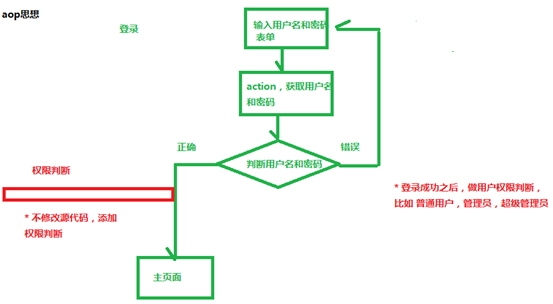
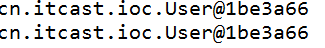
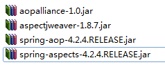
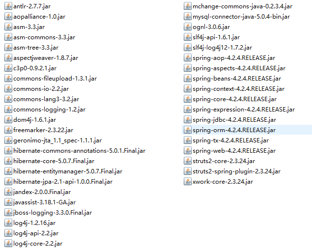

[TOC]

# Hibernate_day01

## Hibernate课程安排

- 第一天 hibernate入门和基本操作

- 第二天 hibernate概念和api使用

- 第三天 hibernate配置一对多和多对多

- 第四天 hibernate查询操作

## 今天内容介绍

1. web内容回顾

   - javaee三层结构

   - mvc思想

2. hibernate概述

3. hibernate入门案例

4. hibernate配置文件

5. hibernate的api使用


## WEB内容回顾

### JavaEE三层结构

1. web层：struts2框架
2. service层：spring框架
3. dao层：hibernate框架
   - 对数据库进行crud操作

### MVC思想

1 m：模型
2 v：视图
3 c：控制器

## Hibernate概述

### 什么是框架
1 写程序，使用框架之后，帮我们实现一部分功能，使用框架好处，少写一部分代码实现功能

### 什么是hibernate框架（重点）
1 hibernate框架应用在javaee三层结构中 dao层框架

2 在dao层里面做对数据库crud操作，使用hibernate实现crud操作，hibernate底层代码就是jdbc，hibernate对jdbc进行封装，使用hibernate好处，不需要写复杂jdbc代码了，
不需要写sql语句实现

3 hibernate开源的轻量级的框架

4 hibernate版本

- Hibernate3.x
- Hibernate4.x
- Hibernate5.x（学习）


lib：hibernate相关jar包

### 什么是orm思想（重点）
1 hibernate使用orm思想对数据库进行crud操作

2 在web阶段学习 javabean，更正确的叫法 实体类

3 orm：object relational mapping，对象关系映射
文字描述：
（1）让实体类和数据库表进行一一对应关系
让实体类首先和数据库表对应
让实体类属性 和 表里面字段对应
（2）不需要直接操作数据库表，而操作表对应实体类对象

画图描述：


## Hibernate入门

### 搭建hibernate环境（重点）

#### 第一步 导入hibernate的jar包


因为使用hibernate时候，有日志信息输出，hibernate本身没有日志输出的jar包，导入其他日志的jar包
不要忘记还有mysql驱动的jar包


#### 第二步 创建实体类

```java
public class User{
    //hibernate要求实体类有一个主键
    private Integer uid;
    private String username;
    private String password;
    private String address;
    //get/set方法
}
```

（1）使用hibernate时候，不需要自己手动创建表，hibernate帮把表创建

#### 第三步 配置实体类和数据库表一一对应关系（映射关系）

使用配置文件实现映射关系
（1）创建xml格式的配置文件

- 映射配置文件名称和位置没有固定要求

- 建议：在实体类所在包里面创建，实体类名称.hbm.xml

（2）配置是是xml格式，在配置文件中首先引入xml约束

- 学过约束dtd、schema，在hibernate里面引入的约束dtd约束


```xml
<?xml version="1.0" encoding="UTF-8"?>
<!DOCTYPE hibernate-mapping PUBLIC
	"-//Hibernate/Hibernate Mapping DTD 3.0//EN"
	"http://www.hibernate.org/dtd/hibernate-mapping-3.0.dtd">
```

（3）配置映射关系

```xml
<hibernate-mapping>
	<!-- 1 配置类和表对应 
		class标签
		name属性：实体类全路径
		table属性：数据库表名称
	-->
	<class name="cn.itcast.entity.User" table="t_user">
		<!-- 2 配置实体类id和表id对应 
			hibernate要求实体类有一个属性唯一值
			hibernate要求表有字段作为唯一值
		-->
		<!-- id标签
			name属性：实体类里面id属性名称
			column属性：生成的表字段名称
		 -->
		<id name="uid" column="uid">
			<!-- 设置数据库表id增长策略 
				native:生成表id值就是主键自动增长
			-->
			<generator class="native"></generator>
		</id>
		<!-- 配置其他属性和表字段对应 
			name属性：实体类属性名称
			column属性：生成表字段名称
		-->
		<property name="username" column="username"></property>
		<property name="password" column="password"></property>
		<property name="address" column="address"></property>
	</class>
</hibernate-mapping>
```

#### 第四步 创建hibernate的核心配置文件

（1）核心配置文件格式xml，但是核心配置文件名称和位置固定的

- 位置：必须src下面
- 名称：必须hibernate.cfg.xml


（2）引入dtd约束

```xml
<!DOCTYPE hibernate-configuration PUBLIC
	"-//Hibernate/Hibernate Configuration DTD 3.0//EN"
	"http://www.hibernate.org/dtd/hibernate-configuration-3.0.dtd">
```

（3）hibernate操作过程中，只会加载核心配置文件，其他配置文件不会加载

第一部分： 配置数据库信息 必须的

```xml
<!-- 第一部分：配置数据库信息 必须的 -->
<property name="hibernate.connection.driver_class">com.mysql.jdbc.Driver</property>
<property name="hibernate.connection.url">jdbc:mysql://hibernate_day01</property>
<property name="hibernate.connection.username">root</property>
<property name="hibernate.connection.password">root</property>
```

第二部分： 配置hibernate信息 可选的

```xml
<!-- 第二部分：配置hibernate信息 可选的 -->
<!-- 输出底层sql语句 -->
<property name="hibernate.show_sql">true</property>
<!-- 输出底层sql语句格式 -->
<property name="hibernate.format_sql">true</property>
<!-- hibernate帮创建表，需要配置之后
	update：如果已经有表，更新，如果没有创建
-->
<property name="hibernate.hbm2ddl.auto">update</property>
<!-- 配置数据库方言
	在mysql里面实现分页关键字limit，只能使用mysql
	在oracle数据库，实现分页rownum
	让hibernate框架识别不同数据库自己特有的语句
-->
<property name="hibernate.dialect">org.hibernate.dialect.MySQLDialect</property>
```

第三部分： 把映射文件放到核心配置文件中

```xml
<!-- 第三部分：把映射文件放到核心配置文件中 -->
<mapping resource="cn/itcast/entity/User.hb,.xml"/>
```


### 实现添加操作

#### 第一步 加载hibernate核心配置文件

#### 第二步 创建SessionFactory对象

#### 第三步 使用SessionFactory创建session对象

#### 第四步 开启事务

#### 第五步 写具体逻辑 crud操作

#### 第六步 提交事务

#### 第七步 关闭资源

```java
@Test
public void testAdd() {
    // 第一步 加载hibernate核心配置文件
    // 到src下面找到名称是hibernate.cfg.xml
    //在hibernate里面封装对象
    Configuration cfg = new Configuration();
    cfg.configure();

    //第二步 创建SessionFactory对象
    //读取hibernate核心配置文件内容，创建sessionFactory
    //在过程中，根据映射关系，在配置数据库里面把表创建
    SessionFactory sessionFactory = cfg.buildSessionFactory();

    //第三步 使用SessionFactory创建session对象
    // 类似于连接
    Session session = sessionFactory.openSession();

    //第四步 开启事务
    Transaction tx = session.beginTransaction();

    //第五步 写具体逻辑 crud操作
    //添加功能
    User user = new User();
    user.setUsername("小王");
    user.setPassword("250");
    user.setAddress("日本");
    //调用session的方法实现添加
    session.save(user);

    //第六步 提交事务
    tx.commit();

    //第七步 关闭资源
    session.close();
    sessionFactory.close();
}
```
看到效果：

（1）是否生成表


（2）看表是否有记录


## Hibernate配置文件详解

### Hibernate映射配置文件（重点）

1 映射配置文件名称和位置没有固定要求

2 映射配置文件中，标签name属性值写实体类相关内容
（1）class标签name属性值实体类全路径
（2）id标签和property标签name属性值 实体类属性名称

3 id标签和property标签，column属性可以省略的
（1）不写值和name属性值一样的

4 property标签type属性，设置生成表字段的类型，自动对应类型

### Hibernate核心配置文件

1 配置写位置要求

```xml
<hibernate-configuration>
	<session-factory>
    	...
    </session-factory>
</hibernate-configuration>
```

2 配置三部分要求

（1）数据库部分必须的
（2）hibernate部分可选的
（3）映射文件必须的

3 核心配置文件名称和位置固定的

（1）位置：src下面
（2）名称：hibernate.cfg.xml

## Hibernate核心api

### Configuration

1 代码

```java
Configuration cfg = new Configuration();
cfg.configure();
```

（1）到src下面找到名称hibernate.cfg.xml配置文件，创建对象，把配置文件放到对象里面（加载核心配置文件）

### SessionFactory（重点）

1 使用configuration对象创建sessionFactory对象

（1）创建sessionfactory过程中做事情：

- 根据核心配置文件中，有数据库配置，有映射文件部分，到数据库里面根据映射关系把表创建

```xml
<property name="hibernate.hbm2ddl.auto">update</property>
```

2 创建sessionFactory过程中，这个过程特别耗资源的

（1）在hibernate操作中，建议一个项目一般创建一个sessionFactory对象

3 具体实现

（1）写工具类，写静态代码块实现

- 静态代码块在类加载时候执行，执行一次

```java
static Configuration cfg =null;
static SessionFactory sessionFactory = null;
//静态代码块实现
static{
    //加载核心配置文件
    cfg = new Configuration();
    cfg.configure();
    sessionFactory = cfg.buildSessionFactory();
}

//提供方法返回sessionFactory
public static SessionFactory getSessionFactory(){
    return sessionFactory;
}
```

### Session（重点）

1 session类似于jdbc中connection

2 调用session里面不同的方法实现crud操作
（1）添加 save方法
（2）修改 update方法
（3）删除 delete方法
（4）根据id查询 get方法

3 session对象单线程对象
（1）session对象不能共用，只能自己使用

### Transaction

1 事务对象

```java
//第四步开启事务
Transaction tx = session.beginTransaction();
```

2 事务提交和回滚方法

```java
tx.commit();

tx.rollback();
```

3 事务概念

（1）事务四个特性(ACID)

原子性、一致性、隔离性、持久性

## 解决配置文件没有提示问题

1 可以上网

2 把约束文件引入到eclipse中


（1）在配置文件中复制一句话

 `http://www.hibernate.org/dtd/hibernate-mapping-3.0.dtd`


重启eclipse开发工具

演示常见错误
1 在映射配置文件中，把name属性值写错了，和实体类属性名称不一样，出现异常

 


2 在核心配置文件中，没有引入映射配置文件


3 测试配置是否正确
（1）在工具类，写静态代码块，创建sessionFactory，过程中根据配置把表创建
（2）让工具类执行，在工具类写main方法可以了


（3）如果出现异常，弹出框


点击确定，在控制台有异常输出


4 配置文件里面属性值，双引号里面不能有空格

5 注意输入法全角问题


# Hibernate_day02

## 上节内容

1 web内容回顾

2 hibernate概述

（1）orm思想

3 hibernate入门案例

4 hibernate的配置文件

5 hibernate的核心api

## 今天内容

1 实体类编写规则

2 hibernate主键生成策略
（1）native
（2）uuid

3 实体类操作
（1）crud操作
（2）实体类对象状态

4 hibernate的一级缓存

5 hibernate的事务操作
（1）事务代码规范写法

6 hibernate其他的api（查询）
（1）Query
（2）Criteria
（3）SQLQuery

## 实体类编写规则

1 实体类里面属性私有的

2 私有属性使用公开的set和get方法操作

3 要求实体类有属性作为唯一值（一般使用id值）

4 实体类属性建议不使用基本数据类型，使用基本数据类型对应的包装类
（1）八个基本数据类型对应的包装类
- int – Integer
- char—Character、
- 其他的都是首字母大写 比如 double – Double
（2）比如 表示学生的分数，假如 int score;
- 比如学生得了0分 ，int score = 0;
- 如果表示学生没有参加考试，int score = 0;不能准确表示学生是否参加考试
		解决：使用包装类可以了， Integer score = 0，表示学生得了0分，
		表示学生没有参加考试，Integer score = null;

## Hibernate主键生成策略

1 hibernate要求实体类里面有一个属性作为唯一值，对应表主键，主键可以不同生成策略

2 hibernate主键生成策略有很多的值

```xml
<!-- 设置数据库表id增长策略
	native：根据使用的数据库帮选择哪个值
-->
<generator class="native"/>
```

3 在class属性里面有很多值

（1）native： 根据使用的数据库帮选择哪个值


（2）uuid：之前web阶段写代码生成uuid值，hibernate帮我们生成uuid值


4 演示生成策略值 uuid

（1）使用uuid生成策略，实体类id属性类型 必须 字符串类型

```java
private String id
```

（2）配置部分写出uuid值

 ```xml
<generator class="uuid"/>
 ```


## 实体类操作

### 对实体类crud操作

#### 添加操作

1 调用session里面的save方法实现

```java
//添加功能
User user = new User();
user.setUsername("小马");
user.setPassword("1314520");
user.setAddress("美国");
//调用session的方法实现添加
session.save(user);
```

#### 根据id查询

1 调用session里面的get方法实现

 ```java
//4 根据id查询
//调用session里面的get方法
//第一个参数：实体类的class
//第二个参数：id值
User user = session.get(User.class,1);
 ```


#### 修改操作

1 首先查询，修改值

（1）根据id查询，返回对象

 ```java
//4 修改操作
// 修改uid=2记录的username属性值
//4.1 根据id查询
User user = session.get(User.class,2);
//4.2 向返回的User对象里面设置修改后的值
user.setUsername("东方不败");
//4.3 调用session的方法update修改
//执行过程：到User对象里面寻找uid值，根据uid值进行修改
session.update(user);
 ```


#### 删除操作

1 调用session里面delete方法实现

```java
//4 删除操作
//第一种 根据id查询对象
User user = session.get(User.class,2);
session.delete(user);
```

### 实体类对象状态（概念）

1 实体类状态有三种

（1）瞬时态：对象里面没有id值，对象与session没有关联

```java
User user = new User();
user.setUsername("jack");
user.setPassword("124");
user.setAddress("china");
```

（2）持久态：对象里面有id值，对象与session关联

```java
User user = session.get(User.class,1);
```

（3）托管态：对象有id值，对象与session没有关联

```java
User user = new User();
user.setUid(3);
```

2 演示操作实体类对象的方法
（1）saveOrUpdate方法：实现添加、实现修改

```java
//1 添加操作
User user = new User();
user.setUsername("jack");
user.setPassword("520");
user.setAddress("朝鲜");

//实体类对象状态是瞬时态，做添加
session.saveOrUpdate(user);
```

```java
User user = new User();
user.setUid(6);//指定了主键
user.setUsername("rose");
user.setPassword("1314");
user.setAddress("阿尔巴尼亚");

//实体类对象状态是托管态，做修改
session.saveOrUpdate(user);
```

```java
User user = session.get(User.class,7);
user.setUsername("lilei");

//实体类对象状态是持久态，做修改
session.saveOrUpdate(user);
```


## Hibernate的一级缓存

### 什么是缓存

1 数据存到数据库里面，数据库本身是文件系统，使用流方式操作文件效率不是很高。
（1）把数据存到内存里面，不需要使用流方式，可以直接读取内存中数据
（2）把数据放到内存中，提供读取效率

### Hibernate缓存

1 hibernate框架中提供很多优化方式，hibernate的缓存就是一个优化方式

2 hibernate缓存特点：
第一类 hibernate的一级缓存
（1）hibernate的一级缓存默认打开的
（2）hibernate的一级缓存使用范围，是session范围，从session创建到session关闭范围
（3）hibernate的一级缓存中，存储数据必须 持久态数据

第二类 hibernate的二级缓存
（1）目前已经不使用了，替代技术 redis
（2）二级缓存默认不是打开的，需要配置
（3）二级缓存使用范围，是sessionFactory范围

### 验证一级缓存存在

1 验证方式
（1）首先根据uid=1查询，返回对象
（2）其次再根据uid=1查询，返回对象

```java
//1 根据uid=6查询
//执行第一个get方法是否查询数据库，是否发送sql语句
User user1 = session.get(User.class,6);
System.out.println(user1);

//2 再根据uid=6查询
//执行第二个get方法是否查询数据库，是否发送sql语句
User user2 = session.get(User.class,6);
System.out.println(user2);
```


第一步执行get方法之后，发送sql语句查询数据库
第二个执行get方法之后，没有发送sql语句，查询一级缓存内容

### Hibernate一级缓存执行过程


### Hibernate一级缓存特性
1 持久态自动更新数据库

```java
//1 根据id查询
User user = session.get(User.class,7);
//2 设置返回对象值
user.setUsername("hanmeimei");
//3 调用方法实现
session.update(user);
```


2 执行过程（了解）

## Hibernate事务操作

### 事务相关概念

1 什么是事务

2 事务特性

3 不考虑隔离性产生问题
（1）脏读
（2）不可重复读
（3）虚读

4 设置事务隔离级别
（1）mysql默认隔离级别 repeatable read

### Hibernate事务代码规范写法

1 代码结构
```java
try {
  //开启事务
  //提交事务
}catch() {
  //回滚事务
}finally {
  //关闭
}
```

```java
@Test
public void testTx() {
    SessionFactory sessionFactory = null;
    Session session = null;
    Transaction tx = null;
    try {
        sessionFactory = HibernateUtils.getSessionFactory();
        session = sessionFactory.openSession();
        //开启事务
        tx = session.beginTransaction();

        //添加
        User user = new User();
        user.setUsername("小马");
        user.setPassword("250");
        user.setAddress("美国");

        session.save(user);

        int i = 10/0;
        //提交事务
        tx.commit();
    }catch(Exception e) {
        e.printStackTrace();
        //回滚事务
        tx.rollback();
    }finally {
        //关闭操作
        session.close();
        sessionFactory.close();
    }
}
```

### Hibernate绑定session

1 session类似于jdbc的connection，之前web阶段学过 ThreadLocal

2 帮实现与本地线程绑定session

3 获取与本地线程session
（1）在hibernate核心配置文件中配置

```xml
<!-- 在hibernate核心配置文件中配置 -->
<property name="hibernate.current_session_context_class">thread</property>
```

（2）调用sessionFactory里面的方法得到

```java
//提供返回与本地线程帮的session方法
public static Session getSessionObject(){
    return sessionFactory.getCurrentSession();
}
```

4 获取与本地线程绑定session时候，关闭session报错，不需要手动关闭了


## Hibernate的api使用

### Query对象

1 使用query对象，不需要写sql语句，但是写hql语句
（1）hql：hibernate query language，hibernate提供查询语言，这个hql语句和普通sql语句很相似
（2）hql和sql语句区别：

- 使用sql操作表和表字段
- 使用hql操作实体类和属性

2 查询所有hql语句：
（1）from 实体类名称

3 Query对象使用
（1）创建Query对象
（2）调用query对象里面的方法得到结果

```java
//1 创建Query对象
//方法里面写hql语句
Query query = session.createQuery("from User");

//2 调用query里面的方法得到结果
List<User> list = query.list();

System.out.println(list);
```

### Criteria对象

1 使用这个对象查询操作，但是使用这个对象时候，不需要写语句，直接调用方法实现

2 实现过程
（1）创建criteria对象
（2）调用对象里面的方法得到结果

```java
//1 创建criteria对象
//方法里面参数是实体类class
Criteria criteria = session.createCriteria(User.class);
//2 调用方法得到结果
List<User> list = criteria.list();
```

### SQLQuery对象

1 使用hibernate时候，调用底层sql实现

2 实现过程
（1）创建对象
（2）调用对象的方法得到结果

```java
//1 创建对象
//参数普通sql语句
SQLQuery sqlQuery = session.createSQLQuery("select * from t_user");
//调用sqlQuery里面的方法
//返回list集合，默认里面的每部分数组结构
List<Object[]> list = sqlQuery.list();
for(Object[] objects : list){
    System.out.println(Arrays.toString(objects));
}
```

返回list集合每部分是数组


返回list中每部分是对象形式

 ```java
//1 创建对象
//参数普通sql语句
SQLQuery sqlQuery = session.createSQLQuery("select * from t_user");

//返回的list中每部分是对象形式
sqlQuery.addEntity(User.class);

//调用sqlQuery里面的方法
List<User> list = sqlQuery.list();
 ```


## 完成任务

1 查询表所有记录，把记录显示页面中
（1）servlet里面调用service，service调用dao
（2）在dao里面使用hibernate实现操作
（3）在页面中显示所有数据

- 在servlet里面把list集合放到域对象
- 在jsp中使用el表达式+foreach标签获取

2 复习知识
（1）一对多和建表
（2）多对多和建表

# Hibernate_day03

## 上节内容

1 实体类编写规则

2 hibernate主键生成策略

3 实体类操作
（1）crud操作
（2）实体类对象状态

4 hibernate的一级缓存

5 hibernate的事务操作
（1）事务代码规则写法

6 hibernate其他的api（查询）

## 今天内容

0 列表功能实现

1 表与表之间关系回顾
（1）一对多（客户和联系人）
（2）多对多（用户和角色）

2 hibernate一对多操作
（1）一对多映射配置
（2）一对多级联保存
（3）一对多级联删除
（4）inverse属性

3 hibernate多对多操作
（1）多对多映射配置
（2）多对多级联保存（重点）
（3）多对多级联删除
（4）维护第三张表

## 客户列表功能

1 sessionFactory已经关闭了，不需要关闭

 

```java
//sessionFactory不需要关闭
sessionFactory.close();
```

2 dao里面代码
```java
//使用hibernate实现查询列表
public List<Customer> findAll() {
    SessionFactory sessionFactory = null;
    Session session = null;
    Transaction tx = null;
    try {
        //得到sessionFactory
        sessionFactory = HibernateUtils.getSessionFactory();
        //得到session
        session = sessionFactory.openSession();
        //开启事务
        tx = session.beginTransaction();


        //查询所有记录
        Criteria criteria = session.createCriteria(Customer.class);
        List<Customer> list = criteria.list();

        //提交事务
        tx.commit();
        return list;
    }catch(Exception e) {
        tx.rollback();
    }finally {
        session.close();
        //sessionFactory不需要关闭
        //			sessionFactory.close();
    }
    return null;
}
```

## 表与表之间关系回顾（重点）

1 一对多
（1）分类和商品关系，一个分类里面有多个商品，一个商品只能属于一个分类

（2）客户和联系人是一对多关系
- 客户：与公司有业务往来，百度、新浪、360
- 联系人：公司里面的员工，百度里面有很多员工，联系员工
** 公司和公司员工的关系

- 客户是一，联系人是多
- 一个客户里面有多个联系人，一个联系人只能属于一个客户

（3）一对多建表：通过外键建立关系


2 多对多
（1）订单和商品关系，一个订单里面有多个商品，一个商品属于多个订单

（2）用户和角色多对多关系
- 用户： 小王、小马、小宋
- 角色：总经理、秘书、司机、保安
** 比如小王 可以 是总经理，可以是司机
** 比如小宋 可以是司机，可以是秘书，可以保安
** 比如小马 可以是 秘书，可以是总经理
-	一个用户里面可以有多个角色，一个角色里面可以有多个用户

（3）多对多建表：创建第三张表维护关系


3 一对一
（1）在中国，一个男人只能有一个妻子，一个女人只能有一个丈夫

## Hibernate的一对多操作（重点）

### 一对多映射配置（重点）

以客户和联系人为例：客户是一，联系人是多

第一步 创建两个实体类，客户和联系人

第二步 让两个实体类之间互相表示

（1）在客户实体类里面表示多个联系人

- 一个客户里面有多个联系人

```java
//在客户实体类里面表示多个联系人，一个客户有多个联系人
//hibernate要求使用集合表示多的数据，使用Set集合
private Set<LinkMan> setLinkMan = new HashMap<LinkMan>();
//生成set/get方法
```


（2）在联系人实体类里面表示所属客户
- 一个联系人只能属于一个客户

```java
// 在联系人实体类里面表示所属客户，一个联系人只能属于一个客户
private Customer customer;
// 生成get/set方法
```

第三步 配置映射关系

（1）一般一个实体类对应一个映射文件

（2）把映射最基本配置完成

（3）在映射文件中，配置一对多关系
- 在客户映射文件中，表示所有联系人

```xml
<!-- 在客户映射文件中，表示所有联系人
	使用set标签表示所有联系人
	set标签里面有name属性
	属性值写在客户实体类里面表示联系人的set集合名称
-->
<set name="setLinkMan">
	<!-- 一对多建表，有外键
		hibernate机制：双向维护外键，在一和多方都配置外键
		column属性值：外键名称
	-->
    <key column="clid"/>
    <!-- 客户所有的联系人，class里面写联系人实体类全路径 -->
    <one-to-many class="cn.itcast.entity.LinkMan"/>
</set>
```


- 在联系人映射文件中，表示所属客户

```xml
<!-- 表示联系人所属客户 
   name属性：因为在联系人实体类使用customer对象表示，写customer名称
   class属性：customer全路径
   column属性：外键名称
  -->
<many-to-one name="customer" class="cn.itcast.entity.Customer" column="clid"></many-to-one>
```

第四步 创建核心配置文件，把映射文件引入到核心配置文件中

```xml
<!-- 第三部分：把映射文件放到核心配置文件中 -->
<mapping resource="cn/itcast/entity/Customer.hbm.xml"/>
<mapping resource="cn/itcast/entity/LinkMan.hbm.xml"/>
```

测试：


### 一对多级联操作

级联操作
1 级联保存
（1）添加一个客户，为这个客户添加多个联系人

2 级联删除
（1）删除某一个客户，这个客户里面的所有的联系人也删除

### 一对多级联保存

1 添加客户，为这个客户添加一个联系人
（1）复杂写法：

```java
//演示一对多级联保存
@Test
public void testAddDemo1() {
    SessionFactory sessionFactory = null;
    Session session = null;
    Transaction tx = null;
    try {
        //得到sessionFactory
        sessionFactory = HibernateUtils.getSessionFactory();
        //得到session
        session = sessionFactory.openSession();
        //开启事务
        tx = session.beginTransaction();


        // 添加一个客户，为这个客户添加一个联系人
        //1 创建客户和联系人对象
        Customer customer = new Customer();
        customer.setCustName("传智播客");
        customer.setCustLevel("vip");
        customer.setCustSource("网络");
        customer.setCustPhone("110");
        customer.setCustMobile("999");

        LinkMan linkman = new LinkMan();
        linkman.setLkm_name("lucy");
        linkman.setLkm_gender("男");
        linkman.setLkm_phone("911");

        //2 在客户表示所有联系人，在联系人表示客户		
        // 建立客户对象和联系人对象关系
        //2.1 把联系人对象 放到客户对象的set集合里面
        customer.getSetLinkMan().add(linkman);
        //2.2 把客户对象放到联系人里面
        linkman.setCustomer(customer);

        //3 保存到数据库
        session.save(customer);
        session.save(linkman);

        //提交事务
        tx.commit();

    }catch(Exception e) {
        tx.rollback();
    }finally {
        session.close();
        //sessionFactory不需要关闭
        sessionFactory.close();
    }
}
```


（2）简化写法

- 一般根据客户添加联系人

第一步 在客户映射文件中进行配置

- 在客户映射文件里面set标签进行配置

```xml
<set name="setLinkMan" cascade="save-update">
```


第二步 创建客户和联系人对象，只需要把联系人放到客户里面就可以了，最终只需要保存客户就可以了
```java
//演示一对多级联保存
@Test
public void testAddDemo2() {
    SessionFactory sessionFactory = null;
    Session session = null;
    Transaction tx = null;
    try {
        //得到sessionFactory
        sessionFactory = HibernateUtils.getSessionFactory();
        //得到session
        session = sessionFactory.openSession();
        //开启事务
        tx = session.beginTransaction();
        // 添加一个客户，为这个客户添加一个联系人
        //1 创建客户和联系人对象
        Customer customer = new Customer();
        customer.setCustName("百度");
        customer.setCustLevel("普通客户");
        customer.setCustSource("网络");
        customer.setCustPhone("110");
        customer.setCustMobile("999");


        LinkMan linkman = new LinkMan();
        linkman.setLkm_name("小宏");
        linkman.setLkm_gender("男");
        linkman.setLkm_phone("911");
        //2 把联系人放到客户里面
        customer.getSetLinkMan().add(linkman);
        //3 保存客户
        session.save(customer);

        //提交事务
        tx.commit();
    }catch(Exception e) {
        tx.rollback();
    }finally {
        session.close();
        //sessionFactory不需要关闭
        sessionFactory.close();
    }
}
```
### 一对多级联删除

1 删除某个客户，把客户里面所有的联系人删除

2 具体实现

第一步 在客户映射文件set标签，进行配置

（1）使用属性cascade属性值 delete

```xml
<set name="setLinkMan" cascade="save-update">
```

第二步 在代码中直接删除客户

（1）根据id查询对象，调用session里面delete方法删除

```java
// 1 根据id查询客户对象
Customer customer = session.get(Customer.class, 3);
//2 调用方法删除
session.delete(customer);
```

3 执行过程：
（1）根据id查询客户


（2）根据外键id值查询联系人


（3）把联系人外键设置为null


（4）删除联系人和客户


### 一对多修改操作（inverse属性）

1 让lucy联系人所属客户不是传智播客，而是百度

 ```java
//1 根据id查询lucy联系人，根据id查询百度的客户
Customer baidu = session.get(Customer.class, 1);
LinkMan lucy = session.get(LinkMan.class, 2);
//2 设置持久态对象值
//把联系人放到客户里面
baidu.getSetLinkMan().add(lucy);
//把客户放到联系人里面
lucy.setCustomer(baidu);
 ```

2 inverse属性
（1）因为hibernate双向维护外键，在客户和联系人里面都需要维护外键，修改客户时候修改一次外键，修改联系人时候也修改一次外键，造成效率问题


（2）解决方式：让其中的一方不维护外键
- 一对多里面，让其中一方放弃外键维护
- 一个国家有总统，国家有很多人，总统不能认识国家所有人，国家所有人可以认识总统

（3）具体实现：

在放弃关系维护映射文件中，进行配置，在set标签上使用inverse属性

```xml
<set name="setLinkMan" inverse="true">
    <!-- 一对多建表，有外键
    hibernate机制：双向维护外键，在一和多那一方都配置外键	
    column属性值：外键名称
    -->
    <key column="clid"></key>
    <!-- 客户所有的联系人，class里面写联系人实体类全路径 -->
    <one-to-many class="cn.itcast.entity.LinkMan"/>
</set>
```

## Hibernate多对多操作

### 多对多映射配置

以用户和角色为例演示

第一步 创建实体类，用户和角色

第二步 让两个实体类之间互相表示

（1）一个用户里面表示所有角色，使用set集合

```java
//一个用户可以有多个角色
private Set<Role> setRole = new HashSet<Role>();

public Set<Role> getSetRole() {
    return setRole;
}
public void setSetRole(Set<Role> setRole) {
    this.setRole = setRole;
}
```

（2）一个角色有多个用户，使用set集合

```java
// 一个角色有多个用户
private Set<User> setUser = new HashSet<User>();

public Set<User> getSetUser() {
    return setUser;
}
public void setSetUser(Set<User> setUser) {
    this.setUser = setUser;
}
```


第三步 配置映射关系
（1）基本配置
（2）配置多对多关系
- 在用户里面表示所有角色，使用set标签

```xml
<set name="setRole" table="user_role" cascade="save-update,delete">
    <!-- key标签里面配置
    配置当前映射文件在第三张表外键名称
    -->
    <key column="userid"></key>
    <!-- class：角色实体类全路径
        column：角色在第三张表外键名称
    -->
    <many-to-many class="cn.itcast.manytomany.Role" column="roleid"></many-to-many>
</set>
```


- 在角色里面表示所有用户，使用set标签

 ```xml
<!-- 在角色里面表示所有用户，使用set标签 -->
<set name="setUser" table="user_role">
    <!-- 角色在第三张表外键 -->
    <key column="roleid"></key>
    <many-to-many class="cn.itcast.manytomany.User" column="userid"></many-to-many>
</set>
 ```


第四步 在核心配置文件中引入映射文件

```xml
<!-- 第三部分： 把映射文件放到核心配置文件中 必须的-->
<mapping resource="cn/itcast/manytomany/User.hbm.xml"/>
<mapping resource="cn/itcast/manytomany/Role.hbm.xml"/>
```

测试：


### 多对多级联保存

根据用户保存角色

第一步 在用户配置文件中set标签进行配置，cascade值save-update

```xml
<set name="setRole" table="user_role" cascade="save-update">
```

第二步 写代码实现

（1）创建用户和角色对象，把角色放到用户里面，最终保存用户就可以了

```java
//演示多对多修级联保存
@Test
public void testSave() {
    SessionFactory sessionFactory = null;
    Session session = null;
    Transaction tx = null;
    try {
        //得到sessionFactory
        sessionFactory = HibernateUtils.getSessionFactory();
        //得到session
        session = sessionFactory.openSession();
        //开启事务
        tx = session.beginTransaction();		

        //添加两个用户，为每个用户添加两个角色
        //1 创建对象
        User user1 = new User();
        user1.setUser_name("lucy");
        user1.setUser_password("123");

        User user2 = new User();
        user2.setUser_name("mary");
        user2.setUser_password("456");

        Role r1 = new Role();
        r1.setRole_name("总经理");
        r1.setRole_memo("总经理");

        Role r2 = new Role();
        r2.setRole_name("秘书");
        r2.setRole_memo("秘书");

        Role r3 = new Role();
        r3.setRole_name("保安");
        r3.setRole_memo("保安");

        //2 建立关系，把角色放到用户里面
        // user1 -- r1/r2
        user1.getSetRole().add(r1);
        user1.getSetRole().add(r2);

        // user2 -- r2/r3
        user2.getSetRole().add(r2);
        user2.getSetRole().add(r3);

        //3 保存用户
        session.save(user1);
        session.save(user2);

        //提交事务
        tx.commit();

    }catch(Exception e) {
        tx.rollback();
    }finally {
        session.close();
        //sessionFactory不需要关闭
        sessionFactory.close();
    }
}
```


### 多对多级联删除（了解）

第一步 在set标签进行配置，cascade值delete

```xml
<set name="setRole" table="user_role" cascade="save-update,delete">
```

第二步 删除用户

 ```java
User user = session.get(User.class,1);
sesion.delete(user);
 ```

### 维护第三张表关系

1 用户和角色多对多关系，维护关系通过第三张表维护

2 让某个用户有某个角色
第一步 根据id查询用户和角色

第二步 把角色放到用户里面
（1）把角色对象放到用户set集合

3 让某个用户没有某个角色

第一步 根据id查询用户和角色

```java
// 让某个用户有某个角色
//让lucy有经纪人角色
//1 查询lucy和经纪人
User lucy = session.get(User.class, 1);
Role role = session.get(Role.class, 1);

//2 把角色放到用户的set集合里面
lucy.getSetRole().add(role);
```

第二步 从用户里面把角色去掉

（1）从set集合里面把角色移除

```java
// 让某个用户没有有某个角色
User user = session.get(User.class, 2);
Role role = session.get(Role.class, 3);

//2 从用户里面把角色去掉
user.getSetRole().remove(role);
```

# Hibernate_day04

## 上节内容

1 表与表之间关系回顾
（1）一对多（客户和联系人）
（2）多对多（用户和角色）

2 hibernate一对多操作
（1）一对多映射配置
（2）一对多级联保存
（3）一对多级联删除
（4）inverse属性

3 hibernate多对多操作
（1）多对多映射配置
（2）多对多级联保存（重点）
（3）多对多级联删除（了解）
（4）维护第三张表

## 今天内容

1 hibernate的查询方式

2 对象导航查询

3 hql查询
（1）查询所有
（2）条件查询
（3）排序查询
（4）分页查询
（5）投影查询
（6）聚集函数使用

4 qbc查询
（1）查询所有
（2）条件查询
（3）排序查询
（4）分页查询
（5）统计查询
（6）离线查询

5 hql多表查询
（1）mysql多表查询回顾
（2）hql多表查询
- 内连接、迫切内连接、左外连接、迫切左外连接、右外连接

6 hibernate的检索策略
（1）概念
- hibernate分成 ：立即和延迟查询
- 延迟查询分成：类级别和关联级别延迟
（2）具体操作

## Hibernate查询方式

1 对象导航查询
（1）根据id查询某个客户，再查询这个客户里面所有的联系人

2 OID查询
（1）根据id查询某一条记录，返回对象

3 HQL查询
（1）Query对象，写hql语句实现查询

4 QBC查询
（1）Criteria对象

5 本地sql查询
（1）SQLQuery对象，使用普通sql实现查询

## 对象导航查询

1 查询某个客户里面所有联系人过程，使用对象导航实现

2 代码

```java
//根据cid=1客户，在查询这个客户里面所有联系人
Customer customer = session.get(Customer.class,1);
//再查询这个客户里面所有联系人
//直接得到客户里面联系人的set集合
Set<LinkMan> linkman = customer.getSetLinkMan();
System.out.println(linkman.size());
```

## OID查询

1 根据id查询记录

（1）调用session里面的get方法实现

```java
//根据cid=1客户，在查询这个客户里面所有联系人
Customer customer = session.get(Customer.class,1);
```

## HQL查询
1 hql：hibernate query language，hibernate提供一种查询语言，hql语言和普通sql很相似，区别：普通sql操作数据库表和字段，hql操作实体类和属性

2 常用的hql语句

（1）查询所有： from 实体类名称

（2）条件查询： from 实体类名称 where 属性名称=? 

（3）排序查询： from 实体类名称 order by 实体类属性名称 asc/desc

3 使用hql查询操作时候，使用Query对象

（1）创建Query对象，写hql语句

（2）调用query对象里面的方法得到结果

### 查询所有
1 查询所有客户记录

（1）创建Query对象，写hql语句

（2）调用query对象里面的方法得到结果

2 查询所有： from 实体类名称

 ```java
//1 创建query对象
Query query = session.createQuery("from Customer");
//2 调用方法得到结果
List<Customer> list = query.list();
 ```

### 条件查询

1 hql条件查询语句写法：
（1）  from  实体类名称 where 实体类属性名称=? and实体类属性名称=?
from  实体类名称 where 实体类属性名称 like ?

2 代码

```java
//1 创建query对象
//SELECT * FROM t_customer WHERE cid=? AND custName=?
Query query = session.createQuery("from Customer c where c.cid=? and c.custName=?");

//2 设置条件值
// 向？里面设置值
// setParameter方法两个参数
// 第一个参数：int类型是？位置，？位置从0开始
// 第二个参数：具体参数值
//设置第一个？值
query.setParameter(0, 1);
//设置第二个？值
query.setParameter(1, "百度");

//3 调用方法得到结果
List<Customer> list = query.list();
```


模糊查询

```java
//1 创建query对象
Query query = session.createQuery("from Customer c where c.custName like ?");

//2 设置？的值
// %浪%
query.setParameter(0, "%浪%");

//3 调用方法得到结果
List<Customer> list = query.list();
```

### 排序查询
1 hql排序语句写法
（1）from 实体类名称 order by 实体类属性名称 asc/desc

 ```java
//1 创建query对象
Query query = session.createQuery("from Customer order by cid desc");

//2 调用方法得到结果
List<Customer> list = query.list();
 ```

### 分页查询

1 mysql实现分页

（1）使用关键字 limit实现

```sql
SELECT * FROM t_customer LIMIT 0,3
```

2 在hql中实现分页
（1）在hql操作中，在语句里面不能写limit，hibernate的Query对象封装两个方法实现分页操作

 ```java
//1 创建query对象
//写查询所有的语句
Query query = session.createQuery("from Customer");

//2 设置分页数据
//2.1 设置开始位置
query.setFirstResult(0);
//2.2 设置每页记录数
query.setMaxResults(3);

//3 调用方法得到结果
List<Customer> list = query.list();
 ```


### 投影查询
1 投影查询：查询不是所有字段值，而是部分字段的值

2 投影查询hql语句写法：
（1）select 实体类属性名称1, 实体类属性名称2  from 实体类名称
（2）select 后面不能写 * ，不支持的

3 具体实现

```java
//1 创建query对象
Query query = session.createQuery("select custName from Customer");

//2 调用方法得到结果
List<Object> list = query.list();
```

### 聚集函数使用
1 常用的聚集函数
（1）count、sum、avg、max、min

2 hql聚集函数语句写法
（1）查询表记录数
- select count(*) from 实体类名称

 ```java
//1 创建query对象
Query query = session.createQuery("select count(*) from Customer");

//2 调用方法得到结果
//query对象里面有方法，直接返回对象形式
Object obj = query.uniqueResult();

//返回int类型
//int count = (int) obj;

//首先把object变成long类型，再变成int类型
Long lobj = (Long) obj;
int count = lobj.intValue();
System.out.println(count);
 ```


## QBC查询
1 使用hql查询需要写hql语句实现，但是使用qbc时候，不需要写语句了，使用方法实现

2 使用qbc时候，操作实体类和属性

3 使用qbc，使用Criteria对象实现


### 查询所有
1 创建Criteria对象

2 调用方法得到结果

 ```java
//1 创建对象
Criteria criteria = session.createCriteria(Customer.class);
//2 调用方法得到结果
List<Customer> list = criteria.list();
 ```


### 条件查询
1 没有语句，使用封装的方法实现

```java
//1 创建对象
Criteria criteria = session.createCriteria(Customer.class);

//2 使用Criteria对象里面的方法设置条件值
// 首先使用add方法，表示设置条件值
// 在add方法里面使用类的方法实现条件设置
// 类似于 cid=?
//			criteria.add(Restrictions.eq("cid", 1));
//			criteria.add(Restrictions.eq("custName", "百度"));

criteria.add(Restrictions.like("custName", "%百%"));

//3 调用方法得到结果
List<Customer> list = criteria.list();
```

### 排序查询

```java
//asc(String propertyName):Order - Order
//desc(String propertyName):Order - Order

//1 创建对象
Criteria criteria = session.createCriteria(Customer.class);
//2 设置对哪个属性进行排序，设置排序规则 
criteria.addOrder(Order.desc("cid"));
//3 调用方法得到结果
List<Customer> list = criteria.list();
```

### 分页查询

```java
//1 创建对象
Criteria criteria = session.createCriteria(Customer.class);

//2 设置分页数据
//2.1 设置开始位置
criteria.setFirstResult(0);
//2.2 每页显示记录数
criteria.setMaxResults(3);

//3 调用方法得到结果
List<Customer> list = criteria.list();
```


开始位置计算公式： （当前页-1）*每页记录数

### 统计查询

```java
//1 创建对象
Criteria criteria = session.createCriteria(Customer.class);

//2 设置操作
criteria.setProjection(Projections.rowCount());

//3 调用方法得到结果
Object obj = criteria.uniqueResult();

Long lobj = (Long) obj;
int count = lobj.intValue();

System.out.println(count);
```

### 离线查询
1 servlet调用service，service调用dao

（1）在dao里面对数据库crud操作

（2）在dao里面使用hibernate框架，使用hibernate框架时候，调用session里面的方法实现功能

```java
//1 创建对象
//Criteria criteria = session.createCriteria(Customer.class);
DetachedCriteria detachedCriteria = DetachedCriteria.forClass(Customer.class);

//2 最终执行时候才需要到session
Criteria criteria = detachedCriteria.getExecutableCriteria(session);

List<Customer> list = criteria.list();

```

（3）在后面ssh练习中具体应用

### HQL多表查询

Mysql里面多表查询

1 内连接


2 左外连接


3 右外连接


## HQL实现多表查询

Hql多表查询
（1）内连接
（2）左外连接
（3）右外连接
（4）迫切内连接
（5）迫切左外连接

### HQL内连接

1 内连接查询hql语句写法：以客户和联系人为例

（1）from  Customer  c  inner  join  c.setLinkMan

```java
//1 创建query
Query query = session.createQuery("from Customer c inner join c.setLinkMan");
List list = query.list();
```

返回list，list里面每部分是数组形式


2 演示迫切内连接

（1）迫切内连接和内连接底层实现一样的

（2）区别：使用内连接返回list中每部分是数组，迫切内连接返回list每部分是对象

（3）hql语句写法

- from  Customer  c  inner  join  fetch  c.setLinkMan


HQL左外连接

1 左外连接hql语句：

（1）from  Customer  c  left  outer  join  c.setLinkMan

（2）迫切左外连接from  Customer  c  left  outer  join  fetch  c.setLinkMan

2 左外连接返回list中每部分是数组，迫切左外连接返回list每部分是对象

 


1 右外连接hql语句：
（1）from  Customer  c  right  outer  join  c.setLinkMan

## Hibernate检索策略
### 检索策略的概念

1 hibernate检索策略分为两类：
（1）立即查询：根据id查询，调用get方法，一调用get方法马上发送语句查询数据库

```java
//根据cid=1客户
//执行get方法之后，是否发送sql语句
//调用get方法马上发送sql语句查询数据库
Customer customer = session.get(Customer.class,1);
```

（2）延迟查询：根据id查询，还有load方法，调用load方法不会马上发送语句查询数据，只有得到对象里面的值时候才会发送语句查询数据库

```java
//1 调用load方法之后，不会马上发送sql语句
//（1）返回对象里面只有id值
//2 得到对象里面不是id的其他值时候才会发送语句
Customer customer = session.load(Customer.class,2);
System.out.println(customer.getCid());
System.out.println(customer.getCustName());
```

2 延迟查询分成两类：

（1）类级别延迟：根据id查询返回实体类对象，调用load方法不会马上发送语句

（2）关联级别延迟：
- 查询某个客户，再查询这个客户的所有联系人，查询客户的所有联系人的过程是否需要延迟，这个过程称为关联级别延迟

```java
// 根据cid=1客户，查询这个客户里面所有的联系人
Customer customer = session.get(Customer.class,1);
//再查询这个客户里面所有联系人
//直接得到客户里面联系人的set集合

//得到set集合，没有发送语句
Set<LinkMan> linkMan = customer.getSetLinkMan();

//发送语句
System.out.println(linkMan.size());
```

### 关联级别延迟操作

1 在映射文件中进行配置实现

（1）根据客户得到所有的联系人，在客户映射文件中配置

2 在set标签上使用属性

（1）fetch：值select（默认）

（2）lazy：值

- true：延迟（默认）
- false：不延迟
- extra：极其延迟


（1）调用get之后，发送两条sql语句


（1）极其懒惰，要什么值给什么值


### 批量抓取

1 查询所有的客户，返回list集合，遍历list集合，得到每个客户，得到每个客户的所有联系人
（1）上面操作代码，发送多条sql语句

```java
//查询所有用户
Criteria criteria = session.createCriteria(Customer.class);
List<Customer> list = criteria.list();
//得到每个客户里面所有的联系人
for(Customer customer : list){
    System.out.println(customer.getCid()+"::"+customer.getCustName());
    //每个客户里面所有的联系人
    Set<LinkMan> setLinkMan = customer.getSetLinkMan();
    for(LinkMan linkMan : setLinkMan){
        System.out.println(linkMan.getLkm_id()+"::"+linkMan.getLkm_name());
    }
}
```

2 在客户的映射文件中，set标签配置
（1）batch-size值，值越大发送语句越少


# Struts2_day01

## Struts2课程安排

第一天	struts2入门

第二天	struts2数据操作

第三天 struts2值栈

第四天 struts2拦截器

## 今天内容

1 struts2概述

（1）应用在web层

2 struts2入门案例

3 struts2底层执行过程

4 struts2相关配置

（1）struts.xml配置

- package、action、result标签

（2）常量配置

（3）分模块开发

5 struts2的action创建

（1）有三种

（2）一般使用继承类 ActionSupport实现

6 struts2的action方法访问

（1）使用action标签method属性，method属性值写执行的方法名称

（2）使用通配符方式，使用*匹配任意内容，method里面写*值，写法固定 {1}

## Struts2概述

1 struts2框架应用javaee三层结构中web层框架

2 struts2框架在struts1和webwork基础之上发展全新的框架

3 struts2解决问题：


4 struts2版本 


5 web层常见框架
（1）struts2
（2）springMVC

## Struts2框架入门

第一步 导入jar包


（1）在lib中有jar包，不能把这些jar都导入到项目中

（2）到apps目录里面，找到示例程序，从示例程序复制jar包


第二步 创建action

```java
public class HelloAction{
    // 1 每次访问servlet的时候都会执行serice方法
    // 2 每次访问action的时候，都会默认执行execute方法
    public String execute(){
        return "ok";
    }
}
```

第三步 配置action类访问路径

（1）创建struts2核心配置文件

- 核心配置文件名称和位置是固定的
- 位置必须在src下面，名称 struts.xml

（2）引入dtd约束

```xml
<?xml version="1.0" encoding="UTF-8"?>
<!DOCTYPE struts PUBLIC
    "-//Apache Software Foundation//DTD Struts Configuration 2.3//EN"
    "http://struts.apache.org/dtds/struts-2.3.dtd">
```

（3）action配置

```xml
<struts>
    <constant name="struts.devMode" value="true" />
    <package name="hellodemo" extends="struts-default">
        <action name="hello" class="cn.itcast.action.HelloAction">
            <result name="ok">/hello.jsp</result>
        </action>
    </package>
</struts>
```

访问路径：
http://127.0.0.1/struts2_day01/hello.action


第四步 配置struts2过滤器

 ```xml
<filter>
    <filter-name>struts2</filter-name>
    <!-- 高版本中去掉ng -->
    <filter-class>org.apache.struts2.dispatcher.ng.filter.StrutsPrepareAndExecuteFilter</filter-class>
</filter>

<filter-mapping>
    <filter-name>struts2</filter-name>
    <url-pattern>/*</url-pattern>
</filter-mapping>
 ```


## Struts2执行过程

画图分析过程


## 查看源代码


1 过滤器在服务器启动时候创建，创建过滤器时候执行init方法

（1）在init方法中主要加载配置文件

- 包含自己创建的配置文件和struts2自带配置文件
** struts.xml
** web.xml

## Struts2的核心配置文件


1 名称和位置固定的

2 在配置文件中主要三个标签 package、action、result，标签里面的属性


### 标签package

1 类似于代码包，区别不同的action，要配置action，必须首先写package标签，在package里面才能 配置action

2 package标签属性

（1）name属性

- name属性值根功能本身没有关系的，
- 在一个配置文件中可以写多个package标签，name属性值不能相同的

（2）extends属性


- 属性值固定的，struts-default
- 写了这个属性之后，在package里面配置的类具有action功能

（3）namespace属性
- namespace属性值和action标签里面的name属性值构成访问路径

```xml
<package name="hellodemo" extends="struts-default" namespace="/">
	<!-- name：访问名称 -->
    <action name="hello" class="cn.itcast.action.HelloAction">
    	<!-- 配置方法的返回值到页面 -->
        ...
    </action>
</package>
```

### 标签action

1 action标签配置action访问路径

2 action标签属性

（1）name属性

- namespace属性值和action标签里面的name属性值构成访问路径
- 在package标签里面写多个action标签，但是action的name属性值不能相同的

（2）class属性
- action全路径

（3）method属性
- 比如在action里面默认执行的方法execute方法，但是在action里面写其他的方法
- 让action里面多个方法执行，使用method进行配置

### 标签result

1 根据action的方法返回值，配置到不同的路径里面

2 result标签属性

（1）name属性

- 和方法返回值一样

```xml
<!-- 配置方法的返回值 -->
<result name="ok">/hello.jsp</result>
```


（2）type属性
- 配置如何到路径中（转发或者重定向）
- type属性默认值 做转发操作

## Struts2常量配置

1 struts2框架，帮我们实现一部分功能，struts2里面有常量，在常量里面封装一部分功能

2 struts2默认的常量位置（记住）


3 修改struts2默认常量值

（1）常用的方式

- 在struts.xml中进行配置

```xml
<constant name="struts.i18n.encoding" value="UTF-8"/>
```

（2）还有两种方式（了解）
- 在src下面创建 struts.properties，进行修改
- 在web.xml进行配置

4 介绍最常用常量（明天演示）

`struts.i18n.encoding=UTF-8`

（1）表单提交数据到action里面，在action可以获取表单提交数据，

（2）表单提交数据有中文，有乱码问题，解决：

- post提交直接设置编码
- get提交做编码转换

（3）如果在action获取表单通过post方式提交中文，中文乱码问题帮解决了，不需要自己处理问题

## 分模块开发

1 单独写配置文件，把配置文件引入到核心配置文件中

```xml
<include file="cn/itcast/action/hello.xml"></include>
```

## Action编写方式

1 action编写有三种方式

第一种 创建普通类，这个不继承任何类，不实现任何接口

```java
public class HelloAction{
    ...
}
```


第二种 创建类，实现接口 Action

 ```java
public class HelloAction implements Action{
    @Override
    public String execute() throws Exception{
        return SUCCESS;
    }
}
 ```

第三种 创建类，继承类 ActionSupport（一般使用）

 ```java
public class HelloAction extends ActionSupport{
    @Override
    public String execute() throws Exception{
        return SUCCESS;
    }
}
 ```

## 访问action的方法（重点）

1 有三种方式实现

第一种 使用action标签的method属性，在这个属性里面写执行的action的方法

第二种 使用通配符方式实现

第三种 动态访问实现（不用）

2 演示错误

（1）如果action方法有返回值，在配置文件中没有配置，出现错误


（2）在action里面的方法有返回值，如果有返回值时候类型必须是String

（3）action里面的方法可以没有返回值，没有返回值时候，在result标签不需要配置

- 把方法写成void
- 让返回值，返回 ”none”

```java
public String execute(){
    return NONE;//或者return "none";
}
```


### 使用action标签method属性

1 创建action，创建多个方法

```java
public class BookAction extends ActionSupport{
    //添加
    public String add(){
        System.out.println("add............");
        return NONE;
    }
    //修改
    public String update(){
        System.out.println("update............");
        return NONE;
    }
}
```


2 使用method配置

```xml
<package name="methoddemo" extends="struts-default" namespace="/">
	<!-- 有method属性：写要执行的action里面的方法的名称 -->
    <action name="addAction" class="cn.itcast.method.BookAction" method="add"></action>
    <!-- 执行update方法 -->
    <action name="updateAction" class="cn.itcast.method.BookAction" method="update"></action>
</package>
```


缺陷：action每个方法都需要配置，如果action里面有多个方法，配置很多的action

### 使用通配符实现（重点）

1 在action标签里面name属性，name属性值里面写 符号 *  星号

（1）* 理解： 表示匹配任意内容

- 比如访问hello，* 可以匹配到
- 比如访问add，* 可以匹配到

 ```xml
<package name="methoddemo" extends="struts-default" namespace="/">
	<action name="book_*" class="cn.itcast.method.BookAction" method="{1}"></action>
    <allowed-methods>add,update</allowed-methods>
</package>
 ```

> 原帖作者：CRitsu 链接：https://www.jianshu.com/p/543c75ab7a2e
> struts2.5版本引入了新的安全限制（据说是2.3版本开始，没去确认）新版本通配符需要配置才能使用
> 两种配置方法：
> 1、关闭严格方法调用
> <package name = “default" namespace="/" extends="struts-default" strict-method-invocation="false">
> 放弃新引进的DMI机制，一劳永逸，但有风险（不过想想原来都是这样用的……)
> **2、设定方法白名单。**第二种方式需要维护方法白名单，是官方推荐的做法
> //设定全局允许通行的方法
> <global-allowed-methods>method1,method2</global-allowed-methods>
> //每个action单独设定允许通行的方法
> <action name="test_*" method="{1}" class="com.test.TestClass">
>     <result name="success">{1}page.jsp</result>
>     <allowed-methods>method1,metho2</allowed-methods>
> </action>
> //注解加在action类上
> @AllowedMethods(“method”)
> public class TestAction extends ActionSupport {
>     //…
> }

 

## 案例-客户列表

 ```java
public class CustomerAction extends ActionSupport{
    //客户列表
    public String list(){
        //调用service
        CustomerService service = new CustomerService();
        List<Customer> list = service.findAll();
        //放到域对象里面
        HttpServletRequest request = ServletActionContext.getRequest();
        request.setAttribute("list",list);
        return "list";
    }
}
 ```

```xml
<package name="demo" extends="struts-default" namespace="/">
	<action name="customer_*" class="cn.itcast.action.CustomerAction" method="{1}">
    	<result name="list">/jsp/customer/list.jsp</result>
    </action>
</package>
```

# Struts2_day02

## 上节内容

1 struts2概述

2 struts2入门案例

3 struts2底层执行过程

4 struts2相关配置

5 struts2的action创建

6 struts2的action方法访问

## 今天内容

1 结果页面配置

（1）全局结果页面

（2）局部结果页面

- 配置全局也配置局部，最终局部为准

（3）result标签type属性
- 默认值 dispatcher做转发
- redirect做重定向
- chain：转发到action
- redirectAction：重定向到action

2在action获取表单提交数据
（1）使用ActionContext类获取
（2）使用ServletActionContext类获取
（3）使用接口注入方式获取
- 使用ServletActionContext类操作域对象

3 struts2提供获取表单数据方式
（1）属性封装
- 定义变量，变量和表单输入项name属性值一样，生成get和set方法

（2）模型驱动封装（重点）

- 实现接口，实现接口里面的方法，表单输入项name属性值和实体类属性名称一样

（3）表达式封装

（4）表达式封装和模型驱动封装比较

- 相同点：可以把数据封装到实体类对象里面
- 不同点：表达式封装可以封装到不同的实体类里面

4 struts2获取数据封装到集合中（会用）

（1）封装到list集合

（2）封装到map集合

5 案例-添加客户功能

## 结果页面配置

### 全局结果页面

1 result标签配置action方法的返回值到不同的路径里面

2 创建两个action，执行默认的方法execute方法，让两个action的方法都返回success，返回success之后，配置到同一个页面里面

（1）如果多个action，方法里面返回值相同的，到页面也是相同的，这个时候可以使用全局结果页面配置

```xml
<package name="demo1" extends="struts-default" namespace="/">
	<action name="book" class="cn.itcast.action.BookAction">
    	<result name="success">/success.jsp</result>
    </action>
    <action name="order" class="cn.itcast.action.OrderAction">
    	<result name="success">/success.jsp</result>
    </action>
</package>
```

（2）在package标签里面配置

```xml
<global-results>
	<result name="success">/success.jsp</result>
</global-results>
```

### 局部结果页面

```xml
<action name="book" class="cn.itcast.action.BookAction">
    <result name="success">/success.jsp</result>
</action>
```

（1）配置全局页面，也配置了局部页面，最终以局部配置为准

```xml
<global-results>
	<result name="success">/hello.jsp</result>
</global-results>
<action name="book" class="cn.itcast.action.BookAction">
    <!-- 最终以局部配置为准 -->
    <result name="success">/world.jsp</result>
</action>
```

### Result标签的type属性

1 result标签里面除了name属性之外，还有一个属性 type属性

（1）type属性：如何到路径里面（转发还是重定向）

2 type属性值

（1）默认值，做转发操作，值是 dispatcher

 ```xml
<result name="success" type="dispatcher">/hello.jsp</result>
 ```


（2）做重定向操作，值是 redirect

 ```xml
<result name="success" type="redirect">/hello.jsp</result>
 ```


（2）上面两个值dispatcher、redirect，这两个值一般针对到页面中配置，
配置到其他的action里面
- chain：转发到action，一般不用，缓存问题

```xml
<result name="success" type="chain">orders</result>
```

- redirectAction：重定向到action

```xml
<result name="success" type="redirectAction">orders</result>
```

## Action获取表单提交数据

1 之前web阶段，提交表单到servlet里面，在servlet里面使用request对象里面的方法获取，getParameter，getParameterMap

2 提交表单到action，但是action没有request对象，不能直接使用request对象

3 action获取表单提交数据主要三种方式

（1）使用ActionContext类

（2）使用ServletActionContext类

（3）使用接口注入方式

### 使用ActionContext类获取

`Map<String,Object> getParameters()`

返回一个包含所有HttpSerletRequest信息的对象

- 因为这个方法不是静态方法，所以需要创建ActionContext对象

- 并且这个ActionContext对象也不是通过new创建的

`static ActionContext  getContext()`

1 具体演示

（1）创建表单，提交表单到action里面

（2）在action使用ActionContext获取数据

```java
//第一种方式 使用ActionContext类获取
//1 获取ActionContext对象
ActionContext context = ActionContext.getContext();
//2 调用方法得到表单数据
Map<String,Object> map = context.getParameters();

Set<String,Object> keys=map.keySet();
for(String key:keys){
    //根据key得到value
    //数组形式：因为输入项里面可能有复选框情况
    Object[] obj = (Object[]) map.get(key);
    System.out.println(Arrays.toString(obj));
}
```

### 使用ServletActionContext类获取

| 方法签名                                  | 功能                                 |
| ----------------------------------------- | ------------------------------------ |
| static HttpServletRequest getRequest()    | 获取Web应用的HttpServletRequest对象  |
| static HttpServletResponse getResponse()  | 获取Web应用的HttpServletResponse对象 |
| static ServletContext getServletContext() | 获取Web应用的ServletContext对象      |
| static PageContext getPageContext()       | 获取Web应用的PageContext对象         |

（1）调用类里面静态方法，得到request对象

```java
public String execute(){
    //第一种方式 使用ServletActionContext类来获取
    //1 使用ServletActionContext获取request对象
    HttpServletRequest request = ServletActionContext.getRequest();
    //2 调用request里面的方法的得到结果
    String username = request.getParameter("username");
    String password = request.getParameter("password");
    String address = request.getParameter("address");
    
    System.out.println(username+" "+password+" "+address);
    
    return NONE;
}
```


### 使用接口注入（了解）

1 让action实现接口，为了得到request对象

```java
public class Form3DemoAction extends ActionSupport implements ServletRequestAware{
    private HttpServletRequest request;
    @Override
    public void setServletRequest(HttpServletRequest request){
        this.request = request;
    }
    
    public String execute() throws Exception{
        request.getParameter("");
        ...
        return ...;
    }
}
```


### 在action操作域对象

1 request、session、servletContext域对象

2 使用ServletActionContext类操作

```java
//操作三个域对象
//1 request域
HttpServletRequest request = ServletActionContext.getRequest();
request.setAttribute("req","reqValue");

//2 session域
HttpSession session = request.getSession();
session.setAttribute("sess","sessValue");

//3 ServletContext域
ServletContext context = ServletActionContext.getServletContext();
context.setAttribute("contextname","contextValue");
```

## Struts2封装获取表单数据方式

### 原始方式获取表单封装到实体类对象

```java
public String execute() throws Exception{
    //1 获取表单数据
    HttpServletRequest request = ServletActionContext.getRequest();
    String username = request.getParameter("username");
    String password = request.getParameter("password");
    String address = request.getParameter("address");
    
    //2 封装到实体类对象里面
    User user = new User();
    user.setUsername(username);
    user.setPassword(password);
    user.setAddress(address);
    
    System.out.println(user);
    return NONE;
}
```

### 属性封装（会用）

1 直接把表单提交属性封装到action的属性里面

2 实现步骤
（1）在action成员变量位置定义变量
- 变量名称和表单输入项的name属性值一样

（2）生成变量的set方法（把set和get方法都写出来）

```java
//1 定义变量
//变量的名称和表单输入项name属性值要保持一致
private String username;
private String password;
private String address;

//2 生成变量的set和get方法
//get/set方法在这里略去
```


3 使用属性封装获取表单数据到属性里面，不能把数据直接封装到实体类对象里面

### 模型驱动封装（重点）

1 使用模型驱动方式，可以直接把表单数据封装到实体类对象里面

2 实现步骤
（1）action实现接口 ModelDriven

```java
public DataDemo2Action extends ActionSupport implements ModelDriven<User>{
    ...
}
```

（2）实现接口里面的方法 getModel方法
- 把创建对象返回

（3）在action里面创建实体类对象

 ```java
//创建对象
private User user = new User();

public User getModel(){
    //返回创建的user对象
    return user;
}
//前提要求：表单输入项的name属性值和实体类属性名称要保持一致
 ```


3 使用模型驱动和属性封装注意问题：
（1）在一个action中，获取表单数据可以属性封装，使用模型驱动封装，

不能同时使用属性封装和模型驱动封装获取同一个表单数据
如果同时使用，之后执行模型驱动

### 表达式封装（会用）

1 实现过程
（1）使用表达式封装可以把表单数据封装到实体类对象里面

第一步 在action里面声明实体类

第二步 生成实体类变量的set和get方法

```java
//1 声明实体类
private User user;

//2 生成实体类变量的set和get方法
//set/get方法略
```

第三步 在表单输入项的name属性值里面写表达式形式

```html
username: <input type="text" name="user.username"/><br/>
password: <input type="text" name="user.password"/><br/>
address: <input type="text" name="user.address"/><br/>
```

2 把表达式封装归类到属性封装里面

### 比较表达式封装和模型驱动封装

1 使用表达式封装和模型驱动封装都可以把数据封装到实体类对象里面

2 不同点：

（1）使用模型驱动只能把数据封装到一个实体类对象里面

- 在一个action里面不能使用模型驱动把数据封装到不同的实体类对象里面

（2）使用表达式封装可以把数据封装到不同的实体类对象里面

```java
private User user;
private Book book;
//user和book的get/set方法略
```

```html
username: <input type="text" name="user.username"/><br/>
password: <input type="text" name="user.password"/><br/>
bookname: <input type="text" name="book.bookname"/><br/>
```

### 封装到集合里面

#### 封装数据到List集合

第一步 在action声明List

第二步 生成list变量的set和get方法

```java
//1 声明List变量
private List<User> list;
//2 生成get和set方法
public List<User> getList(){
    return list;
}
public void setList(List<User> list){
    this.list = list;
}

```

第三步 在表单输入项里面写表达式

```html
username:<input type="text" name="list[0].username"/><br/>
password:<input type="text" name="list[0].password"/><br/>
address:<input type="text" name="list[0].address"/><br/><br/>

username:<input type="text" name="list[1].username"/><br/>
password:<input type="text" name="list[1].password"/><br/>
address:<input type="text" name="list[1].address"/><br/>
```


#### 封装数据到Map集合

第一步 声明map集合

第二步 生成get和set方法

```java
private Map<String,User> map;
//生成get/set方法
```

第三步 在表单输入项的name属性值里面写表达式

```html
username:<input type="text" name="list[0].username"/><br/>
password:<input type="text" name="list[0].password"/><br/>
address:<input type="text" name="list[0].address"/><br/><br/>
```


## 案例-添加客户功能

1 模型驱动获取表单数据


2 在hibernate实现


3 添加之后到列表页面中，让列表的action执行一次


## 完成任务

1 客户列表功能

2 添加客户功能

3 修改客户

4 删除客户

# Struts2_day03

## 上节内容

1 在action获取表单提交数据

（1）使用ActionContext类获取

（2）使用ServletActionContext类获取

（3）接口注入

2 结果配置
（1）全局结果页面和局部结果页面
（2）result标签type属性
- type属性值：
-- 默认值是dispatcher做转发
-- redirect做重定向
-- chain转发到action
-- redirectAction重定向到action

3 struts2提供获取表单数据方式
（1）属性封装
（2）模型驱动封装
（3）表达式封装

4 struts2获取数据封装到集合中

5 使用模型驱动和属性封装注意问题：
（1）不能同时使用对同一个表单进行数据操作

6 表达式封装和模型驱动比较
（1）相同点：可以把数据封装到实体类对象里面
（2）不同的：表达式封装可以封装到多个实体类对象里面

## 今天内容

1 ognl概述

2 ognl入门案例

3 什么是值栈
（1）servlet和action区别
（2）值栈存储位置
- 每个action对象里面有一个值栈对象
- 值栈对象里面有action引用

4 如何获取值栈对象

5 值栈内部结构
（1）root：list集合
（2）context：map集合

6 向值栈放数据
（1）s:debug标签
（2）向值栈放字符串
（3）向值栈放对象
（4）向值栈放list集合
- set方法
- push方法
- 定义变量，get方法

7 从值栈获取数据
（1）从值栈获取字符串
（2）从值栈获取对象
（3）从值栈获取list集合
- s:iterator标签使用

8 EL表达式获取值栈数据
（1）增强request里面getAttribute方法

9 ognl表达式 #、%使用

## OGNL概述

1 之前web阶段，学习过EL表达式，EL表达式在jsp中获取域对象里面的值

2 OGNL是一种表达式，这个表达式功能更加强大，

（1）在struts2里面操作值栈数据

（2）一般把ognl在struts2操作：和struts2标签一起使用操作值栈

3 OGNL不是struts2的一部分，单独的项目，经常和struts2一起使用

（1）使用ognl时候首先导入jar包，struts2提供jar包

## OGNL入门案例

1 使用ognl+struts2标签实现计算字符串长度

`支持对象方法调用：objName.methodName();`

（1）在java代码中，调用字符串.length();

2 使用struts2标签

（1）使用jstl时候，导入jar包之外，在jsp页面中引入标签库
使用struts2标签时候，在jsp中引入标签库

`<%@ taglib uri="/struts-tags" prefix="s" %>`

（2）使用struts2标签实现操作

`<s:property value="'haha'.length()"/>`

## 什么是值栈

1 之前在web阶段，在servlet里面进行操作，把数据放到域对象里面，在页面中使用el表达式获取到，域对象在一定范围内，存值和取值

2 在struts2里面提供本身一种存储机制，类似于域对象，是值栈，可以存值和取值
（1）在action里面把数据放到值栈里面，在页面中获取到值栈数据

3 servlet和action区别
（1）Servlet：默认在第一次访问时候创建，创建一次，单实例对象
（2）Action：访问时候创建，每次访问action时候，都会创建action对象，创建多次，多实例对象

4 值栈存储位置
（1）每次访问action时候，都会创建action对象，
（2）在每个action对象里面都会有一个值栈对象（只有一个）


## 获取值栈对象

1 获取值栈对象有多种方式

（1）常用方式：使用ActionContext类里面的方法得到值栈对象

```java
ActionContext context = ActionContext.getContext();
ValueStack stack1 = context.getValueStack();
```


2 每个action对象中只有一个值栈对象

 ```java
ActionContext context = ActionContext.getContext();
ValueStack stack1 = context.getValueStack();
ValueStack stack2 = context.getValueStack();
System.out.println(stack1 == stack2);//返回值为true
 ```


## 值栈内部结构

1 值栈分为两部分：

第一部分 root，结构是list集合

（1）一般操作都是root里面数据


第二部分 context，结构map集合


2 struts2里面标签 s:debug，使用这个标签可以查看值栈结构和存储值

在struts新版本中注意要激活调式模式：

```xml
<constant name="struts.devMode" value="true"></constant>
```

（1）访问action，执行action的方法有返回值，配置返回值到jsp页面中，在jsp页面中使用这个标签


点击超链接看到结构


（2）在action没有做任何操作，栈顶元素是 action引用


- action对象里面有值栈对象
- 值栈对象里面有action引用

## 向值栈放数据

1 向值栈放数据多种方式

第一种 获取值栈对象，调用值栈对象里面的 set 方法

 ```java
ActionContext context = ActionContext.getContext();
ValueStack stack1 = context.getValueStack();
stack1.set("username","itcastitheima");
 ```


第二种 获取值栈对象，调用值栈对象里面的  push方法

 ```java
ActionContext context = ActionContext.getContext();
ValueStack stack1 = context.getValueStack();
stack1.set("username","itcastitheima");
stack1.push("abc");
 ```


第三种 在action定义变量，生成变量的get方法


### 向值栈放对象

1 实现步骤

第一步 定义对象变量

第二步 生成变量的get方法

第三步 在执行的方法里面向对象中设置值

```java
//1 定义对象变量
private User user = new User();

//2 生成get方法
public User getUser(){
    return user;
}

//3 向值栈的user里面放数据
@Override
public String execute() throws Exception{
    user.setUsername("工藤新一");
    user.setPassword("4869");
    user.setAddress("日本国东京都米花市杯户镇");
    return SUCCESS;
}
```


### 向值栈放list集合

第一步 定义list集合变量

第二步 生成变量的get方法

第三步 在执行的方法里面向list集合设置值

 ```java
private List<User> list = new ArrayList<>();

public List<User> getList(){
    return list;
}

@Override
public String execute() throws Exception{
    User user = new User();
    user.setUsername("麦兜");
    user.setPassword("123");
    user.setAddress("香港特别行政区");
    
    User user0 = new User();
    user0.setUsername("老白");
    user0.setPassword("555");
    user0.setAddress("新墨西哥州");
    
    list.add(user);
    list.add(user0);
    
    return SUCCESS;
}
 ```


## 从值栈获取数据

1 使用struts2的标签+ognl表达式获取值栈数据
（1）<s:property value=”ognl表达式”/>

### 获取字符串

1 向值栈放字符串

```java
private String username;
public String getUsername(){
    return username;
}
@Override
public String execute() throws Exception{
    username="胡志明";
    return SUCCESS;
}
```

2 在jsp使用struts2标签+ognl表达式获取

```xml
<s:property value="username"/>
```


### 获取对象

1 向值栈放对象

```java
//1 定义对象变量
private User user = new User();

//2 生成get方法
public User getUser(){
    return user;
}

//3 向值栈的user里面放数据
@Override
public String execute() throws Exception{
    user.setUsername("工藤新一");
    user.setPassword("4869");
    user.setAddress("日本国东京都米花市杯户镇");
    return SUCCESS;
}
```

2 在页面中获取值

```xml
<s:property value="user.username"/>
<s:property value="user.password"/>
<s:property value="user.address"/>
```

### 获取list集合

第一种方式：

```html
<s:property value="list[0].username"/>
<s:property value="list[0].password"/>
<s:property value="list[0].address"/>
<br/>
<s:property value="list[1].username"/>
<s:property value="list[1].password"/>
<s:property value="list[1].address"/>
```

第二种方式：

```html
<s:iterator value="list">
    <s:property value="username"/>
    <s:property value="password"/>
    <s:property value="address"/>
    <br/>
</s:iterator>
```

第三种方式：

```html
<s:iterator value="list" var="item">
    <s:property value="#item.username"/>
    <s:property value="#item.password"/>
    <s:property value="#item.address"/>
    <br/>
</s:iterator>
```


### 其他操作

1 使用set方法向值栈放数据，获取

`stack.set("user","itcastitheima");`

`<s:property value="itcast"/>`

2 使用push方法向值栈放数据，获取

`stack.push("abcd");`

（1）使用push方法设置值，没有名称，只有设置的值

（2）向值栈放数据，把向值栈放数据存到数组里面，数组名称 top，根据数组获取值

`<s:property value="[0].top"/>`

## EL表达式获取值栈数据（为什么）

1 EL表达式获取域对象值

2 向域对象里面放值使用setAttribute方法，获取值使用getAttribute方法

3 底层增强request对象里面的方法getAttribute方法
（1）首先从request域获取值，如果获取到，直接返回
（2）如果从request域获取不到值，到值栈中把值获取出来，把值放到域对象里面

4 查看源代码

 

## OGNL的#、%使用

### #使用

1 使用#获取context里面数据

```html
<s:iterator value="list" var="item">
    <s:property value="#item.username"/>
    <s:property value="#item.password"/>
    <s:property value="#item.address"/>
    <br/>
</s:iterator>
```

2 演示# 操作

（1）向request域放值

（2）在页面中使用ognl获取

```html
<!-- 获取context里面数据，写ognl的时候，首先添加符号
	#context的key名称，域对象名称
-->
<s:property value="#request.req"/>
```


### %使用

1 在struts2标签中表单标签

（1）在struts2标签里面使用ognl表达式，如果直接在struts2表单标签里面使用ognl表达式不识别，只有%之后才会识别。

`<s:textfield name="username" value="%{#request.req}"/>`

## 案例-列表功能改造（值栈）

 

# Struts2_day04

## 上节内容

1什么是值栈
（1）action和servlet区别

2 如何获取值栈对象

3 值栈内部结构
（1）root和context

4 向值栈放数据
（1）向值栈放字符串
（2）向值栈放对象
（3）向值栈放list集合

5 从值栈获取数据
（1）从值栈获取字符串
（2）从值栈获取对象
`<s:property>`
（3）从值栈获取list集合
`<s:iterator>`

6 EL表达式获取值栈数据
（1）增强request里面getAttribute方法

7 ognl表达式 #、%使用

## 今天内容

1 拦截器概述

2 拦截器底层原理

3 过滤器和拦截器区别

4 自定义登录拦截器

5 struts2标签库（会用）

6 struts2表单标签

## Struts2拦截器概述

1 struts2是框架，封装了很多的功能，struts2里面封装的功能都是在拦截器里面

2 struts2里面封装了很多的功能，有很多拦截器，不是每次这些拦截器都执行，每次执行默认的拦截器

3 struts2里面默认拦截器位置

 

4 拦截器在什么时候执行？

（1）在action对象创建之后，action的方法执行之前

## 拦截器底层原理

1 拦截器底层使用两个原理

第一个 aop思想

（0）后面在spring里面把aop做更深层次分析

（1）文字描述：

Aop是面向切面（方面）编程，有基本功能，扩展功能，不通过修改源代码方式扩展功能

（2）画图分析：



第二个 责任链模式

（1）在java中有很多的设计模式，责任链模式是其中的一种

（2）责任链模式和过滤链很相似的

责任链模式：

 要执行多个操作，有添加、修改、删除三个操作。

首先执行添加操作，添加操作执行之后 做类似于放行操作，执行修改操作，修改操作执行之后做类似于放行操作，执行删除操作

过滤链：一个请求可有多个过滤器进行过滤，每个过滤器只有做放行才能到下一个过滤器


2 aop思想和责任链模式如何应用到拦截器里面？

（1）文字描述：

- 拦截器在action对象创建之后，action的方法执行之前执行

- 在action方法执行之前执行默认拦截器，执行过程使用aop思想，在action没有直接调用拦截器的方法，使用配置文件方式进行操作

- 在执行拦截器时候，执行很多的拦截器，这个过程使用责任链模式
-- 假如执行三个拦截器，执行拦截器1，执行拦截器1之后做放行操作，执行拦截器2，执行拦截器2之后做放行，执行拦截器3，执行拦截器3之后放行，执行action的方法

（2）画图分析


3 查看源代码

（1）执行action


（2）创建action对象，使用动态代理方式


（3）执行action的方法


（4）执行很多的拦截器，遍历执行


类似于放行的操作的方法


## 重要的概念

1 过滤器和拦截器区别

（1）过滤器：过滤器理论上可以任意内容，比如html、jsp、servlet、图片路径

（2）拦截器：拦截器只可以拦截action

2 Servlet和action区别

（1）servlet默认第一次访问时候创建，创建一次，单实例对象

（2）action每次访问时候创建，创建多次，多实例对象

## 自定义拦截器

1 在struts2里面有很多的拦截器，这些拦截器是struts2封装的功能，但是在实际开发中，struts2里面的拦截器中可以没有要使用的功能，这个时候需要自己写拦截器实现功能

2 拦截器结构

（1）查看源代码看拦截器结构

- 继承类

`class ModelDrivenInterceptor extends AbstractInterceptor`

`class AbstractInterceptor implements Intercpetor`

在接口里面有三个方法
 `void init()`： 初始化操作
 `void destroy()`：销毁
 `String intercept(ActionInvocation invocation)`：拦截逻辑的操作

（2）开发中，建议使用另外一种方式
- 写类，继承 MethodFilterInterceptor类实现
-- 让action里面某个的方法不进行拦截

（3）让拦截器和action有关系
- 不是在action调用拦截器的方法，而是通过配置文件方式让建立关系

## 自定义登录拦截器

1 需求：在项目中，有很多的action的超链接，实现只有是登录的状态，才可以点击action的超链接实现功能，如果不是登录状态，点击action超链接返回到登录页面

2 登录的状态：使用session域对象实现

（1）登录成功之后，把数据放到session里面

（2）判断session是否有值，可以知道是否是登录状态

3 实现登录的基本功能

（1）查询数据库判断用户名和密码（作业）

 ```java
private User user;
//user的get/set方法
public String login(){
    HttpSession session = ServletActionContext.getRequest().getSession();
    if("admin".equals(user.getUsername()) && "250".equals(user.getPassword())){
        session.setAttribute("username",user.getUsername());
        return "loginsuccess";
    }
    else{
        return "login";
    }
}
 ```


4 添加登录拦截器功能

（1）判断是否登录：判断session里面是否有名称是username的值

（2）拦截器实现过程

第一步 创建类，继承MethodFilterInterceptor类

第二步 重写MethodFilterInterceptor类里面的方法写拦截器逻辑

 ```java
public class LoginInterceptor extends MethodFilterInterceptor{
    @Override
    protected String doInterceptor(ActionInvocation invocation) throws Exception{
        Object obj = ServletActionContext.getRequest().getSession().getAttribute("username");
        if(obj == null){
            return "login";
        }
        else{
            return invocation.invoke();
        }
    }
}
 ```

第三步 配置action和拦截器关系（注册拦截器）

（1）在要拦截的action标签所在的package标签里面声明拦截器

```xml
<interceptors>
	<interceptor name="logininterceptor" class="cn.itcast.interceptor.LoginInterceptor"/>
</interceptors>
```

（2）在具体的action标签里面使用声明的拦截器

```xml
<interceptor-ref name="logininterceptor"></interceptor-ref>
```

（3）struts2里面执行很多的默认拦截器，但是如果在action里面配置自定义拦截器，

问题：默认的拦截器不会执行了

解决：把默认拦截器手动使用一次

```xml
<interceptor-ref name="defaultStack"></interceptor-ref> 	
```

5配置拦截器，对action里面所有的方法都进行拦截

（1）在action里面有login的登录的方法，这个方法不需要拦截，如果这个方法都拦截，问题是，永远登录不进去了

（2）解决：让login方法不进行拦截
- 直接通过配置方式让action里面某些方法不进行拦截

```xml
<interceptor-ref name="logininterceptor">
	<param name="excludeMethods">login</param>
</interceptor-ref>
```

6 如果登录状态，直接到功能页面，如果不是登录显示登陆页面

登录之后出现小问题：


（1）设置打开位置，在form标签里面


## Struts2的标签库

0 struts2标签使用jsp页面中

1 s:property： 和ognl表达式在jsp页面中获取值栈数据

2 s:iterator: 获取值栈list集合数据，表示list集合

3 s:debug: 查看值栈结构和数据

## Struts2表单标签（会用）

1 html表单标签

（1）form : action、method、enctype

（2）输入项

- 大部分在input里面封装 type=”值”
- text：普通输入项
- password：密码输入项
- radio：单选输入项
- checkbox：复选输入项
- file：文件上传项
- hidden：隐藏项
- button：普通按钮
- submit：提交按钮
- image：图片提交
- reset：重置
- select：下拉输入项
- textarea：文本域

2 在struts2里面对应html表单标签大部分都有

```html
<!-- form标签 -->
<s:form>
    <!-- 1 普通输入项 -->
    <s:textfield name="username" label="username"></s:textfield>

    <!-- 2 密码输入项 -->
    <s:password name="password" label="password"></s:password>

    <!-- 3 单选输入项 -->
    <!-- value属性值和显示值一样的 -->
    <s:radio list="{'女','男'}" name="sex" label="性别"></s:radio>

    <!-- value属性值和显示值不一样的 -->
    <s:radio list="#{'nv':'女','nan':'男'}" name="sex1" label="性别"></s:radio>

    <!-- 4 复习输入项 -->
    <s:checkboxlist list="{'吃饭','睡觉','敲代码'}" name="love" label="爱好"></s:checkboxlist>

    <!-- 5 下拉输入框 -->
    <s:select list="{'幼儿园','博士后','教授'}" name="college" label="学历"></s:select>	

    <!-- 6 文件上传项 -->
    <s:file name="file" label="上传文件"></s:file>

    <!-- 7 隐藏项 -->
    <s:hidden name="hid" value="abcd"></s:hidden>

    <!--  文本域 --> 
    <s:textarea rows="10" cols="3" name="resume" label="简历"></s:textarea>

    <!-- 8 提交按钮 -->
    <s:submit value="提交"></s:submit>

    <!-- 9 重置 -->
    <s:reset value="重置"></s:reset>
</s:form>
```

## 缺少两个知识点

放到ssh练习中讲到

1 struts2文件上传

2 错误处理机制 input

## Struts2总结

1 Action
（1）action创建（继承ActionSupport类）
（2）配置访问action的方法（通配符）
（3）action获取表单数据

- 模型驱动
（4）action操作域对象
（5）result标签里面type属性

2 值栈
（1）值栈结构
（2）向值栈放数据
（3）从值栈获取数据

3 拦截器
（1）拦截器原理
（2）自定义拦截器
- 继承类
- 写拦截器逻辑
- 配置拦截器
-- 配置让action某些方法不进行拦截

# Spring_day01

## Spring课程安排

第一天 spring概念和ioc入门（ioc操作xml配置文件）

第二天 spring的ioc操作（注解）和aop概念

第三天 jdbcTemplate和spring管理事务

第四天 ssh框架整合开发

## 今天内容介绍

1 spring概念

（1）spring核心两部分

（2）spring一站式框架

（3）spring版本

2 spring的入门

（1）ioc底层原理

（2）ioc入门案例

（3）解决配置文件没有提示

3 spring的bean管理（xml配置文件）

（1）bean实例化三种方式

- 无参数构造创建（重点）

（2）bean标签常用属性
- scope属性：singleton、prototpye

（3）属性注入方式介绍

（4）spring注入属性（有参构造和set方法）
- set方法注入

（5）spring注入对象类型属性（重点）

（6）p名称空间注入

（7）spring注入复杂数据

4 ioc和di区别

5 spring整合web项目原理

（1）ServletContext对象

（2）监听器

## Spring概念

1 spring是开源的轻量级框架

2 spring核心主要两部分：

（1）aop：面向切面编程，扩展功能不是修改源代码实现

（2）ioc：控制反转，

- 比如有一个类，在类里面有方法（不是静态的方法），调用类里面的方法，创建类的对象，使用对象调用方法，创建类对象的过程，需要new出来对象
- 把对象的创建不是通过new方式实现，而是交给spring配置创建类对象

3 spring是一站式框架

（1）spring在javaee三层结构中，每一层都提供不同的解决技术

- web层：springMVC
- service层：spring的ioc
- dao层：spring的jdbcTemplate

4 spring版本

（1）hibernate5.x

（2）spring4.x

## Spring的ioc操作

1 把对象的创建交给spring进行管理

2 ioc操作两部分：

（1）ioc的配置文件方式

（2）ioc的注解方式

IOC底层原理

1 ioc底层原理使用技术

（1）xml配置文件

（2）dom4j解决xml

（3）工厂设计模式

（4）反射

2 画图分析ioc实现原理


## IOC入门案例

第一步 导入jar包

（1）解压资料zip文件

Jar特点：都有三个jar包


（2）做spring最基本功能时候，导入四个核心的jar包就可以了

（3）导入支持日志输出的jar包


第二步 创建类，在类里面创建方法

```java
public class User{
    public void add(){
        System.out.println("add.........");
    }
    public static void main(String[] args){
        User user = new User();
        user.add();
    }
}
```

第三步 创建spring配置文件，配置创建类

（1）spring核心配置文件名称和位置不是固定的

- 建议放到src下面，官方建议applicationContext.xml

（2）引入schema约束


```xml
<beans xmlns="http://www.springframework.org/schema/beans"
       xmlns:xsi="http://www.w3.org/2001/XMLSchema-instance"
       xsi:schemaLocation="http://www.springframework.org/schema/beans http://www.springframework.org/schema/beans/spring-beans.xsd">
    ...
</beans>
```

（3）配置对象创建

```xml
<bean id="user" class="cn.itcast.ioc.User">
	...
</bean>
```

第四步 写代码测试对象创建

（1）这段代码在测试中使用

```java
//1 加载spring配置文件，根据创建对象
ApplciationContext context = new ClassPathXmlApplicationContext("applicationContext.xml");
//2 得到配置创建的对象
User user = (User) context.getBean("user");
System.out.println(user);
user.add();
```

## 配置文件没有提示问题

1 spring引入schema约束，把约束文件引入到eclipse中

（1）复制约束路径

 `http://www.springframework.org/schema/beans/spring-beans.xsd`


## Spring的bean管理（xml方式）

### Bean实例化的方式

1 在spring里面通过配置文件创建对象

2 bean实例化三种方式实现

第一种 使用类的无参数构造创建（重点）

```xml
<bean id="user" class="cn.itcast.ioc.User"></bean>
```

类里面没有无参数的构造，出现异常


第二种 使用静态工厂创建

（1）创建静态的方法，返回类对象

 ```java
public class Bean2Factory{
    //静态的方法，返回Bean2对象
    public static Bean2 getBean2(){
        return new Bean2();
    }
}
 ```

```xml
<bean id="bean2" class="cn.itcast.bean.Bean2Factory" factory-method="getBean2"/>
```

第三种 使用实例工厂创建

（1）创建不是静态的方法，返回类对象

 ```java
public class Bean3Factory{
    public Bean3 getBean3(){
        return new Bean3();
    }
}
 ```

```xml
<bean id="bean3Factory" class="cn.itcast.bean.Bean3Factory"/>
<bean id="bean3" factory-bean="bean3Factory" factory-method="getBean3"/>
```


### Bean标签常用属性

（1）id属性：起名称，id属性值名称任意命名

- id属性值，不能包含特殊符号
- 根据id值得到配置对象

（2）class属性：创建对象所在类的全路径

（3）name属性：功能和id属性一样的，id属性值不能包含特殊符号，但是在name属性值里面可以包含特殊符号

（4）scope属性
- `singleton`：默认值，单例

  `scope="singleton"`

  


- `prototype`：多例


- `request`：创建对象把对象放到request域里面
- `session`：创建对象把对象放到session域里面
- `globalSession`：创建对象把对象放到globalSession里面

## 属性注入介绍

1 创建对象时候，向类里面属性里面设置值

2 属性注入的方式介绍（三种方式）

（1）使用set方法注入

（2）使用有参数构造注入

（3）使用接口注入


3 在spring框架里面，支持前两种方式

（1）set方法注入（重点）

（2）有参数构造注入

### 使用有参数构造注入属性

```xml
<bean id="demo" class="cn.itcast.property.PropertyDemo1">
	<constructor-arg name="username" value="小王小马"></constructor-arg>
</bean>
```

```java
private String username;

public PropertyDemo1(String username){
    this.username = username;
}

public void test1(){
    System.out.println("demo1.............."+username);
}
```


### 使用set方法注入属性（重点）

 ```java
private String bookname;

public void setBookname(String bookname){
    this.bookname = bookname;
}
 ```

```xml
<bean id="book" class="cn.itcast.property.Book">
	<property name="bookname" value="易筋经"/>
</bean>
```

## 注入对象类型属性（重点）

1 创建service类和dao类

（1）在service得到dao对象

2 具体实现过程

（1）在service里面把dao作为类型属性

（2）生成dao类型属性的set方法

```java
public class UserService{
    //1 定义dao类型属性
    private UserDao userDao;
    //2 生成set方法
    public void setUserDao(UserDao userDao){
        this.userDao = userDao;
    }
}
```

（3）配置文件中注入关系

```xml
<bean id="userDao" class="cn.itcast.ioc.UserDao"/>
<bean id="userService" class="cn.itcast.ioc.UserService">
	<property name="userDao" ref="userDao"/>
</bean>
```

## P名称空间注入

 `xmlns:p="http://www.springframework.org/schema/p"`

```xml
<bean id="person" class="cn.itcast.property.Person" p:pname="Lucy"/>
```


## 注入复杂类型属性

1 数组

2 list集合

3 map集合

4 properties类型

```xml
<!-- 注入复杂类型属性值 -->
<bean id="person" class="cn.itcast.property.Person">
    <!-- 数组 -->
    <property name="arrs">
        <list>
            <value>小王</value>
            <value>小马</value>
            <value>小宋</value>
        </list>
    </property>


    <!-- list -->
    <property name="list">
        <list>
            <value>小奥</value>
            <value>小金</value>
            <value>小普</value>
        </list>			
    </property>

    <!-- map -->
    <property name="map">
        <map>
            <entry key="aa" value="lucy"></entry>
            <entry key="bb" value="mary"></entry>
            <entry key="cc" value="tom"></entry>
        </map>
    </property>

    <!-- properties -->
    <property name="properties">
        <props>
            <prop key="driverclass">com.mysql.jdbc.Driver</prop>
            <prop key="username">root</prop>
        </props>
    </property>
</bean>
```

## IOC和DI区别

（1）IOC: 控制反转，把对象创建交给spring进行配置

（2）DI: 依赖注入，向类里面的属性中设置值

（3）关系：依赖注入不能单独存在，需要在ioc基础之上完成操作

## Spring整合web项目原理

1 加载spring核心配置文件，

```java
ApplicationContext ctx = new ClassPathXmlApplcation("bean1.xml");
```

（1）new对象，功能可以实现，效率很低

2 实现思想：把加载配置文件和创建对象过程，在服务器启动时候完成

3 实现原理

（1）ServletContext对象

（2）监听器

（3）具体使用：
- 在服务器启动时候，为每个项目创建一个ServletContext对象
- 在ServletContext对象创建时候，使用监听器可以具体到ServletContext对象在什么时候创建
- 使用监听器监听到ServletContext对象创建时候，
- 加载spring配置文件，把配置文件配置对象创建
- 把创建出来的对象放到ServletContext域对象里面（setAttribute方法）
- 获取对象时候，到ServletContext域得到 （getAttribute方法）

# Spring_day02

## 上节内容回顾

1 spring的概念
（1）核心：ioc和aop
（2）spring一站式框架

2 spring的bean管理（xml）
（1）bean实例化
（2）注入属性
（3）注入对象属性

3 ioc和di
（1）ioc：控制反转，把对象创建交给spring管理
（2）di：依赖注入，创建对象过程中，向属性设置值

4 在服务器启动时候加载配置文件，创建对象
（1）ServletContext对象
（2）监听器

## 今天内容介绍

1 spring的bean管理（注解）

（1）使用注解创建对象

- 四个注解
（2）使用注解注入属性
- Autowired
- Resource
（3）xml和注解方式混合使用
- 创建对象使用配置文件，注入属性使用注解

2 AOP
（1）aop概述
（2）aop底层原理
（3）aop操作相关术语
- 切入点
- 增强
- 切面

3 spring的aop操作（基于aspectj的xml方式）

4 log4j介绍

5 spring整合web项目演示

## Spring的bean管理（注解）

### 注解介绍

1 代码里面特殊标记，使用注解可以完成功能

2 注解写法 @注解名称(属性名称=属性值)

3 注解使用在类上面，方法上面 和 属性上面

### Spring注解开发准备

1 导入jar包

（1）导入基本的jar包


（2）导入aop的jar包


2 创建类，创建方法

3 创建spring配置文件，引入约束

（1）第一天做ioc基本功能，引入约束beans

（2）做spring的ioc注解开发，引入新的约束

```xml
<beans xmlns="http://www.springframework.org/schema/beans"
       xmlns:xsi="http://www.w3.org/2001/XMLSchema-instance"
       xmlns:context="http://www.springframework.org/schema/context"
       xsi:schemaLocation="http://www.springframework.org/schema/beans http://www.springframework.org/schema/beans/spring-beans.xsd
                           http://www.springframework.org/schema/context http://www.springframework.org/schema/context/spring-context.xsd">
    ...
</beans>
```

4 开启注解扫描

```xml
<context:component-scan base-package="cn.itcast"/>
<context:annotation-config/>
```


### 注解创建对象

1 在创建对象的类上面使用注解实现

 ```java
//User.java
@Component("user")
public class User{
    ...
}

//测试代码
ApplicationContext context = new ClassPathXmlApplicationContext("bean1.xml");
User user = context.getBean(User.class,"user");
System.out.println(user);
user.add();
 ```

2 创建对象有四个注解

Spring中提供@Component的三个派生注解（目前功能上是一致的）

- @Controller        :WEB层
- @Service        :业务层
- @Repository        :持久层

这三个注解是为了让标注类本身的用途更加清晰，Spring在后续版本中会对其功能进行增强

（1）@Component

（2）@Controller

（3）@Service

（4）@Repository

目前这四个注解功能是一样的，都创建对象

3 创建对象单实例还是多实例

```java
@Service("user")
@Scope("prototype")
public class User{
    ...
}
```


### 注解注入属性

1 创建service类，创建dao类，在service得到dao对象

注入属性第一个注解 @Autowired

（1）创建dao和service对象

```java
@Component("userDao")
public class UserDao{
    ...
}

@Service("userService")
public class UserService{
    ...
}
```

（2）在service类里面定义dao类型属性

```java
@Service("userService")
public class UserService{
    //得到dao对象
    //1 定义dao类型属性
    //在dao属性上面使用注解完成对象注入
    @Autowired
    private UserDao userDao;
   	//使用自动注解方式时不需要set方法
}
```

注入属性第二个注解 @Resource

```java
@Service("userService")
public class UserService{
    @Resource(name="userDao")
    private UserDao userDao;
}
```


### 配置文件和注解混合使用

1 创建对象操作使用配置文件方式实现

```xml
<!-- 配置对象 -->
<bean id="bookService" class="cn.itcast.xmlanno.BookService"/>
<bean id="bookDao" class="cn.itcast.xmlanno.BookDao"/>
<bean id="ordersDao" class="cn.itcast.xmlanno.OrdersDao"/>
```

2 注入属性的操作使用注解方式实现

```java
//得到bookDao和ordersDao
@Resource(name="bookDao")
private BookDao bookDao;

@Resource(name="ordersDao")
private OrdersDao ordersDao;
```


## AOP概念

1 aop：面向切面（方面）编程，扩展功能不修改源代码实现

2  AOP采取横向抽取机制，取代了传统纵向继承体系重复性代码

3 aop底层使用动态代理实现

（1）第一种情况，有接口情况，使用动态代理创建接口实现类代理对象
（2）第二种情况，没有接口情况，使用动态代理创建类的子类代理对象

## AOP原理

画图分析原理


## AOP操作术语

- Joinpoint(连接点): 类里面可以被增强的方法，这些方法称为连接点

- Pointcut(切入点):所谓切入点是指我们要对哪些Joinpoint进行拦截的定义.

- Advice(通知/增强):所谓通知是指拦截到Joinpoint之后所要做的事情就是通知.通知分为前置通知,后置通知,异常通知,最终通知,环绕通知(切面要完成的功能)

- Aspect(切面): 是切入点和通知（引介）的结合

- Introduction(引介):引介是一种特殊的通知在不修改类代码的前提下, Introduction可以在运行期为类动态地添加一些方法或Field.

- Target(目标对象):代理的目标对象(要增强的类)

- Weaving(织入):是把增强应用到目标的过程.
  	把advice 应用到 target的过程

- Proxy（代理）:一个类被AOP织入增强后，就产生一个结果代理类

 

## Spring的aop操作

1 在spring里面进行aop操作，使用aspectj实现
（1）aspectj不是spring一部分，和spring一起使用进行aop操作
（2）Spring2.0以后新增了对AspectJ支持

2 使用aspectj实现aop有两种方式
（1）基于aspectj的xml配置
（2）基于aspectj的注解方式

### Aop操作准备

1 除了导入基本的jar包之外，还需要导入aop相关的jar包



2 创建spring核心配置文件，导入aop的约束

```xml
<beans xmlns="http://www.springframework.org/schema/beans"
       xmlns:xsi="http://www.w3.org/2001/XMLSchema-instance"
       xmlns:aop="http://www.springframework.org/schema/aop"
       xsi:schemaLocation="http://www.springframework.org/schema/beans 
                           http://www.springframework.org/schema/beans/spring-beans.xsd
                           http://www.springframework.org/schema/aop
                           http://www.springframework.org/schema/aop/spring-aop.xsd">
	...
</beans>
```


### 使用表达式配置切入点

1 切入点：实际增强的方法

2 常用的表达式

`execution(<访问修饰符>?<返回类型><方法名>(<参数>)<异常>)`

（1）`execution(* cn.itcast.aop.Book.add(..))`

（2）`execution(* cn.itcast.aop.Book.*(..))`

（3）`execution(* *.*(..))`

（4）匹配所有save开头的方法 `execution(* save*(..))`

### Aspectj的aop操作

```xml
<!-- 1 配置对象 -->
<bean id="book" class="cn.itcast.aop.Book"/>
<bean id="myBook" class="cn.itcast.aop.MyBook"/>

<!-- 2 配置aop操作 -->
<aop:config>
	<!-- 2.1 配置切入点 -->
    <aop:pointcut expression="execution(* cn.itcast.aop.Book.*(..))" id="pointcut1"/>
    
    <!-- 2.2 配置切面
		把增强应用到方法上
	-->
    <aop:aspect ref="myBook">
    	<!-- 配置增强类型
			method：增强类里面使用哪个方法作为前置
		-->
        <aop:before method="before1" pointcut-ref="pointcut1"/>
    </aop:aspect>
</aop:config>
```

```java
//环绕通知
public void around1(ProceedingJoinPoint proceedingJoinPoint){
    //方法之前
    System.out.println("方法之前..........");
    
    //执行增强的方法
    proceedingJoinPoint.proceed();
    
    //方法之后
    System.out.println("方法之后");
}
```

```xml
<aop:before method="before1" pointcut-ref="pointcut1"/>
<aop:after-returning method="after1" pointcut-ref="pointcut1"/>
<aop:around method="around1" pointcut-ref="pointcut1"/>
```


 

## log4j介绍

1 通过log4j可以看到程序运行过程中更详细的信息
（1）经常使用log4j查看日志

2 使用
（1）导入log4j的jar包
（2）复制log4j的配置文件，复制到src下面: `log4j.properties`

3 设置日志级别

`log4j.rootLogger=info, stdout`

（1）info：看到基本信息
（2）debug：看到更详细信息

## Spring整合web项目演示

1 演示问题
（1）action调用service，service调用dao


每次访问action时候，都会加载spring配置文件

2 解决方案：
（1）在服务器启动时候，创建对象加载配置文件
（2）底层使用监听器、ServletContext对象

3 在spring里面不需要我们自己写代码实现，帮封装

（1）封装了一个监听器，只需要 配置监听器 就可以了
（2）配置监听器之前做事情：导入spring整合web项目jar包


```xml
<!-- 配置监听器 -->
<listener>
	<listener-class>org.springframework.web.context.ContextLoaderListener</listener-class>
</listener>
```

（3）指定加载spring配置文件位置


 ```xml
<!-- 指定spring的配置文件 -->
<context-param>
	<param-name>contextConfiguration</param-name>
    <param-value>claspath:bean1.xml</param-value>
</context-param>
 ```


#  Spring_day03

## 上节内容回顾

1 注解ioc操作

（1）使用注解创建对象

- 四个注解

（2）使用注解注入属性

- 两个注解

2 aop

（1）aop原理

（2）aop术语

- 切入点

- 增强

- 切面

3 spring的aop操作

（1）基于aspectj的xml方式

## 今天内容介绍

1 基于aspectj的注解aop操作（会用）

2 spring的jdbcTemplate操作

（1）实现crud操作

- 增加、修改、删除，调用模板update方法
- 
- 查询某个值时候，调用queryForObject方法

--- 自己写实现类封装数据

- 查询对象，调用queryForObject方法

- 查询list集合，调用query方法

3 spring配置连接池

（1）配置c3p0连接池

（2）dao注入jdbcTemplate操作

4 spring事务管理

（1）事务概念

（2）spring进行事务管理api

- spring针对不同的dao层框架提供不同的实现类
- 
（3）spring进行事务配置（声明式）

- 基于xml配置文件

- 基于注解方式

## 基于aspectj的注解aop

1 使用注解方式实现aop操作

第一步 创建对象

```xml
<!-- 创建对象 -->
<bean id="book" class="cn.itcast.aop.Book"/>
<bean id="myBook" class="cn.itcast.aop.MyBook"/>
```

第二步 在spring核心配置文件中，开启aop操作

```xml
<!-- 开启aop操作 -->
<aop:aspectj-autoproxy/>
```

第三步 在增强类上面使用注解完成aop操作

```java
@Aspect
public class MyBook{
    //在方法上面使用注解完成增强配置
    @Before("execution(* cn.itcast.aop.Book.*(..))")
    public void before1(){
        System.out.println("before..............");
    }
}
```

## Spring的jdbcTemplate操作

1 spring框架一站式框架

（1）针对javaee三层，每一层都有解决技术

（2）在dao层，使用 jdbcTemplate

2 spring对不同的持久化层技术都进行封装


（1）jdbcTemplate对jdbc进行封装

3 jdbcTemplate使用和dbutils使用很相似，都数据库进行crud操作

### 增加

1 导入jdbcTemplate使用的jar包


2 创建对象，设置数据库信息

3 创建jdbcTemplate对象，设置数据源

4 调用jdbcTemplate对象里面的方法实现操作

`update(String sql,Object... args):int - JdbcTemplate`

```java
@Test
public void add(){
    //设置数据库信息
    DriverManagerDataSource dataSource = new DriverManagerDataSource();
    dataSource.setDriverClassName("com.mysql.jdbc.Driver");
    dataSource.setUrl("jdbc:mysql:///spring_day03");
    dataSource.setUsername("root");
    dataSource.setPassword("******");
    
    //创建jdbcTemplate对象，设置数据源
    jdbcTemplate jdbcTemplate = new JdbcTemplate(dataSource);
    
    //调用jdbcTemplate对象里面的方法实现操作
    //创建sql语句
    String sql = "insert into user values(?,?)";
    int rows = jdbcTemplate.update(sql,"lucy","250");
    System.out.println(rows);
}
```

### 修改

```java
@Test
public void update(){
    //设置数据库信息
    DriverManagerDataSource dataSource = new DriverManagerDataSource();
    dataSource.setDriverClassName("com.mysql.jdbc.Driver");
    dataSource.setUrl("jdbc:mysql:///spring_day03");
    dataSource.setUsername("root");
    dataSource.setPassword("******");
    
    //创建jdbcTemplate对象，设置数据源
    jdbcTemplate jdbcTemplate = new JdbcTemplate(dataSource);
    
    //调用jdbcTemplate对象里面的方法实现操作
    //创建sql语句
    String sql = "update user set password=? where username=?";
    int rows = jdbcTemplate.update(sql,"1314","lucy");
    System.out.println(rows);
}
```

### 删除

```java
@Test
public void update(){
    //设置数据库信息
    DriverManagerDataSource dataSource = new DriverManagerDataSource();
    dataSource.setDriverClassName("com.mysql.jdbc.Driver");
    dataSource.setUrl("jdbc:mysql:///spring_day03");
    dataSource.setUsername("root");
    dataSource.setPassword("******");
    
    //创建jdbcTemplate对象，设置数据源
    jdbcTemplate jdbcTemplate = new JdbcTemplate(dataSource);
    
    //调用jdbcTemplate对象里面的方法实现操作
    //创建sql语句
    String sql = "delete from user where username=?";
    int rows = jdbcTemplate.update(sql,"lucy");
    System.out.println(rows);
}
```

### 查询

1 使用jdbcTemplate实现查询操作


2 查询具体实现

第一个 查询返回某一个值

`queryForObject(String sql, Class<T> requiredType): T - Jdbc`

（1）第一个参数是sql语句

（2）第二个参数 返回类型的class

```java
//创建jdbcTemplate对象
JdbcTemplate jdbcTemplate = new JdbcTemplate(dataSource);

//调用方法得到记录数
String sql = "select count(*) from user";

//调用jdbcTemplate的方法
int count = jdbcTemplate.queryForObject(sql, Integer.class);
System.out.println(count);
```

Jdbc实现

```java
try{
    Class.forName("com.mysql.jdbc.Driver");
    //创建连接
    conn = DriverManager。getConnection("jdbc:mysql:///spring_day03","root","root");
    //编写sql语句
    String sql = "select * from where username=?";
    //预编译sql
    pstmt = conn.prepareStatement(sql);
    //设置参数值
    pstmt.setString(1, "lucy");
    //执行sql
    rs = pstmt.executeQuery();
    //遍历结果集
    while(rs.next()){
        //得到返回结果集
        String username = rs.getString("username");
        String password = rs.getString("password");
        
        //放到user对象中
        User user = new User();
        user.setUsername(usernam,e);
        user.setPasword(pasword);
        
        System.out.println(user);
    }
}
```

第二个 查询返回对象

`queryForObject(String sql,RowMapper<T> rowMapper, Object.. args):T`

第一个参数是sql语句

第二个参数是 RowMapper，是接口，类似于dbutils里面接口

第三个参数是 可变参数

```java
//创建jdbcTemplate对象
JdbcTemplate jdbcTemplate = new JdbcTemplate(dataSource);

//写sql语句，根据username查询
String sql = "select * from user where username=?";
//调用jdbcTemplate的方法实现
//第二个参数是接口RowMapper，需要自己写类实现接口，自己做数据封装
User user = jdbcTemplate.queryForObject(sql,new MyRowMapper(),"mary");
System.out.println(user);
```

```java
class MyRowMapper implements RowMapper<User>{
    @Override
    public User mapRow(ResultSet rs, int num) throws SQLException{
        //1 从结果把里面数据得到
        String username = rs.getString("username");
        String password = rs.getString("pasword");
        
        //2 把得到数据封装到对象里面
        User user = new User();
        user.setUsername(username);
        
        return user;
    }
}
```

第三个 查询返回list集合

`query(String sql,RowMapper<T> rowMapper, Object... args):List<T>`

（1）	sql语句

（2）	RowMapper接口，自己写类实现数据封装

（3）	可变参数 

```java
//创建jdbcTemplate对象
JdbcTemplate jdbcTemplate = new JdbcTemplate(dataSource);

//写sql语句
String sql = "select * from user";
//调用jdbcTemplate的方法实现
List<User> list = jdbcTemplate.query(sql,new MyRowMapper());

System.out.println(list);
```

## Spring配置连接池和dao使用jdbcTemplate

1 spring配置c3p0连接池

第一步 导入jar包


第二步 创建spring配置文件，配置连接池

```java
ComboPooledDataSource dataSource = new ComboPooledDataSource();
dataSource.setDriverClass("com.mysql.jdbc.Driver");
dataSource.setJdbcUrl("jdbc:mysql:///spring_day03");
dataSource.setUser("root");
dataSource.setPassword("root");
```

（1）把代码在配置文件中进行配置

```xml
<!-- 配置c3p0连接池 -->
<bean id="dataSource" class="com.mchange.v2.c3p0.ComboPooledDataSource">
    <!-- 注入属性值 -->
    <property name="driverClass" value="com.mysql.jdbc.Driver"/>
    <property name="jdbcUrl" value="jdbc:mysql:///spring_day03"/>
    <property name="user" value="root"/>
    <property name="password" value="root"/>
</bean>
```

2 dao使用jdbcTemplate

（1）创建service和dao，配置service和dao对象，在service注入dao对象

```xml
<bean id="userService" class="cn.itcast.c3p0.UserService">
	<property name="userDao" ref="userDao"/>
</bean>
<bean id="userDao" class="cn.itcast.c3p0.UserDao"/>
```

（2）创建jdbcTemplate对象，把模板对象注入到dao里面

```java
private JdbcTemplate jdbcTemplate;
public void setJdbcTemplate(JdbcTemplate jdbcTemplate){
    this.jdbcTemplate = jdbcTemplate;
}
```

```xml
<bean id="userDao" class="cn.itcast.c3p0.UserDao">
	<property name="jdbcTemplate" ref="jdbcTemplate"/>
</bean>
<bean id="jdbcTemplate" class="org.springframework.jdbc.core.JdbcTemplate"/>
```


（3）在jdbcTemplate对象里面注入dataSource

 ```java
private DataSource dataSource;

private SQLExceptionTranslator exceptionTranslator;

private boolean lazyInit = true;

public void setDataSource(DataSource dataSource){
    this.dataSource = dataSource;
}
 ```

```xml
<bean id="jdbcTemplate" class="org.springframework.jdbc.core.JdbcTemplate">
	<property name="dataSource" ref="dataSource"/>
</bean>
```


## Spring的事务管理

### 事务概念

1 什么事务

2 事务特性

3 不考虑隔离性产生读问题

4 解决读问题

（1）设置隔离级别

### Spring事务管理api

1 spring事务管理两种方式

第一种 编程式事务管理（不用）

第二种 声明式事务管理

（1）	基于xml配置文件实现

（2）	基于注解实现

2 spring事务管理的api介绍


（1）spring针对不同的dao层框架，提供接口不同的实现类


（2）首先 配置事务管理器

### 搭建转账环境

1 创建数据库表，添加数据


2 创建service和dao类，完成注入关系

```xml
<bean id="ordersService" class="cn.itcast.service.OrdersService">
    <property name="ordersDao" ref="ordersDao"></property>
</bean>
<bean id="ordersDao" class="cn.itcast.dao.OrdersDao">
    <property name="jdbcTemplate" ref="jdbcTemplate"></property>
</bean>
<bean id="jdbcTemplate" class="org.springframework.jdbc.core.JdbcTemplate">
    <property name="dataSource" ref="dataSource"></property>
</bean>
```


（1）service层又叫业务逻辑层 

（2）dao层，单纯对数据库操作层，在dao层不添加业务

（3）需求：小王 转账 1000 给 小马

- 小王少1000
- 小马多1000

 ```java
/*
	 * 做对数据库操作的方法，不写业务操作
	 * */
//小王少钱的方法
public void lessMoney() {
    String sql = "update account set salary=salary-? where username=?";
    jdbcTemplate.update(sql, 1000,"小王");
}

//小马多钱的方法
public void moreMoney() {
    String sql = "update account set salary=salary+? where username=?";
    jdbcTemplate.update(sql, 1000,"小马");
}
 ```

```java
//调用dao的方法
//业务逻辑层，写转账业务
public void accountMoney() {
    //小王少1000
    ordersDao.lessMoney();

    //出现异常
    int i = 10/0;

    //小马多1000
    ordersDao.moreMoney();
}
```

3 产生问题：

（1）如果小王少了1000之后，出现异常，小马不会多1000，钱丢失了

4 解决：

（1）添加事务解决，出现异常进行回滚操作

### 声明式事务管理（xml配置）

1 配置文件方式使用aop思想配置

```xml
<!-- 第一步 配置事务管理器 -->
<bean id="transactionManager" class="org.springframework.jdbc.datasource.DataSourceTransactionManager">
    <!-- 注入dataSource -->
    <property name="dataSource" ref="dataSource"></property>
</bean>

<!-- 第二步 配置事务增强 -->
<tx:advice id="txadvice" transaction-manager="transactionManager">
    <!-- 做事务操作 -->
    <tx:attributes>
        <!-- 设置进行事务操作的方法匹配规则  -->
        <tx:method name="account*" propagation="REQUIRED"/>
        <!-- <tx:method name="insert*" /> -->
    </tx:attributes>
</tx:advice>

<!-- 第三步 配置切面 -->
<aop:config>
    <!-- 切入点 -->
    <aop:pointcut expression="execution(* cn.itcast.service.OrdersService.*(..))" id="pointcut1"/>
    <!-- 切面 -->
    <aop:advisor advice-ref="txadvice" pointcut-ref="pointcut1"/>
</aop:config>
```


### 声明式事务管理（注解）

```xml
<!-- 第一步配置事务管理器 -->
<bean id="transactionManager" class="org.springframework.jdbc.datasource.DataSourceTransactionManager">
    <property name="dataSource" ref="dataSource"></property>
</bean>

<!-- 第二步 开启事务注解 -->
<tx:annotation-driven transaction-manager="transactionManager"/>
```

```java
@Transactional
public class OrdersService {
    ...
}
```

# Spring_day04

## 上节内容回顾

1 基于aspectj的注解aop操作

2 spring的jdbcTemplate操作

（1）实现crud操作

- 添加、修改、删除update方法

- 查询

-- 查询某个值 queryForObject

-- 查询对象queryForObject

-- 查询list query

3 spring配置连接池

（1）配置c3p0连接池

（2）dao注入jdbcTemplate

4 spring事务管理

（1）事务概念

（2）spring进行事务管理api

（3）spring进行事务配置

- 基于xml配置文件

- 基于注解方式

## 今天内容介绍

SSH三大框架整合

（1）struts2

（2）hibernate5.x

（3）spring4.x

## 回顾SSH框架知识点

### Hibernate框架

1 hibernate核心配置文件

（0）orm思想

- 对象关系映射

（1）数据库信息

（2）hibernate信息

（3）映射配置

（4）hibernate核心配置文件

- 如果单纯使用hibernate框架，核心配置文件名称 hibernate.cfg.xml和位置 src下面 固定的

- hibernate和spring整合时候，hibernate核心配置文件名称和位置没有固定要求的

2 hibernate映射配置文件

（1）实体类和数据库表映射关系—使用orm思想

3 hibernate操作的步骤

（1）在spring框架对hibernate框架进行封装，使用hibernateTemplate

### Struts2框架

1 Action操作

（1）action创建三种方式

- 继承类 ActionSupport

（2）配置action访问路径

- 创建struts.xml配置文件，这个文件名称和位置固定 src下面的

（3）配置访问action的多个方法

- 使用通配符方式配置

（4）在action获取表单提交数据

- 获取request对象
使用ServletActionContext类获取
- 属性封装

- 模型驱动（重点）

- 表达式封装

（5）在action操作域对象

- 使用ServletActionContext获取域对象

（6）配置struts2的过滤器

2 值栈

（1）向值栈放数据

- set方法

- push方法

- 定义变量，生成get方法

（2）从值栈获取数据

- 在jsp中使用struts2标签+ognl获取

- `<s:property>`

- `<s:iterator>`

3 拦截器

（1）aop和责任链模式

（2）自定义拦截器

- 继承MethodFilterInterceptor

- 重写类里面的方法

- 配置拦截器和action关联

### Spring框架

1 spring核心配置文件

（1）名称和位置没有固定要求

（2）在spring核心配置文件中引入schema约束

2 创建对象

（1）xml配置方式：`<bean  id=""  class=""  scope=""/>`

（2）注解方式：四个注解

3 注入属性(对象类型属性)

（1）xml配置方式：

（2）注解方式：两个注解

- autowired

- resource

3 使用ServletContext对象和监听器实现

（1）在服务器启动时候，加载spring配置文件，创建对象

（2）配置spring的监听器

（3）指定spring配置文件位置


4 jdbcTemplate

5 spring事务配置

（1）xml方式

（2）注解方式

## SSH框架整合思想

1 三大框架应用在javaee三层结构


2 struts2框架和spring整合

（1）struts2的action在spring配置


3 spring框架和hibernate框架整合

（1）hibernate的sessionFactory交给spring配置

（2）把hibernate数据库配置交给spring配置


## 整合struts2和spring框架

1 把struts2的action交给spring管理

2 实现过程

第一步 导入struts2的jar包

（1）导入用于整合的jar包


第二步 创建action

第三步 创建struts2核心配置文件，配置action

（1）位置在src下面，名称是struts.xml

第四步 配置struts2过滤器

第五步 导入spring的jar包

第六步 创建spring配置文件

（1）	引入约束

（2）	配置spring监听器

（3）	指定spring配置文件位置

```xml
<context-param>
    <param-name>contextConfigLocation</param-name>
    <param-value>classpath:bean1.xml</param-value>
</context-param>
...
<listener>
    <listener-class>org.springframework.web.context.ContextLoaderListener</listener-class>
</listener>
```

第七步 把action交给spring进行配置（***）

```xml
<!-- 配置action的对象 -->
<bean id="userAction" class="cn.itcast.action.UserAction" scope="prototype">
```

（1）在spring配置action对象，在struts.xml中也配置action对象

（2）解决：

只需要在spring里面配置action对象，不要在struts.xml中配置

```xml
<!-- 配置action的对象 -->
<bean id="userAction" class="userAction" scope="prototype">
```


## Spring框架整合hibernate框架

1 把hibernate核心配置文件中配置数据库信息，把数据库信息在spring进行配置

2 把hibernate里面的sessionFactory创建交给spring管理

### 具体实现

第一步 导入hibernate的jar包

（1）导入struts2和hibernate的jar包时候有jar冲突问题

在struts2里面有jar包


在hibernate里面有jar包


删除低版本的jar包

（2）导入spring整合持久化层框架需要导入jar包


第二步 搭建hibernate环境搭建

1 创建实体类

2 配置实体类映射关系

3 创建核心配置文件

第三步 把hibernate核心配置文件数据库配置，在spring进行配置

（1）把hibernate核心文件中数据库配置去掉了，在spring配置

```xml
<!-- 配置c3p0连接池 -->
<bean id="dataSource" class="com.mchange.v2.c3p0.ComboPooledDataSource">
    <!-- 注入属性值 -->
    <property name="driverClass" value="com.mysql.jdbc.Driver"></property>
    <property name="jdbcUrl" value="jdbc:mysql:///spring_day04"></property>
    <property name="user" value="root"></property>
    <property name="password" value="root"></property>
</bean>
```


第四步 把hibernate的sessionFactory交给spring配置

（1）服务器启动时候，加载spring配置文件，把配置文件中对象创建

（2）把sessionFactory对象创建在spring配置

（3）因为创建sessionFactory代码不是new出来的，而是多行代码实现的

```java
//加载核心配置文件
cfg = new Configuration().configure();
//创建sessionFactory
sessionFactory = cfg.buildSessionFactory();
```

（4）spring里面针对上面情况，封装类，配置类对象可以创建sessionFactory

```xml
<!-- sessionFactory创建交给spring管理 -->
<bean id="sessionFactory" class="org.springframework.orm.hibernate5.LocalSessionFactoryBean">
    <!-- 因为在hibernate核心配置文件中，没有数据库配置，数据库配置在spring里面配置，注入dataSource -->
    <property name="dataSource" ref="dataSource"></property>

    <!-- 指定使用hibernate核心配置文件 -->
    <property name="configLocations" value="classpath:hibernate.cfg.xml"></property>
</bean>
```

第五步 在dao里面使用hibernateTemplate


（1）在dao得到hibernateTemplate的对象

```java
//得到hibernateTemplate对象
private HibernateTemplate hibernateTemplate;
public void setHibernateTemplate(HibernateTemplate hibernateTemplate) {
    this.hibernateTemplate = hibernateTemplate;
}
```

```xml
<!-- 创建实现类对象 -->
<bean id="userDao" class="cn.itcast.dao.UserDao">
    <property name="hibernateTemplate" ref="hibernateTemplate"></property>
</bean>

<!-- 创建hibernateTemplate对象 -->
<bean id="hibernateTemplate" class="org.springframework.orm.hibernate5.HibernateTemplate">
    <!-- 注入sessionFactory -->
    <property name="sessionFactory" ref="sessionFactory"></property>
</bean>
```


（2）调用hibernate模板里面save方法添加

```java
User user = new User();
user.setUsername("lucy");
user.setAddress("日本");
hibernateTemplate.save(user);
```

没有配置事务，做操作时候，出现异常


第六步 配置事务

```xml
<!-- 第一步 配置事务管理器 -->
<bean id="transactionManager" class="org.springframework.orm.hibernate5.HibernateTransactionManager">
    <!--注入sessionFactory-->
    <property name="sessionFactory" ref="sessionFactory"></property>
</bean>

<!-- 第二步 开启事务注解 -->
<tx:annotation-driven transaction-manager="transactionManager"/>
```

```java
@Transactional
public class UserService {
    ...
}
```


## HibernateTemplate介绍

1 HibernateTemplate对hibernate框架进行封装，

直接调用HibernateTemplate里面的方法实现功能

2 HibernateTemplate常用的方法

- `Serializable save(Object entity) `：添加操作
- `void update(Object entity)` ：修改操作
- `void delete(Object entity) `：删除操作
- `<T> T get(Class<T> entityClass, Serializable id) `：根据id查询
- `<T> T load(Class<T> entityClass, Serializable id)`： 根据id查询

```java
//1 get方法：根据id查询
User user = hibernateTemplate.get(User.class, 2);
System.out.println(user.getUsername()+"::"+user.getAddress());
```

- `List find(String queryString, Object... values) `：查询操作的方法

  `find(String queryString,Object... values):List<?>`

（1）第一个参数是 hql语句

（2）语句参数值

```java
//2 find方法查询所有记录
List<User> list = (List<User>) hibernateTemplate.find("from User");
for (User user : list) {
    System.out.println(user.getUsername()+"::"+user.getAddress());
}
```

`findByCriteria(DetachedCriteria, int firstResult, int maxResults): List<?>`


## SSH框架整合过程

第一步 导入jar包




第二步 搭建struts2环境

（1）创建action，创建struts.xml配置文件，配置action

（2）配置struts2的过滤器

第三步 搭建hibernate环境

（1）创建实体类

（2）配置实体类和数据库表映射关系

（3）创建hibernate核心配置文件

- 引入映射配置文件

第四步 搭建spring环境

（1）创建spring核心配置文件

（2）让spring配置文件在服务器启动时候加载

- 配置监听器

  ```xml
  <listener>
      <listener-class>org.springframework.web.context.ContextLoaderListener</listener-class>
  </listener>
  ```

- 指定spring配置文件位置

  ```xml
  <context-param>
      <param-name>contextConfigLocation</param-name>
      <param-value>classpath:bean1.xml</param-value>
  </context-param>
  ```

  


第五步 struts2和spring整合

（1）把action在spring配置（action多实例的）

```xml
<!-- 配置action的对象 -->
<bean id="userAction" class="cn.itcast.action.UserAction" scope="prototype">
    <!-- 注入service -->
    <property name="userService" ref="userService"></property>
</bean>
```

（2）在struts.xml中action标签class属性里面写 bean的id值

```xml
<!-- class属性里面不写action全路径了，因为写，action对象创建两次
   写spring配置的action的bean的id值
   -->
<action name="userAction" class="userAction"></action>
```


第六步 spring和hibernate整合

（1）把hibernate核心配置文件中数据库配置，在spring里面配置

```xml
<!-- 配置c3p0连接池 -->
<bean id="dataSource" class="com.mchange.v2.c3p0.ComboPooledDataSource">
    <!-- 注入属性值 -->
    <property name="driverClass" value="com.mysql.jdbc.Driver"></property>
    <property name="jdbcUrl" value="jdbc:mysql:///spring_day04"></property>
    <property name="user" value="root"></property>
    <property name="password" value="root"></property>
</bean>
```

（2）把hibernate的sessionFactory在spring配置

```xml
<!-- sessionFactory创建交给spring管理 -->
<bean id="sessionFactory" class="org.springframework.orm.hibernate5.LocalSessionFactoryBean">
    <!-- 因为在hibernate核心配置文件中，没有数据库配置，数据库配置在spring里面配置，注入dataSource -->
    <property name="dataSource" ref="dataSource"></property>

    <!-- 指定使用hibernate核心配置文件 -->
    <property name="configLocations" value="classpath:hibernate.cfg.xml"></property>
</bean>
```


第七步 在dao里面使用hibernateTemplate

（1）在dao注入hibernateTemplate对象

（2）在hibernateTemplate对象中注入sessionFactory

```xml
<!-- 创建实现类对象 -->
<bean id="userDaoImpl" class="cn.itcast.dao.UserDaoImpl">
    <property name="hibernateTemplate" ref="hibernateTemplate"></property>
</bean>

<!-- 创建hibernateTemplate对象 -->
<bean id="hibernateTemplate" class="org.springframework.orm.hibernate5.HibernateTemplate">
    <!-- 注入sessionFactory -->
    <property name="sessionFactory" ref="sessionFactory"></property>
</bean>
```

第八步 配置事务

```xml
<!-- 第一步 配置事务管理器 -->
<bean id="transactionManager" class="org.springframework.orm.hibernate5.HibernateTransactionManager">
    <!--注入sessionFactory-->
    <property name="sessionFactory" ref="sessionFactory"></property>
</bean>

<!-- 第二步 开启事务注解 -->
<tx:annotation-driven transaction-manager="transactionManager"/>
```

```java
@Transactional
public class UserService {
```

 

出现异常时候，

第一行 异常信息

下面 cased by ： 

## 整合其他方式

1 spring整合hibernate时候，可以不写hibernate核心配置文件

（1）把hibernate核心配置文件中，基本信息配置和映射引入都放到spring配置

 ```xml
<!-- 配置hibernate基本信息 -->
<property name="hibernateProperties">
    <props>
        <prop key="hibernate.show_sql">true</prop>
        <prop key="hibernate.format_sql">true</prop>
        <prop key="hibernate.hbm2ddl.auto">update</prop>
        <prop key="hibernate.dialect">org.hibernate.dialect.MySQLDialect</prop>
    </props>
</property>

<!-- 配置映射文件引入 -->
<property name="mappingResources">
    <list>
        <value>cn/itcast/entity/User.hbm.xml</value>
        <!-- <value>....</value> -->
    </list>
</property>
 ```

## Spring分模块开发

1 在spring里面配置多个内容，造成配置混乱，不利用维护

2 把spring核心配置文件中，一部分配置放到单独的配置文件中，在spring核心配置文件中引入单独配置文件

```xml
<!-- 引入其他spring配置文件 -->
<import resource="classpath:user.xml"/>
```


### 问题：

1 在struts2里面和hibernate里面都有jar包


Jar包冲突问题，删除其中的一个，删除低版本的jar包

2 如果把数据库信息配置在hibernate里面进行配置

（1）出现异常，事务里面找不到数据源了

（2）数据库配置在spring里面配置

## SSH练习功能

1 客户管理

（1）crud操作

2 联系人管理

（1）配置一对多操作

（2）添加联系人

- 选择所属客户

- struts2实现文件上传

（3）联系人列表

（4）修改联系人

3 客户拜访管理

（1）多对多配置拆分成两个有对多实现

4 综合查询

（1）多条件组合查询

5 统计分析

（1）hibernateTemplate调用底层sql实现功能

6 其他知识

（1）svn版本控制工具使用

（2）代码重构

- baseDao抽取

（3）插件：jquery easyui

- jquery ajax操作

- json数据格式

## 完成任务

1 搭建ssh整合环境

2 复习知识

（1）jquery ajax操作

（2）json数据格式