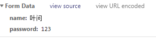
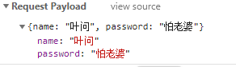
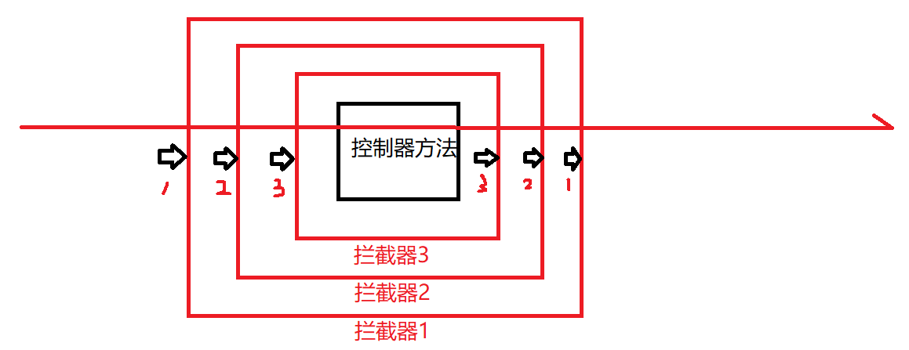

typora-root-url: D:\liangjiah

[TOC]
# ssm框架学习笔记

## maven
### 什么是maven

maven是由apache公司开发的一个项目管理工具

### pom

project object model，工程对象模型

核心配置文件pom.xml

修改settings.xml，设置默认依赖项本地存放路径，设置镜像地址


在idea中配置maven，设置maven home directory和User settings file，勾选override。


### 创建一个maven项目


点击import changes


修改pom.xml

```xml
<?xml version="1.0" encoding="UTF-8"?>

<project xmlns="http://maven.apache.org/POM/4.0.0" xmlns:xsi="http://www.w3.org/2001/XMLSchema-instance"
  xsi:schemaLocation="http://maven.apache.org/POM/4.0.0 http://maven.apache.org/xsd/maven-4.0.0.xsd">
  <modelVersion>4.0.0</modelVersion>

  <!--组织名称-->
  <groupId>cn.edu.chd</groupId>
  <!--项目、模块名称-->
  <artifactId>helloworld</artifactId>
  <!--版本号-->
  <version>1.0-SNAPSHOT</version>

  <!--项目名-->
  <name>helloworld</name>
  <!-- FIXME change it to the project's website -->
  <url>http://www.example.com</url>

  <!--属性的定义-->
  <properties>
    <!--字符编码-->
    <project.build.sourceEncoding>UTF-8</project.build.sourceEncoding>
    <!--编译源代码版本-->
    <maven.compiler.source>1.8</maven.compiler.source>
    <!--目标源代码版本-->
    <maven.compiler.target>1.8</maven.compiler.target>
  </properties>

  <!--依赖项列表
    依赖也就是你所需要的jar包
  -->
  <dependencies>
    <dependency>
      <groupId>junit</groupId>
      <artifactId>junit</artifactId>
      <version>4.12</version>
      <scope>test</scope>
    </dependency>
    <!-- https://mvnrepository.com/artifact/mysql/mysql-connector-java -->
    <dependency>
      <groupId>mysql</groupId>
      <artifactId>mysql-connector-java</artifactId>
      <version>5.1.38</version>
    </dependency>
  </dependencies>

  <build>
    <pluginManagement><!-- lock down plugins versions to avoid using Maven defaults (may be moved to parent pom) -->
      <plugins>
        <!-- clean lifecycle, see https://maven.apache.org/ref/current/maven-core/lifecycles.html#clean_Lifecycle -->
        <plugin>
          <artifactId>maven-clean-plugin</artifactId>
          <version>3.1.0</version>
        </plugin>
        <!-- default lifecycle, jar packaging: see https://maven.apache.org/ref/current/maven-core/default-bindings.html#Plugin_bindings_for_jar_packaging -->
        <plugin>
          <artifactId>maven-resources-plugin</artifactId>
          <version>3.0.2</version>
        </plugin>
        <plugin>
          <artifactId>maven-compiler-plugin</artifactId>
          <version>3.8.0</version>
        </plugin>
        <plugin>
          <artifactId>maven-surefire-plugin</artifactId>
          <version>2.22.1</version>
        </plugin>
        <plugin>
          <artifactId>maven-jar-plugin</artifactId>
          <version>3.0.2</version>
        </plugin>
        <plugin>
          <artifactId>maven-install-plugin</artifactId>
          <version>2.5.2</version>
        </plugin>
        <plugin>
          <artifactId>maven-deploy-plugin</artifactId>
          <version>2.8.2</version>
        </plugin>
        <!-- site lifecycle, see https://maven.apache.org/ref/current/maven-core/lifecycles.html#site_Lifecycle -->
        <plugin>
          <artifactId>maven-site-plugin</artifactId>
          <version>3.7.1</version>
        </plugin>
        <plugin>
          <artifactId>maven-project-info-reports-plugin</artifactId>
          <version>3.0.0</version>
        </plugin>
      </plugins>
    </pluginManagement>
  </build>
</project>

```

点击右下角的按钮，选择Maven，打开Maven项目依赖包的管理器


标准的maven项目文件结构如下图所示


手动创建resources文件夹并右键选择标记为resources root和test resources root

在浏览器搜索maven repository，搜索想要的框架，选择对应依赖项的版本，直接将依赖项的xml语句复制到pom.xml中，点击import changes即可。

### 创建一个servlet的maven项目

基本步骤相同，创建一个maven项目，选择webapp，编辑项目信息完成项目的创建。src/main目录下只有一个webapp文件夹，手动创建java文件夹并标记为源代码文件夹，手动创建resources文件夹并标记为资源文件夹。在maven中央仓库搜索并选择servlet API并依赖信息复制到pom.xml文件中。修改web.xml文件的dtd声明。


配置tomcat server


## MyBatis

### MyBatis环境配置

file->settings->plugins，搜索并安装mybatis plugin和mybatis tools

导入mysql和mybatis依赖项

利用mybatis插件在src/resources路径下右键选择new->mybatis->new Configuration File，命名为mybatis.cfg.xml

修改mybatis.cfg.xml，配置数据库的url、驱动类、用户名、密码等信息

```xml
<?xml version="1.0" encoding="UTF-8"?>
<!DOCTYPE configuration PUBLIC "-//mybatis.org//DTD Config 3.0//EN" "http://mybatis.org/dtd/mybatis-3-config.dtd">
<configuration>

    <environments default="dev">
        <environment id="dev">
            <transactionManager type="JDBC"></transactionManager>
            <dataSource type="UNPOOLED">
                <property name="url" value="jdbc:mysql:///mybatis"/>
                <property name="driver" value="com.mysql.jdbc.Driver"/>
                <property name="username" value="root"/>
                <property name="password" value="ljh_5098_CHD"/>
            </dataSource>
        </environment>
    </environments>

</configuration>
```

### 编写MyBatis代码

创建MyBatisUtils类

```java
package cn.edu.chd.util;

import org.apache.ibatis.io.Resources;
import org.apache.ibatis.session.SqlSession;
import org.apache.ibatis.session.SqlSessionFactory;
import org.apache.ibatis.session.SqlSessionFactoryBuilder;

import java.io.IOException;
import java.io.InputStream;

public class MyBatisUtil {

    private static SqlSessionFactory sqlSessionFactory;

    static{
        String resource="mybatis.cfg.xml";//mybatis核心配置文件的相对路径
        InputStream in=null;
        try {
            in = Resources.getResourceAsStream(resource);//获得配置文件输入流
            sqlSessionFactory = new SqlSessionFactoryBuilder().build(in);//创建sessionFactory对象
        } catch (IOException e) {
            e.printStackTrace();
        } finally{
            if(in != null){
                try {
                    in.close();//关闭文件输入流
                } catch (IOException e) {
                    e.printStackTrace();
                }
            }
        }
    }

    //返回session对象，开启会话
    public static SqlSession getSession(){
        return sqlSessionFactory.openSession();
    }
}

```

创建数据库与数据库表，不再赘述

创建实体类，生成get/set方法

```java
package cn.edu.chd.entity;

import java.util.Date;

public class Girl {
    private Long id;
    private String name;
    private String flower;
    private Date birthday;
    public Long getId() {
        return id;
    }
    public void setId(Long id) {
        this.id = id;
    }
    public String getName() {
        return name;
    }
    public void setName(String name) {
        this.name = name;
    }
    public String getFlower() {
        return flower;
    }
    public void setFlower(String flower) {
        this.flower = flower;
    }
    public Date getBirthday() {
        return birthday;
    }
    public void setBirthday(Date birthday) {
        this.birthday = birthday;
    }
}

```

创建mapper接口

```java
package cn.edu.chd.mapper;

import cn.edu.chd.entity.Girl;

public interface GirlMapper {
    Integer insert(Girl girl);
}

```

创建mapper配置文件

```xml
<!-- 引入dtd声明 -->
<?xml version="1.0" encoding="UTF-8" ?>
<!DOCTYPE mapper PUBLIC "-//mybatis.org//DTD mapper 3.0//EN" "http://mybatis.org/dtd/mybatis-3-mapper.dtd">
<!-- 配置映射关系
	namespace属性表示与配置文件关联的接口的全路径
-->
<mapper namespace="cn.edu.chd.mapper.GirlMapper">
    <!-- 插入数据
		id表示接口中的方法名
		parameterType表示接口方法中传入参数的类型的全路径
		#{}表示对象属性的引用
	-->
    <insert id="insert" parameterType="cn.edu.chd.entity.Girl">        
        insert into girl(name,flower,birthday)        
        values(#{name},#{flower},#{birthday})    
    </insert>
</mapper>
```

在mybatis核心配置文件中添加配置xml文件与接口的映射关系

```xml
<mappers>
    <!--不要写点，要写斜杠-->
    <mapper resource="cn/edu/chd/mapper/GirlMapper.xml"></mapper>
</mappers>
```

### MyBatis核心配置文件详细解释

- environments
  - dataSource：用于配置数据源信息，包括数据库的url、driver、username、password
  - transactionManager：用于配置事务管理器

- properties

  - 作用：用于引入键值对，再配置文件的其他地方，可以通过${}引用键值。

  - property子标签：具有name和value属性，引入键值对。
  - resource属性：引入配置文件，注意配置文件的属性值优先于property子标签中定义的属性值。

```xml
<properties resource="db.properties">
	<property name="username" value="123"/><!-- 配置文件中属性值大于property子标签中同名的属性值-->
</properties>
```

- typeAliases
  - 作用：配置mybatis时，类型要写全路径，typeAliases标签用于创建别名，在mapper配置文件中可以引用，以便简化类型的书写。
  - typeAlias子标签：用于配置一个类名的别名，type表示类型的全路径，alias表示命名的别名
  - package子标签：用于直接引入包下的所有类型。

```xml
<typeAliases>
    <!-- 注册一个简写的类名 -->
    <typeAlias type="cn.edu.chd.entity.Girl" alias="girl"/>
    <!--直接注册整个包名-->
    <package name="cn.edu.chd.entity"/>
</typeAliases>
```

- typeHandlers
  - 一般情况下不需要额外添加，特殊情况再考虑

- settings
  - 直接查询官方文档进行配置即可
  - mapUnderscoreToCamelCase：数据库命名一般采用下划线风格，而实体类属性的命名一般采用驼峰命名风格，该选项用于设置两种风格的自动转换。
  - 注意settings标签的位置是固定的，位于properties标签之后，typeAliases标签之前。

```xml
<settings>
  <setting name="cacheEnabled" value="true"/>
  <setting name="lazyLoadingEnabled" value="true"/>
  <setting name="multipleResultSetsEnabled" value="true"/>
  <setting name="useColumnLabel" value="true"/>
  <setting name="useGeneratedKeys" value="false"/>
  <setting name="autoMappingBehavior" value="PARTIAL"/>
  <setting name="autoMappingUnknownColumnBehavior" value="WARNING"/>
  <setting name="defaultExecutorType" value="SIMPLE"/>
  <setting name="defaultStatementTimeout" value="25"/>
  <setting name="defaultFetchSize" value="100"/>
  <setting name="safeRowBoundsEnabled" value="false"/>
  <setting name="mapUnderscoreToCamelCase" value="false"/>
  <setting name="localCacheScope" value="SESSION"/>
  <setting name="jdbcTypeForNull" value="OTHER"/>
  <setting name="lazyLoadTriggerMethods" value="equals,clone,hashCode,toString"/>
</settings>
```

- mappers
  - 配置mapper接口与mapper配置文件之间的关联
  - 四种方式：相对路径、url、类型全限定名、引入包

```xml
<mappers>
    <!--第一种 使用相对路径-->
    <!--<mapper resource="cn/edu/chd/mapper/GirlMapper.xml"/>-->
    <!--第二种 使用url路径引入-->
    <!--<mapper url="file:///D:/liangjiahao/projects/IdeaProjects/mybatis/src/main/resources/cn/edu/chd/mapper/GirlMapper.xml"/>-->
    <!--第三种 使用接口类型的全限定名引入，必须保证接口与mapper.xml在在同一级包下-->
    <!--<mapper class="cn.edu.chd.mapper.GirlMapper"/>-->
    <!--第四种 引入一个包的方式-->
    <package name="cn.edu.chd.mapper"/>
</mappers>
```

### MyBatis的参数问题

- 单个基本数据类型

  如果仅仅是简单的一个单值传入，那么#{}表达式里面写什么都可以，只有一个参数，MyBatis没有入参绑定的烦恼。建议还是写有含义的名称。

- 单个非基本数据类型

  String。仍然没有入参绑定。

- 多个基本类型或非基本类型传入参数问题

  关于

  Cause: org.apache.ibatis.binding.BindingException: Parameter 'name' not found. Available parameters are [arg1, arg0, param1, param2]

  问题的解决：

  方法一：报错为参数绑定错误，参数name找不到，可用的参数只有arg1，arg0，param1，param2。将#{}表达式改为#{param1}和#{param2}，或者修改为#{arg0}和#{arg1}，能够解决这一问题。

  MyBatis会采用arg0、arg1、arg2……和param1、param2、param3……来命名传入的参数。

  方法二：方法一参数命名没有具体的含义，代码的可读性不好。方法二采用给mapper接口方法的参数添加注解的形式完成参数的绑定，在xml文件中直接使用绑定的名称引用对应的参数即可。

  ```java
  Girl queryByNameAndFlower(@Param("name") String name, @Param("flower") String flower);
  ```

- 单个JavaBean

  如果传入参数是单个实体类对象，那么在xml文件中直接引用实体类对象的属性名称即可，MyBatis能够在实体类下自动寻找匹配的属性。

  注意，传入的实体类对象不需要加@Param，也不要在#{}表达式中写“对象名.属性名”的形式。

- MAP

  ```java
  Girl queryByNameAndFlower3(Map<String,Object> map);
  ```
按照这种方式进行封装，就是根据键的名称查找属性值
     ```java
  Map<String,Object> map=new HashMap<>();//创建map对象
  map.put("name","Gaogege");
  map.put("flower","Mudan");
  Girl girl = mapper.queryByNameAndFlower3(map);//传入参数map
  System.out.println("girl = " + girl);//输出girl的toString()的结果
     ```

- 多个JavaBean

  方法一：

  ```java
  Girl queryByNameAndFlower4(A a, B b);
  ```

  ```xml
  <select id="queryByNameAndFlower4" resultType="cn.edu.chd.entity.Girl">
      <!-- 注意#{}的写法，采用了对象名.属性名的形式，其中对象名是param1，param2，param3……-->
  	select * from girl where name=#{param1.name} and flower=#{param2.flower}
  </select>
  ```

  方法二：

  ```java
  Girl queryByNameAndFlower4(@Param("a")A a,@Param("b")B b);
  ```

  ```xml
  <select id="queryByNameAndFlower4" resultType="cn.edu.chd.entity.Girl">
  	select * from girl where name=#{a.name} and flower=#{b.flower}
  </select>
  ```

- 一组值的传入（List集合）

### 动态SQL

- if标签

  ```xml
  <select id="queryByCountryAndCity" resultType="cn.edu.chd.entity.Address">
      select * from address
      where
      <if test="country != null">
          country=#{country}
          and
      </if>
      city=#{city}
  </select>
  ```

- where标签：可以消除多余的and，但要注意只能处理前置and，不能处理后置and

  ```xml
  <select id="queryByCountryAndCity" resultType="cn.edu.chd.entity.Address">
      select * from address
      <where>
          <if test="country != null and country != ''">
              and country=#{country}
          </if>
          <if test="city != null and city != ''">
              and city=#{city}
          </if>
      </where>
  </select>
  ```

  - 如何添加log4j：在pom.xml添加log4j依赖项，在resources目录下添加log4j.properties，在mybatis核心配置文件的settings标签中开启日志，具体教程参考官方文档。

- set标签：可以消除多余的逗号，但要注意只能处理后置的逗号

  ```xml
  <update id="updateAddress" parameterType="cn.edu.chd.entity.Address">
      update address
      <set>
          <if test="country != null and country != ''">
          	country=#{country},
          </if>
          <if test="state != null and state != ''">
          	state=#{state},
          </if>
          <if test="city != null and city != ''">
          	city=#{city},
          </if>
          <if test="street != null and street != ''">
          	street=#{street},
          </if>
          <if test="zip != null and zip != ''">
          	zip=#{zip},
          </if>
      </set>
      where addr_id=#{addrId}
  </update>
  ```

- choose、when、otherwise标签

  ```xml
  <select id="query" resultType="cn.edu.chd.entity.Address" parameterType="cn.edu.chd.entity.Address">
      select * from address
      <where>
          <choose>
              <when test="country != null">
              	and country=#{country}
              </when>
              <when test="state != null">
              	and state=#{state}
              </when>
              <otherwise>
              	and city=#{city}
              </otherwise>
          </choose>
      </where>
  </select>
  ```

- trim标签：trim标签有四个属性，分别为prefix，suffix，prefixOverrides，suffixOverrides，分别表示添加前缀、添加后缀、消除前缀、消除后缀。

  ```xml
  <select id="queryTrim" resultType="cn.edu.chd.entity.Address" parameterType="cn.edu.chd.entity.Address">
      select * from address
      <trim prefix="WHERE" suffixOverrides="AND">
          <if test="country != null and country != ''">
          	country=#{country} and
          </if>
          <if test="state != null and state != ''">
          	state=#{state} and
          </if>
          <if test="city != null and city != ''">
          	city=#{city} and
          </if>
          <if test="street != null and street != ''">
          	street=#{street} and
          </if>
          <if test="zip != null and zip != ''">
          	zip=#{zip} and
          </if>
      </trim>
  </select>
  ```

- foreach标签

  ```xml
  <select id="queryByIds" resultType="cn.edu.chd.entity.Address">
      <!-- 相当于select * from address
          where addr_id in (a,b,c,……)
      -->
      select * from address
      <where>
          addr_id in
          <foreach collection="list" open="(" close=")" item="item" separator=",">
          	#{item}
          </foreach>
      </where>
  </select>
  ```

  foreach标签用于遍历list集合中的元素，其中collection属性表示集合的名称，open表示起始字符串，close表示结束字符串，item属性指代list集合中的每一个元素，separator属性表示分隔符，index表示循环的下标值，标签体表示每轮循环输出的结果。

- 模糊查询

  注意：#{}不支持拼接字符串

  ```
  <select id="queryLike" resultType="cn.edu.chd.entity.Address">
      <!-- 注意#{}不支持拼接字符串#,这样的写法是错误的 -->
      select * from address
      where city like #{city}
  </select>
  ```

  解决方案：

  方案一：在应用层添加%

  ```java
  List<Address> list = mapper.queryLike("%law%");
  ```

  方案二：使用字符串拼接函数concat()

  ```xml
  <select id="queryLike" resultType="cn.edu.chd.entity.Address">
      select * from address
      where city like concat('%',#{city},'%')
  </select> 
  ```

  方案三：使用bind标签，重新绑定并引用传入的参数

  ```xml
  <select id="queryLike" resultType="cn.edu.chd.entity.Address">
      <bind name="_city" value="'%'+city+'%'"/>
      <!-- 注意#{}不支持拼接字符串# -->
      select * from address
      where city like #{_city};
  </select>
  ```

- sql标签：

  - 功能：根据传入的对象动态的修改其中的值，如果某个字段传入的是非空值，再去修改，否则不修改。
  - 具体步骤：使用sql标签声明一组列名，使用include标签在需要这组列名的地方占位。
  ```xml
  <sql id="baseColumn">
      country,state,city
  </sql>
  <select id="listAll" resultType="cn.edu.chd.entity.Address">
      select
      <include refid="baseColumn"/>
      from address
  </select>
  ```
### 缓存
- 意义：数据库查询速度相比起应用程序要慢很多，使用缓存能够加快数据查询的效率。
- MyBatis可以定制缓存，分为一级缓存和二级缓存。
  - 一级缓存：会话级别的缓存，只有在同一个会话中才有效，默认开启且不能关闭
  - 二级缓存：会话工厂级别的缓存，默认关闭但可以手动开启
- 过程：如果开启了二级缓存，先在二级缓存中查询。如果没有查询到，再去一级缓存。如果还没有查询到，在查询数据库。
- 缓存失效：
  - 第一种情况：执行插入、更新、删除等操作会导致缓存失效。
  - 第二种情况：手动清空缓存，清空所有缓存
  ```java
  sqlSession.clearCache();
  ```
- 二级缓存：
  - 开启二级缓存的步骤
    第一步：在mapper的xml文件中添加以下标签
    ```xml
    <cache/>
    ```
    第二步：在MyBatis配置文件中开启缓存
    ```xml
    <setting name="cacheEnabled" value="true"/>
    ```
    第三步：实体类实现Serializable
  - 验证二级缓存的存在
    ```java
    //开启两个会话
    SqlSession sqlSession = MyBatisUtil.getSession();
    SqlSession sqlSession2 = MyBatisUtil.getSession();
    //得到两个mapper对象
    AddressMapper mapper = sqlSession.getMapper(AddressMapper.class);
    AddressMapper mapper2 = sqlSession2.getMapper(AddressMapper.class);
    //会话一进行查询
    mapper.listAll();
    sqlSession.commit();
    sqlSession.close();//关闭会话一
    //会话二进行查询
    mapper2.listAll();
    sqlSession2.commit();
    sqlSession2.close();//关闭会话二
    ```
    输出结果
    ```
    DEBUG [main] - Cache Hit Ratio [cn.edu.chd.mapper.AddressMapper]: 0.0
    DEBUG [main] - ==>  Preparing: select country,state,city from address 
    DEBUG [main] - ==> Parameters: 
    DEBUG [main] - <==      Total: 5
    DEBUG [main] - Cache Hit Ratio [cn.edu.chd.mapper.AddressMapper]: 0.5
    ```
- 配置缓存属性
  ```xml
  <cache
    eviction="FIFO"
    flushInterval="60000"
    size="512"
    readOnly="true"/>
  ```
  - eviction：配置缓存的回收策略。LRU——最近最少使用；FIFO——先进先出；SOFT——软引用；WEAK——弱引用。默认回收策略是LRU。
  - flushInterval：刷新间隔毫秒数
  - size：引用数目，默认为1024
  - readOnly：只读属性为true时返回缓存对象的浅拷贝，不可修改；只读属性为false时返回缓存对象的深拷贝，可修改。

### 关系映射

- 实体关系问题
  - 从数学上对数量关系进行描述
    1-1：强弱之分
    1-n：
    
  - MyBatis实现1-1多表查询
    1、创建实体类User、UserDetail和对应的数据库表user、user_detail
    2、创建User的子类UserWithDetail，并与UserDetail类关联
    
    ```java
    public class UserWithDetail extends User {
    	private UserDetail userDetail;
    	//生成get/set方法
    }
    ```
    3、创建UserMapper接口和UserMapper.xml配置文件
    4、实现数据的封装
    
    - 方法一：使用resultMap实现数据的封装
    MyBatis对于处理简单的单表查询一般使用resultType就可以解决，对于多表联合查询往往都需要使用resultMap进行详细的描述，告诉mybatis怎么封装。
    ```xml
    <resultMap id="userWithDetailMap" type="cn.edu.chd.entity.UserWithDetail">
        <id property="uid" column="uid"/><!-- id标签定义主键 -->
        <result property="password" column="password"/><!-- result标签定义非主属性 -->
        <result property="phone" column="phone"/>
        <result property="createTime" column="create_time"/>
        <result property="status" column="status"/>
        <!-- assocation标签定义关联关系 -->
        <association property="userDetail" javaType="cn.edu.chd.entity.UserDetail">
            <id property="udid" column="udid"/>
            <result property="address" column="address"/>
            <result property="cid" column="cid"/>
        </association>
    </resultMap>
    <!-- ... -->
    <!-- 使用resultMap属性引入关系映射 -->
    <select id="queryById" resultMap="userWithDetailMap">
        select user.uid,user.phone,user.password,user.create_time,user.status,
        user_detail.udid,user_detail.address,user_detail.cid
        from user inner join user_detail on user.uid=user_detail.uid
        where user.uid=#{id}
    </select>
    ```
    - 方法二：resultMap标签的连缀写法
    ```xml
    <resultMap id="userWithDetailMap" type="cn.edu.chd.entity.UserWithDetail">
        <id property="uid" column="uid"/>
        <result property="password" column="password"/>
        <result property="phone" column="phone"/>
        <result property="createTime" column="create_time"/>
        <result property="status" column="status"/>
        <result property="userDetail.udid" column="udid"/>
        <result property="userDetail.address" column="address"/>
        <result property="userDetail.cid" column="cid"/>
    </resultMap>
    ```
    - 方法三：分步查询
    分两步走，先查询user表，然后再查询user_detail表，在UserMapper.xml中配置分步查询。
    ```xml
    <resultMap id="userBaseMap" type="cn.edu.chd.entity.User">
        <id property="uid" column="uid"/>
        <result property="password" column="password"/>
        <result property="phone" column="phone"/>
        <result property="createTime" column="create_time"/>
        <result property="status" column="status"/>
    </resultMap>
    
    <!-- ... -->
    
    <!-- 使用resultMap标签的extends属性能够实现resultMap的继承 -->
    <resultMap id="userWithDetailMap" extends="userBaseMap" type="cn.edu.chd.entity.UserWithDetail">
        <!-- select属性表示第二步查询的方法名，可以跨mapper接口，column属性给出了传递的参数 -->
        <association
                property="userDetail"
                select="cn.edu.chd.mapper.UserDetailMapper.queryByUserId"
                column="uid"/>
    </resultMap>
    ```
    
  - MyBatis实现1-n多表查询
  
    1、创建实体类Blog、Comment和对应的数据库表blog和comment
    2、创建User类的子类UserBlog并与Blog类关联，Blog类与Comment类关联，关联类型为一对多，并生成get/set方法
    ```java
    //UserBlog.java
    public class UserBlog extends User {
        private List<Blog> blogs;//体现User与Blog之间一对多的关系
        //生成get/set方法和toString方法
    }
    //Blog.java
    public class Blog {
        private Integer id;
        private String title;
        private String summary;
        private String content;
        private User user;
        private List<Comment> comments;//体现Blog与Comment之间一对多的关系
        //生成get/set方法和toString方法
    }
    //Comment.java
    public class Comment {
        private Integer id;
        private String content;
        //生成get/set方法和tostring方法
    }
    ```
    3、在UserMapper.xml中进行配置
    ```xml
    <resultMap id="userBaseMap" type="cn.edu.chd.entity.User">
        <id property="uid" column="uid"/>
        <result property="password" column="password"/>
        <result property="phone" column="phone"/>
        <result property="createTime" column="create_time"/>
        <result property="status" column="status"/>
    </resultMap>
    <!-- ... -->
    <resultMap id="userWithBlogMap" extends="userBaseMap" type="cn.edu.chd.entity.UserBlog">
        <collection property="blogs" ofType="cn.edu.chd.entity.Blog">
            <id property="id" column="bid"/>
            <result property="title" column="title"/>
            <result property="content" column="blog_content"/>
            <result property="summary" column="summary"/>
            <collection property="comments" ofType="cn.edu.chd.entity.Comment">
                <id property="id" column="cid"/>
                <result property="content" column="comment_content"/>
            </collection>
        </collection>
    </resultMap>
    <!-- ... -->
    <select id="queryByIdWithBlog" resultMap="userWithBlogMap">
        SELECT t1.`uid`,t1.phone,t1.`password`,t1.`create_time`,t1.`status`,
            t2.`id` AS bid,t2.`title`,t2.`content` AS blog_content,t2.`summary`,
            t3.`id` AS cid,t3.`content` AS comment_content
        FROM `user` t1,`blog` t2,`comment` t3
        WHERE t1.uid=t2.uid AND t2.id=t3.bid AND t1.uid=#{id}
    </select>
    ```
## Spring框架
### 简介

- 2002年由Rod Johnson开发的一种框架，主要用来进行java企业级的开发以代替EJB。EJB使用比较繁琐，不仅需要继承某个类，还要实现一堆接口方法。使用Spring框架能够大大简化项目的开发，改变了对象创建的方式，降低了代码的耦合度，方便维护与测试

- 使用new关键字创建对象耦合度比较高，依赖关系由java代码维护，难以修改和维护。

```java
//写死的方式，想要替换必须修改代码
Girl g = new Girl();
new PrettyGirl();
new YoungGirl();

Pay pay;
pay = new WXPay();
pay = Alipay();
pay = ManualPay();
```

- 使用Spring框架时，大部分的对象获取应该从容器中获取，而不是进行Java硬编码。

- 容器：就由它来写，以后我们要什么，就从这个容器中拿，在容器去声明告诉它，给我准备什么。

- 基础技术
  - java 
  - 反射
  - xml
  - xml解析
  - 代理 
  - 大量的设计模式
- spring可以学习的模块
  - Core technologies: dependency injection, events, resources, i18n, validation, data binding, type conversion, SpEL, AOP.
  - Testing: mock objects, TestContext framework, Spring MVC Test, `WebTestClient`.
  - Data Access: transactions, DAO support, JDBC, ORM, Marshalling XML.
  - Spring MVC and Spring WebFlux web frameworks.
  - Integration: remoting, JMS, JCA, JMX, email, tasks, scheduling, cache.
  - Languages: Kotlin, Groovy, dynamic languages
- 官网：https://spring.io/ 


### 基础环境搭建

- 基本步骤
  - 添加Spring依赖
  - 编写一个Spring的配置文件
  - 通过Spring的应用程序上下文对象获取对象
- 示例：配置Spring框架并创建一个对象
  - 添加依赖项：

  ```xml
  <!-- https://mvnrepository.com/artifact/org.springframework/spring-core -->
  <dependency>
    <groupId>org.springframework</groupId>
    <artifactId>spring-core</artifactId>
    <version>5.1.5.RELEASE</version>
  </dependency>
  <dependency>
    <groupId>org.springframework</groupId>
    <artifactId>spring-beans</artifactId>
    <version>5.1.5.RELEASE</version>
  </dependency>
  <dependency>
    <groupId>org.springframework</groupId>
    <artifactId>spring-context</artifactId>
    <version>5.1.5.RELEASE</version>
  </dependency>
  ```

  - 创建实体类Girl

  ```java
  package cn.edu.chd.entity;
  public class Girl {
      private String name;
      private Integer age;
      //todo 生成get/set方法
  }

  ```

  - 添加spring核心配置文件applicationContext.xml

  ```xml
  <?xml version="1.0" encoding="UTF-8"?>
  <beans xmlns="http://www.springframework.org/schema/beans"
         xmlns:xsi="http://www.w3.org/2001/XMLSchema-instance"
         xsi:schemaLocation="http://www.springframework.org/schema/beans http://www.springframework.org/schema/beans/spring-beans.xsd">
      <!-- 将对象的创建交给spring容器，在这个配置文件中去声明需要的对象
          class：写java类的全限定类名，spring按照全限定类名通过反射技术创建对象
          id：id就是创建的对象在整个应用程序上下文中唯一的标识符
      -->
      <bean id="girl" class="cn.edu.chd.entity.Girl">
          <property name="name" value="lucy"/>
          <property name="age" value="18"/>
      </bean>
  </beans>
  ```

  - 编写测试代码

  ```java
  public void m1(){
      //获取上下文对象，spring里面声明对象都需要通过上下文对象获取
      ApplicationContext ctx = new ClassPathXmlApplicationContext("applicationContext.xml");
      //通过ctx对象获得Girl对象
      Girl g = (Girl) ctx.getBean("girl");
      System.out.println(g.getName());
  }
  ```

- 普通编写VSSpring方式

普通的获取对象的方式，所有对象之间的依赖，类之间的依赖关系都是在java代码里面维护的，很难维护，如果有替换方案也难以替换。

对象的产生全都是在配置文件里面完成的，可以直接从配置文件中了解依赖关系。

### 两大基本思想

- 控制反转（IOC，inverse of control）
  
  什么是控制？谁反转了谁？
  
  1. 控制：创建对象、彼此关联的权力
2. 夺取开发人员控制权，反转给spring容器。开发人员声明需要的对象，由spring容器完成对象的创建与管理，这种做法彻底改变了编程的方式，降低了代码的耦合度。

依赖注入：通过配置文件将属性值注入到bean对象中

- 面向切面编程（AOP，Aspect Oriented Programming）

### 容器


- pojos：自己定义的实体类
- metadata：在spring配置文件中配置的数据就是元数据，即告诉Spring容器在应用程序中实例化、配置和组装对象
- 实例化容器：利用ClassPathXmlContext等将配置文件传入

### 值的注入

- setter注入
  - 其字段必须具有对应的setter方法
  
  - 通过property子节点注入，name指定要注入的属性名称，value指定要注入的值，ref指定要注入的其他bean对象的id，注入对象只能使用ref不能使用value。
  
  - 如果没有对应setter方法就会报错，Invalid property ‘name’ of bean class [cn.edu.chd.entity.Girl]: Bean property 'name' is not writable or has an invalid setter method.
  
  - 默认通过无参构造器完成对象的创建，如果没有默认的构造器就会报错：No default constructor found; nested exception is java.lang.NoSuchMethodException: cn.edu.chd.entity.Girl.<init>()
  
    ```xml
    <bean id="girl" class="cn.edu.chd.entity.Girl" depends-on="dog">
        <property name="name" value="韩雪"/>
        <property name="age" value="33"/>
        <property name="dog" ref="dog"/>
    </bean>
    <bean id="dog" class="cn.edu.chd.entity.Dog">
        <property name="name" value="哮天犬"/>
    </bean>
    ```

- 构造注入

  - 必须有匹配的有参构造方法

  ```xml 
  <!-- 方式一 通过构造方法参数名注入 -->
  <bean id="car" class="cn.edu.chd.entity.Car">
  	<constructor-arg name="name" value="宝马"/>
      <constructor-arg name="price" value="3333333333"/>
      <constructor-arg name="speed" value="200"/>
  </bean>
  <!-- 方式二 通过构造方法参数下标注入 -->
  <!-- 注意，如果有多个重载的构造方法，优先使用后面的构造方法 -->
  <bean id="car" class="cn.edu.chd.entity.Car">
  	<constructor-arg index="0" value="宝马"/>
      <constructor-arg index="1" value="3333333333"/>
      <constructor-arg index="2" value="200"/>
  </bean>
  <!-- 方式三 按照构造方法传入参数的类型 -->
  <bean id="car" class="cn.edu.chd.entity.Car">
  	<constructor-arg type="java.lang.String" value="宝马"/>
      <constructor-arg type="java.lang.Double" value="3333333333"/>
      <constructor-arg type="java.lang.Double" value="200"/>
  </bean>
  ```

- 特殊属性值的注入

  - 如果其对应的值是简单的字面值，直接写就可以了，如果是一个其他的类，那么使用内部bean的方式完成注入

  ```xml
  <bean class="cn.edu.chd.entity.People" id="people">
      <property name="name" value="阿发"/>
      <property name="age" value="62"/>
      <!-- 数组属性值注入 -->
      <property name="friends">
          <array>
              <value>刘德华</value>
              <value>郭富城</value>
              <value>黎明</value>
              <value>张学友</value>
          </array>
      </property>
      <!-- List集合属性值注入 -->
      <property name="numbers">
          <list>
              <value>8</value>
              <value>7</value>
          </list>
      </property>
      <!-- 元素类型为Cat的List集合属性值注入 -->
      <property name="cats">
          <list>
              <!-- 内部bean，无法被外部引用，无需id -->
              <bean class="cn.edu.chd.entity.Cat">
                  <property name="skin" value="蓝色"/>
                  <property name="leg" value="4"/>
              </bean>
              <bean class="cn.edu.chd.entity.Cat">
                  <property name="skin" value="黄色"/>
                  <property name="leg" value="2"/>
              </bean>
          </list>
      </property>
      <!-- set集合属性值的注入 -->
      <property name="pigs">
          <set>
              <bean class="cn.edu.chd.entity.Pig">
                  <property name="name" value="佩奇"/>
                  <property name="sleep" value="80"/>
                  <property name="kw" value="香辣"/>
              </bean>
              <bean class="cn.edu.chd.entity.Pig">
                  <property name="name" value="小宝"/>
                  <property name="sleep" value="99"/>
                  <property name="kw" value="酱香"/>
              </bean>
          </set>
      </property>
      <!-- map映射属性值的注入 -->
      <property name="users">
          <map>
              <entry key="user1">
                  <bean class="cn.edu.chd.entity.User">
                      <property name="name" value="韩雪"/>
                      <property name="address" value="梧桐村"/>
                  </bean>
              </entry>
              <entry key="user2">
                  <bean class="cn.edu.chd.entity.User">
                      <property name="name" value="林青霞"/>
                      <property name="address" value="台湾"/>
                  </bean>
              </entry>
          </map>
      </property>
  </bean>
  ```

- 自动注入

  ```xml
  <!-- byType是根据类型注入它的属性，此时在上下文中搜寻Pig这种类型的bean，有且仅有一个Pig类型的对象的情况下自动注入成功，如果一个都没有不会注入，如果找到多个bean则抛出异常 -->
  <bean class="cn.edu.chd.entity.User" id="user" autowire="byType">
      <property name="name" value="陈慧琳"/>
      <property name="address" value="香港"/>
  </bean>
  <bean class="cn.edu.chd.entity.Pig" id="pig">
      <property name="name" value="大宝"/>
  </bean>
  <!-- 如果添加下面的代码，则有两个Pig类型的bean，user这个bean自动注入就抛出下面的异常 -->
  <!--<bean class="cn.edu.chd.entity.Pig" id="pig2">
      <property name="name" value="巨大宝"/>
  </bean>-->
  ```

  
  
  - 解决方案
  
    ```xml
    <!-- 添加primary指明主要和次要bean，primary默认值都是true
    	如果有多个bean，并且按类型注入给其他bean，那么只能有一个primary为true
    -->
    <bean class="cn.edu.chd.entity.Pig" id="pig" primary="true">
        <property name="name" value="大宝"/>
    </bean>
    <bean class="cn.edu.chd.entity.Pig" id="pig2" primary="false">
        <property name="name" value="巨大宝"/>
    </bean>
    ```
  
  - 自动注入的类型：
  
    - byType：按照数据类型注入
    - byName：按照bean对应的pojo里面的属性名来进行匹配
    - constructor：先按byType匹配，如果结果不唯一再按照bean对应的pojo里面的构造方法的传入参数的名称来进行匹配
    - default：不明确
    - none：不注入

### bean元素的探讨

- 属性探讨

  - abstract：该bean将无法被实例化，用于子bean继承

  - parent：指定父bean的id，继承父bean的属性和属性值

    ```xml
    <bean id="girl" class="cn.edu.chd.entity.Girl" abstract="true">
        <property name="name" value="韩雪"/>
    </bean>
    <bean id="yourGirl" class="cn.edu.chd.entity.Girl" parent="girl">
        <property name="age" value="33"/>
    </bean>
    ```

  - destroy-method：指定bean销毁时必须执行的方法，多用于一些清理工作。触发条件是bean确实被销毁才发生。
  
  - init-method：指定bean初始化时执行的方法，用于做准备性的工作。
  
    ```xml
    <bean id="girl" class="cn.edu.chd.entity.Girl" destroy-method="clear" init-method="init">
        <property name="name" value="韩雪"/>
        <property name="age" value="33"/>
    </bean>
    ```
  
    ```java
    ApplicationContext ctx = new ClassPathXmlApplicationContext("applicationContext.xml");
    Girl g = ctx.getBean("girl",Girl.class);
    //((ClassPathXmlApplicationContext) ctx).close();//情形一：容器被关闭
    //((ClassPathXmlApplicationContext) ctx).refresh();//情形二：容器被刷新
  ((ClassPathXmlApplicationContext) ctx).destroy();//情形三：容器被销毁，该方法deprecated
    ```
  
  - name：别名，通过它一样可以获取对象，可以设置多个别名，分隔符可以采用空格、逗号等等
  
  - scope：singleton/prototype，配置单例/原型模式，单例模式指spring的上下文中只有一个对象，原型模式则每次访问都创建一个新对象。
  
  - primary：与自动注入相关的内容，暂不讨论
  
  - lazy-init：延迟初始化，默认情况下在加载完配置文件后就创建对象，为true时当访问对象才创建。
  
    - 直接初始化：程序启动慢些，内存消耗大些，使用bean快些
  
    - 延迟初始化：程序启动快，内存消耗小，使用bean时慢一些
  
  - depends-on：如果一个bean的执行严重依赖于另一个bean的准备的话，就可以配置depends-on属性，属性值为被依赖bean的id。
  
- 补充几点
  
  - 别名：alias标签
  - 非字面值的注入问题：通过property子节点的ref
  - spring多个配置文件中的bean可以相互引用

### ApplicationContext对象与BeanFactory对象的区别

ApplicationContext对象不仅具有BeanFactory的全部功能，还添加了一些新特性。参考官方文档。

### 资源的引入

- 资源的路径

```java
Resource template = ctx.getResource("some/resource/path/myTemplate.txt");//
Resource template = ctx.getResource("classpath:some/resource/path/myTemplate.txt");
Resource template = ctx.getResource("file:///some/resource/path/myTemplate.txt");
Resource template = ctx.getResource("http://myhost.com/resource/path/myTemplate.txt");
```

- 作为依赖项的资源

  ```xml
  <bean id="myBean" class="...">
  	<property name="template" value="some/resource/path/myTemplate.txt"/>
  </bean>
  ```

- spring配置文件完整的schema约束

  ```xml
  <?xml version="1.0" encoding="UTF-8"?>
  <beans xmlns="http://www.springframework.org/schema/beans"
         xmlns:xsi="http://www.w3.org/2001/XMLSchema-instance"
         xmlns:aop="http://www.springframework.org/schema/aop"
         xmlns:c="http://www.springframework.org/schema/c"
         xmlns:cache="http://www.springframework.org/schema/cache"
         xmlns:context="http://www.springframework.org/schema/context"
         xmlns:jdbc="http://www.springframework.org/schema/jdbc"
         xmlns:jee="http://www.springframework.org/schema/jee"
         xmlns:lang="http://www.springframework.org/schema/lang"
         xmlns:mvc="http://www.springframework.org/schema/mvc"
         xmlns:p="http://www.springframework.org/schema/p"
         xmlns:task="http://www.springframework.org/schema/task"
         xmlns:tx="http://www.springframework.org/schema/tx"
         xmlns:util="http://www.springframework.org/schema/util"
         xsi:schemaLocation="http://www.springframework.org/schema/jee http://www.springframework.org/schema/jee/spring-jee-4.3.xsd
  		http://www.springframework.org/schema/mvc http://www.springframework.org/schema/mvc/spring-mvc-4.3.xsd
  		http://www.springframework.org/schema/context http://www.springframework.org/schema/context/spring-context-4.3.xsd
  		http://www.springframework.org/schema/aop http://www.springframework.org/schema/aop/spring-aop-4.3.xsd
  		http://www.springframework.org/schema/util http://www.springframework.org/schema/util/spring-util-4.3.xsd
  		http://www.springframework.org/schema/jdbc http://www.springframework.org/schema/jdbc/spring-jdbc-4.3.xsd
  		http://www.springframework.org/schema/cache http://www.springframework.org/schema/cache/spring-cache-4.3.xsd
  		http://www.springframework.org/schema/task http://www.springframework.org/schema/task/spring-task-4.3.xsd
  		http://www.springframework.org/schema/beans http://www.springframework.org/schema/beans/spring-beans.xsd
  		http://www.springframework.org/schema/lang http://www.springframework.org/schema/lang/spring-lang-4.3.xsd
  		http://www.springframework.org/schema/tx http://www.springframework.org/schema/tx/spring-tx-4.3.xsd ">
  </beans>
  ```

- 资源文件与配置文件的引入

  ```xml
  <!-- 引入properties文件 -->
  <context:property-placeholder location="classpath:db.properties"/>
  <!-- 引入其他配置文件 -->
  <bean class="cn.edu.chd.dao.ProviderDao" id="providerDao">
      <!-- 通过${}可以引入properties里面的属性值 -->
      <property name="driver" value="${driver}"/>
      <property name="url" value="${url}"/>
      <property name="user" value="${user}"/>
      <property name="password" value="${password}"/>
  </bean>
  
  <!-- import标签可以将其他配置文件引入，这样将来可以只引入这一个核心配置文件即可 -->
  <import resource="classpath:spring/spring-*.xml" />
  ```

### 注解

- 组件注解
  - component
  - controller （springMVC）
  - service（业务层）
  - repository（dao层）
  
  这些注解的功能都是相似的，只是语义不同。
  
- 自动注入注解

  - Autowired

- 开启自动注解的扫描

  ```xml
  <!-- 激活注解
  	递归扫描子包
  -->
  <context:component-scan base-package="cn.edu.chd.entity"/>
  
  <!-- 排除某种注解 -->
  <context:component-scan base-package="cn.edu.chd.entity">
  	<context:exclude-filter type="annotation" expression="org.springframework.stereotype.Repository"/>
  </context:component-scan>
  ```

- 使用注解完成Spring的配置（略）

  ```java
  @Configuration//表明一个类是配置类，程序启动的时候扫描这个类，就能够完成所有的配置
  @ComponentScan(basePackages = "cn.edu.chd")//开启扫描的注解
  @ImportSource("classpath:path/to/applicationContext.xml")//引入配置文件
  @PropertySource("classpath:path/to/db.properties")//引入properties文件
  public class SpringConfig {
      @Bean("girl")//在Spring容器中注册一个bean
      public Girl createGirl(){
          Girl g = new Girl();
          g.setName("wangzuxian");
          g.setAge(22);
          return g;
      }
      @Bean("myService")//在Spring容器中注册一个bean
      public MyService createMyService(){
          return new MyService();
      }
      
      @Autowired
      private Environment env;//获取配置文件中的数据
      
      @Bean("myDao")
      public MyDao createMyDao(){
          System.out.println(env.getProperty("driver"));//取得配置文件中的值
          return new MyDao();
      }
  }
  
  //测试类
  public class TestSpring{
      @Test
      public void m1(){
          ApplicationContext ctx = new AnnotationConfigApplicationContext(SpringConfig.class);
          MyService myService = ctx.getBean("myService",MyService.class);
          myService.hello();
      }
  }
  ```

### Spring AOP

#### AOP简介

- 背景
  - 并不是用来取代OOP，只是OOP的一个补充。
  - 传统的编程模式是纵向的，从问题到问题的解决方案。
  - AOP将关注点从纵向变为横切面。对于不同的业务模块，事务处理的过程基本都是相似的，早期通过模板template达到封装的目的，而AOP在处理业务时，既没有实现、继承，也没有编写事务代码，仅通过配置文件就能够实现事务的控制

- 概念

  - 切面：切入点和通知的结合

  - 连接点：那些可以被被拦截到的点，Spring只支持方法类型的连接点，因此这里的点就是方法

  - 切入点：那些被拦截的连接点就是切入点

  - 建议（通知）：拦截后执行的操作就是建议（通知）

  - 简介：一种特殊的通知，在不修改代码的前提下在运行时为对象添加一些属性和方法

  - 目标对象：要代理的原对象，即将通知应用到的类的对象

  - AOP代理：由AOP框架创建的对象，用于实现建议的内容，代替目标对象实际执行。在Spring框架中，aop代理可以是JDK动态代理或CGLIB代理

  - 织入：将增强应用到目标对象的过程

- 建议类型

  - 前置通知（before）：在连接点之前执行，不能阻止进入连接点
  - 后置通知（after）：方法返回或抛出异常之前执行
  - 异常通知（after-throwing）：抛出异常之后执行
  - 返回通知（又名最终通知，after-returning）：方法返回之后执行
  - 环绕通知（around）：最全面的建议，在环绕建议中可以阻止连接点的执行 

#### 使用配置文件实现AOP

- 添加依赖项：

  ```xml
  <dependency>
  	<groupId>org.aspectj</groupId>
  	<artifactId>aspectjrt</artifactId>
  	<version>1.9.2</version>
  </dependency>
  <dependency>
  	<groupId>org.aspectj</groupId>
  	<artifactId>aspectjweaver</artifactId>
  	<version>1.9.2</version>
  </dependency>
  ```

- 配置文件

  ```xml
  <?xml version="1.0" encoding="UTF-8"?>
  <!-- 引入aop schema约束 -->
  <beans xmlns="http://www.springframework.org/schema/beans"
         xmlns:aop="http://www.springframework.org/schema/aop"
         ......
         xsi:schemaLocation="
         http://www.springframework.org/schema/aop http://www.springframework.org/schema/aop/spring-aop-4.3.xsd
         ......">
      <!-- 配置一个bean -->
      <bean id="providerService" class="cn.edu.chd.service.ProviderService"/>
      <!-- 1.aop是基于代理完成的，所以要激活自动代理 -->
      <aop:aspectj-autoproxy/>
      <!-- 2.注册一个切面要使用的类 -->
      <bean id="beforeAdvice" class="cn.edu.chd.advice.BeforeAdvice"/>
      <!-- 3.配置切入点 -->
      <aop:config>
          <!-- ref表示用那个bean来切 -->
          <aop:aspect ref="beforeAdvice">
              <!--aop:before 表明前置通知
                  method 指明用那个方法来切
                  pointcut 指明切入点表达式
              -->
              <aop:before method="methodBefore" pointcut="execution(public void cn.edu.chd.service.ProviderService.add())"/>
          </aop:aspect>
      </aop:config>
  </beans>
  ```

- 切入点表达式的写法

  - Spring AOP中一般使用execution切入点表达式，格式如下：

    ```xml
    execution(modifiers-pattern? ret-type-pattern declaring-type-pattern?name-pattern(param-pattern) throws-pattern?)
    ```

  - *表示任意值，可以用来替换修饰器返回类型、包名或包名的一部分、参数列表的类型

  - .用于连接包名、类名和方法名

  - ..用于参数列表表示接受任意个参数，或者用于当前包下或当前包的子包下

  - 实验证明包装类和基本数据类型对于execution是严格区分的

  - 示例

    ```xml
    execution(public * *(..))
    execution(* set*(..))
    execution(* com.xyz.service.AccountService.*(..)
    execution(* com.xyz.service.*.*(..))
    execution(* com.xyz.service..*.*(..))
    ```

- 注意事项

  - 如果配置了多个相同类型的通知，那么按照配置的先后顺序依次执行

  - 可以给通知的方法添加一个参数JoinPoint，该对象能够获取几乎所有这个方法的信息

    ```java
    public void before(JoinPoint joinPoint){
        System.out.println(joinPoint.getSignature().getName());
        System.out.println(Arrays.toString(joinPoint.getArgs()));
    } 
    ```

  - AOP只能应用于Spring容器中得到的bean

  - 返回通知中returning属性可以实现返回值的绑定，值为通知的传入参数名

  - 异常通知中throwing属性可以实现异常的绑定，值为通知的传入参数名


#### 使用注解实现AOP

- 添加依赖项（同上）

- 在配置文件中引入aop约束并激活自动代理，同时开启基础扫描包

  ```xml
  <aop:aspectj-autoproxy/>
  <context:component-scan base-package="cn.edu.chd"/>
  ```

- 添加注解

  ```java
  package cn.edu.chd.advice;
  
  import org.aspectj.lang.JoinPoint;
  import org.aspectj.lang.ProceedingJoinPoint;
  import org.aspectj.lang.annotation.*;
  import org.springframework.stereotype.Component;
  
  @Aspect
  @Component
  public class MyAdvice {
      @Before("execution(* cn.edu.chd.service.*.*(..))")
      public void before(){
          System.out.println("before........");
      }
      @After("execution(* cn.edu.chd.service.*.*(..))")
      public void after(){
          System.out.println("after..........");
      }
      @AfterReturning(pointcut="execution(* cn.edu.chd.service.*.*(..))",returning = "returning")
      public void afterReturning(String returning){
          System.out.println("afterReturning.............");
          System.out.println("returning = " + returning);
      }
      @AfterThrowing(pointcut="execution(* cn.edu.chd.service.*.*(..))",throwing="throwing")
      public void afterThrowing(Throwable throwing){
          System.out.println("afterThrowing..............");
      }
      @Around("execution(* cn.edu.chd.service.*.*(..))")
      public String around(ProceedingJoinPoint proceedingJoinPoint) throws Throwable {
          System.out.println("around begin.................");
          proceedingJoinPoint.proceed();
          System.out.println("around end.............");
          return "the returning of around";
  
      }
  }
  
  ```

  ```java
  @Service
  public class MyService {
      public String hello(String msg){
          System.out.println("msg = " + msg);
          return "the returning of hello";
      }
  }
  ```

- 配置多个通知的先后次序问题

  同一个类定义的同类型通知按照定义的先后顺序执行

  不同的类中定义的同类型通知按照切面优先级小的优先执行

  通过@Order注解可以设置优先级，优先级是一个int整数

  ```java
  //MyAdvice.java
  @Order(100)
  @Aspect
  @Component
  public class MyAdvice {
  
      @Before("execution(* cn.edu.chd.service.*.*(..))")
      public void before(){
          System.out.println("before............");
      }
  }
  //OtherAdvice.java
  @Order(10)
  @Aspect
  @Component
  public class OtherAdvice {
      @Before("execution(* cn.edu.chd.service.*.*(..))")
      public void before2(){
          System.out.println("before2.....................");
      }
  }
  /* 执行结果
   * before2.....................
   * before............
   */
  ```


## Spring MVC

### 简介

spring mvc是一个web层的mvc框架，mvc分别指模型（Model）、视图（View）、控制器（Controller）

MVC模式将责任进行拆分，不同的组件负责不同的事情，好处是结构清晰、更好维护，缺点是比较复杂

### 原理分析

- 流程图


- 组件分析

  - web.xml注册前端控制器，目的在于，我们希望让springmvc去处理所有的请求

    通过

    ```xml
    <servlet-mapping>
      <servlet-name>springmvc</servlet-name>
      <!-- 这里统一写斜杠 -->
      <url-pattern>/</url-pattern>
    </servlet-mapping>
    ```

    确实是处理所有的请求（不是真的所有）

  - urlPattern的写法问题

    - /

      处理所有的请求，和/*不一样，处理完毕要出去的时候不会再将girl.jsp当作一个新的请求，将这个渲染的结构直接返回给浏览器

    - /*

      永远都不要这么写。因为请求 /helloController过去的时候，它的视图名称是girl，girl.jsp页面，它将其当作了一个叫girl.jsp的请求，尝试去匹配对应的controller，但是容器中根本不存在这样的controller，于是就会404错误

    - *.do

      这种方式是有的开发团队习惯将请求的行为添加一个扩展名.do用以区分，还有的团队习惯用.action

- 关于前端控制器的解释

  spring mvc设计的理念是希望开发者尽量远离原生的servlet api，因为原生的servlet api使用起来比较繁琐，希望将操作进一步的简化，对很多东西进行了拆分，不希望我们将一些技术点绑定死，可以做到随意的切换。但本身还是servlet，分发的servlet。

- springmvc配置文件的问题

  默认情况下使用dispatcherServlet的名字当作命名空间，在web-inf下寻找[servletName]-servlet.xml配置文件。

  如果想要修改配置文件的名称，那么可以修改web.xml配置文件

  ```xml
  <servlet>
      <servlet-name>springmvc</servlet-name>
      <servlet-class>org.springframework.web.servlet.DispatcherServlet</servlet-class>
      <init-param>
          <!-- 可以重新声明配置文件的名称
  			默认的namespace是[servletName]-servlet
  			配置init-param标签可以重新定义
  		-->
          <param-name>namespace</param-name>
          <param-value>mvc</param-value>
      </init-param>
  </servlet>
  ```

  将配置文件移动位置之后，会出现错误，因为默认的规则要求在web-inf下。但是maven项目的标准应该在resources下面，如果解决这一问题？

  重新指定上下文的配置文件的位置即可。

  ```xml
  <servlet>
      <!-- 这里写的名字是有讲究的，
        如果我们不去修改spring配置文件默认的位置，呢么spring mvc
        会去web-inf下面找一个叫做springmvc-servlet.xml的文件
      -->
      <servlet-name>springmvc</servlet-name>
      <servlet-class>org.springframework.web.servlet.DispatcherServlet</servlet-class>
      <!-- 通过配置init-param标签还可以同时修改配置文件的位置和名称 -->
      <init-param>
          <param-name>contextConfigLocation</param-name>
          <param-value>classpath:springmvc.xml</param-value>
      </init-param>
  </servlet>
  ```

- 视图解析器

  - spring mvc支持多种视图技术，包括
    - jsp
    - freemaker（模板技术）
  - 内部的视图解析器
    - 视图前缀
      - /jsp/它是我们请求响应资源的路径的配置，viewName=girl会加上前缀变为/jsp/girl
    - 后缀
      - .jsp 此时我们的前缀+视图名称+后缀= /jsp/girl.jsp
    - request.getDS.forward(request,response)的作用是一样的，使用spring mvc可以简化操作流程
  - 物理视图是由逻辑视图转化而来的，物理视图是webapp/jsp/girl.jsp，逻辑视图则是由前缀、逻辑视图名称和后缀组成的。physical view = prefix + logicViewName + suffix

- 控制器的解释

  比较传统的方式是通过实现接口的方式实现的，Controller

  如果接口只有一个方法，这种接口就称为函数式接口

  ```java
  @Nullable
  ModelAndView handleRequest(HttpServletRequest request,HttpServletResponse response) throws Exception;
  ```

  这个接口像doGet方法和doPost方法，区别在于返回值是ModelAndView对象，在Model中填充数据，在具体的视图View中进行展示

  ```java
  @Override
  public ModelAndView handleRequest(HttpServletRequest httpServletRequest, HttpServletResponse httpServletResponse) throws Exception {
      ModelAndView mav = new ModelAndView();//定义一个ModelANdView对象
      mav.addObject("girl","菲菲");//添加Model数据
      mav.setViewName("girl");//添加View数据
      return mav;//返回该对象
  }
  ```

  还需要在配置文件中配置一下bean，要取个名字name，充当这个请求的uri。

  只处理一个请求，感觉和servlet差别不大，不过真实使用一般采用注解开发。

### spring mvc环境配置

- 步骤

  - 创建web项目
  - 编写web.xml，在其中注册一个特殊的servlet，前端控制器
  - 编写一个spring mvc的配置文件
    - 注册一个视图解析器
  - 编写一个控制器
  - 编写一个结果页面

- 创建web项目

  **pom.xml**
  
  ```xml
  <!-- https://mvnrepository.com/artifact/org.springframework/spring-webmvc -->
  <dependency>
      <groupId>org.springframework</groupId>
      <artifactId>spring-webmvc</artifactId>
      <version>5.1.5.RELEASE</version>
  </dependency>
  <!-- https://mvnrepository.com/artifact/javax.servlet/javax.servlet-api -->
  <dependency>
      <groupId>javax.servlet</groupId>
      <artifactId>javax.servlet-api</artifactId>
      <version>3.1.0</version>
      <scope>provided</scope>
  </dependency>
  ```
  
  **web.xml**
  
  ```xml
  <?xml version="1.0" encoding="UTF-8"?>
  <web-app xmlns="http://xmlns.jcp.org/xml/ns/javaee"
           xmlns:xsi="http://www.w3.org/2001/XMLSchema-instance"
           xsi:schemaLocation="http://xmlns.jcp.org/xml/ns/javaee
                               http://xmlns.jcp.org/xml/ns/javaee/web-app_4_0.xsd"
           version="4.0">
      <display-name>Archetype Created Web Application</display-name>
      <servlet>
          <!-- 这里写的名字是有讲究的，
        如果我们不去修改spring配置文件默认的位置，呢么spring mvc
        会去web-inf下面找一个叫做springmvc-servlet.xml的文件
      -->
          <servlet-name>springmvc</servlet-name>
          <servlet-class>org.springframework.web.servlet.DispatcherServlet</servlet-class>
          <!-- 通过配置init-param标签还可以同时修改配置文件的位置和名称 -->
          <init-param>
              <param-name>contextConfigLocation</param-name>
              <param-value>classpath:springmvc.xml</param-value>
          </init-param>
      </servlet>
      <!-- servlet映射配置 -->
      <servlet-mapping>
          <servlet-name>springmvc</servlet-name>
          <!-- 这里统一写斜杠 -->
          <url-pattern>/</url-pattern>
      </servlet-mapping>
  </web-app>
  
  ```
  

### 注解开发模式

- 基本注解

  - @Controller
  - @RequestMapping

- 开发步骤

  - 配置基础扫描的包，使配置的注解生效

  - 在指定的类上面添加@Controller注解

  - 添加@RequestMapping注解，添加视图名称参数（是由不同的requestHandler处理的HandlerMapping）

- 当我们写上Controller组件之后，就标记为一个控制器的组件，handlerMapping会去扫描寻找这个controller是否与之匹配，如果发现匹配就把处理工作交给它

  具体的匹配就通过请求的路径进行匹配的@RequestMapping(uri)，此时就是通过这个uri进行匹配的

- @RequestMapping可以写在类上，也可以写在方法上，一般组合使用，类上的和方法上的requestMapping会进行拼接。

- 示例

  ```xml
  <?xml version="1.0" encoding="UTF-8"?>
  <beans xmlns="http://www.springframework.org/schema/beans"
         xmlns:context="http://www.springframework.org/schema/context"
         xmlns:xsi="http://www.w3.org/2001/XMLSchema-instance"
         xsi:schemaLocation="http://www.springframework.org/schema/beans
             http://www.springframework.org/schema/beans/spring-beans.xsd
             http://www.springframework.org/schema/context
             http://www.springframework.org/schema/context/spring-context.xsd">
  	<!-- 开启注解扫描 -->
      <context:component-scan base-package="cn.edu.chd"/>
      <!-- 配置一个视图解析器
      	常用内部资源视图解析器
  		物理视图=前缀+视图名称+后缀
      -->
      <bean class="org.springframework.web.servlet.view.InternalResourceViewResolver">
          <!-- 1.前缀 -->
          <property name="prefix" value="/jsp/"/>
          <!-- 2.后缀 -->
          <property name="suffix" value=".jsp"/>
      </bean>
  </beans>
  ```

  ```java
  @Controller
  @RequestMapping("/orders")
  public class OrdersController{
      @RequestMapping("/addOrder")
      //返回值就是视图名称
      public String addOrders(Model model){
          List<Orders> list = new ArrayList<>();
          Orders o = new Orders();
          o.setId("1");
          o.setName("洗面奶");
          o.setTotal(333.3);
          list.add(o);
          
          o = new Orders();
          o.setId("2");
          o.setName("平底锅");
          o.setTotal(888.77);
          list.add(o);
          model.addAttribute("list",list);
          return "orders";
      }
  }
  ```

  ```jsp
  <%--
    Created by IntelliJ IDEA.
    User: lenovo
    Date: 2019/8/3
    Time: 16:12
    To change this template use File | Settings | File Templates.
  --%>
  <%@ page contentType="text/html;charset=UTF-8" language="java" %>
  <%@taglib prefix="c" uri="http://java.sun.com/jsp/jstl/core" %>
  <html>
  <head>
      <title>Title</title>
  </head>
  <body>
      <c:forEach items="${list}" var="obj">
          <tr>
              <td>${obj.id}</td>
              <td>${obj.name}</td>
              <td>${obj.total}</td>
          </tr>
      </c:forEach>
  </body>
  </html>
  ```


### 转发与重定向

- 本质区别：重定向发起了一个新的请求，转发则没有

- 转发到页面：默认到选项

- 重定向到页面：redirect:path

- 转发到另一个控制器：forward:path

  ```java
  //不继承任何的类实现任何的接口，没有强迫性
  @Controller
  @RequestMapping("/hello")
  public class HelloController {
      @RequestMapping("/forward")
      public String forward(Model model) {
          //spring mvc Model默认是request域中存放值
          System.out.println(111);
          model.addAttribute("skill", "sleep");
          return "forward";
      }
      @RequestMapping("/redirect")
      public String redirect(Model model){
          model.addAttribute("skill","cook");
          System.out.println(222);
          //不带斜杠的写法表示相对路径，根据当前上下文决定
          //如果加上redirect: 就跟视图解析的规则无关
          return "redirect:/jsp/redirect.jsp";
      }
  
      @RequestMapping("/forward2")
      public String forward2(){
          return "forward:/baby/hello";
      }
  }
  
  ```

### 关于Spring MVC访问web元素的问题

- 可以获得的web元素
  - request
  - session
  - application
- 可以通过模拟的对象完成操作，也可使用原生的Servlet API完成，直接在方法中传入参数即可

```java
@Controller
@RequestMapping("/hello")
public class HelloController {
    //模拟请求
    @RequestMapping("/request")
    public String request(WebRequest request){
        System.out.println(request.getParameter("girl"));
        return "forward";
    }

    @RequestMapping("/request2")
    public String request2(HttpServletRequest request){
        System.out.println(request.getParameter("boy"));
        return "forward";
    }

    @RequestMapping("/request3")
    public String request3(HttpSession session){
        session.setAttribute("skill","sleep");
        return "redirect:/jsp/forward.jsp";
    }

    @RequestMapping("/request4")
    public String request4(HttpSession session){
        session.getServletContext().setAttribute("ctx","宇宙我最帅");
        return "redirect:/jsp/forward.jsp";
    }
}
```

### 注解的研究

- @RequestMapping  加在类上或方法上的注解

  - value：配置访问的路径

    请求映射的路径path可以写多个值，用{}括起来

    ```java
    @RequestMapping({"/a","/b","/c"})
    ```

  - path：是value的别名，作用与value一致

  - method：指定可以访问请求的类型，可以写成数组的形式，取值为RequestMethod.GET/POST/...

    ```java
    @RequestMapping(value="/a",method={RequestMethod.GET,RequestMethod.POST})
    ```

  - params：指定参数或限定这个参数的特征（=、!=）

    ```java
    @RequestMapping(path="/m1",params={"girl","boy"})
    .../hello/m1  访问失败
    .../hello/m1?boy=b&girl=g  访问成功
    
    @RequestMapping(path="/m2",params={"girl=g","boy!=b"})
    .../hello/m2  访问失败
    .../hello/m2?boy=b&girl=g  访问失败
    .../hello/m2?boy=c&girl=g  访问成功
    ```

  - headers：能够影响浏览器的行为

  - consumes：消费者，描述媒体类型，例如可以限定媒体类型为application/json;charset=UTF-8

  - produces：生产者，产生的响应的媒体类型

- 关于请求路径的问题，spring mvc支持ant风格

    - ?  表示任意的字符，斜杠例外
    - \*  表示任意长度任意内容的字符串，斜杠除外
    - **  支持任意层路径，但是必须写成“/\*\*”，不能写成“/get\*\*"这种形式

- 其他Mapping注解

  - @GetMapping：相当于只允许get方式提交数据的@RequestMapping
  - @PostMapping：相当于只允许post方式提交数据的@RequestMapping
  - ......

  - 对于非get、post请求的支持，需要额外添加一些内容

    - 添加一个过滤器

    ```xml
    <!-- 注册一个支持所有http请求类型的过滤器 -->
    <filter>
        <filter-name>hiddenHttpMethodFilter</filter-name>
        <filter-class>org.springframework.web.filter.HiddenHttpMethodFilter</filter-class>
    </filter>
    <filter-mapping>
        <filter-name>hiddenHttpMethodFilter</filter-name>
        <url-pattern>/*</url-pattern>
    </filter-mapping>
    ```

    - 表单提交里面还要添加一个隐藏的参数

    ```html
    <!-- TODO -->
    <form action="${pageContext.request.contextPath}/hello/m3" method="post">
        <input type="hidden" name="_method" value="delete"/>
        delete<br/><input type="submit" value="submit"/>
    </form>
    ```

- @PathVariable：加在方法形参上

  - restful风格

    详情参考罗伊菲尔丁的博士论文

  - 示例

    ```java
    @RequestMapping("/add/{id}/{name}/{price}")
    public String addProduct(@PathVariable("id")Integer id,@PathVariable("name")String name,@PathVariable("price")Double price){
        System.out.println("id = " + id);
        System.out.println("name = " + name);
        System.out.println("price = " + price);
        return "result";
    }
    ```

- @ResponseBody：返回数据而不是一个页面，一般情况下返回的是json格式的数据，加在类上或者方法上
  
- @RequestParam：参见表单数据的提交部分，加在形参上

    ```java
    username=123&password=456&address=spdb
        
    {
        "username":"123",
        "password":"456",
        "address":"spdb"
    }
    
    {
        "answerSheetId":1,
        "answerList":[
            {
                "questionId":1,
                "score":2
            },
            {
                "question":2,
                "score":0
            }
        ]
    }
    ```

    

- @ModelAttribute：

    - 使用方式一：

      ```java
      //就是在Controller里面任意一个具体方法执行前都会执行
      @ModelAttribute("user")//默认是类名首字母小写
      public User init(){
          System.out.println("init");
          User u = new User();
          u.setUsername("金田一一");
          return u;
      }
      
      @RequestMapping("/login")
      @ResponseBody
      public String login(Model model){
          System.out.println("model.containsAttribute(\"u\") = " + model.containsAttribute("u"));//false
          System.out.println("model.containsAttribute(\"user\") = " + model.containsAttribute("user"));//true
          System.out.println("model.containsAttribute(\"vdfdfdf\") = " + model.containsAttribute("vdfdfdf"));//false
          return "ok";
      }
      ```

      如果某些对象从头到尾每次请求都要存在，不消失，就是适合这么用

    - 使用方式二：

      ```java
      @ModelAttribute
      public void init(Model model){
          System.out.println("init");
          User u = new User();
          u.setUsername("金田一一");
          model.addAttribute("user",u);
      }
      ```

    - 使用方式三：这种方式会在model中直接寻找

      ```java
      @RequestMapping("/login")
      @ResponseBody
      public String login(@ModelAttribute User user){
          System.out.println("user = " + user);
          return "ok";
      }
      ```

      **注意如果user同时与表单数据绑定了，那么model中的值会被表单数据传入的值覆盖掉**。

- @RequestBody，加在形参上

    Object,User,List,Map<String,Object>

    json数据，不是通过form表单传递，而是通过下面的方式传递数据

    ```javascript
    ajax({
        data:
    })
    ```

- @SessionAttributes

    用在类上面，将model中的属性添加到session中，可以根据属性名或类型来添加。

    ```java
    @Controller
    @RequestMapping("/user")
    @SessionAttributes("user")//将model中的user对象添加到session中
    //添加多个值：@SessionAttributes(value={"user","usr"})
    //根据类型添加：@SessionAttributes(types=User.class)
    //根据名称和类型添加：@SessionAttributes(value={"user","usr"},types={User.class,Orders.class})
    public class UserController {
        //表单数据被绑定到user对象中，user对象被添加到model中，@SessionAttributes在model中寻找user并添加到session中
        @PostMapping("/put")
        public String put(User user){
            System.out.println("user = " + user);
            return "redirect:/jsp/result.jsp";
        }
    }
    ```

- @SessionAttribute

    要求当前这次访问中的会话里面必须要有某个对象

    ```java
    @Controller
    @RequestMapping("/user")
    @SessionAttributes("userInfo")
    public class UserController {
    	@RequestMapping("/register")
        @ResponseBody
        public String doRegister(User userInfo){
            return "register successfully!"
        }
        
        @RequestMapping("/login")
        public String doLogin(@SessionAttribute User user){
            return "redirect:/jsp/home.jsp";
        }
    }
    ```

- @CookieValue

  获取cookie中的某个键值对

  ```java
  @PostMapping("/put")
  public String put(User user,@CookieValue("JSESSIONID") String jsessionid){
      System.out.println("jsessionid = " + jsessionid);
      return "redirect:/jsp/result.jsp";
  }
  ```

- @RestController，只能加在类上

  相当于@Controller+@ResponseBody

### 常见问题的解决

- 关于静态资源访问的问题

  由于我们的servlet设置了URL匹配方式为“/”，所以静态资源也被当做一个后台的请求

  ```xml
  Request URL: http://localhost:8080/springmvc_war_exploded/static/css/index.css
  ```

  它尝试匹配一个static/css/index.css的Controller里面的RequestMapping，因为没有所以匹配404

  解决方法：

  - 方法一：最简单的，是让springmvc单独处理，将这些请求交给容器的默认Servlet处理，就不让DispatcherServlet来处理了。springmvc能够根据MIME类型区分出媒体请求

    ```xml
    <!-- 默认的Servlet处理者 -->
    <mvc:default-servlet-handler/><!-- 只加这一个会导致所有的注解失效 -->
    <mvc:annotation-driven/>
    ```
  - 方法二：通过映射关系描述一一编写规则
  
    ```xml
    <mvc:resources mapping="/static/css/*" location="static/css/"/>
    ```
  
  - 方法三：自行在web.xml中定义映射规则
  
- 关于post请求中文乱码问题的解决

  添加一个过滤器即可，spring mvc提供了优良的字符编码过滤器，注册即可使用

  ```xml
  <!-- 放置过滤器时，应该放在其他过滤器的前面 -->
  <filter>
      <filter-name>characterEncodingFilter</filter-name>
      <filter-class>org.springframework.web.filter.CharacterEncodingFilter</filter-class>
      <!-- 指定字符编码 -->
      <init-param>
          <param-name>encoding</param-name>
          <param-value>UTF-8</param-value>
      </init-param>
      <init-param>
          <param-name>forceRequestEncoding</param-name>
          <param-value>true</param-value>
      </init-param>
  </filter>
  
  <filter-mapping>
      <filter-name>characterEncodingFilter</filter-name>
      <url-pattern>/*</url-pattern>
  </filter-mapping>
  ```

- 关于form表单提交数据请求

  ```html
  <form action="${pageContext.request.contextPath}/user/put" method="post">
      <input type="hidden" name="_method" value="put"/>
      username:<input type="text" name="username"/><br/>
      password:<input type="password" name="password"/><br/>
      <input type="submit" value="提交"/>
  </form>
  ```

  - 方式一：通过属性名字进行绑定

    通过属性的名称进行绑定可以完成数据的传递，页面当中表单元素的name属性值与后台形参的名字要保持一致。

    ```java
    @Controller
    @RequestMapping("/user")
    public class UserController {
        @PutMapping("/put")
        @ResponseBody
        //页面当中表单元素的属性值与后台形参的名字要保持一致
        public String put(String username,String password){
            System.out.println("username = " + username);
            System.out.println("password = " + password);
            return "ok";
        }
    }
    ```

  - 方式二：利用@RequestParam注解

    ```java
    @Controller
    @RequestMapping("/user")
    public class UserController {
        @PutMapping("/put")
        @ResponseBody
        public String put(@RequestParam("username") String usr,@RequestParam("password") String pwd){
            System.out.println("usr = " + usr);
            System.out.println("pwd = " + pwd);
            return "ok";
        }
    }
    ```

  - 方式三：利用实体类对象实现参数传递

    ```java
    @Controller
    @RequestMapping("/user")
    public class UserController {
        @PutMapping("/put")
        @ResponseBody
        public String put(User user){
            System.out.println("user = " + user);
            return "ok";
        }
    }
    ```

  - 关于时间类型数据的传递

    方法一：在实体类属性前或方法的参数前添加@DateTimeFormat注解

    ```java
    //User.java
    public class User{
        private String username;
        private String password;
        @DateTimeFormat(pattern="yyyy-MM-dd")
        private Date birthday;
    }
    //UserController.java
    @RequestMapping("/login")
    @ResponseBody
    public String login(User user){
        System.out.println("user = " + user);
        return "ok";
    }
    
    @RequestMapping("/login")
    @ResponseBody
    public String login2(
        String username,
        String password,
        @DateTimeFormat("yyyy-MM-dd") Date birthday){
        System.out.println("user = " + user);
        return "ok";
    }
    ```

    方法二：添加

    ```java
    //配置Date类型数据的绑定规则
    @InitBinder("user")//不写参数默认为类名首字母小写
    public void init(WebDataBinder dataBinder){
        //这里指定什么格式，前台就只能传递什么格式
        SimpleDateFormat sdf = new SimpleDateFormat("yyyy-MM-dd");
        sdf.setLenient(false);
        dataBinder.registerCustomEditor(Date.class,new CustomDateEditor(sdf,false));
        
        sdf = new SimpleDateFormat("yyyy-MM-dd HH:mm:ss");
        sdf.setLenient(false);
        dataBinder.registerCustomEditor(Date.class,new CustomDateEditor(sdf,false));
    }
    
    @PostMapping("/put")
    @ResponseBody
    public String put(User user){
        System.out.println("user = " + user);
        //打印的结果：user = User{username='***', password='111', birthday=Thu Aug 01 00:00:00 CST 2019}
        return "ok";
    }
    ```

### LayUI工具的使用

https://www.layui.com/

### Json数据交互

- 额外依赖

  ```xml
  <dependency>
      <groupId>com.fasterxml.jackson.core</groupId>
      <artifactId>jackson-databind</artifactId>
      <version>2.9.3</version>
  </dependency>
  <dependency>
      <groupId>com.fasterxml.jackson.core</groupId>
      <artifactId>jackson-core</artifactId>
      <version>2.9.3</version>
  </dependency>
  <dependency>
      <groupId>com.fasterxml.jackson.core</groupId>
      <artifactId>jackson-annotations</artifactId>
      <version>2.9.3</version>
  </dependency>
  <dependency>
      <groupId>net.sf.json-lib</groupId>
      <artifactId>json-lib</artifactId>
      <version>2.4</version>
      <classifier>jdk15</classifier>
  </dependency>
  
  <!-- 添加处理json为javabean -->
  <dependency>
      <groupId>org.codehaus.jackson</groupId>
      <artifactId>jackson-core-asl</artifactId>
      <version>1.9.2</version>
  </dependency>
  <dependency>
      <groupId>org.codehaus.jackson</groupId>
      <artifactId>jackson-mapper-asl</artifactId>
      <version>1.9.2</version>
  </dependency>
  <!-- 添加处理json为javabean ===end=== -->
  ```

#### json数据返回前台以及如何解析

- json后台返回

  - 返回pojo

    ```java
    @RequestMapping("/m1")
    @ResponseBody//this annotation knows what is returned is not view, it will convert the data into json form
    public User m1(){
        User user = new User();
        user.setName("许晴");
        user.setPassword("e434243");
        return user;
    }
    ```

  - 返回map

    ```java
    @RequestMapping("/m2")
    @ResponseBody
    public Map<String,Object> m2(){
        Map<String,Object> map = new HashMap<>();
        map.put("name","许晴");
        map.put("password","12345454");
        return map;
    }
    ```

  - 返回数组

    ```java
    @RequestMapping("/m3")
    @ResponseBody
    public User[] m3(){
        User user = new User();
        user.setPassword("123");
        user.setName("许晴");
        User user1 = new User();
        user1.setPassword("456");
        user1.setName("姜文");
        return new User[]{user,user1};
    }
    ```

  - 返回list

    ```java
    @RequestMapping("/m4")
    @ResponseBody
    public List<User> m4(){
        List<User> users = new ArrayList<>();
        User user = new User();
        user.setName("许晴");
        user.setPassword("123");
        users.add(user);
        user = new User();
        user.setName("姜文");
        user.setPassword("456");
        users.add(user);
        return users;
    }
    ```

- json前台如何解析

  ```jsp
  <button id="b1">请求得到一个User</button>
  <button id="b2">请求得到一个Map</button>
  <button id="b3">请求得到一个数组</button>
  <button id="b4">请求得到一个list</button>
  
  <script src="${pageContext.request.contextPath}/static/plugins/jquery/jquery.js"></script>
  <script>
      $(function(){
          $('#b1').click(
              function(){
                  $.ajax({
                      url:'${pageContext.request.contextPath}/json/m1',
                      type:'post',
                      success:function(data){
                          alert('name = '+data.name+', password = '+data.password)
                          //如果返回的是数组或集合
                          /*for(var i=0;i<data.length;i++){
                              alert(data[i].name+' '+data[i].password);
                          }*/
                      }
                  })
              }
          )
      })
  </script>
  ```

  

#### json数据使用ajax提交到后台进行解析

- 指明返回的数据类型

  ```javascript
  contentType:"application/json;charset=utf-8"
  ```

- json后台接收数据

  ```java
  @RequestMapping("/add")
  @ResponseBody
  //@RequestBody注解用于接受通过ajax形式传回的json数据，如果不加这个注解就只能接受表单数据
  public String add(@RequestBody User user){
      System.out.println("user = "+user);
      return "ok";
  }
  
  //也可以接收list集合
  @RequestMapping("/addList")
  @ResponseBody
  public String addList(@RequestBody List<User> users){
      System.out.println("users = "+users);
      return "ok";
  }
  ```

- json前台发送数据

  ```jsp
  <script src="${pageContext.request.contextPath}/static/plugins/jquery/jquery.js"></script>
  <script>
      $(function(){
          $('#b1').click(function(){
              var obj={
                  'name':'叶问',
                  'password':'怕老婆'
              };
              alert(JSON.stringify(obj));
              $.ajax({
                  url:'${pageContext.request.contextPath}/json/add',
                  type:'post',
                  //通过json形式传递数据时必须要添加contentType属性
                  contentType:"application/json",
                  //JSON.stringify()能够把对象数据转化为json格式字符串
                  data:JSON.stringify(obj),
                  success:function(data){
                      alert("succeed");
                  }
              })
          });
      })
      
      //也可以发送list集合
      $(function(){
          $('#b2').click(function(){
              var obj={
                  'name':'叶问',
                  'password':'怕老婆'
              };
              var obj2={
                  'name':'李小龙',
                  'password':'截拳道'
              };
              var arr = new Array();
              arr.push(obj);
              arr.push(obj2);
              $.ajax({
                  url:'${pageContext.request.contextPath}/json/add',
                  type:'post',
                  contentType:"application/json",
                  data:JSON.stringify(arr),
                  success:function(data){
                      alert("succeed");
                  }
              })
          });
      })
  </script>
  ```

- 关于form提交数据与ajax提交数据的区别

  对于form表单提交的数据，contentType属于application/x-www-form-urlencoded

  对于ajax发送json，contentType则属于application/json

  



#### 使用layui改善表单的显示

```javascript
//注意引入jquery
layui.use(['element','jquery','layer'],function(){
    var element=layui.element;
    var jquery=layui.jquery;
    var layer=layui.layer;
    
});
```

### 关于form提交的数据与ajax自定义json数据提交的区别


### xml数据交互

对于很多第三方开发，还是由很多会采用XML作为数据交互，比如微信

- 添加额外的依赖

  ```xml
  <!-- xml数据处理 -->
  <dependency>
      <groupId>com.fasterxml.jackson.dataformat</groupId>
      <artifactId>jackson-dataformat-xml</artifactId>
      <version>2.9.3</version>
  </dependency>
  ```

- 方法返回的数据定义

  ```java
  @RestController
  @RequestMapping("/xml")
  public class XMLController {
      //描述生产类型，也就是返回的类型
      //@RequestMapping(value="/m1",produces={"application/xml"})
      @RequestMapping(value="/m1",produces = {MediaType.APPLICATION_XML_VALUE})
      public User m1() {
          //将数据转换为XML形式user
          User u = new User();
          u.setName("梁佳豪");
          u.setPassword("123");
          return u;
      }
  }
  ```

  如果想要实现以下的效果

  ```xml
  <user name="hahaha">
  	<password>123</password>
  </user>
  ```

### 文件上传

文件上传有2种方式，在servlet3.0之前采用的方案是apache fileUpload，Servlet3.0之后可以采用servlet的文件上传。

在进行文件上传之前，务必将表单数据类型设置为“**multipart/form**”，这一点非常关键。

- apache 上传组件方案

  - 添加依赖

    ```xml
    <!-- apache文件上传组件 -->
    <dependency> 
        <groupId>commons-fileupload</groupId> 
        <artifactId>commons-fileupload</artifactId>
        <version>1.3.3</version>
    </dependency>
    ```

  - 在springmvc.xml中要进行注册一个文件上传解析器

    ```xml
    <!-- 文件上传解析器 
         id必须为multipartResolver，原因是源代码中写死了这个名字
    -->
    <bean id="multipartResolver" class="org.springframework.web.multipart.commons.CommonsMultipartResolver">
        <!-- 定义上传文件大小上限 -->
        <property name="maxUploadSize" value="1024*1024"/>
        <!-- 指定上传的编码 -->
        <property name="defaultEncoding" value="UTF-8"/>
        <!-- 单个文件大小上限 -->
        <property name="maxUploadSizePerFile" value="2000000"/>
    </bean>
    ```

  - 准备一个上传的页面

    ```jsp
    <%@ page contentType="text/html;charset=UTF-8" language="java" %>
    <html>
        <head>  
            <title>Title</title>
        </head>
        <body>
            <%--添加一个 enctype="multipart/form-data"--%>
            <form action="${pageContext.request.contextPath}/file/upload" method="post" enctype="multipart/form-data">    
                文件：<input type="file" name="file"/>  
                <input type="submit" value="submit"/>
            </form>
        </body>
    </html>
    ```
    
  - 后台处理程序
  
    ```java
    @RestController
    @RequestMapping("/file")
    public class FileController {
    
        private static String uploadPath = "D:"+ File.separator;
        @RequestMapping("/upload")
        public String upload(@RequestParam("file") MultipartFile multipartFile) {
            // 1 传到哪里去 2 传什么 3 传的细节
            // 1 判断
            String newFilename=null;
            if (multipartFile != null && !multipartFile.isEmpty()) {
                // 不空才传文件
                
                // 2 获取原始的文件名
                String originalFilename = multipartFile.getOriginalFilename();
                System.out.println("orginalFilename = " + originalFilename);
                
                // 3 截取不带扩展名的文件名
                String fileNamePrefix = originalFilename.substring(0, originalFilename.lastIndexOf("."));
                
                // 4 加工处理文件名，原文件名+时间戳
                String newFileNamePrefix = fileNamePrefix + new Date().getTime();
    
                // 5 得到新文件名
                newFilename = newFileNamePrefix + originalFilename.substring(originalFilename.lastIndexOf("."));
    
                // 6 构建文件对象
                File file = new File(uploadPath + newFilename);
    
                // 7 上传
                try {
                    multipartFile.transferTo(file);
                } catch (IOException e) {
                    e.printStackTrace();
                }
            }
            return newFilename;
        }
    }
    ```
    
  - 多个文件上传：
  
    基本方法是类似的，在jsp页面的表单中添加文件类型的表单输入项，然后在后台处理程序中将传入的参数改为MultipartFile类型的数组，对数组进行遍历，逐个上传即可。
  
- Servlet3.0新特性

  - 在springmvc.xml中注册一个文件上传解析器

    ```xml
    <bean id="multipartResolver" class="org.springframework.web.multipart.support.StandardServletMultipartResolver"/>
    ```

  - 在web.xml中进行配置

    ```xml
    <servlet>
        <servlet-name>springmvc</servlet-name>
        <servlet-class>org.springframework.web.servlet.DispatcherServlet</servlet-class>
        <init-param>
            <param-name>contextConfigLocation</param-name>
            <param-value>classpath:springmvc.xml</param-value>
        </init-param>
        
        <!-- 添加文件上传的配置 -->
        <multipart-config>
            <max-file-size>20000000</max-file-size>
        </multipart-config>
        <!-- 添加文件上传的配置 ===end=== -->
    </servlet>
    ```

  - 后台处理程序同上

### 文件下载

- 后台处理程序

  ```java
  @RestController
  @RequestMapping("/file")
  public class FileController {
  
      private static String parentPath = "D:"+File.separator;
  
      @RequestMapping("/download")
      public String download(HttpServletResponse response) {
          //通过输出流写到客户端、浏览器
          // 1 获取文件下载名
          String fileName = "流浪地球.HD1280高清国语中字版.mp4";
  
          // 2 构建一个文件对象通过Paths工具类获取一个Path对象
          Path path = Paths.get(parentPath, fileName);
  
          // 3 判断是否存在
          if(Files.exists(path)){
              // 存在则下载
              // 通过response设置响应类型
              // 4 获取文件的后缀
              String fileSuffix = fileName.substring(fileName.lastIndexOf(".")+1);
  
              // 5 设置contentType，只有指定它才能去下载
              response.setContentType("application/"+fileSuffix);
  
              // 6 添加头信息
              response.addHeader("Content-Disposition", "attachment; filename="
                      + new String(fileName.getBytes(StandardCharsets.UTF_8),
                                StandardCharsets.ISO_8859_1));
  
              // 7 通过Path写出去就ok
              try {
                  Files.copy(path,response.getOutputStream());
              } catch (IOException e) {
                  e.printStackTrace();
              }
          }
          return "ok";
      }
  }
  ```

### 拦截器

- spring mvc提供了拦截器，类似于过滤器，它将在处理请求之前先做检查，有权决定接下来是否继续，也可以对我们的请求进行加工。

  拦截器可以设计多个

  

- 通过实现HandlerInterceptor，这是一个接口，定义了非常重要的三个方法

  - 前置处理
  - 后置处理
  - 完成处理

#### 案例一：通过拦截器实现方法耗时统计

- 添加日志依赖项：

  ```xml
  <dependency>
      <groupId>log4j</groupId>
      <artifactId>log4j</artifactId>
      <version>1.2.17</version>
  </dependency>
  ```

- 定义拦截器类

    ```java
  //MethodTimerInterceptor.java
  //实现接口HandlerInterceptor，重写三个方法
  public class MethodTimerInterceptor implements HandlerInterceptor {
      private static final Logger LOGGER= Logger.getLogger(MethodTimerInterceptor.class);
  
      // 前置功能 开始 到 结束 两个时间点做减法
      @Override
      public boolean preHandle(HttpServletRequest request, HttpServletResponse response, Object handler) throws Exception {
          //定义开始时间
          long start = System.currentTimeMillis();
          // 将其存入到请求域中
          request.setAttribute("start",start);
          // 返回true，才会找下一个拦截器或找控制器
  
          //记录请求日志
  
          LOGGER.info(request.getRequestURI()+"，请求到达");
          return true;
      }
  
      @Override
      public void postHandle(HttpServletRequest request, HttpServletResponse response, Object handler, ModelAndView modelAndView) throws Exception {
          // 取出start
          long start = (long) request.getAttribute("start");
          // 得到end
          long end = System.currentTimeMillis();
          // 记录一下耗时
          long spendTime = end - start;
          if(spendTime >= 1000){
              LOGGER.warn("方法耗时："+spendTime+"毫秒，方法耗时严重，请及时处理");
          }else{
              LOGGER.info("方法耗时："+spendTime+"毫秒，速度正常");
          }
      }
  
      @Override
      public void afterCompletion(HttpServletRequest request, HttpServletResponse response, Object handler, Exception ex) throws Exception {
  
      }
  }
  
  ```

- 在springmvc.xml中配置拦截器

    ```xml
  <!-- 拦截器的配置 -->
  <mvc:interceptors>
      <mvc:interceptor>
          <!-- /*的写法只能拦截一层，不能拦截多层 -->
          <mvc:mapping path="/**/*"/>
          <bean class="cn.edu.chd.interceptors.MethodTimerInterceptor">
  
          </bean>
      </mvc:interceptor>
  </mvc:interceptors>
  ```

- 测试

    ```java
  @Controller
  @RequestMapping("/user")
  public class UserController {
      @RequestMapping("/login")
      public String login() {
          System.out.println("login.............");
          return "user";
      }
  }
  
  //执行结果
  //16:29:12,320  INFO http-nio-8080-exec-12 interceptors.MethodTimerInterceptor:24 - /springmvc_war_exploded/user/login，请求到达
  //login.............
  //16:29:12,355  INFO http-nio-8080-exec-12 interceptors.MethodTimerInterceptor:39 - 方法耗时：35毫秒，速度正常
  ```

#### 案例二：通过拦截器实现方法耗时统计

- 添加日志依赖项：

    ```xml
  <dependency>
      <groupId>log4j</groupId>
      <artifactId>log4j</artifactId>
      <version>1.2.17</version>
  </dependency>
  ```

- 定义拦截器类

    ```java
  public class SessionInterceptor implements HandlerInterceptor {
      private static final Logger LOGGER = Logger.getLogger(SessionInterceptor.class);
      //检查当前会话是否有user，如果有放行，如果没有不放行
      @Override
      public boolean preHandle(HttpServletRequest request, HttpServletResponse response, Object handler) throws Exception {
          Object user = request.getSession().getAttribute("SESSION_USER");
          if(user == null){
              LOGGER.warn("您的权限不够，请先登录");
              return false;
          }
  
          if(user instanceof User){
              //再去数据库检查身份，是否拉黑了
              User u = (User)user;
              u.setPassword(null);
              request.getSession().setAttribute("SESSION_USER",u);
              LOGGER.info(u.getUsername()+"处于登录状态，可以执行操作");
              return true;
          } else{
              LOGGER.warn("请不要搞事情，请先登录");
          }
          return false;
      }
  }
  
  ```

- 在springmvc.xml中配置拦截器

    ```xml
  <mvc:interceptors>
      <mvc:interceptor>
          <!--
                  拦截/user/**/*
                  开放登录和注册
              -->
          <mvc:mapping path="/user/**/*"/>
          <!-- 排除登录的uri -->
          <mvc:exclude-mapping path="/user/login"/>
          <bean class="cn.edu.chd.interceptors.SessionInterceptor"/>
      </mvc:interceptor>
  </mvc:interceptors>
  ```

- 测试

    ```java
  @Controller
  @RequestMapping("/user")
  public class UserController {
      @RequestMapping("/login")
      public String login(User user, HttpSession session) {
          System.out.println("login.............");
          //数据库检查
          //将用户信息存到会话中，也可以通过状态信息
          session.setAttribute("SESSION_USER",user);
          return "user";
      }
  
      @RequestMapping("/delete")
      public String delete(){
          System.out.println("delete.......");
          return "delete";
      }
  }
  
  //17:36:04,928  WARN http-nio-8080-exec-2 interceptors.SessionInterceptor:17 - 您的权限不够，请先登录
  //login.............
  //17:36:44,663  INFO http-nio-8080-exec-2 interceptors.SessionInterceptor:26 - 梁佳豪处于登录状态，可以执行操作
  //delete.......
  
  
  ```

#### 拦截器的注意事项

- 配置在前的先执行，配置在后的后执行
- 拦截器与过滤器的比较
  - 相似：都有优先处理请求的权力，可以决定是否将控制权移交给控制器，可以加工请求的数据
  - 区别：过滤器优先于拦截器执行，过滤器是servlet组件，拦截器大都是框架提供的

## SSM整合

spring和spring mvc天然集成，所以只需要解决mybatis和spring整合的问题

重点整合mybatis和spring

- 由spring容器管理mybatis这个mapper
- 由spring利用声明式事务（AOP）进行事务综合管理

添加依赖

```xml
<?xml version="1.0" encoding="UTF-8"?>

<project xmlns="http://maven.apache.org/POM/4.0.0" xmlns:xsi="http://www.w3.org/2001/XMLSchema-instance"
         xsi:schemaLocation="http://maven.apache.org/POM/4.0.0 http://maven.apache.org/xsd/maven-4.0.0.xsd">
    <modelVersion>4.0.0</modelVersion>

    <groupId>cn.edu.chd</groupId>
    <artifactId>ssm</artifactId>
    <version>1.0-SNAPSHOT</version>
    <packaging>war</packaging>

    <name>ssm Maven Webapp</name>
    <url>http://www.example.com</url>

    <properties>
        <project.build.sourceEncoding>UTF-8</project.build.sourceEncoding>
        <maven.compiler.source>1.8</maven.compiler.source>
        <maven.compiler.target>1.8</maven.compiler.target>
        <spring.version>5.0.8.RELEASE</spring.version>
        <jackson.version>2.9.3</jackson.version>
    </properties>

    <dependencies>
        <dependency>
            <groupId>junit</groupId>
            <artifactId>junit</artifactId>
            <version>4.12</version>
            <scope>test</scope>
        </dependency>

        <!-- spring依赖开始 -->
        <dependency>
            <groupId>org.springframework</groupId>
            <artifactId>spring-core</artifactId>
            <version>${spring.version}</version>
        </dependency>
        <dependency>
            <groupId>org.springframework</groupId>
            <artifactId>spring-context</artifactId>
            <version>${spring.version}</version>
        </dependency>
        <dependency>
            <groupId>org.springframework</groupId>
            <artifactId>spring-context-support</artifactId>
            <version>${spring.version}</version>
        </dependency>
        <dependency>
            <groupId>org.springframework</groupId>
            <artifactId>spring-beans</artifactId>
            <version>${spring.version}</version>
        </dependency>
        <dependency>
            <groupId>org.springframework</groupId>
            <artifactId>spring-web</artifactId>
            <version>${spring.version}</version>
        </dependency>
        <dependency>
            <groupId>org.springframework</groupId>
            <artifactId>spring-webmvc</artifactId>
            <version>${spring.version}</version>
        </dependency>
        <dependency>
            <groupId>org.springframework</groupId>
            <artifactId>spring-aop</artifactId>
            <version>${spring.version}</version>
        </dependency>
        <dependency>
            <groupId>org.springframework</groupId>
            <artifactId>spring-aspects</artifactId>
            <version>${spring.version}</version>
        </dependency>
        <dependency>
            <groupId>org.springframework</groupId>
            <artifactId>spring-jdbc</artifactId>
            <version>${spring.version}</version>
        </dependency>
        <dependency>
            <groupId>org.springframework</groupId>
            <artifactId>spring-tx</artifactId>
            <version>${spring.version}</version>
        </dependency>
        <!-- spring依赖结束 -->

        <!-- json -->
        <dependency>
            <groupId>com.fasterxml.jackson.core</groupId>
            <artifactId>jackson-databind</artifactId>
            <version>${jackson.version}</version>
        </dependency>
        <dependency>
            <groupId>com.fasterxml.jackson.core</groupId>
            <artifactId>jackson-core</artifactId>
            <version>${jackson.version}</version>
        </dependency>
        <dependency>
            <groupId>com.fasterxml.jackson.core</groupId>
            <artifactId>jackson-annotations</artifactId>
            <version>${jackson.version}</version>
        </dependency>

        <dependency>
            <groupId>net.sf.json-lib</groupId>
            <artifactId>json-lib</artifactId>
            <version>2.4</version>
            <classifier>jdk15</classifier>
        </dependency>

        <!-- 新添加处理json为javabean -->
        <dependency>
            <groupId>org.codehaus.jackson</groupId>
            <artifactId>jackson-core-asl</artifactId>
            <version>1.9.2</version>
        </dependency>
        <dependency>
            <groupId>org.codehaus.jackson</groupId>
            <artifactId>jackson-mapper-asl</artifactId>
            <version>1.9.2</version>
        </dependency>
        <!-- 新添加处理json为javabean === end === -->

        <!-- 文件上传依赖 ==start==  -->
        <dependency>
            <groupId>commons-fileupload</groupId>
            <artifactId>commons-fileupload</artifactId>
            <version>1.3.1</version>
        </dependency>
        <!-- 文件上传依赖 ==end== -->

        <!-- 持久层依赖 -->
        <dependency>
            <groupId>org.mybatis</groupId>
            <artifactId>mybatis</artifactId>
            <version>3.4.1</version>
        </dependency>
        <dependency>
            <groupId>mysql</groupId>
            <artifactId>mysql-connector-java</artifactId>
            <version>5.1.38</version>
        </dependency>

        <!-- 日志依赖 -->
        <dependency>
            <groupId>org.slf4j</groupId>
            <artifactId>slf4j-api</artifactId>
            <version>1.7.12</version>
        </dependency>
        <dependency>
            <groupId>org.slf4j</groupId>
            <artifactId>slf4j-log4j12</artifactId>
            <version>1.7.12</version>
        </dependency>
        <dependency>
            <groupId>log4j</groupId>
            <artifactId>log4j</artifactId>
            <version>1.2.17</version>
        </dependency>

        <!-- 数据源的引入,池化技术 -->
        <dependency>
            <groupId>com.mchange</groupId>
            <artifactId>c3p0</artifactId>
            <version>0.9.2.1</version>
        </dependency>

        <!-- mybatis与spring整合所需要的依赖 -->
        <dependency>
            <groupId>org.mybatis</groupId>
            <artifactId>mybatis-spring</artifactId>
            <version>1.3.0</version>
        </dependency>

        <!-- servlet jsp jstl等依赖 -->
        <dependency>
            <groupId>javax.servlet</groupId>
            <artifactId>javax.servlet-api</artifactId>
            <version>3.1.0</version>
            <scope>provided</scope>
        </dependency>
        <dependency>
            <groupId>javax.servlet.jsp</groupId>
            <artifactId>javax.servlet.jsp-api</artifactId>
            <version>2.3.1</version>
            <scope>provided</scope>
        </dependency>
        <dependency>
            <groupId>javax.servlet</groupId>
            <artifactId>jstl</artifactId>
            <version>1.2</version>
        </dependency>

        <!-- 处理时间格式 -->
        <dependency>
            <groupId>joda-time</groupId>
            <artifactId>joda-time</artifactId>
            <version>2.9.9</version>
        </dependency>

        <!-- mybatis分页依赖 -->
        <dependency>
            <groupId>com.github.pagehelper</groupId>
            <artifactId>pagehelper</artifactId>
            <version>5.1.2</version>
        </dependency>

        <!-- apache 用于md5加密 -->
        <dependency>
            <groupId>commons-codec</groupId>
            <artifactId>commons-codec</artifactId>
            <version>1.10</version>
        </dependency>
    </dependencies>

    <build>
        <finalName>ssm</finalName>
        <pluginManagement><!-- lock down plugins versions to avoid using Maven defaults (may be moved to parent pom) -->
            <plugins>
                <plugin>
                    <artifactId>maven-clean-plugin</artifactId>
                    <version>3.1.0</version>
                </plugin>
                <!-- see http://maven.apache.org/ref/current/maven-core/default-bindings.html#Plugin_bindings_for_war_packaging -->
                <plugin>
                    <artifactId>maven-resources-plugin</artifactId>
                    <version>3.0.2</version>
                </plugin>
                <plugin>
                    <artifactId>maven-compiler-plugin</artifactId>
                    <version>3.8.0</version>
                </plugin>
                <plugin>
                    <artifactId>maven-surefire-plugin</artifactId>
                    <version>2.22.1</version>
                </plugin>
                <plugin>
                    <artifactId>maven-war-plugin</artifactId>
                    <version>3.2.2</version>
                </plugin>
                <plugin>
                    <artifactId>maven-install-plugin</artifactId>
                    <version>2.5.2</version>
                </plugin>
                <plugin>
                    <artifactId>maven-deploy-plugin</artifactId>
                    <version>2.8.2</version>
                </plugin>
            </plugins>
        </pluginManagement>
    </build>
</project>

```

web.xml配置

注册spring的上下文

```xml
<context-param>
    <!-- 指定上下文位置 -->
    <param-name>contextConfigLocation</param-name>
    <param-value>classpath:spring/applicationContext.xml</param-value>
</context-param>
```

字符编码以及全HTTP请求支持过滤器添加

```xml
<filter>
    <filter-name>encodingFilter</filter-name>
    <filter-class>org.springframework.web.filter.CharacterEncodingFilter</filter-class>
    <init-param>
        <param-name>encoding</param-name>
        <param-value>UTF-8</param-value>
    </init-param>
    <init-param>
        <param-name>forceRequestEncoding</param-name>
        <param-value>true</param-value>
    </init-param>
    <init-param>
        <param-name>forceResponseEncoding</param-name>
        <param-value>true</param-value>
    </init-param>
</filter>
<filter-mapping>
    <filter-name>encodingFilter</filter-name>
    <url-pattern>/*</url-pattern>
</filter-mapping>
<filter>
    <filter-name>hiddenHttpMethodFilter</filter-name>
    <filter-class>org.springframework.web.filter.HiddenHttpMethodFilter</filter-class>
</filter>
<filter-mapping>
    <filter-name>hiddenHttpMethodFilter</filter-name>
    <url-pattern>/*</url-pattern>
</filter-mapping>
```

DispatcherServlet注册

```xml
<servlet>
    <servlet-name>springMVC</servlet-name>
    <servlet-class>org.springframework.web.servlet.DispatcherServlet</servlet-class>
    <init-param>
        <param-name>contextConfigLocation</param-name>
        <param-value>classpath:spring/spring-servlet.xml</param-value>
    </init-param>
    <load-on-startup>1</load-on-startup>
</servlet>
<servlet-mapping>
    <servlet-name>springMVC</servlet-name>
    <url-pattern>/</url-pattern>
</servlet-mapping>
```

spring启动监听器配置

```xml
<listener>
	<listener-class>org.springframework.web.context.ContextLoaderListener</listener-class>
</listener>
```

spring核心配置文件编写

核心配置文件用于引入其他配置文件 applicationContext.xml

```xml
<?xml version="1.0" encoding="UTF-8"?>
<beans xmlns="http://www.springframework.org/schema/beans"
       xmlns:xsi="http://www.w3.org/2001/XMLSchema-instance"
       xsi:schemaLocation="http://www.springframework.org/schema/beans http://www.springframework.org/schema/beans/spring-beans.xsd">
    <!--引入spring和其他整合的配置文件-->
    <import resource="classpath:spring/spring-*.xml"/>
</beans>
```

spring-servlet.xml

```xml
<?xml version="1.0" encoding="UTF-8"?>
<beans xmlns="http://www.springframework.org/schema/beans"
       xmlns:xsi="http://www.w3.org/2001/XMLSchema-instance"
       xmlns:aop="http://www.springframework.org/schema/aop"
       xmlns:c="http://www.springframework.org/schema/c"
       xmlns:cache="http://www.springframework.org/schema/cache"
       xmlns:context="http://www.springframework.org/schema/context"
       xmlns:jdbc="http://www.springframework.org/schema/jdbc"
       xmlns:jee="http://www.springframework.org/schema/jee"
       xmlns:lang="http://www.springframework.org/schema/lang"
       xmlns:mvc="http://www.springframework.org/schema/mvc"
       xmlns:p="http://www.springframework.org/schema/p"
       xmlns:task="http://www.springframework.org/schema/task"
       xmlns:tx="http://www.springframework.org/schema/tx"
       xmlns:util="http://www.springframework.org/schema/util"
       xsi:schemaLocation="http://www.springframework.org/schema/jee http://www.springframework.org/schema/jee/spring-jee.xsd
                           http://www.springframework.org/schema/mvc http://www.springframework.org/schema/mvc/spring-mvc.xsd
                           http://www.springframework.org/schema/context http://www.springframework.org/schema/context/spring-context.xsd
                           http://www.springframework.org/schema/aop http://www.springframework.org/schema/aop/spring-aop.xsd
                           http://www.springframework.org/schema/util http://www.springframework.org/schema/util/spring-util.xsd
                           http://www.springframework.org/schema/jdbc http://www.springframework.org/schema/jdbc/spring-jdbc.xsd
                           http://www.springframework.org/schema/cache http://www.springframework.org/schema/cache/spring-cache.xsd
                           http://www.springframework.org/schema/task http://www.springframework.org/schema/task/spring-task.xsd
                           http://www.springframework.org/schema/beans http://www.springframework.org/schema/beans/spring-beans.xsd
                           http://www.springframework.org/schema/lang http://www.springframework.org/schema/lang/spring-lang.xsd
                           http://www.springframework.org/schema/tx http://www.springframework.org/schema/tx/spring-tx.xsd">
	<!-- 启动注解 -->
    <context:component-scan base-package="com.sz">
    	<context:exclude-filter type="annotation" expression="org.springframework.stereotype.Service"/>
    </context:component-scan>
    
    <!-- 配置一个视图解析器 -->
    <bean class="org.springframework.web.servlet.view.InternalResourceViewResolver">
    	<property name="prefix" value="/pages/"/>
        <property name="suffix" value=".jsp"/>
    </bean>
    
    <!-- 加上MVC驱动 -->
    <mvc:annotation-driven>
        <!-- 配置消息转换器以支持JSON的使用 -->
        <mvc:message-converters>
            <bean class="org.springframework.http.converter.StringHttpMessageConverter">
                <property name="supportedMediaTypes">
                    <list>
                        <value>application/json;charset=UTF-8</value>
                    </list>
                </property>
            </bean>
        </mvc:message-converters>
    </mvc:annotation-driven>
    
    <bean class="org.springframework.web.servlet.mvc.method.annotation.RequestMappingHandlerAdapter">
        <property name="messageConverters">
            <list>
                <bean class="org.springframework.http.converter.StringHttpMessageConverter">
                    <property name="supportedMediaTypes">
                        <list>
                            <value>text/html;charset=UTF-8</value>
                            <value>application/json;charset=UTF-8</value>
                        </list>
                    </property>
                </bean>
                <bean class="org.springframework.http.converter.json.MappingJackson2HttpMessageConverter">
                    <property name="supportedMediaTypes">
                        <list>
                            <value>text/html;charset=UTF-8</value>
                            <value>application/json;charset=UTF-8</value>
                        </list>
                    </property>
                </bean>
            </list>
        </property>
    </bean>

    <!-- 文件上传 id 必须取名multipartResolver,注册我们的文件上传解析器 -->
    <bean id="multipartResolver" class="org.springframework.web.multipart.commons.CommonsMultipartResolver">
        <!-- 最大上传的文件大小 单位 byte -->
        <property name="maxUploadSize" value="54000000"/>
        <property name="defaultEncoding" value="UTF-8"/>
    </bean>

    <mvc:default-servlet-handler />
</beans>
```

spring-mybatis.xml

```xml
<?xml version="1.0" encoding="UTF-8"?>
<beans xmlns="http://www.springframework.org/schema/beans"
       xmlns:xsi="http://www.w3.org/2001/XMLSchema-instance"
       xmlns:aop="http://www.springframework.org/schema/aop"
       xmlns:c="http://www.springframework.org/schema/c"
       xmlns:cache="http://www.springframework.org/schema/cache"
       xmlns:context="http://www.springframework.org/schema/context"
       xmlns:jdbc="http://www.springframework.org/schema/jdbc"
       xmlns:jee="http://www.springframework.org/schema/jee"
       xmlns:lang="http://www.springframework.org/schema/lang"
       xmlns:mvc="http://www.springframework.org/schema/mvc"
       xmlns:p="http://www.springframework.org/schema/p"
       xmlns:task="http://www.springframework.org/schema/task"
       xmlns:tx="http://www.springframework.org/schema/tx"
       xmlns:util="http://www.springframework.org/schema/util"
       xsi:schemaLocation="http://www.springframework.org/schema/jee http://www.springframework.org/schema/jee/spring-jee.xsd
                           http://www.springframework.org/schema/mvc http://www.springframework.org/schema/mvc/spring-mvc.xsd
                           http://www.springframework.org/schema/context http://www.springframework.org/schema/context/spring-context.xsd
                           http://www.springframework.org/schema/aop http://www.springframework.org/schema/aop/spring-aop.xsd
                           http://www.springframework.org/schema/util http://www.springframework.org/schema/util/spring-util.xsd
                           http://www.springframework.org/schema/jdbc http://www.springframework.org/schema/jdbc/spring-jdbc.xsd
                           http://www.springframework.org/schema/cache http://www.springframework.org/schema/cache/spring-cache.xsd
                           http://www.springframework.org/schema/task http://www.springframework.org/schema/task/spring-task.xsd
                           http://www.springframework.org/schema/beans http://www.springframework.org/schema/beans/spring-beans.xsd
                           http://www.springframework.org/schema/lang http://www.springframework.org/schema/lang/spring-lang.xsd
                           http://www.springframework.org/schema/tx http://www.springframework.org/schema/tx/spring-tx.xsd">
    <context:component-scan base-package="cn.edu.chd.mapper">
        <context:exclude-filter type="annotation" expression="org.springframework.stereotype.Controller"/>
    </context:component-scan>
    <!-- 引入数据库相关信息的配置文件 -->
    <context:property-placeholder location="classpath:db.properties"/>
    <bean id="dataSource" class="com.mchange.v2.c3p0.ComboPooledDataSource">
        <property name="driverClass" value="${jdbc.driver}"/>
        <property name="jdbcUrl" value="${jdbc.url}"/>
        <property name="user" value="${jdbc.username}"/>
        <property name="password" value="${jdbc.password}"/>
        <!-- 如果有需要，请把所有的属性全部写到properties文件中去 -->
        <!-- c3p0连接池的私有属性 -->
        <property name="maxPoolSize" value="30"/>
        <property name="minPoolSize" value="10"/>
        <!-- 关闭连接后不自动commit -->
        <property name="autoCommitOnClose" value="false"/>
        <!-- 获取连接超时时间 -->
        <property name="checkoutTimeout" value="100000"/>
        <!-- 当获取连接失败重试次数 -->
        <property name="acquireRetryAttempts" value="2"/>
    </bean>

    <!-- 最后关键一步，如何整合mybatis -->
    <!-- 1 注入一股mybatis的sqlsessionFactory这就是我们要做的关键步骤
         2 声明式的事务管理
     -->
    <bean id="SqlSessionFactoryBean" class="org.mybatis.spring.SqlSessionFactoryBean">
        <property name="dataSource" ref="dataSource"/>
        <!-- 引入mappers文件 -->
        <!-- <property name="configLocation" value="classpath:mybatis-config.xml"/>-->
        <!-- 这就要求所有的mapper文件必须在cn/edu/chd/mapper/之下 -->
        <property name="mapperLocations" value="classpath:cn/edu/chd/mapper/**/*.xml" />
        <property name="configuration">
            <bean class="org.apache.ibatis.session.Configuration">
                <!-- 可以加入驼峰命名，其他mybatis的配置也就是mybatis.cfg.xml的相关配置就会转移到这里来 -->
                <property name="mapUnderscoreToCamelCase" value="true"/>
            </bean>
        </property>
        <!-- 插件配置 -->
        <property name="plugins">
            <array>
                <!-- 分页插件的配置 拦截器实现分页功能 limit就不需要加-->
                <bean class="com.github.pagehelper.PageInterceptor">
                    <!-- 这里几个配置主要演示如何使用，如果不注解，一定要去掉下面的配置 -->
                    <property name="properties">
                        <value>
                            helperDialect=mysql
                            reasonable=true
                            supportMethodsArguments=true
                            params=count=countSql
                            autoRuntimeDialect=true
                        </value>
                    </property>
                </bean>
            </array>
        </property>
    </bean>

    <!-- 持久层接口 -->
    <bean class="org.mybatis.spring.mapper.MapperScannerConfigurer">
        <property name="basePackage" value="cn.edu.chd.mapper"/>
        <property name="sqlSessionFactoryBeanName" value="SqlSessionFactoryBean"/>
    </bean>

    <!-- 事务管理 使用数据源事务分类进行管理 -->
    <bean id="transactionManager" class="org.springframework.jdbc.datasource.DataSourceTransactionManager">
        <property name="dataSource" ref="dataSource"/>
    </bean>

    <!-- 确定事务管理的策略 transaction-manager:指向上面的transactionManage -->
    <tx:advice transaction-manager="transactionManager" id="transactionAdvice">
        <!-- 事务处理的相关值以及它的传播性 -->
        <tx:attributes>
            <!-- 查询相关配置为只读 select开头或者query -->
            <tx:method name="select*" read-only="true"/>
            <tx:method name="get*" read-only="true"/>
            <tx:method name="query*" read-only="true"/>
            <tx:method name="delete*" propagation="REQUIRED" rollback-for="Exception"/>
            <tx:method name="update*" propagation="REQUIRED" rollback-for="Excpetion"/>
            <tx:method name="insert*" propagation="REQUIRED" rollback-for="Exception"/>
            <tx:method name="add*" propagation="REQUIRED" rollback-for="Exception"/>
        </tx:attributes>
    </tx:advice>
    <!-- 1 使用aop对事务管理的范围进行织入 明确几个点 1 对哪些地方需要进行事物的管理 execution书写，明确边界
         2 使用什么策略去管理策略我们使用了tx:advice全部书写于其中，在我们的aop的advisor当中只需要去引用这个事务管理者的建议即可。 -->
    <aop:config>
        <aop:pointcut id="txCut" expression="execution(* cn.edu.chd.service..*.*(..))"/>
        <aop:advisor advice-ref="transactionAdvice" pointcut-ref="txCut"/>
    </aop:config>

    <!-- 采用注解进行事务配置，请在Service的实现类上面加上@TransactionManager注解 -->
    <tx:annotation-driven transaction-manager="transactionManager"/>
</beans>
```

mybatis映射文件

```xml
<?xml version="1.0" encoding="UTF-8" ?>
<!DOCTYPE mapper
  PUBLIC "-//mybatis.org//DTD Mapper 3.0//EN"
  "http://mybatis.org/dtd/mybatis-3-mapper.dtd">
<mapper namespace="org.mybatis.example.BlogMapper">
    <select id="selectBlog" resultType="Blog">
        select * from Blog where id = #{id}
    </select>
</mapper>
```

log4j.properties

```properties
#定义LOG输出级别
log4j.rootLogger=INFO,Console,File

#定义日志输出目的地为控制台
log4j.appender.Console=org.apache.log4j.ConsoleAppender
log4j.appender.Console.Target=System.out
#可以灵活的指定日志输出格式 , 下面一行是指定具体的格式
log4j.appender.Console.layout=org.apache.log4j.PatternLayout
log4j.appender.Console.layout.ConversionPattern=[%c]-%m%n

#mybatis显示SQL语句日志配置
log4j.logger.com.leike.mapper=DEBUG

#文件大小到达指定尺寸的时候产生一个新的文件
log4j.appender.File=org.apache.log4j.RollingFileAppender
#指定输出目录 这里会放在tomcat之下
log4j.appender.File.File=D:/log.log
#定义文件最大大小
log4j.appender.File.MaxFileSize=10MB
#输出所有日志 如果换成DEBUG表示输出DEBUF以上级别的日志
log4j.appender.File.Threshold=ALL
log4j.appender.file.layout=org.apache.log4j.PatternLayout
log4j.appender.file.layout.ConversionPattern=[%p][%d{yyyy-MM-dd HH\:mm|\:ss}][%c]%m%n
```

