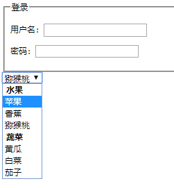
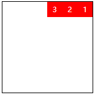

[TOC]

## 开始

### HTML基本概念

网站开发人员=UI设计师+前端工程师+后端工程师

HTML（结构）+CSS（样式）+JS（行为）

XHTML比HTML语法更为严格，主要体现在DOCTYPE写法、大小写敏感、属性b布尔值、属性引号、alt属性、标签的严格闭合等方面

### HTML语法

标签与属性的含义

常见HTML标签：http://www.xuanfengge.com/funny/html5/element/

#### HTML文档的典型结构：

```html
<!DOCTYPE html><!--文档声明-->
<html lang="en"><!--根标签-->
    <head><!--头部-->
        <meta charset="UTF-8"><!--元信息-->
        <title>Title</title><!--标题-->
    </head>
    <body><!--主体-->
        
    </body>
</html>
```

注释：`<!-- -->`

HTML语义化：根据网页中内容的语义选择相应的标签

#### 常见的标签：

- 标题与段落：h与p标签
- 文本修饰标签：strong、em、sub、sup、del、ins
- 引用标签：blockquote、q、abbr、address、cite
- pre与code标签：用于代码的输出
- 图片标签：img
  - 属性：src、alt、width、height、title
- 跳转：
  - 标签：a、base
  - 属性：href、target、name
  - 锚点：#+Id、#+name
- 特殊符号：`&nbsp;&copy;&reg;&lt;&gt;&amp;&yen;&deg;`
- 列表：
- 无序列表：ul/dir/menu、li
  - 有序列表：ol、li
  - 定义列表：dl、dt、dd
- 表格：
- 标签：table、tr、th、td、caption、thead、tbody、tfoot；
  - 属性：border、cellpadding、callspacing、rowspan、colspan、align、valign
- 表单：
  - 标签：form、input、select与option、textarea、label
  - 属性：action、method、type、name、value
  - 输入类型：text、radio、checkbox、password、file、submit、button、reset ...
- 块标签：div，span

strong和em标签都表示强调，表现形态为文本加粗和斜体；b和i标签同样也表示文本加粗和斜体。区别在于前者是具备语义化的，而后者是不具备语义化的。

br与wbr：br是换行，wbr软换行，用于长单词的折行

### 扩展学习

#### iframe嵌套页面：

- iframe元素会创建包含另外一个文档的内联框架（即行内框架）

，引入其他html页面到本html页面中显示

- 属性
  - frameborder：规定是否显示周围的边框
  - width：定义iframe的宽度
  - height：定义iframe的高度
  - scrolling：规定是否在iframe中显示滚动条
  - src：规定在iframe中引入的url
  - srcdoc：规定在iframe中显示的页面内容

- 应用场景：数据传输、共享代码、局部刷新、第三方介入等

#### map与area

作用：定义一个客户端图像映射

> 图像映射：带有可点击区域的一幅图像

area元素永远嵌套在map元素的内部，area元素可定义图像映射中的区域。area元素的href属性定义区域的url，shape属性来定义区域的形状，coords属性定义热区的坐标。

```html

<map name="star">
    <!-- 矩形区域 -->
	<area shape="rect" coords="0,0,100,100" href="#" alt="">
    <!-- 圆区域 -->
    <area shape="circle" coords="100,100,10" href="#" alt="">
    <!-- 多边形区域 -->
    <area shape="poly" coords="0,0,0,100,100,100" href="#" alt="">
</map>
```

#### embed与object

嵌入一些多媒体，如flash动画、插件等，基本使用没有太多差别，主要是为了兼容不同的浏览器。object元素需要配合param元素一起完成。使用较少。

```html
<embed src="example.swf">
<object>
    <param name="movie" value="example.swf">
</object>
```

#### audio与video标签（html5）

audio标签嵌入音频文件、video标签表示侵入视频文件。

默认空间是不显示的，可以通过controls属性来显示控件。

为了能够支持多个备选文件的兼容支持，可以配合source标签使用

```html
<audio src="exmaple.mp3" controls loop autoplay></audio>
<video src="example.mp4" controls></video>

<video>
	<source src="example.ogv">
    <source src="example.mp4">
</video>
```

#### 文字注解与文字标签

文字注解： ruby、rt

文字方向：bdo或者direction css样式

#### link标签的扩展

引入css文件

添加网址标题栏之前的小图标

引入dns的解析

```html
<link href="/_css/tpl2/system.css" type="text/css" rel="stylesheet">
<link rel="icon" type="/image/x-icon" href="#">
<link rel="dns-prefetch" href="//s1.hdslb.com">
```

#### meta标签

添加一些辅助信息

```html
<!-- 网站的描述 -->
<meta name="description" content="bilibili是国内知名的视频弹幕网站，这里有最及时的动漫新番，最棒的ACG氛围，最有创意的Up主。大家可以在这里找到许多欢乐。">
<!-- 网站的关键字 -->
<meta name="keywords" content="Bilibili,哔哩哔哩,哔哩哔哩动画,哔哩哔哩弹幕网,弹幕视频,B站,弹幕,字幕,AMV,MAD,MTV,ANIME,动漫,动漫音乐,游戏,游戏解说,二次元,游戏视频,ACG,galgame,动画,番组,新番,初音,洛天依,vocaloid,日本动漫,国产动漫,手机游戏,网络游戏,电子竞技,ACG燃曲,ACG神曲,追新番,新番动漫,新番吐槽,巡音,镜音双子,千本樱,初音MIKU,舞蹈MMD,MIKUMIKUDANCE,洛天依原创曲,洛天依翻唱曲,洛天依投食歌,洛天依MMD,vocaloid家族,OST,BGM,动漫歌曲,日本动漫音乐,宫崎骏动漫音乐,动漫音乐推荐,燃系mad,治愈系mad,MAD MOVIE,MAD高燃">
<!-- 选择内核 -->
<meta name="renderer" content="webkit">
<!-- 针对IE浏览器，选择Edge -->
<meta http-equiv="X-UA-Compatible" content="IE=edge">
<!-- 设置刷新周期 -->
<meta http-equiv="refresh" content="3">
<!-- 缓存处理 -->
<meta http-equiv="expires" content="Web, 20 Jun 2019 22:33:00 GMT">
```

#### HTML5新语义化标签

| 标签 | 语义 |
| ---- | ---- |
|header  |页眉|
|footer  |页脚|
|main  |主体|
|hgroup  |标题组合|
|nav  |导航|
|article |主题独立的内容|
|aside |辅助信息|
|section |章节区域|
|figure |图像和视频|
|figcaption |对图片和视频的描述|
|datalist |智能选项列表|
|details/summary |文档细节/文档标题|
|progress/meter |定义进度条/定义度量范围|
|time |定义日期和时间|
|mark |带有标记的文本|

#### 表格扩展内容

| 功能       | 标签/样式                 |
| ---------- | ------------------------- |
| 添加单线   | border-collapse: collapse |
| 隐藏空单元 | empty-cells: hide         |
| 斜线分类   | border / rotate           |
| 列分组     | colgroup / col            |

```html
<table>
    <caption>这是一个表格</caption>
    <colgroup>
        <col span="2" style="">
        <col span="3" style="">
        ...
    </colgroup>
    <thead>...</thead>
    <tbody>...</tbody>
    <tfoot>...</tfoot>
</table>
```

#### 表单的扩展内容

美化表单控件：1、伪类 :checked  2、position+透明度 

```html
<!DOCTYPE html>
<html lang="en">
<head>
    <meta charset="UTF-8">
    <title>Title</title>
    <style>
        input{
            display: none;
        }

        input[name=file]+div{
            width:366px;
            height:40px;
            color: white;
            font:16px 微软雅黑,Arial;
            background:rgb(66,139,202);
            text-align: center;
            vertical-align: center;
            line-height: 40px;
            border-radius: 5px;
        }

        input[name=ok]+div{
            width:20px;
            height:20px;
            box-sizing: border-box;
            border:4px solid black;
        }

        input[name=ok]:checked+div{
            background: black;
        }


    </style>
</head>
<body>
<label>
    <input type="file" name="file" value="文件上传">
    <div>上传</div>
</label>

<label>
    <input type="checkbox" name="ok">
    <div></div>
</label>

</body>
</html>
```

新的表单属性：

| 属性         | 功能                    |
| ------------ | ----------------------- |
| autocomplete | 自动完成，可选值on、off |
| autofocus    | 获取焦点，可选值on、off |
| required     | 不能为空                |
| pattern      | 正则验证                |
| method       | 数据传输方式            |
| enctype      | 数据传输类型            |
| name、value  | 数据的键值对            |

扩展标签：

|标签|功能|
|--------|------------------|
|fieldset|表单内元素分组|
|legend|为fieldset元素定义标题|
|optgroup|定义选项组|



```html
<form method="post" action="#">
    <fieldset>
        <legend>登录</legend>
        <p>
            用户名：<input type="text" name="username">
        </p>
        <p>
            密码：<input type="password" name="password">
        </p>
    </fieldset>

    <select name="" id="">
        <optgroup label="水果"></optgroup>
        <option value="">苹果</option>
        <option value="">香蕉</option>
        <option value="">猕猴桃</option>
        <optgroup label="蔬菜"></optgroup>
        <option value="">黄瓜</option>
        <option value="">白菜</option>
        <option value="">茄子</option>
    </select>
</form>
```


## CSS基础

语法：

```css
Selector{
    Param1:Value1;
    Param2:Value2;
    ...
}
```

#### 浏览器前缀

CSS去兼容不同的浏览器，针对旧的浏览器做兼容，新的浏览器基本不需要添加前缀 

| 浏览器        | 内核    | 前缀     |
| ------------- | ------- | -------- |
| IE            | Trident | -ms-     |
| Firefox       | Gecko   | -moz-    |
| Opera         | Presto  | -o-      |
| Chrome        | Webkit  | -webkit- |
| Safari        | Webkit  | -webkit- |
| Opera、Chrome | Blink   |          |


### 基本样式

#### 长度单位

像素px、百分比%、相对字体长度单位em

#### 样式的类型

`内联样式、内部样式、外部样式`

区别link与@import：https://www.cnblogs.com/my--sunshine/p/6872224.html）

```html
<html>
    <head>
        <meta charset="UTF-8">
        <!-- 引入外部样式的第一种方法 -->
        <link rel="stylesheet" href="./hello.css">
        <title>Title</title>
        <style>
            /* 引入内部样式 */
            #a{
                color:red;
                background-color:blue;
            }
            /* 引入外部样式的第二种方法，不建议使用 */
            @import url("./world.css")
        </style>
    </head>
    <body>
        <!-- 内部样式 -->
        <div id="a">
            这是一段文字
        </div>
        <!-- 内联样式 -->
        <div style="color:blue;background-color:red;">
            这是另外一段文字
        </div>
        <!-- 外部样式 -->
        <div class="hello">
            这是第三段文字
        </div>
    </body>
</html>
```

#### 颜色表示法

- 单词表示法：`red、blue、green、violet`

- 十六进制表示法：`#000000、#FF0000`

- rgb表示法：`rgb(255,0,0)`

- 透明颜色：transparent

  提取颜色工具FeHelper

#### CSS背景样式

- 背景颜色：`background-color:red`
- 背景图片：`background-image:url("/example.jpg")`
- 背景图片的平铺方式：`background-repeat:word`，其中`word=repeat-x|repeat-y|repeat|no-repeat`
- 背景图片的位置：`background-position:x y` ，其中`x=数值|left|right|center，y=数值|top|bottom|center`
- 背景图片随滚动条移动的方式：`background-attachment:attachment`，其中`attachment=scroll|fixed`

利用背景实现视觉差效果：

```html
<!DOCTYPE html>
<html lang="en">
<head>
    <meta charset="UTF-8">
    <title>Title</title>
    <style>
        div{width:100%;height:768px;}
        .div1{background: url("./images/quanyecha.jpg") fixed;}
        .div2{background: url("./images/quanyecha2.jpg") fixed;}
        .div3{background: url("./images/quanyecha3.jpg") fixed;}
    </style>
</head>
<body>
<div class="div1"></div>
<div class="div2"></div>
<div class="div3"></div>
</body>
</html>
```

CSS3背景扩展样式：

background-size：背景图的尺寸、cover覆盖、contain包含

background-origin：背景图的填充位置、padding-box（默认）、 border-box、content-box

background-clip：背景图的裁切方式，padding-box、border-box（默认）、content-box

#### CSS边框样式

- 边框风格（border-style）：solid、dashed、dotted
- 边框大小（border-width）
- 边框颜色（border-color）

单独设某一条边：`border-left-style: solid;`

绘制三角形：

```css
width: 0;
height: 0;
border-right: solid red 100px;
border-left: solid transparent 100px;
border-top: solid transparent 100px;
border-bottom: solid transparent 100px;
```

#### CSS文字样式

- font-family：字体类型，中文、西文，衬线体与非衬线体，注意适当添加引号
- font-size：字体大小，数值|xx-small|x-small|small|medium|large|x-large|xx-large
- font-weight：字体粗细，数值|normal|bold
- font-style：字体样式，normal|italic|oblique，注意区别italic与oblique
- color：字体颜色

#### CSS段落样式

- text-decoration：文本装饰，underline|overline|line-through|none
- text-transform：文本大小写，lowercase|uppercase|capitalize
- text-indent：首行缩进，数值表示，单位可以选择px、em等
- text-align：文本对齐方式，left|right|center|justify
- line-height：定义行高，行高=上边距+字体大小+下边距，上边距=下边距，默认行高与字体大小有关，绝对值（带单位）|比例值（不带单位）
- letter-spacing：字间距
- word-spacing：单词间距，针对西文
- 折行：`word-break: break-all;`或者`word-wrap: break-word;`，注意二者区别

#### CSS复合样式

background、font、border、border-left，通过空格进行区分。

font的格式：`其他属性值 font-size/line-height font-family`

复合样式与单一样式不应该混合使用，复合样式会覆盖所包含的单一样式，如果非要混合使用一定要先写复合样式再写单一样式

### 选择器

#### ID选择器

```html
<style>
    #div1{color:red;}
    #div2{color:blue;}
</style>
...
<div id="div1">这是一个块</div>
<div id="div2">这是另外一个块</div>
```

ID在一个页面内是唯一的，符合标识符命名规则，可选择驼峰写法、下划线写法、短线写法，遵守约定俗成的命名惯例。

快捷键：div#aaa+tab

#### CLASS选择器

```html
<style>
    .box{color:red;}
</style>

<div class="box">这是一个块</div>
```

class可以复用，可以组合，css文件或style标签中顺序决定优先级（而不是class中顺序），CLASS选择器可以与标签选择器混合使用。

#### 标签选择器

```html
<style>
    div{color:red;}
</style>

<div>这是一个块</div>
```

用于去掉标签默认样式，用于复杂层级选择器

#### 群组选择器、通配选择器

```css
div,p,span{}  /* 群组选择器 */
*{}  /* 通配选择器 */
```

通配选择器可以去掉默认样式，一般不要使用

#### 层次选择器

```css
M N{} /* 后代选择器 */
M>N{} /* 父子选择器 */
M~N{} /* 右兄弟选择器 */
M+N{} /* 相邻右兄弟选择器 */
```

#### 属性选择器

```css
M[expr]{}
M[expr]...[expr]{}
/*
	expr := param | param op val
	op:=
		*=  （部分匹配）  |
		=   （完全匹配）  |
		^=  （前缀匹配）  |
		$=  （后缀匹配）
*/
```

#### 伪类选择器

```css
M:pseudo-classes{}
```

伪类（pseudo-classes）：

- `:link、:visited、:hover、:active`

  - `:link`：访问前，仅适用于a标签
  - `:visited`：访问后，仅适用于a标签
  - `:hover`：鼠标移入
  - `:active`：鼠标按下

  注意顺序（LVHA），一般只使用a{}、a:hover{}

- `:after、:before`

  - `:after`：在目标之后添加内容（使用content属性）和样式
  - `:before`：在目标之前添加内容和样式

- 表单元素相关

  - `:checked`：当元素具有checked属性时被选中
  - `:disabled`：当元素具有disabled属性时被选中
  - `:focus`：当元素获取到光标时被选中

- 结构性伪类

  - `:nth_of_type(param)`：按下标选择父元素**同类型**的子元素，其中param:=num|n|expr，num为从1开始整数，expr为num与n组成的表达式

    ```css
    div:nth_of_type(1){} /* 选择第一个div */
    div:nth_of_type(n){} /* 选择全部div */
    div:nth_of_type(2n){} /* 选择第偶数个div */
    div:nth_of_type(2n+1){} /* 选择第奇数个div */
    div:nth_of_type(3n+1){} /* 选择模3等于1个div */
    ```

  - `:first_of_type、:last_of_type、:only_of_type`：第一个、最后一个、仅有的一个**同类型**子元素

  - `:nth_child(param)`：按下标选择父元素**不同类型**的子元素

  - `:first_child、:last_child、:only_child`：第一个、最后一个、仅有的一个**不同类型**子元素

  - `of_type`与`child`的区别：前者的下标是**排除了其他类型子元素**的下标，后者的下标是**不排除其他类型子元素**的下标

### 样式继承

默认情况下文字相关的样式可以继承，布局相关的样式不继承，但是可以设置继承属性继承布局相关的样式。

```css
div{
    border: red 10px;
}

/* div的p子标签会继承div的border属性 */
div>p{
    border: inherit;
}
```

### 样式优先级

相同样式，后写的优先。

内部样式与外部样式优先级相同，后引入优先。

单一样式优先级：行间样式（1000）>id(100)>class(10)>tag(1)>*>继承

!important提升优先级最高，非规范不建议使用

一般原则：精确度原则+就近原则

层次优先级比较：权重比较、约分比较

### 盒子模型

#### 盒子结构


组成：

- content：内容

- padding：内填充

  ```css
  div{padding: 30px;/*上下左右*/}
  div{padding: 30px 40px;/*上下、左右*/}
  div{padding: 30px 40px 50px 60px;/*上、右、下、左*/}
  ```

- border：边框

- margin：外填充（设置方式与padding类似）

注意：

背景颜色填充到margin以内（不含margin）

子元素在content区域

padding不能为负数而margin可以为负数（此时会造成盒子的重叠）

#### box-sizing

改变盒子的展示方式

- content-box：尺寸（width、height）针对content，默认情况
- border-box：尺寸针对content+padding+border
- padding-box：尺寸针对的是content+padding

#### 盒子模型的一些问题

margin叠加问题

- 问题描述：上下盒子的间距=max{上盒子下边距, 下盒子上边距}

- 解决方案：BFC规范、只给一个元素添加间距

margin传递问题

- 问题描述：出现在嵌套结构中，只在margin-top方向上，子元素margin-top也会影响父元素

- 解决方案：BFC、给父容器加边框、子元素margin换成父元素padding

  ```css
  body > div{
      background: red;
      width: 200px;
      height: 200px;
  }
  
  div > div{
      background: blue;
      width: 100px;
      height: 100px;
      margin-top: 200px; /* 只在子元素中定义了margin-top属性 */
  }
  ```

  

margin的自适应居中：

```css
div{
    width:200px;
    height:200px;
    background: red;
}
/* 靠右 */
div{margin-left: auto;}
/* 靠左 */
div{margin-right: auto;}
/* 居中 */
div{
    margin-left: auto;
    margin-right: auto;
}
div{
    margin: 0 auto;
}
```

不设置content的现象：如果没有设置尺寸，div元素会撑满整个父容器的content；但是如果设置width或者height为100%，同时添加border或padding，却会导致div元素超出父容器content区域。

### 标签

#### 按类型分类

- block：div、p、ul、li、h1 ……
  - 独占一行
  - 支持所有样式
  - 宽度默认与父容器相同
  - 占据矩形区域
- inline：span、a、em、strong、img ……
  - 紧挨在一起
  - 不支持某些样式，例如width、height、margin、padding，但img元素支持宽高，因为是替换元素
  - 宽度由内容决定
  - 占据区域不一定是矩形
  - 内联标签之间会有空隙，这是由于换行导致的，一般使用span修饰文本而不是布局，如果非要解决可以将空白的font-size设为0
- inline-block：input、select ……
  - 紧挨在一起，但是支持宽高
  - 占据矩形区域
  - 内联块之间会有空隙

浏览器开发人员工具可以查看标签类型

#### 按内容分类


- FLow（流内容）：绝大多数在body内使用的元素被归纳为流内容
- Metadata（元数据）：设置其他内容的展示方式或行为、设置文档之间的关系、传输其他”带外数据“
- Sectioning（分区）：用于定义标题栏和页脚范围的内容
- Heading（标题）：定义章节标题的内容
- Phrasing（措辞）：段落内的文本和修饰和标记文本的元素
- Embedded（嵌入）：导入资源和嵌入其他内容
- Interactive（互动）：同用户进行交互

https://html.spec.whatwg.org/multipage/dom.html

#### 按显示划分标签

- 替换元素：浏览器根据元素的属性决定显示的内容，如img、input
- 非替换元素：直接将内容告诉浏览器，如h1~6

#### 标签嵌套规范

- 列表、表格与行、单元格标签
- 块可以嵌套内联，内联一般不能嵌套块（但有例外，如a标签可以嵌套块）
- 块一般可以嵌套块（但有例外，如p不能嵌套div）

### 更多的样式

#### 显示框类型

display：block、inline、inline-block、none，其中none用于隐藏

`display: none;`不占空间的隐藏，`visibility: hidden;`是占空间的隐藏

#### 溢出隐藏

overflow：visible、hidden、scroll、auto

overflow-x overflow-y

#### 透明度与手势

opacity：0~1，占空间，会影响所有的子孙元素

rgba：颜色与透明度，不会影响子孙元素

cursor：手势，default是箭头、pointer、move、help …… ，自定义手势cursor: url(...),auto;

#### 最小最大宽高

min-width、max-width、min-height、max-height

自适应屏幕的高：

```css
*{padding:0;margin:0;}
html,body{height: 100%;}
img{width: 100%;height: 100%;display: block;}
```

#### CSS默认样式

没有默认样式的：div、span

有默认样式的：

- body：默认外边距为8px
- h1：上下margin、font-weight
- p：上下margin
- ul：上下margin、padding-left、list-style
- a：text-decoration: underline；

有一些默认样式影响到前端开发，需要CSS reset

```css
*{margin:0; padding:0;}/*不用考虑那些标签有默认的margin、padding，但略微会影响性能*/
ul{list-style: none;}
a{text-decoration: none; color:#999;}
a:hover{text-decoration: underline; color: red;}
img{display: block;}
/*
	内联元素按照基线对齐，而不是底线
	vertical-align: baseline;
	解决方案一：vertical-align: bottom;
	解决方案二：display: block;
*/
```

写具体页面的时候或一个布局效果的时候：

1、写结构

2、写CSS重置样式

3、具体写样式

#### float浮动

文档流：文档中可显示对象在排列时所占用的位置

float特性：加浮动的元素会脱离文档流，会延迟父容器靠左或靠右排列，如果之前已经有浮动的元素，会挨着浮动的元素进行排列。

float的取值：left、right、none（默认）

float注意事项：

- 只会影响后面的元素
- 内容默认提升半层（与文字相同），利用这一点可以实现图文混排的效果
- 默认的宽根据content决定
- 流式布局，换行排列
- 主要给块元素添加，但也可以给内联元素添加
- clear标签只对块标签起作用，对内联标签不起作用

清除float：

- 上下排列：clear表示清除浮动的影响，left、right、both
- 嵌套排列：
  - 固定宽高：把父元素高度写死，不推荐
  - 父元素浮动：也会影响后面的元素，不推荐
  - overflow: hidden（BFC）：如果有子元素想溢出，也会受到影响。
  - display: inline-block（BFC）：父容器会影响到后面的元素，不推荐
  - 设置空标签：在父容器中添加一个空标签，并清除float。不推荐，会添加一个多余的标签
  - **after伪类**：空标签的加强版，目前各大公司的做法，推荐使用

```html
<!DOCTYPE html>
<html lang="en">
<head>
    <meta charset="UTF-8">
    <title>Title</title>
    <style>
        #box1{
            width: 200px;
            border: 1px solid black;
        }
        #box2{
            width:100px;
            height:200px;
            background: red;
            float: left;
        }
    </style>
</head>
<body>
<div id="box1"><div id="box2"></div></div>
</body>
</html>
```


解决方案：

```css
/* 将父容器的高度写死 */
#box1{height: 200px;}

/* 父元素浮动 */
#box1{float: left;}

/* 隐藏溢出 */
#box1{overflow: hidden;}

/* 内联块显示 */
#box1{display: inline-block;}

/* 空标签，在div#box1中再添加一个空标签div#box3 */
#box3{clear:left;}

/* 伪类 */
#box1:after{content:'';display:block;clear:left;}
```

#### position定位

position用于指定一个元素在文档中的定位方式

top、right、bottom、left属性则决定了元素的最终位置

z-index层级指定重叠次序，方向向外。

取值：

- static：默认
- relative：相对定位
  - 如果没有定义偏移量，则对于元素本身没有任何影响
  - 没有让元素脱离文档流
  - 不影响其他元素布局
  - left、right、top、bottom是相对于元素自身进行偏移的
- absolute：绝对定位
  - 使元素完全脱离文档流
  - 使内联元素支持宽高（具备块的性质）
  - 使块元素默认宽度根据内容决定（让块具备内联的特性）
  - **如果有定位祖先元素，那么相对于定位祖先元素发生偏移；如果没有定位祖先元素，那么相对于整个文档发生偏移（绝对、相对、固定）**
- fixed：固定定位
  - 使元素完全脱离文档流
  - 使内联元素支持宽高（具备块的性质）
  - 使块元素默认宽度根据内容决定（让块具备内联的特性）
  - **相对于整个浏览器窗口进行偏移，不受浏览器滚动条的影响**
- sticky：黏性定位，进行黏性操作（例如hao123首页搜索框的效果）
  - 配合偏移量使用，否则不起作用

场景：

- 利用定位和:hover伪类可以实现菜单效果

- 定位可以实现子元素在父元素中居中

  ```css
  #box1{width:100px;height:100px;border:1px solid black;position:relative;}
  #box2{width:100px;height:100px;background:red;position:absolute;left:50%;top:50%;margin:-50px 0 0 -50px;}
  ```

- 利用定位和:before伪类实现列表的装饰点

#### CSS添加省略号

做法：

- 必须有一个固定的宽度：width
- 不让内容折行：white-space: nowrap
- 隐藏溢出的内容：overflow: hidden
- 添加省略号：text-overflow: ellipsis

支持单行，多行要用其他的方法。

#### CSS Sprite

特性：又名CSS雪碧、CSS精灵，一种网页图片处理方式，它允许你将一个页面中涉及到的零散的图片都包含到一张大图中去加载。

好处：减少图片的质量，提高加载的速度；减少图片的请求速度，加快页面的打开速度。

#### CSS圆角

border-radius：给标签添加圆角

```css
#box1{border-radius:20px;}                 /* 四个圆角半径相同 */
#box2{border-radius:20px 10px;}            /* 次对角圆角半径20px，主对角圆角半径10px */
#box3{border-radius:10px 20px 30px 40px;}  /* 左上开始顺时针次序，圆角半径分别为10、20、30、40px */
#box4{border-radius:10px/20px;}            /* 椭圆角，半宽度为10px，半高度为20px */

/* 半圆效果 */
#box5{
    width:200px;
    height:100px;
    background:darkviolet;
    border-radius: 100px 100px 0 0;
    margin:auto;
}
```

#### CSS渐变

1、线性渐变 ：linear-gradient是值，需要添加到background-image属性上。

eg：

```css
background-image: linear-gradient(red,blue,green);
background-image: linear-gradient(to top,red,blue);
background-image: linear-gradient(to right top,red,blue);
/*注意顺时针为正，0deg方向竖直向下*/
background-image: linear-gradient(45deg,red,blue);
/* 从25%开始渐变到75%结束 */
background-image: linear-gradient(red 25%, blue 75%);
```

2、径向渐变：radial-gradient

#### 字体图标

font-face是css3中的一个模块，把自定义web字体嵌入到网页中。

好处：方便修改颜色和大小、不失真、减少请求次数、简化网页布局、添加系统不具备的字体等

使用方法：

```css
@font-face {
    font-family:hello;
    src:url("https://at.alicdn.com/t/font_1404888168_2057645.eot");
    src:url("https://at.alicdn.com/t/font_1404888168_2057645.eot?#iefix") format("embedded-opentype"),
        url("https://at.alicdn.com/t/font_1404888168_2057645.woff") format("woff"),
        url("https://at.alicdn.com/t/font_1404888168_2057645.ttf") format("truetype"),
        url("https://at.alicdn.com/t/font_1404888168_2057645.svg#uxiconfont") format("svg")
}

div{
    font-family:hello;
}

.gouwuche:after{
    content:"";
}
```

iconfont矢量图标库：https://www.iconfont.cn/：提供了大量免费的字体图标

自定义字体图标：https://iconmoon.io/app：在线生成字体图标

#### 阴影

1、text-shadow：

可选值：x y，blur，color，多阴影

注意阴影的颜色与默认的颜色是相同的

通过逗号分隔设置多阴影

2、box-shadow

可选值：x y，blur，spread，color，inset，多阴影

盒子阴影的默认颜色是黑色

默认就是外阴影，显式设置outset反而不起作用

利用阴影实现浮起效果：

```css
ul{list-style:none;}
li{
    float:left;
    margin:50px;
    cursor:pointer;
    position:relative;
    top:0;
    transition: .5s;
    border-radius: 3px;
}
li:hover{
    top:-3px;
    box-shadow:0px 5px 10px 3px #ccc;
}
```

#### 遮罩

```css
.mask{
    width:300px;
    height:300px;
    background:url("./img/girl.jpg");
    -webkit-mask:url("./img/love.png");
}

.mask2{
    width:300px;
    height:300px;
    background:url("./img/girl.jpg");
    /* x y / w h表示遮罩的位置及尺寸 */
    -webkit-mask:url("./img/love.png") no-repeat center center/100px 100px;
    transition:.5s;
}

.mask2:hover{
    -webkit-mask:url("./img/love.png") no-repeat center center/200px 200px;
}
```

注意mask目前还没有标准化，所以需要添加浏览器前缀

通过逗号实现多个遮罩的添加。

#### 倒影

-webkit-box-reflect：

可选值：above、below、left、right、距离、遮罩|渐变

```css
.box{
    margin: 50px auto;
    width: 300px;
    /* 遮罩 */
    /* -webkit-box-reflect: below 20px url("./img/love.png"); */
    /* 透明度渐变 */
    -webkit-box-reflect: below 20px linear-gradient(rgba(255,255,255,0),rgba(255,255,255,1))
}
```

注意渐变只支持透明度的渐变。

#### 模糊与计算

filter:blur(10px)

width:calc(100% - 100px)

### BFC规范

格式化上下文（Formmating context）：是W3C CSS2.1规范中的一个概念。他是页面中的一块渲染区域，并且有一套渲染规则，它决定了其子元素将如何定位，以及和其它元素的关系和相互作用。

BFC：Block Formatting Contexts，块级格式化上下文，属于上述规范。具有BFC特性的元素可以看作是隔离了的独立容器，容器里面的元素不会在布局上影响到外面的元素，并且BFC具有普通容器所没有的一些特性。

#### 触发BFC的条件

1、浮动元素：float除none以外的值

2、绝对定位元素：position（absolute、fixed）

3、display为inline-block、table-cells、flex

4、overflow除了visible以外的值（hidden、auto、scroll）

#### BFC特性及应用

1、解决margin叠加问题

css：

```css
.div1 {
    width: 100px;
    height: 100px;
    background: red;
    margin-bottom: 50px;
}

.div2 {
    width: 100px;
    height: 100px;
    background: blue;
    margin-top: 50px;
}

.bfc {
    overflow: hidden; /* 触发BFC */
}
```

html:

```html
<div class="bfc">
    <div class="div1"></div>
</div>
<div class="bfc">
    <div class="div2"></div>
</div>
```

2、解决margin传递问题

CSS:

```css
.div1 {
    width: 200px;
    height: 200px;
    background: red;
    overflow:hidden;/* 触发bfc */
}

.div2 {
    width: 100px;
    height: 100px;
    background: blue;
    margin-top:50px;
}

```

HTML:

```html
<div class="div1"><div class="div2"></div></div>
```

3、解决浮动问题

CSS:

```css
.div1 {
    width:200px;
    border: 1px solid black;
    overflow:hidden;/* 触发bfc */
}

.div2 {
    width: 100px;
    height: 100px;
    background: blue;
    float:left;
}
```

HTML

```html
<div class="div1"><div class="div2"></div></div>
```

4、解决覆盖问题

CSS:

```css
.div1 {
    width: 100px;
    height: 100px;
    background:red;
    float:left;
}

.div2 {
    height: 200px;
    background: blue;
    overflow: hidden;/*触发BFC*/
}
```

HTML

```html
<div class="div1"></div>
<div class="div2">星星之火，可以燎原！</div>
```

### 几何、动画与3D效果

#### transition过渡

transition-property：规定设置过渡效果的CSS属性名称

transition-duration：规定完成过渡效果持续的秒数或毫秒数

transition-delay：定义过渡效果何时开始（负值表示提前）

transition-timing-function：规定速度效果的速度曲线，可选值如linear、ease（默认）、ease-in、ease-out、cubic-bezier

复合样式：transition: property duration delay transition-timing-function

#### transform变形

| 操作            | 用法                                                         |
| --------------- | ------------------------------------------------------------ |
| translate，位移 | translate(x,y)<br/>translateX(x)<br/>translateY(y)<br/>translateZ(z) |
| scale，缩放     | scale(s)<br/>scale(x-scale,y-scale)<br/>scaleX(x-scale)<br/>scaleY(y-scale)<br/>scaleZ(z-scale) |
| rotate，旋转    | rotateZ(angle)，单位deg、rad、顺时针为正值<br/>rotateX(angle)（3d）<br/>rotateY(angle)（3d） |
| skew，错切      | skewX(x)<br/>skewY(y)<br/>单位是deg或rad、正值向左倾斜、负值向右倾斜 |

注意事项：

1、transform操作不会影响到其他元素

2、变形操作只能添加给块元素，不能添加给内联元素

3、复合写法，可以同时添加多个变形操作，但要注意顺序，后面的先执行；translate会受到排在它前面的其余三种操作的影响

4、transform-origin:x, y;设置基点的位置

#### animation动画

animation-name：设置动画的名称

animation-duration：动画的持续时间

animation-delay：动画的延迟时间,infinite

animation-iteration-count：动画的重复时间

animation-timing-function：动画的运动形式

注意：

1、运动结束后默认情况下会停留在起始位置

2、复合写法：`animation: myBox 4s 2s infinite linear`

练习：

1、实现方块的移动效果

```css
.box1{
    width:300px;
    height:300px;
    border:1px black solid;
    margin:30px auto;
}

.box2{
    width:100px;
    height:100px;
    background:red;
    animation-name:myBox;
    animation-duration:4s;
}

/*@keyframes myBox{
    from{
        transform:translate(0,0);
    }
    to{
        transform:translate(200px,0);
    }
}*/

@keyframes myBox{
    0%{transform:translate(0,0);}
    25%{transform:translate(200px,0);}
    50%{transform:translate(200px,200px);}
    75%{transform:translate(0,200px);}
    100%{transform:translate(0,0);}
}
```

2、实现滑入滑出的效果

```css
.icon:hover{
    animation: ani .5s 0s;
}

@keyframes ani {
    0%,100%{transform:translate(0,0);opacity: 1;}
    60%{transform:translate(0,-800%);opacity: 0;}
    61%{transform:translate(0,200%);opacity: 1;}
}
```

3、实现loading的效果

```html
<!DOCTYPE html>
<html lang="en">
<head>
    <meta charset="UTF-8">
    <title>Title</title>
    <style>
        .m{
            width:100px;
            margin:30px auto;
            position:relative;
        }
        .container{
            width:100px;
            height:100px;
            position:absolute;
        }
        .circle{
            width:20px;
            height:20px;
            background:blue;
            border-radius:50%;
            position:absolute;
        }
        .container2{
            width:100px;
            height:100px;
            position:absolute;
            left:0;
            top:0;
            transform: rotate(45deg);
        }

        .m div.circle{
            animation: ani 1s 0s infinite;
        }

        div.container>div:nth-of-type(1){
            animation-delay: 0s;
        }
        div.container>div:nth-of-type(2){
            animation-delay: 250ms;
        }
        div.container>div:nth-of-type(3){
            animation-delay: 500ms;
        }
        div.container>div:nth-of-type(4){
            animation-delay: 750ms;
        }
        div.container2>div:nth-of-type(1){
            animation-delay: 125ms;
        }
        div.container2>div:nth-of-type(2){
            animation-delay: 375ms;
        }
        div.container2>div:nth-of-type(3){
            animation-delay: 625ms;
        }
        div.container2>div:nth-of-type(4){
             animation-delay: 875ms;
         }


        @keyframes ani{
            0%{
                transform:scale(1);
            }
            50%{
                transform:scale(.2);
            }
        }
    </style>
</head>
<body>
<div class="m">
    <div class="container">
        <div class="circle" style="left:0;top:0;"></div>
        <div class="circle" style="right:0;top:0;"></div>
        <div class="circle" style="right:0;bottom:0;"></div>
        <div class="circle" style="left:0;bottom:0;"></div>
    </div>
    <div class="container2">
        <div class="circle" style="left:0;top:0;"></div>
        <div class="circle" style="right:0;top:0;"></div>
        <div class="circle" style="right:0;bottom:0;"></div>
        <div class="circle" style="left:0;bottom:0;"></div>
    </div>
</div>
</body>
</html>
```

#### animation动画的扩展用法

animation-fill-mode：规定动画播放之前或之后，其动画效果是否可见

1、none：默认值，在运动结束之后回到初始状态，在有延迟的情况下让0%在延迟后生效；

2、backwards：在延迟的情况下，让0%在延迟前生效；

3、forwards：在运动结束后，停到结束位置；

4、both：backwards和forwards同时生效

animation-direction：属性定义是否应该轮流反向播放动画。

1、alternate：一次正向（0%-100%），一次反向（100%-0%）

2、reverse：永远都是正向；

3、normal：默认值，永远都是正向；

#### animate.css库

官网地址：https://daneden.github.io/animate.css/

基本使用：

- animated：基类（基础的样式，每个动画效果都需要添加）
- infinite：动画的无限次数

#### transform3D

相关属性：

rotateX()：正值向上翻转

rotateY()：正值向右翻转

translateZ()：正值向前，负值向后

scaleZ()：立体元素的厚度

3d写法：

scale3d()：三个值x y z

translate3d()：三个值x y z

rotate3d()：四个值0|1（x轴是否添加旋转角度）0|1（y轴是否添加旋转角度）0|1（z轴是否添加旋转角度） deg

3d相关属性：

perspective：离屏幕多远的距离去观察元素，值越大幅度越小

perspective-origin：景深-基点位置，观察元素的角度

transform-origin：x y z

transform-style：3D空间，flat（默认值2d）、preserve-3d（3d产生一个三维空间）

backface-visibility：消隐，hidden、visible（默认）

```css
#box1{
    width:300px;
    height:300px;
    border:1px black solid;
    margin: 30px auto;
    perspective:200px;/* 在父容器上设置perspective */
}

#box2 {
    width: 100px;
    height: 100px;
    background: red;
    margin:100px;
    transition:transform 1s;
    transform: rotateX(0);
}

#box1:hover>#box2{
    transform:rotateX(180deg);
}
```

立方体效果：

```html
<!DOCTYPE html>
<html lang="en">
<head>
    <meta charset="UTF-8">
    <title>Title</title>
    <style>
        /* CSS RESET */
        * {
            margin: 0;
            padding: 0;
        }

        /* 立方体 */
        ul {
            list-style: none;
            transform-style: preserve-3d;/*配置3d空间*/
            transition: 2s;/*配置变形*/
        }

        div.box {
            width: 300px;
            height: 300px;
            border: 1px black solid;
            margin: 30px auto;
            perspective: 400px;/*设置景深*/
        }

        div.box ul {
            width: 100px;
            height: 100px;
            margin: 100px;
            position: relative;/*设置父容器相对定位*/
            transform-origin:center center -50px;/*设置变换基点*/
        }

        div.box ul li {
            width: 100px;
            height: 100px;
            background: red;
            line-height: 100px;
            text-align: center;
            vertical-align: center;
            position: absolute;/*设置子容器绝对定位*/
        }

        /*左侧面向后翻转*/
        div.box ul li:nth-of-type(2) {
            background: blue;
            transform: rotateY(-90deg);
            transform-origin: right;
            left: -100px;
        }

        /*右侧面向后翻转*/
        div.box ul li:nth-of-type(3) {
            background: green;
            transform: rotateY(90deg);
            transform-origin: left;
            left: 100px;
        }

        /*上侧面向后翻转*/
        div.box ul li:nth-of-type(4) {
            background: yellow;
            transform: rotateX(90deg);
            transform-origin: bottom;
            top: -100px;
        }

        /*下侧面向后翻转*/
        div.box ul li:nth-of-type(5) {
            background: magenta;
            transform: rotateX(-90deg);
            transform-origin: top;
            top: 100px;
        }

        /*将背面翻转后平移*/
        div.box ul li:nth-of-type(6) {
            background: cyan;
            transform: rotateY(180deg) translateZ(100px);
        }

        /*旋转操作*/
        div.box:hover ul{
            transform:rotateX(360deg) rotateY(360deg) rotateZ(360deg);
        }

    </style>
</head>
<body>
<div class="box">
    <ul>
        <li>1</li>
        <li>2</li>
        <li>3</li>
        <li>4</li>
        <li>5</li>
        <li>6</li>
    </ul>
</div>
</body>
</html>
```

选择木马效果：

```html
<!DOCTYPE html>
<html lang="en">
<head>
    <meta charset="UTF-8">
    <title>Title</title>
    <style>
        /* CSS RESET */
        * {
            margin: 0;
            padding: 0;
        }

        /* 立方体 */
        ul {
            list-style: none;
            transform-style: preserve-3d;/*配置3d空间*/
            transition: 2s;/*配置变形*/
        }

        div.box {
            width: 300px;
            height: 300px;
            border: 1px black solid;
            margin: 30px auto;
            perspective: 400px;/*设置景深*/
        }

        div.box ul {
            width: 100px;
            height: 100px;
            margin: 100px;
            position: relative;/*设置父容器相对定位*/
            /*transform-origin:center center -50px;*//*设置变换基点*/
        }

        div.box ul li {
            width: 100px;
            height: 100px;
            line-height: 100px;
            text-align: center;
            vertical-align: center;
            position: absolute;/*设置子容器绝对定位*/
        }

        div.box ul li:nth-of-type(1) {
            background: red;
            transform:translateZ(100px);
        }
        
        div.box ul li:nth-of-type(2) {
            background: blue;
            transform:rotateY(60deg) translateZ(100px);
        }
        
        div.box ul li:nth-of-type(3) {
            background: green;
            transform:rotateY(120deg) translateZ(100px);
        }
        
        div.box ul li:nth-of-type(4) {
            background: yellow;
            transform:rotateY(180deg) translateZ(100px);
        }
        
        div.box ul li:nth-of-type(5) {
            background: magenta;
            transform:rotateY(240deg) translateZ(100px);
        }
        
        div.box ul li:nth-of-type(6) {
            background: cyan;
            transform:rotateY(300deg) translateZ(100px);
        }
        
        div.box:hover ul{
            transform:rotateY(-360deg);
        }
    </style>
</head>
<body>
<div class="box">
    <ul>
        <li>1</li>
        <li>2</li>
        <li>3</li>
        <li>4</li>
        <li>5</li>
        <li>6</li>
    </ul>
</div>
</body>
</html>
```

翻面效果：

```html
<!DOCTYPE html>
<html lang="en">
<head>
    <meta charset="UTF-8">
    <title>Title</title>
    <style>
        /* CSS RESET */
        * {
            margin: 0;
            padding: 0;
        }

        img {
            width: 100%;
            height: 100%;
            display: block;
        }

        .container {
            width: 800px;
            height: 450px;
            border: 1px solid black;
            margin: 30px auto;
            position:relative;
            transform-style: preserve-3d;
            perspective: 1000px;
            backface-visibility: hidden;
        }

        .container > div {
            width:calc(100% - 50px);
            height:calc(100% - 50px);
            position:absolute;
            margin:25px;
            transition:1s;
        }

        .container > div:last-child{
            transform: rotateY(180deg);
        }

        .container:hover > div:first-child{
            transform: rotateY(-180deg);
        }

        .container:hover > div:last-child{
            transform: rotateY(0);
        }


    </style>
</head>
<body>
<div class="container">
    <div>
        
    </div>
    <div>
        
    </div>
</div>
</body>
</html>
```

#### 利用scale负值实现翻转

```css
.box{
    margin:50px auto;
    transform: scale(-1);
}
```

### 布局

1、BFC规范

2、定位

3、float

4、flex弹性

#### 版心与通栏布局

#### 分栏布局

column-count：分栏的个数

column-width：分栏的宽度

column-gap：分栏的间距

column-rule：分栏的边线

column-span：合并分栏

注意：分栏的个数与分栏的宽度互斥的

#### 等高布局

做法：margin+padding+overflow

```css
*{margin:0;padding:0;}
#parent{
    border:10px black solid;
    overflow:hidden;
}
#box1{
    float:left;
    width:100px;
    background:red;
    margin-bottom:-2000px;
    padding-bottom:2000px;
}
#box2{
    float:right;
    width:100px;
    background:blue;
    margin-bottom:-2000px;
    padding-bottom:2000px;
}
```

html

```html
<div id="parent">
    <div id="box1">
		<p>111</p>
        <p>111</p>
        <p>111</p>
    </div>
    <div id="box2">
        <p>222</p>
        <p>222</p>
    </div>
</div>
```

#### 双飞翼布局

效果：左右固定，中间自适应

做法：

```css
*{
    margin:0;
    padding:0;
}

.header{
    height:100px;
    background:red;
}

.container .center{
    height:200px;
    width:100%;
    float:left;
}

.container .center p{
    background: yellow;
    height: 100%;
    margin: 0 150px 0 100px;
}

.container .left{
    float: left;
    width: 100px;
    height: 200px;
    background: blue;
    margin-left: -100%;
}

.container .right{
    float: right;
    width: 150px;
    height: 200px;
    background: green;
    margin-left: -150px;
}
```

html

```html
<div class="header"></div>
<div class="container">
    <div class="center">
        <p>我是中国人民的儿子，我深情地爱着我的祖国和人民。</p>
    </div>
    <div class="left"></div>
    <div class="right"></div>
</div>
```

#### 圣杯布局

圣杯布局与双飞翼布局类似，但双飞翼布局需要在center盒子内部添加内容，而圣杯布局不需要。正因为如此，所以圣杯布局的实现复杂一点。

```css
*{
    margin:0;
    padding:0;
}

.header{
    height:100px;
    background:red;
}

.container{
    height: 200px;
    margin: 0 300px 0 200px;
    background:yellow;
}

.clear:after{
    content:"";
    display:block;
    clear:both;
}

.container .center {
    width:100%;
    height: 200px;
    float: left;
}

.container .left{
    float:left;
    width:200px;
    height:100%;
    background:blue;
    margin-left:-200px;
}

.container .right{
    float: right;
    width:300px;
    height:100%;
    background:purple;
    margin-right:-300px;
}
```

html

```html
<div class="header"></div>
<div class="container clear">
    <div class="left"></div>
    <div class="center"></div>
    <div class="right"></div>
</div>
```

#### Flex弹性盒模型

语法：

| 作用在flex容器上 | 作用在flex子项上 |
| ---------------- | ---------------- |
| flex-direction   | order            |
| flex-wrap        | flex-grow        |
| flex-flow        | flex-shrink      |
| justify-content  | flex-basis       |
| align-items      | flex             |
| align-content    | align-self       |

flex-direction：用来控制子项整体布局，从左往右、从右往左、从上往下、从下往上

| 取值           | 含义                                                         | 效果                                                      |
| -------------- | ------------------------------------------------------------ | --------------------------------------------------------- |
| row            | 默认值，显示为行。方向为当前文档水平流方向，默认情况下是从左往右 |  |
| row-reverse    | 显示为行。但方向和row属性值是相反的                          |  |
| column         | 显示为列                                                     |  |
| column-reverse | 显示为列。但方向和column属性值是相反的                       |  |

flex-wrap：用来控制子项整体单行显示还是换行显示。

| 取值         | 含义                                                         | 效果                                                      |
| ------------ | ------------------------------------------------------------ | --------------------------------------------------------- |
| nowrap       | 默认值，表示单行显示，不换行                                 |  |
| wrap         | 宽度不足换行显示                                             |  |
| wrap-reverse | 宽度不足换行显示，但是是从下往上开始，也就是原本换行在下面的子项现在跑到上面 |  |

flex-flow：flex-direction与flex-wrap的缩写，表示flex布局的flow流动特性。第一个值表示方向，第二个值表示换行，中间用逗号隔开。

justify-content：决定了主轴方向上子项的对齐方式和分布方式。

| 取值          | 含义                                                         | 效果                                                      |
| ------------- | ------------------------------------------------------------ | --------------------------------------------------------- |
| flex-start    | 默认值，表现为起始位置对齐                                   |  |
| flex-end      | 表现为结束位置对齐                                           |  |
| center        | 表现为居中对齐                                               |  |
| space-between | 表现为两端对齐，between是中间的意思，意思是多余的空白间距只在元素中间区域分配 |  |
| space-around  | around是环绕的意思，即每个flex子项两侧都环绕着互不干扰的等宽的空白间距，最终视觉上边缘两端的空白只有中间空白宽度的一半 |  |
| space-evenly  | evenly是匀称、平等的意思。也就是在视觉上，每个flex子项两侧空白间距完全相等。 |  |

align-items：items指的就是flex子项们，因此align-items指的就是flex子项们相对于flex容器在侧轴方向上的对齐方式。

| 取值       | 含义                 | 效果                                                      |
| ---------- | -------------------- | --------------------------------------------------------- |
| stretch    | 默认值，flex子项拉伸 |  |
| flex-start | 表现为容器顶部对齐   |  |
| flex-end   | 表现为容器底部对齐   |  |
| center     | 表现为垂直居中对齐   |  |

align-content：align-content可以看成和justify-content是相似且对立的属性，如果所有flex子项只有一行，则align-content属性没有任何效果。

| 取值          | 含义                                                         | 效果                                                      |
| ------------- | ------------------------------------------------------------ | --------------------------------------------------------- |
| stretch       | 默认值。每一行flex子元素都等比例拉伸。例如，如果共两行flex子元素，则每一行拉伸高度是50%。 |  |
| flex-start    | 表现为起始位置对齐                                           |  |
| flex-end      | 表现为结束位置对齐                                           |  |
| center        | 表现为居中对齐                                               |  |
| space-between | 表现为两端对齐                                               |  |
| space-around  | 每一行元素上下都享有独立不重叠的空白空间                     |  |
| space-evenly  | 每一行元素都能完全上下等分                                   |  |

作用在flex子项上的css属性

| 取值        | 含义                                                         |
| ----------- | ------------------------------------------------------------ |
| order       | 可以通过设置order改变某一个flex子项的排序位置。所有flex子项的默认order属性值是0。 |
| flex-grow   | 属性中的grow是扩展的意思，扩展的就是flex子项所占据的宽度，扩展所侵占的空间就是除去元素外的剩余的空白间隙。默认值是0. |
| flex-shrink | 属性中的shrink是收缩的意思，flex-shrink主要处理当flex容器空间不足时候，单个元素的收缩比例。默认值是1. |
| flex-basis  | flex-basis定义了在分配剩余空间之前元素的默认大小。           |
| flex        | flex属性是flex-grow，flex-grow和flex-basis的简写，注意flex优先级高于width |
| align-self  | 指控制单独某一flex子项的垂直对齐方式                         |

#### Grid网格布局

Grid是一个二维的布局方法，纵横两个方向总是同时存在。

语法：

|     作用在容器上      | 作用在grid子项上  |
| :-------------------: | :---------------: |
| grid-template-columns | grid-column-start |
|  grid-template-rows   |  grid-column-end  |
|  grid-template-areas  |  grid-row-start   |
|     grid-template     |   grid-row-end    |
|    grid-column-gap    |   grid--column    |
|     grid-row-gap      |     grid-row      |
|       grid-gap        |     grid-area     |
|     justify-items     |   justify-self    |
|      align-items      |    align-self     |
|      place-items      |    place-self     |
|    justify-content    |                   |
|     align-content     |                   |
|     place-content     |                   |

1、grid-template-columns和grid-template-rows

对网格进行横纵划分，形成二维布局。单位可以是像素、百分比、自适应以及fr单位（网格剩余空间比例单位）。

有时候，我们对网格的划分是很规律的，如果需要添加多个横纵网络时，可以利用`repeat()`语法进行简化操作。例如：`repeat(3,1fr)`

注意使用fr单位时，如果设置的总的长度不足，会导致留白。

2、grid-template-areas和grid-template

area是区域的意思，grid-template-areas就是给我们的网格划分区域的。此时grid子项只要使用grid-area属性指定其隶属于哪个区。

grid-template是grid-template-rows，grid-template-columns和grid-template-areas属性的简写。

注意，划分区域的时候不允许出现特殊区域，只能出现矩形区域。

```html
<html>
    <head>
        <style>
            .container{
                width:300px;
                height:300px;
                border:1px black solid;
                display:grid;
                grid-template-rows:repeat(3,1fr);
                grid-template-columns:repeat(3,1fr);
                grid-template-areas:
                    "a a a"
                    "b b c"
                    "b b c";
            }
            
            .box{
                background:red;
                border:1px black solid;
            }
            
            .box:nth-of-type(1){
                grid-area:a;
            }
            
            .box:nth-of-type(2){
                grid-area:b;
            }
            
            .box:nth-of-type(3){
                grid-area:c;
            }
        </style>
    </head>
    <body>
       	<div class="container">
            <div class="box"></div>
            <div class="box"></div>
            <div class="box"></div>
        </div>
    </body>
</html>
```

grid-template的复合写法：

```css
.container{
    /* ... */
    grid-template:
        "a a a" 1fr
        "b b c" 1fr
        "b b c" 1fr
        /1fr /1fr /1fr;
}
```

3、grid-template-gap和grid-row-gap

grid-column-gap和grid-row-gap属性用来定义网格中网格间隙的尺寸。

grid-gap属性是grid-column-gap和grid-row-gap属性的缩写。

4、justify-items和align-items

justify-items指定了网格元素的水平呈现方式，是水平拉伸显示，还是左中右对齐。align-items指定了网格元素的垂直呈现方式，是垂直拉伸显示，还是上中下对齐。

place-items可以让align-items和justify-items属性卸载单个声明中。

| 取值          | 含义                                 |
| ------------- | ------------------------------------ |
| stretch       | 默认值，拉伸。表现为水平或垂直填充。 |
| start         | 表现为容器左侧或顶部对齐。           |
| end           | 表现为容器右侧或底部对齐。           |
| center        | 表现为水平或垂直居中对齐。           |
| space-between | 表现为两端对齐                       |
| space-around  | 享有独立不重叠的空白区域             |
| space-evenly  | 平均分配空白空间                     |

注意只有width或height被设置为auto的情况下才能看到stretch与start的区别

5、作用在grid子项上的css属性

| 取值              | 含义                                           | 写法                         |
| ----------------- | ---------------------------------------------- | ---------------------------- |
| grid-column-start | 水平方向上占据的起始位置                       | 2                            |
| grid-column-end   | 水平方向上占据的位置结束（span属性）           | 2或span 2                    |
| grid-row-start    | 垂直方向上占据的起始位置                       | 3                            |
| grid-row-end      | 垂直方向上占据的结束位置（span属性）           | 3或span 3                    |
| grid-column       | grid-column-start和grid-column-end的缩写       | 2/4或2/span 2                |
| grid-row          | grid-row-start和grid-row-end的缩写             | 2/4或2/span 2                |
| grid-area         | 表示当前网格所占用的区域，名字和位置有两种写法 | 2/1/4/3或者2/1/span 2/span 2 |
| justify-self      | 单个网格元素的水平对齐方式                     | 同justify-content            |
| align-self        | 单个网格元素的垂直对齐方式                     | 同align-content              |
| place-self        | align-self和justify-self的缩写                 | 同place-content              |

（1）grid-column-start、grid-column-end、grid-row-start、grid-row-end分别指定了网格的左、右、上、下边界具体是第几条经线或纬线，配合使用。

（2）grid-column-end、grid-row-end中可以不写结束位置，而是改成跨越的块数，类似于“grid-column-end: span 2”的写法。

（3）grid-column、与grid-row通过“/”划分起始位置与结束位置，例如“2 /3”标识从2开始到3结束。

（4）grid-area通过“/”划分左、上、右、下边界。

### 伪类与伪元素

CSS3中对伪类

和伪元素进行了相对清晰的解释，并且在语法上

也做了明显的区分。

1、语法：伪类由一个冒号开始，然后是伪类的名称；伪元素由两个冒号开始，然后是伪元素的名称。

2、概念：

- 伪类：本质上是为了弥补常规CSS选择器的不足，以便获取到更多信息。通常表示获取不存在与DOM树中的信息，或获取不能被常规CSS选择器获取的信息。

  eg：:hover、:focus、:empty。

- 伪元素：本质上是创建了一个虚拟容器，这个容器不包含任何的DOM元素，但是可以包含内容。另外，开发者还可以为伪元素定制样式。

  eg：::selection、::first-line / first-letter、::before / after

### CSS Hack

用来解决浏览器的兼容问题

分类：

1、CSS属性前缀法

2、选择器前缀法

3、IE条件注释法

#### CSS前缀表示法

属性前缀法是在CSS样式属性名前加上一些只有特定浏览器才能识别的hack前缀，以达到预期的页面展示效果

| 前缀标识 | 兼容浏览器 | 用法                 |
| -------- | ---------- | -------------------- |
| _        | IE6        | `_background:red;`   |
| +、*     | IE6、IE7   | +`background:red`;   |
| \\9      | IE6~9      | `background:red\\9;` |
| \\0      | IE8~11     | `background:red\\0;` |

#### 选择器前缀法

选择器前缀法是针对一些页面表现不一致或者需要特殊对待的浏览器，在CSS选择器前加上一些只有某些特定浏览器才能识别的前缀进行hack。

| 前缀标识 | 兼容浏览器 | 用法          |
| -------- | ---------- | ------------- |
| *html    | IE6        | *html .box{}  |
| *+html   | IE7        | *+html .box{} |
| :root    | IE9+       | :root .box{}  |

#### IE条件注释

IE10以上已经不支持了

| 前缀标识                     | 兼容浏览器 |
| ----------------------------- | ---------- |
| `<!-- [if IE]>...<![endif]-->`  | IE |
| `<!--[if IE 7]>...<![endif]-->`    | IE7 |
| `<!--[if lte IE 7]>...<![endif]-->` | IE7以下 |
| `<!--[if ! IE 7]>...<![endif]-->` | 非IE7 |

#### IE低版本常见bug

opacity在IE8以下版本不支持

双边距现象：_display:inline

最小高度bug：overflow:hidden

图片边框问题：border: none;

### 渐进增强与优雅降级

渐进增强：针对浏览器进行构建页面，保证最基本的功能，然后再针对高级浏览器进行效果、交互等改进和追加功能达到更好的用户体验。

优雅降级：一开始就构建完整的功能，然后再针对低版本浏览器进行兼容。

### 移动端

移动端模拟器：切换平台之后一般要刷新页面才能访问移动端页面。

#### viewport

viewport视口：浏览器显示页面的屏幕区域，在viewport中有两种视口，分别表示为：visual viewport（可视视口）和layout viewport（布局视口）。visual viewport固定大小跟屏幕大小相同，在上面；而layout viewport可改变大小，在下面。layout viewport默认大小为980px，可通过document。documentElement.clientWidth获取。现代网页需要将layout viewport设置成跟visual viewport等同大小，方便进行网页制作。

viewport设置：通过`<meta>`标签进行设置，name属性指定viewport值，content属性进行视口配置。

| 取值          | 含义                                                    |
| ------------- | ------------------------------------------------------- |
| width         | 设置layout viewport的宽度特定值，device-width表示设备宽 |
| height        | 设置layout viewport的高度特定值，一般不进行设置         |
| initial-scale | 设置页面的初始缩放                                      |
| minimum-scale | 设置页面的最小缩放                                      |
| maximum-scale | 设置页面的最大缩放                                      |
| user-scalable | 设置页面能否进行缩放                                    |

```html
<meta name="viewport" content="width=device-width, initial-scale=1.0,user-scalable=no">
```

#### 移动端适配方案

1、百分比布局，也叫流式布局。代表网站：优酷、百度、天猫、腾讯。

2、等比缩放布局，也叫rem布局。代表网站：网易、爱奇艺、淘宝、美团。


#### 流式布局

好处：大屏幕下显示更多内容

坏处：宽屏时比例会有略微失调。

#### rem布局

单位：

- em：相对单位，1em等于当前元素或父元素的font-size值

- rem：相对单位，1rem等于根元素的font-size值

- vm/vh：把屏幕分为100份，1vw等于屏幕宽的1%

动态设置font-size：

- 通过js
- 通过vw

> 注意要给body重置一下font-size: 16px

#### 响应式布局

利用媒体查询，即media queries，可以针对不同的媒体类型定义不同的样式，从而实现响应式布局。

媒体类型

| 取值   | 含义                             |
| ------ | -------------------------------- |
| all    | 用于所有设备                     |
| print  | 用于打印机和打印预览             |
| screen | 用于电脑屏幕、平板电脑、智能手机 |
| speech | 应用于屏幕阅读器等发声设备       |

常见选项：媒体类型、and、not、min-width、max-width、orientation:portrait、orientation:landscape、\<link\>

```css
#box{
    width:100px;
    height:100px;
    background:red;
}
@media all 
    and (min-width:1000px) 
    and (max-width:1200px){
    #box{
        background:blue;
    }
}

/* 使用not关键字取反 */
/*@media not all and (min-width:1200px){
    #box{
        background:blue;
    }
}*/

/* 纵屏条件下 */
/*@media all and (orientation: portrait){
    #box{
        background:blue;
    }
}*/
```

```html
<link rel="stylesheet" href="base.css" media="all and (min-width:400px)">
<link rel="stylesheet" href="base2.css" media="all and (min-width:600px)">
```

常见修改样式：display、float、width

> 响应式代码要写到适配的CSS后面

两种操作模式：

```css
*{margin:0;padding:0;}
.container{padding-left:15px;padding-right:15px;margin-left:auto;margin-right:auto;}
/* 第一种操作模式 */
@media all and (min-width:768px){
    .container{max-width:720px;}
}
@media all and (min-width:992px){
    .container{max-width:960px;}
}
@media all and (min-width:1200px){
    .container{max-width:1140px;}
}

/* 第二种操作模式 */
.mt-50{
    margin-top:50px;
}

@media all and (min-width:768px){
    .mt-md-50{margin-top:50px;}
}
@media all and (min-width:992px){
    .mt-lg-50{margin-top:50px;}
}
@media all and (min-width:1200px){
    .mt-xl-50{margin-top:50px;}
}
```

### bootstrap

bootstrap是最受欢迎的HTML、CSS和JS框架，用于开发`响应式布局`、`移动设备优先`的WEB项目。

特色：响应式布局、基于flex的栅格系统、丰富的组件和工具方法、常见交互使用

官方网站：https://getbootstrap.com

## CSS高级与新特性

### Sass和Less

Sass和Less都属于CSS预处理器，CSS预处理器定义了一种新的编程语言，其基本思想是，用一种专门的编程语言，为CSS增加了一些编程的特性，如：变量、语句、函数、继承等概念。将CSS作为目标生成文件，然后开发者就只要使用这种语言进行CSS编码的工作即可。

less官方网站：http://lesscss.org/

VSCode插件：Easy LESS

sass官方网站：https://sass-lang.com/

VSCode插件：Easy Sass

#### 1、注释

单行注释不会被编译，多行注释会被编译

#### 2、变量、插值、作用域

LESS

```less
@number:200px;
@key:margin;
@i:2;
.box@{i}{
    width:@number;
    height:@number;
    @{key}:auto;
}

.box3{
    height:@number;//匹配456px
    @number:456px;
    width:@number;//匹配456px
}
```

SASS

```SCSS
$number:200px;
$key:margin;
$i:2;
.box#{$i}{
    width:$number;
    height:$number;
    #{$key}:auto;
}


/* Sass的作用域是有顺序的 */
.box3{
    height:$number;//匹配200px
    $number:456px;
    width:$number;//匹配456px
}
```

#### 3、选择器嵌套、伪类嵌套、属性嵌套（sass）

LESS

```less
ul{
    list-style: none;
    li{
        float:left;
        div{
            margin:10px;
        }
        p{
            margin:20px;
        }
    }
    &:hover{
        color:red;
        font-size:10px;
        font-family:宋体;
        font-weight:bold;
    }
    
}
```

sass

```SCSS
ul{
    list-style: none;
    li{
        float:left;
        div{
            margin:10px;
        }
        p{
            margin:20px;
        }
    }

    &:hover{
        color:red;
        //属性嵌套是sass特有的性质
        font : {
            size:10px;
            family:宋体;
            weight:bold;
        }
    }
}
```

#### 4、运算、单位、转义、颜色

LESS

```LESS
@num:100px;
.box4{
    width: @num * 3;
    height:@num+10em;//单位是px
    margin:10em+@num;//单位是em
    color:#020406 * 2;//颜色计算
    //padding:20px / 2.0;//结果是10px
    padding:~"20px / 2.0";//转义符号，结果是20px/2.0
}
```

SASS

```SCSS
$num:100px;
.box4{
    width: $num * 3;
    //height:$num+10em;//单位不同不能计算
    //margin:10em+$num;//单位不同不能计算
    //padding:20px / 2.0;//结果是10px
    padding:(20px / 2.0);//默认/是分割操作，添加括号表示运算
}
```

#### 5、函数

LESS

```less
.box{
    width:round(3.4px);
    height:percentage(0.2);
}
```

SASS

```scss
@function sum($n,$m){
    @return $n + $m;
}

.box{
    width:round(3.4px);
    height:percentage(0.2);
    margin:random();
    font-size: sum(2px,7px);
}
```

#### 6、混入、命名空间（LESS）、继承

LESS

```LESS
.container{
    font-size:16px;
    font-family:'Times New Roman', Times, serif;
    color:red;
}

//只作混入，不进行渲染
.hide(){
    display:none;
}

//还可以添加参数
.changeColor(@m,@n){
    color:@m;
    background:@n;
}

.box{
    width:100px;
    height:100px;
    background:blue;
    .container;
    .hide;
    .changeColor(white,black);
}

//命名空间
#nm(){
    .container{
        font-size:32px;
        font-family: 宋体,serif;
        color:green;
    }
}

.box1{
    #nm.container;
}

//继承
.line{
    display: inline;
}

.box2{
    &:extend(.line);
    text-align:center;
}

.box3{
    &:extend(.line);
    text-align:left;
}
```

SASS

```SCSS
@mixin show {
    display:block;
}

@mixin hide($color){
    display:none;
    color:$color;
}

.box{
    width:100px;
    height:100px;
    background:red;
    @include show;
    @include hide(red);
}

//继承
.line{
    display:inline;
}
//不会渲染到页面中
%valign{
    vertical-align: center;
}

.box2{
    @extend .line;
    @extend %valign;
    text-align:center;
}

.box3{
    @extend .line;
    @extend %valign;
    text-align:left;
}
```

#### 7、合并、媒体查询

LESS

```LESS
.box{
    background+ : url("a.png");
    background+ : url("b.png");
    transform+_ : scale(2);
    transform+_ : rotate(30deg);
}

.box1{
    width:200px;
    @media all and (min-width:768px){
        width:600px;
    }

    @media all and (min-width:1600px){
        width:900px;
    }
}
```

SASS

```scss
$background : (
    aaa:url("a.png"),
    bbb:url("b.png")
);

$transform : (
    ccc:scale(2),
    ddd:rotate(30deg)
);

.box{
    background: map-values($background);
    transform: zip(map-values($transform)...);
}

.box1{
    width:200px;
    @media all and (min-width:768px){
        width:600px;
    }

    @media all and (min-width:1600px){
        width:900px;
    }
}
```

#### 8、条件、循环

LESS

```less
//条件
.get(@cn) when ( @cn > 4 ){
    width: 100px + @cn;
}

.get(@cn) when ( @cn <= 4 ){
    width: 10px + @cn;
}

.box{
    .get(5);
}

//循环
.get2(@cn) when (@cn<3){
    .get2(@cn+1);
    .box-@{cn}{
        width:100px+@cn;
    }
}

.get2(0);
```

SASS

```scss
$count : 2;

.box{
    @if($count > 3){
        width:100px + $count;
    }
    @else{
        width:10px + $count;
    }
}

@for $i from 0 through 2{
    .box-#{$i}{
        width:100px+$i;
    }
};
```

#### 9、导入

LESS

```LESS
@import './reset.less';
```

SASS

```scss
@import './reset.scss';
```

### PostCSS

PostCSS本身是一个功能比较单一的工具。它提供了一种方式用Javascript代码来处理CSS。利用PostCSS可以实现一些工程化的操作，如：自动添加浏览器前缀，代码合并，代码压缩等。

官方网址：https://postcss.org/

安装：

1、安装node环境；

2、npm install postcss-cli -g

3、-o、-w

4、postcss.config.js

配置npm镜像


常见插件：

autoprefixer：批量添加浏览器前缀

postcss-import：多个css文件合并

cssnano：对css文件进行压缩处理

postcss-cssnext：处理高级CSS语法

stylelint：检查css代码是否符合标准

postcss-sprites：自动生成雪碧图

...

```js
const autoprefixer = require('autoprefixer');
module.exports = {
    plugins:[
        autoprefixer({
            browsers:[' >0% ']
        })
    ]
};
```

### CSS架构

在一个大型项目中，由于页面过多，导致CSS代码难以开发维护和开发。所以CSS架构可以帮助我们解决文件管理和文件划分等问题。

首先要对CSS进行模块化处理，一个模块负责一类操作行为。可利用Sass或Less来实现。

| 文件夹     | 含义                                                       |
| ---------- | ---------------------------------------------------------- |
| base       | 一些初始的通用的CSS，如重置默认样式，动画，工具，打印等    |
| components | 用于构建页面的所有组件，如按钮、表单、表格、弹窗等         |
| layout     | 用于布局页面的不同部分，如页眉、页脚、弹性布局、网格布局等 |
| pages      | 放置页面之间不同的样式，如首页特殊样式，列表页特殊样式等   |
| themes     | 应用不同的主题样式时，如管理员、买家、卖家等。             |
| abstracts  | 放置一些如：变量、函数、响应式等辅助开发的部分             |
| vendors    | 放置一些第三方独立的CSS文件，如bootstrap、iconfont等       |

main.scss


### CSS新特性

#### 自定义属性

```css
:root{
    --color:red;
    --number:100px;
    --number2:100;
    --size:50px;
    --lheight:100px;
}

#box{
    --lheight:50px;
    color:var(--color);
    width:var(--number);
    height:calc(var(--number2)*1px);
    font-size:var(--size,40px);/* 默认值40px */
    line-height:var(--lheight);/* 值为50px */
}
```

#### shapes

- clip-path
- shape-outside
- shape-margin

实现不规则的文字环绕效果，配合浮动实现

```html
<html>
<head>
    <meta charset="UTF-8">
    <meta name="viewport" content="width=device-width,initial-scale=1.0">
    <meta http-equiv="X-UA-Compatible" content="ie=edge">
    <link rel="stylesheet" href="./plugins/css/bootstrap.css">
    <style>
        #parent{
            width:300px;
            height:300px;
            border:1px black solid;
            margin:20px;
        }
        #shape{
            width:100px;
            height:100px;
            padding:10px;
            margin:10px;
            border:10px black solid;
            float:left;
            border-radius: 50%;
            shape-outside: border-box;/* none、margin-box、border-box、padding-box */
        }
    </style>
</head>
<body>
<div id="parent">
    <div id="shape">
    </div>
    1月13日17时36分许，我市南大街长城医院门前发生路面坍塌，一辆由南向北行驶的17路公交车（青A60015）陷入其中，事故发生后
    ，我市第一时间展开救援，并及时通知燃气、供水、供电等部门采取停气停水停电措施，确保现场救援顺利进行。
</div>
</body>
</html>
```


替换为三角形：

```css
#shape{
    /* ... */
    background:red;
    clip-path: polygon(0 0,0 100px,100px 100px);
    shape-outside:polygon(0 0,0 100px,100px 100px);
    shape-margin:10px;/* 文字和边界相距10px */
```


#### scrollbar

用于自定义实现滚动条样式

- ::-webkit-scrollbar

  高宽分别对应横纵滚动条的“厚度”

- ::-webkit-scrollbar-thumb

  滚动条中的“条”

- ::-webkit-scrollbar-track

  滚动条“剩余”部分

#### scroll snap

滚动捕捉，允许你在用户完成滚动后多锁定特定的元素或位置。

- scroll-snap-type
  - x
  - mandatory
- scroll-snap-align
  - start
  - center
  - end

