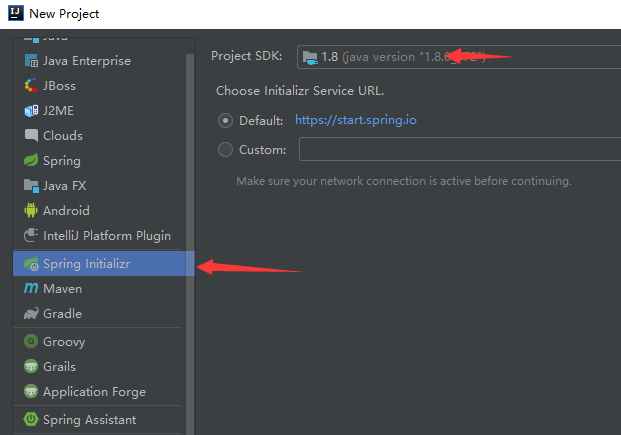
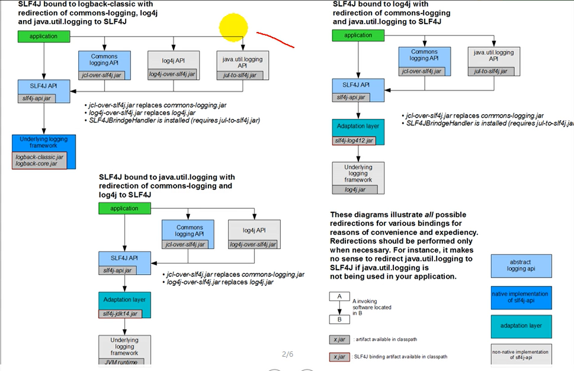

[TOC]

## spring 入门

### 简介

spring boot简化spring应用的开发，遵循约定大于配置的理念，去繁从简，创建一个独立的、产品级别的应用

优点：

- 快速创建独立运行的spring项目以及主流框架集成
- 使用嵌入式servlet容器，应用无需打成war包
- starters自动依赖与版本控制
- 大量的自动配置，简化开发，也可以修改默认值
- 无需配置xml，无代码生成，开箱即用
- 与云计算天然的集成

总结：

- 简化spring应用开发一个框架
- 整个spring技术栈的一个大整合
- j2ee开发的一站式解决方案

### 微服务

http://martinfowler.com

微服务：一种架构风格，基本思想是一个应该是一组小型服务

单体应用：ALL IN ONE

将所有应用功能独立出来，每一个功能元素最终都是一个可独立替换和独立升级的软件单元


### 环境准备

- jdk1.8+
- maven3.3+
- Intelij IDEA 2017+
- SpringBoot 1.5.9 RELEASE

####  maven配置

配置settings.xml

```xml
<profiles>
    <profile>
        <id>jdk-1.8</id>
        <activation>
            <activeByDefault>true</activeByDefault>
            <jdk>1.8</jdk>
        </activation>
        <properties>
            <maven.compiler.source></maven.compiler.source>
            <maven.compiler.target></maven.compiler.target>
            <maven.compiler.compilerVersion></maven.compiler.compilerVersion>
        </properties>
    </profile>
</profiles>
```

#### idea配置

在idea的settings中配置maven的访问路径和本地仓库的路径

### Spring Boot HelloWord应用

#### 使用maven创建一个spring boot项目

#### 导入依赖项

```xml
<parent>
    <groupId>org.springframework.boot</groupId>
    <artifactId>spring-boot-starter-parent</artifactId>
    <version>2.1.7.RELEASE</version>
    <relativePath/> <!-- lookup parent from repository -->
</parent>
<dependencies>
    <dependency>
        <groupId>org.springframework.boot</groupId>
        <artifactId>spring-boot-starter-web</artifactId>
    </dependency>
</dependencies>
```

#### 编写一个主程序

```java
package cn.edu.chd.springbootdemo;
import org.springframework.boot.SpringApplication;
import org.springframework.boot.autoconfigure.SpringBootApplication;

@SpringBootApplication//来标注一个主程序类，说明这是一个spring boot应用
public class SpringBootDemoApplication {
    public static void main(String[] args) {
        //spring应用的启动
        SpringApplication.run(SpringBootDemoApplication.class, args);
    }
}
```

#### 编写一个业务逻辑

```java
 @Controller
public class HelloController{
    @RequestMapping("/hello")
    @ResponseBody
    public String hello(){
        return "hello world";
    }
}
```

#### 运行主程序测试

#### 简化部署

导入插件，将应用打包成一个可执行jar包，直接使用java -jar，命令完成项目的部署，然后在浏览器上进行测试

```xml
<build>
    <plugins>
        <plugin>
            <groupId>org.springframework.boot</groupId>
            <artifactId>spring-boot-maven-plugin</artifactId>
        </plugin>
    </plugins>
</build>
```


### Hello World应用的深究

#### pom文件

##### 父项目

```xml
<!-- pom.xml -->
<parent>
    <groupId>org.springframework.boot</groupId>
    <artifactId>spring-boot-starter-parent</artifactId>
    <version>2.1.7.RELEASE</version>
    <relativePath/> <!-- lookup parent from repository -->
</parent>

<!-- 它的父项目
	spring-boot-starter-parent-2.1.7.RELEASE.pom
-->
<parent>
    <groupId>org.springframework.boot</groupId>
    <artifactId>spring-boot-dependencies</artifactId>
    <version>2.1.7.RELEASE</version>
    <relativePath>../../spring-boot-dependencies</relativePath>
</parent>

<!-- 父项目的父项目
    spring-boot-dependencies-2.1.7.RELEASE.pom
-->
<properties>
	<!-- 很多spring项目中用到的依赖项 -->
    ...
</properties>
```

Spring Boot的版本仲裁中心：以后导入默认依赖是不需要写版本的，但没有出现在仲裁中心的依赖包还是需要配置依赖项的版本号

##### 启动器

```xml
<dependencies>
    <dependency>
        <groupId>org.springframework.boot</groupId>
        <artifactId>spring-boot-starter-web</artifactId>
    </dependency>
</dependencies>
```

**spring-boot-starter-web：**

- spring-boot-starter：spring-boot场景启动器，帮我们导入了web模块正常运行所依赖的组件

spring boot 将所有的功能场景都抽取出来，做成一个个的starters（启动器），只需要在项目里面引入这些starter，相关场景的starter就会导入进来。要用什么功能就导入什么场景的启动器。详情请参考spring boot文档

#### 主容器类，主入口类

```java
/**
 *  @SpringBootApplication  来标注一个主程序类，说明这是一个Spring Boot应用
 */

@SpringBootApplication//来标注一个主程序类，说明这是一个spring boot应用
public class SpringBootDemoApplication {
    public static void main(String[] args) {
        //spring应用的启动
        SpringApplication.run(SpringBootDemoApplication.class, args);
    }
}
```

@SpringBootApplication: SpringBoot应用标注在某个类上说明这个类是Spring Boot类的主配置类，Spring Boot就应该运行这个类的main方法来启动Spring Boot应用

```java
@Target({ElementType.TYPE})
@Retention(RetentionPolicy.RUNTIME)
@Documented
@Inherited
@SpringBootConfiguration
@EnableAutoConfiguration
@ComponentScan(
    excludeFilters = {@Filter(
    type = FilterType.CUSTOM,
    classes = {TypeExcludeFilter.class}
), @Filter(
    type = FilterType.CUSTOM,
    classes = {AutoConfigurationExcludeFilter.class}
)}
)
public @interface SpringBootApplication {
	...
}
```

@SpringBootConfiguration：springboot的配置类，标注在某个类上表示这是一个spring boot的配置类

- @Configuration：配置类上标注这个注解，配置类是用来取代配置文件的，配置类也是容器中的一个组件@Component

@EnableAutoConfiguration：开启自动配置功能，以前需要配置的东西现在由spring boot帮我们配置，这样自动配置才能够生效

- @AutoConfigurationPackage：自动配置包。

  @Import(AutoConfigurationPackages.Register.class)，Spring的底层注解@Import用于给容器中导入一个组件，导入的组件AutoConfigurationPackages.Register.class。详情请了解spring的注解版。

  **这个注解的根本目的就是将主配置类所在包及其子包中所有的组件扫描到Spring容器中**

- @Import(EnableAutoConfigurationImportSelector.class)

  - 给容器中导入组件？

  - EnableAutoConfigurationImportSelector：导入哪些组件的选择器

  - 将所有需要的组件以全类名的形式返回，这些组件就会被添加到容器中

  - 会给容器中导入非常多的自动配置类（xxxConfiguration)，就是给容器中导入这个场景所需要的所有组件，并进行配置

    

    有了自动配置类，免去了我们手动编写配置注入功能组件等的工作

    SpringFactoriesLoader.loadFactoryNames(EnableConfiguration.class, classLoader)，**Spring Boot启动的时候从类路径下的META-INF/spring.factories中获取EnableAutoConfiguration指定的值，自动配置类就生效，帮我们进行自动配置工作。**以前在进行ssm整合时，需要在配置文件中配置一大堆东西，现在自动配置类都帮我们完成了。

    J2EE的整体整合解决方案和自动配置都在

    D:\local_repository\org\springframework\boot\spring-boot-autoconfigure\2.1.7.RELEASE\spring-boot-autoconfigure-2.1.7.RELEASE.jar

### 使用Spring Boot的项目创建向导快速创建Spring Boot项目

IDE都支持使用Spring的项目创建向导快速创建一个Spring Boot项目：

选择Spring Initializer创建项目



填写项目元数据


选择需要的场景，向导会自动完成Spring Boot项目的创建


默认生成的Spring Boot项目：

- 主程序已经生成，只需要编写业务逻辑就可以了

- resources文件夹中的目录结构

  - static：保存所有的静态资源，js、cs、images

  - templates：保存所有的模板页面；Spring Boot默认使用嵌入式的Tomcat，默认不支持JSP页面；可以使用模板引擎（freemarker、thymeleaf）

  - application.properties：Spring Boot应用的配置文件，可以修改一些默认配置

    ```properties
    server.port=8081
    ```

## Spring Boot的配置

### 配置文件

- spring boot使用一个全局的配置文件，配置文件的名称是固定的

  - application.properties
  - application.yml

- 配置文件的作用：修改Spring Boot自动配置的默认值；Spring Boot在底层都给我们配置好了；

- YAML（YAML Ain‘t Markup Language）

  YAML A Markup Language：是一个标记语言

  YAML isn’t Markup Language：不是一个标记语言
  - 标记语言：以前的配置文件，大多使用xml文件；YAML以数据为中心

  YML配置示例

  ```yml
  server:
  	port: 8081
  ```

  XML配置示例：

  ```xml
  <server>
  	<port>8081</port>
  </server>
  ```

### YML语法

#### 基本语法

<键名>:<空格><值>  表示一个键值对（空格必须有）

以**空格**的缩进来控制层级关系；只要是左对齐的一列数据都是同一层级的

```yml
server:
    port: 8081
    path: /hello
```

属性和值也是大小写敏感的；

#### 值的写法

- 字面值：普通的量（数字、字符串、布尔）

  k: v    字面值直接来写

  字符串默认不同加上单引号或双引号

  双引号：不会转义字符串里面的特殊字符，特殊字符会表示本身的意思

  ```yml
  name: "zhangsan\nlist" # 输出zhangsan换行list
  ```

  单引号：会转义特殊字符，特殊字符最终只是一个普通的字符串数据

  ```yml
  name: 'zhangsan\nlist' # 相当于"zhangsan\\nlist"输出zhangsan\nlist
  ```

- 对象（属性和值）（键值对）

  k: v    对象还是key-value的方式

  ```yml
  friends:
  	lastName: zhangsan
  	age: 20
  
  # 行内写法
  friends: {lastname: zhangsan, age: 18}
  ```

- 数组（普通数组、list集合、set集合）

  -<空格>值    表示数组中的每一个元素

  ```yml
  pets:
  	- cat
  	- dog
  	- pig
  
  # 行内写法
  pets: {cat, dog, pig}
  ```

### 配置文件值的注入

#### 配置文件值得获取

yml配置文件

```yml
person:
# -连接符风格会自动转换为驼峰命名风格
  last-name: zhangsan
  age: 18
  boss: false
  birth: 2019/08/01
  maps:
    k1: v1
    k2: 12
  list:
    - lisi
    - zhaoliu
  dog:
    name: xiaogou
    age: 2
```

properties配置文件

配置文件中文乱码文字的解决：在settings里修改fileEncoding，将properties文件编码改为UTF-8并勾选在运行前转换为ascii

```properties
person.last-name=zhangsan
person.age=18
person.boss=false
person.birth=2019/08/01
person.maps.k1=v1
person.maps.k2=12
person.list=lisi,zhaoliu
person.dog.name=xiaogou
person.age=2
```

组件

```java
//将配置文件中配置的每一个值映射到组件中
//告诉Spring Boot将本类中的所有属性和配置文件配置的属性值进行绑定
@ConfigurationProperties(prefix = "person")
//只有这个组件是容器中的组件，才能使用这个功能
@Component
public class Person {
    private String lastName;
    private Integer age;
    private Boolean boss;
    private Date birth;

    private Map<String, Object> maps;
    private List<Object> list;
    private Dog dog;

    //省略get/set方法和toString方法
}

```

导入配置文件的处理器的依赖项


```xml
<!-- 导入配置文件处理器 -->
<dependency>
    <groupId>org.springframework.boot</groupId>
    <artifactId>spring-boot-configuration-processor</artifactId>
    <optional>true</optional>
</dependency>
```

#### 配置文件注入值的校验

```java
@ConfigurationProperties(prefix = "person")
//JSR303校验
@Validated
@Component
public class Person {
    //必须是电子邮件格式
    @Email
    private String lastName;
    private Integer age;
    private Boolean boss;
    private Date birth;

    private Map<String, Object> maps;
    private List<Object> list;
    private Dog dog;
	//省略get/set方法和toString方法
}
```


#### @Value获取值与@CpnfigurationProperties获取值的比较

@Value获取值

```java
@Component
public class Person {
    @Value("${person.last-name}")//使用${}获取值
    private String lastName;
    @Value("#{11*2}")//使用#{}计算值
    private Integer age;
    @Value("true")//字面值
    private Boolean boss;
    private Date birth;

    private Map<String, Object> maps;
    private List<Object> list;
    private Dog dog;

    //省略get/set方法和toString方法
}

```

比较


|                | @ConfigurationProperties | @Value     |
| -------------- | ------------------------ | ---------- |
| 功能           | 批量注入配置文件的属性   | 一个个指定 |
| 松散绑定       | 支持                     | 不支持     |
| SpEL表达式语言 | 不支持                   | 支持       |
| JSR303数据校验 | 支持                     | 不支持     |
| 复杂类型注解   | 支持                     | 不支持     |

如果说只是在某个业务逻辑中用一下某个值，就可以使用@Value；如果说，我们专门编写了一个Javabean来和配置文件进行映射，我们就直接使用@ConfigurationProperties

#### @PropertySource和@ImportResource

@PropertySource：加载指定的配置文件。@ConfigurationProperties默认是在全局配置文件中配置属性值的，如果全部写在里面，那么配置文件就会比较庞大。

```java
@PropertySource(value="classpath:person.properties")
```

@ImportResource：导入Spring的配置文件，让配置文件里面的内容生效。

```xml
<?xml version="1.0" encoding="UTF-8"?>
<beans xmlns="http://www.springframework.org/schema/beans"
       xmlns:xsi="http://www.w3.org/2001/XMLSchema-instance"
       xsi:schemaLocation="http://www.springframework.org/schema/beans http://www.springframework.org/schema/beans/spring-beans.xsd">
	<bean id="helloService" class=""
</beans>
```

Spring Boot里面没有Spring的配置文件，我们自己编写的配置文件也不识别想让自己编写的Spring配置文件生效，加载进来，就要在主启动类上添加@ImportResource注解

```java
@ImportResource(value="classpath:helloServiceBean.xml")
```

Spring Boot推荐给容器中添加组件的方式是采用配置类，不再采用配置文件的方式，而是采用全注解的方式。使用@Configuration注解标记一个注解类，使用@Bean标签向Spring容器中添加组件

```java
//指明当前类是一个Spring的配置类，用于替代之前的Spring配置文件
@Configuration
public class AppConfiguration {

    //将方法的返回值添加到Spring容器中，组件的默认名就是方法名
    @Bean
    public HelloService helloService(){
        return new HelloService();
    }
}
```

### 配置文件的占位符

```properties
# 随机数
# ${random.value} ${random.int} ${random.long}
# ${radom.int(10)} ${random.int[1024,65535]}
# 取随机数uuid
person.last-name=zhangsan${random.uuid}
# 取整数随机数
person.age=${random.int}
person.boss=true
person.birth=1998/04/04
person.list=1,2,3,4
person.maps.k1=v1
person.maps.k2=v2
# 取其他属性值
person.dog.name=${person.last-name}-dog
# 设置默认值
person.dog.age=${person.hello:80}
```

### Profile

#### 多profile文件方式：

在主配置文件编写的时候，文件名可以是application-\<profile\>.properties/yml，例如application-dev.properties、application-prod.properties

默认使用application.properties的配置

#### yml支持多文档方式

```yml
server:
  port: 8081
spring:
  profiles:
    active: dev
---
server:
  port: 8082
spring:
  profiles: dev # 指定属于哪个环境
---
server:
  port: 8083
spring:
  profiles: prod # 指定属于哪个环境
```


#### 激活指定profile

- 在主配置文件中指定spring.profiles.active=dev

- 命令行方式激活：

  --spring.profiles.active=dev

- 虚拟机参数

  -Dspring.profiles.active=dev

### 配置文件的位置

spring boot启动会扫描以下位置的application.properties/yml作为spring boot的默认配置文件

- file:./config/
- file:./
- classpath:/config/
- classpath:/

- 以上按照优先级从高到低的顺序排列，高优先级配置会**覆盖**低优先级的配置，**互补配置**

  > server.context-path已经过时了，修改为server.servlet.context-path

- 也可以通过配置spring.config.location来改变默认配置候来指定配置文件的新位置；指定配置文件和默认加载的这些配置文件共同起作用形成互补配置。**（springboot2中location是代替而不是附加，如果要附加则使用additional-location）

  ```cmd
  java -jar xxx.jar --spring.config.location=classpath:application.properties,file:d:/application.properties
  ```

### 外部配置加载顺序（优先级从高到低）

所有支持的配置加载来源参考官方文档


- **命令行参数：java -jar spring-boot-demo-0.0.1-SNAPSHOT.jar --server.port=8082**

- 来自java:comp/env的JNDI属性
- java系统属性：System.getProperty()
- 操作系统环境变量
- RandomValuePropertySource配置的random.*属性

**（优先加载带profile，由jar包外向jar包内）**

- **jar包外部的application-{profile}.properties或application.yml（带spring.profile)配置文件**
- **jar包内部的application-{profile}.properties或application.yml（带spring.profile)配置文件**
- **jar包外部的application.properties或application.yml（不带spring.profile)配置文件**
- **jar包内部的application.properties或application.yml（不带spring.profile)配置文件**
- @Configuration注解类上的@PropertySource
- 通过SpringApplication.setDefaultProperties指定的默认属性

### 自动配置的原理

#### 自动配置原理

参照文档的 Appendix A. Common application properties

- spring boot启动的时候加载主配置类，启动了自动配置功能@EnableAutoConfoguration

- @EnableAutoConfiguration的作用：

- 利用EnableAutoConfigurationImportSelector选择器完成组件的导入，可以查看selectImports方法中的内容

  ```java
  @Override
  public String[] selectImports(AnnotationMetadata annotationMetadata) {
      if (!isEnabled(annotationMetadata)) {
          return NO_IMPORTS;
      }
      AutoConfigurationMetadata autoConfigurationMetadata = AutoConfigurationMetadataLoader
          .loadMetadata(this.beanClassLoader);
      AutoConfigurationEntry autoConfigurationEntry = getAutoConfigurationEntry(autoConfigurationMetadata,
                                                                                annotationMetadata);
      return StringUtils.toStringArray(autoConfigurationEntry.getConfigurations());
  }
  
  //在这个getAutoConfigurationEntry方法上点击goto又进入下面的方法
  protected AutoConfigurationEntry getAutoConfigurationEntry(AutoConfigurationMetadata autoConfigurationMetadata,
                                                             AnnotationMetadata annotationMetadata) {
      if (!isEnabled(annotationMetadata)) {
          return EMPTY_ENTRY;
      }
      AnnotationAttributes attributes = getAttributes(annotationMetadata);
      //注意下面这一条方法，这个方法获得了候选的配置
      List<String> configurations = getCandidateConfigurations(annotationMetadata, attributes);
      configurations = removeDuplicates(configurations);
      Set<String> exclusions = getExclusions(annotationMetadata, attributes);
      checkExcludedClasses(configurations, exclusions);
      configurations.removeAll(exclusions);
      configurations = filter(configurations, autoConfigurationMetadata);
      fireAutoConfigurationImportEvents(configurations, exclusions);
      return new AutoConfigurationEntry(configurations, exclusions);
  }
  
  ```

- List\<String\> configurations = getCandidateConfigurations(annotationMetadata, attributes);

  候选的配置

  - ```java
    SpringFactoriesLoader.loadFactoryNames()
    ```

    扫描所有jar包类路径下的META-INF/spring.factories文件，把扫描到这些文件的内容包装成properties对象，从properties中获取到EnableAutoConfiguration.class类名对应的值，然后把他们添加在容器中。

    **总之，就是将spring.factories里面配置的所有EnableAutoConfiguration的值加入到了容器中**

    每一个这样的xxxAutoConfiguration类都是容器中的一个组件，都加入到容器中，用他们来做自动配置


- 每一个自动配置类进行自动配置功能

  - 以HttpEncodingAutoConfiguration类为例解释自动配置原理

  ```java
  //表示这是一个配置类，类似于之前的配置文件，可以用来添加组件
  @Configuration
  //启动ConfiurationProperties功能，将配置文件中的值和HttpEncodingProperties绑定起来
  @EnableConfigurationProperties(HttpEncodingProperties.class)
  //Spring底层@Conditional注解，如果满足指定的条件，整个配置类里面的配置就会生效
  //判断当前应用是否是web应用，如果是配置生效
  @ConditionalOnWebApplication(type = ConditionalOnWebApplication.Type.SERVLET)
  //判断当前项目有没有这个类，CharacterEncodingFilter这是解决乱码问题的过滤器
  @ConditionalOnClass(CharacterEncodingFilter.class)
  //判断配置文件中是否存在属性spring.http.encoding的值为enabled，matchIfMissing表这个属性如果不存在也判断成功
  @ConditionalOnProperty(prefix = "spring.http.encoding", value = "enabled", matchIfMissing = true)
  public class HttpEncodingAutoConfiguration {
      //...
      @Bean
      //判断当前Spring容器中是否含有characterEncodingFilter这个bean，如果没有这个bean则该自动配置类生效
  	@ConditionalOnMissingBean
  	public CharacterEncodingFilter characterEncodingFilter() {
  		CharacterEncodingFilter filter = new OrderedCharacterEncodingFilter();
  		filter.setEncoding(this.properties.getCharset().name());
  		filter.setForceRequestEncoding(this.properties.shouldForce(Type.REQUEST));
  		filter.setForceResponseEncoding(this.properties.shouldForce(Type.RESPONSE));
  		return filter;
  	}
      //...
  }
  
  ```

  根据当前不同条件判断配置类是否生效，一旦生效就会给spring添加组件，这些组件的属性都是通过Properties配置类获得的。

  - 所有配置文件中能配置的属性都是在xxxProperties类配置的，配置文件能配置什么就可以参考某个功能对应的属性类

  ```java
  //从配置文件中获得指定的值和bean属性进行绑定
  @ConfigurationProperties(prefix = "spring.http")
  public class HttpProperties {
  	private boolean logRequestDetails;
  	private final Encoding encoding = new Encoding();
  	public boolean isLogRequestDetails() {
  		return this.logRequestDetails;
  	}
  	public void setLogRequestDetails(boolean logRequestDetails) {
  		this.logRequestDetails = logRequestDetails;
  	}
  	public Encoding getEncoding() {
  		return this.encoding;
  	}
  	public static class Encoding {
  		public static final Charset DEFAULT_CHARSET = StandardCharsets.UTF_8;
  		private Charset charset = DEFAULT_CHARSET;
  		private Boolean force;
  		private Boolean forceRequest;
  		private Boolean forceResponse;
  		private Map<Locale, Charset> mapping;
  		//省略get/set方法
  		public boolean shouldForce(Type type) {
  			Boolean force = (type != Type.REQUEST) ? this.forceResponse : this.forceRequest;
  			if (force == null) {
  				force = this.force;
  			}
  			if (force == null) {
  				force = (type == Type.REQUEST);
  			}
  			return force;
  		}
  		public enum Type {
  			REQUEST, RESPONSE
  		}
  
  	}
  
  }
  ```

  我们可以配置的属性都是来源于这个自动配置类的properties类

  ```properties
  spring.http.encoding.enabled=true
  spring.http.encoding.charset=utf-8
  spring.http.encoding.force=true
  ```

- **总结：springboot启动会加载大量自动配置类；查看有无springboot默认写好的自动配置类；查看自动配置类中到底配置了哪些组件，只要要用的组件有就不需要再来配置了；给容器中自动配置类添加组建的时候，会从properties类中获取某些属性，我们就可以在配置文件中制定这些属性的值；**

xxxxAutoConfiguration：自动配置类，给容器中添加组件

xxxxProperties：封装配置文件中相关属性

#### 细节

- @Conditional派生注解（Spring注解版原生@Conditional作用）

  作用：只用@Conditional指定的条件成立，才向容器中添加组件，配置类才会生效

  | @Conditional扩展注解            | 作用（判断是否满足当前指定条件                 |
  | ------------------------------- | ---------------------------------------------- |
  | @ConditionalOnJava              | 系统的Java版本是否满足要求                     |
  | @ConditionalOnBean              | 容器中存在指定Bean                             |
  | @ConditionalOnMissingBean       | 容器中不存在指定Bean                           |
  | @ConditionalOnExpression        | 满足SpEL表达式指定                             |
  | @ConditionalOnClass             | 系统中有指定类                                 |
  | @ConditionalOnMissingClass      | 系统中没有指定类                               |
  | @ConditionalOnSingleCandidate   | 容器中只有一个指定bean，或者这个bean是首选bean |
  | @ConditionalOnProperty          | 系统中指定的属性是否有指定的值                 |
  | @ConditionalOnResource          | 类路径下是否存在指定资源文件                   |
  | @ConditionalOnWebApplication    | 当前是Web环境                                  |
  | @ConditionalOnNotWebApplication | 当前不是Web环境                                |
  | @ConditionalOnJndi              | JNDI存在指定项                                 |

- 自动配置类必须在一定条件下才能生效：

  怎么知道哪些自动配置类生效了？

  在配置文件中配置debug=true，开启SpringBoot的debug，让控制台打印自动配置报告，这样就能方便地知道哪些自动配置类生效了。

## Spring Boot与日志

### 日志框架

市面上的日志框架：JUL、JCL、JBoss-logging、logback、log4j、log4j2、slf4j

| 日志门面（日志的抽象层）                                     | 日志实现                                      |
| ------------------------------------------------------------ | --------------------------------------------- |
| JCL（jakarta Commons Logging）  SLF4j（Simple Logging Facade for java）  jboss-logging | Log4j JUL（java.util.logging)  Log4j2 Logback |

左边选一个门面（抽象层），右边选一个实现：

日志门面：SLF4j

日志实现：Logback

Spring Boot：底层框架是Spring，Spring框架默认使用JCL；Spring Boot选用SLF4j和logback

### SLF4j使用

#### 如何在系统中使用SLF4j

日志记录方法的调用，不应该直接调用实现类，而是调用日志抽象层里面的方法

导入slf4j的jar包和logback的实现jar包

```java
import org.slf4j.Logger;
import org.slf4j.LoggerFactory;

public class HelloWorld{
    public static void main(String[] args){
        Logger logger = LoggerFactory.getLogger(HelloWorld.class);
        logger.info("hello world");
    }
}
```


每一个日志的实现框架都有自己的配置文件，使用slf4j以后，配置文件还是做成日志实现框架的配置文件。

#### 遗留问题

a（slf4j+logback）：Spring（commons-logging）、Hibernate（jboss-logging）、MyBatis、xxxx

统一日志记录，即使是别的框架和我一起统一使用slf4j进行输出？



如何让系统中所有的日志都统一到slf4j：

- 将系统中其他日志框架排除出去
- 用中间包来替换原有的日志框架
- 我们导入slf4j其他的实现

### Spring Boot日志实现

在idea中右键点击show diagram查看依赖视图

```xml
<dependency>
	<groupId>org.springframework.boot</groupId>
    <artifactId>spring-boot-starter</artifactId>
</dependency>
```

Spring Boot使用它来做日志功能：

```xml
<dependency>
	<groupId>org.springframework.boot</groupId>
    <artifactId>spring-boot-starter-logging</artifactId>
</dependency>
```

底层依赖关系


总结：

- Spring Boot底层也是使用slf4j+logback的方式进行日志记录的

- Spring Boot也把其他的日志都替换成了slf4j
- 中间替换包

- 如果我们要引入其他框架？一定要把这个框架的默认日志依赖移除掉。

  Spring框架用的是commons-logging

  ```xml
  <dependency>
  	<groupId>org.springframework</groupId>
      <artifactId>spring-core</artifactId>
      <exclusions>
      	<exclusion>
          	<groupId>commons-logging</groupId>
              <artifactId>commons-logging</artifactId>
          </exclusion>
      </exclusions>
  </dependency>
  ```

  SpringBoot能自动识别所有的日志，而且底层使用slf4j-logback的方式记录日志，引入其他框架的时候，只需要把这个框架依赖的日志框架排除掉；

### 日志使用

#### 默认配置

SpringBoot默认已经帮我们配置好了日志：

```java

@RunWith(SpringRunner.class)
@SpringBootTest
public class SpringBootDemoApplicationTests {
    //日志记录器
    Logger logger = LoggerFactory.getLogger(getClass());

    @Test
    public void contextLoads() {
        //日志的级别
        //由低到高：trace<debug<info<warn<error
        //可以调整日志输出的级别，日志就会在本级别或高级别生效
        logger.trace("trace............");
        logger.debug("debug............");
        //SpringBoot默认输出的是info级别
        logger.info("info..............");
        logger.warn("warn..............");
        logger.error("error............");
    }

}

```

Spring Boot修改日志的默认配置

```properties
# 配置日志级别
logging.level.cn.edu.chd.springbootdemo=trace
# 生成日志文件
logging.file=springboot.log
# 指定日志生成目录，默认文件为spring.log
logging.path=d:/
# 在控制台输出的日志格式
logging.pattern.console=%d{yyyy-MM-dd HH:mm:ss.SSS} {%thread} %-5level %logger{50} - %msg%n
# 文件中日志输出的格式
logging.pattern.file=%d{yyyy-MM-dd HH:mm:ss.SSS} {%thread} %-5level %logger{50} - %msg%n

# 日志输出格式
# %d表示日期和时间
# %thread表示线程名
# %-5level表示级别，并且左对齐、域宽5
# %logger{50}表示logger名字最长50个字符，否则按照句点分割
# %n是换行符
```

查看springboot日志的默认配置：org.springframework.boot.logging

#### 指定配置

给类路径下放上每个日志框架自己的配置文件即可：SpringBoot就不使用默认的配置

| Logging System          | Customization                                                |
| ----------------------- | ------------------------------------------------------------ |
| Logback                 | `logback-spring.xml`, `logback-spring.groovy`, `logback.xml`, or `logback.groovy` |
| Log4j2                  | `log4j2-spring.xml` or `log4j2.xml`                          |
| JDK (Java Util Logging) | `logging.properties`                                         |

logback.xml：直接就被日志框架识别了

logback-spring.xml：日志框架就不直接加载，由spring boot加载就能够使用springProfile标签

```xml
<springProfile name="staging">
	<!-- configuration to be enabled when the "staging" profile is active -->
    <!-- 可以指定某段配置只在某个环境下生效 -->
    <pattern>%d{yyyy-MM-dd HH:mm:ss.SSS} {%thread} %-5level %logger{50} - %msg%n</pattern>
</springProfile>
```

### 切换日志框架

示例：将logback切换为log4j，仅仅示例不推荐使用log4j替换logback

> 小技巧：在依赖视图界面可以完成依赖的排除

1、排除不需要使用的logback-classic

2、排除log4j-over-slf4j

3、导入slf4j-log4j12依赖项

```xml
<dependency>
	<groupId>org.slf4j</groupId>
    <artifactId>slf4j-log4j12</artifactId>
</dependency>
```

示例二：将spring-boot-starter-logging替换为spring-boot-starter-log4j2

1、排除spring-boot-starter-logging

2、添加spring-boot-starter-log4j2依赖项

```xml
<dependency>
	<groupId>org.springframework.boot</groupId>
    <artifactId>spring-boot-starter-log4j2</artifactId>
</dependency>
```

## Spring Boot Web开发

### 使用spring boot

1. 创建spring boot应用，选中我们需要的场景
2. Spring Boot已经默认将这些场景配置完成了，只需要在配置文件中制定少量配置就能运行起来
3. 自己编写业务代码

自动配置原理？

这个场景Spring Boot帮我们配置了什么？能不能修改？能不能扩展？

xxxxAutoConfiguration帮我们给容器中自动配置组件，xxxxProperties封装类帮我们封装配置文件的内容

### spring boot对静态资源的映射规则

可以设置和静态资源有关的参数，缓存时间等

```java
@ConfigurationProperties(prefix = "spring.resources", ignoreUnknownFields = false)
public class ResourceProperties {
    private static final String[] CLASSPATH_RESOURCE_LOCATIONS = { 
        "classpath:/META-INF/resources/",                               
        "classpath:/resources/", 
        "classpath:/static/", 
        "classpath:/public/" };
	//...
}
```


```java
@Override
public void addResourceHandlers(ResourceHandlerRegistry registry) {
    if (!this.resourceProperties.isAddMappings()) {
        logger.debug("Default resource handling disabled");
        return;
    }
    Duration cachePeriod = this.resourceProperties.getCache().getPeriod();
    CacheControl cacheControl = this.resourceProperties.getCache().getCachecontrol().toHttpCacheControl();
    if (!registry.hasMappingForPattern("/webjars/**")) {
        customizeResourceHandlerRegistration(registry.addResourceHandler("/webjars/**")
                                             .addResourceLocations("classpath:/META-INF/resources/webjars/")
                                             .setCachePeriod(getSeconds(cachePeriod)).setCacheControl(cacheControl));
    }
    String staticPathPattern = this.mvcProperties.getStaticPathPattern();
    if (!registry.hasMappingForPattern(staticPathPattern)) {
        customizeResourceHandlerRegistration(registry.addResourceHandler(staticPathPattern)
                                             .addResourceLocations(getResourceLocations(this.resourceProperties.getStaticLocations()))
                                             .setCachePeriod(getSeconds(cachePeriod)).setCacheControl(cacheControl));
    }
}

//配置欢迎页页面
@Bean
public WelcomePageHandlerMapping welcomePageHandlerMapping(ApplicationContext applicationContext) {
    WelcomePageHandlerMapping welcomePageHandlerMapping = new WelcomePageHandlerMapping(
        new TemplateAvailabilityProviders(applicationContext), applicationContext, getWelcomePage(),
        this.mvcProperties.getStaticPathPattern());
    welcomePageHandlerMapping.setInterceptors(getInterceptors());
    return welcomePageHandlerMapping;
}
```

- ==所有/webjars/**，都去classpath:/META-INF/resources/webjars/找资源==

webjars：以jar包的形式引入静态资源，https://www.webjars.org/


localhost:8080/webjars/abc

```xml
<!-- 引入jquery-webjar -->
<!-- 在访问的时候只需要写webjars下面资源的名称即可 -->
<dependency>
    <groupId>org.webjars</groupId>
    <artifactId>jquery</artifactId>
    <version>3.4.1</version>
</dependency>
```

- =="/**"访问当前项目的任何资源，==

```java
"classpath:/META-INF/resources/",
"classpath:/resources/",
"classpath:/static/",
"classpath:/public/",
"/"//当前项目的根路径
```

相当于访问 localhost:8080/abc

- ==欢迎页；静态资源文件下的所有的index.html页面；被“/**”映射==

  localhost:8080/

- ==所有的**/favicon.icon都是在静态资源文件下找的；==

```properties
# 修改静态资源的路径
spring.resource.static-locations=classpath:/hello/,classpath:/world/
```

### 模板引擎


JSP、Velocity、Freemarker、Thymeleaf

Spring Boot推荐使用Thymeleaf，语法更简单，功能更强大

#### 引入thymeleaf

```xml
<properties>
    ...
    <thymeleaf.version>3.0.11.RELEASE</thymeleaf.version>
    <!-- 布局功能的支持程序 thymeleaf3主程序 layout2版本 -->
    <!-- thymeleaf-layout layout1 -->
    <thymeleaf-layout-dialect.version>2.3.0</thymeleaf-layout-dialect.version>
</properties>

<!-- thymeleaf依赖项 -->
<dependency>
    <groupId>org.springframework.boot</groupId>
    <artifactId>spring-boot-starter-thymeleaf</artifactId>
</dependency>
```

#### Thymeleaf使用及语法

```java
@ConfigurationProperties(prefix = "spring.thymeleaf")
public class ThymeleafProperties {
	private static final Charset DEFAULT_ENCODING = StandardCharsets.UTF_8;
	public static final String DEFAULT_PREFIX = "classpath:/templates/";
	public static final String DEFAULT_SUFFIX = ".html";
    //只要把html页面放在classpath:/templates/,thymeleaf就能自动渲染
}
```

使用

1. 导入thymeleaf的名称空间

   ```html
   <html lang="en" xmlns:th="http://www.thymeleaf.org"/>
   ```

2. 使用thymeleaf语法

   ```html
   <!DOCTYPE html>
   <html lang="en" xmlns:th="http://www.thymeleaf.org">
   <head>
       ...
   </head>
   <body>
       <h1>success</h1>
       <!-- th:text 将div里面的文本内容设置为 -->
       <div th:text="${hello}">
           这是模板解析页面
       </div>
   </body>
   </html>
   ```

3. 语法规则

   th:text    改变当前元素里面的文本内容

   th:任意html属性    来替换原生属性值

   

   ```properties
   Simple expressions:
   	# 获取变量值，OGNL
   	# 1获取对象的属性、调用方法
   	# 2使用内置的基本对象
   	# #ctx
   	# #vars
   	# #locale
   	# #request
   	# #response
   	# #session
   	# #servletContext
   	# 3内置工具对象
   	# #execInfo : information about the template being processed.
       # #messages : methods for obtaining externalized messages inside variables expressions, in the same way as they would be obtained using #{…} syntax.
       # #uris : methods for escaping parts of URLs/URIs
       # #conversions : methods for executing the configured conversion service (if any).
       # #dates : methods for java.util.Date objects: formatting, component extraction, etc.
       # #calendars : analogous to #dates , but for java.util.Calendar objects.
       # #numbers : methods for formatting numeric objects.
       # #strings : methods for String objects: contains, startsWith, prepending/appending, etc.
       # #objects : methods for objects in general.
       # #bools : methods for boolean evaluation.
       # #arrays : methods for arrays.
       # #lists : methods for lists.
       # #sets : methods for sets.
       # #maps : methods for maps.
       # #aggregates : methods for creating aggregates on arrays or collections.
       # #ids : methods for dealing with id attributes that might be repeated (for example, as a result of an iteration).
       Variable Expressions: ${...}  
       # 配合th:object="${session.user}"使用
       Selection Variable Expressions: *{...}
       # 获取国际化内容
       Message Expressions: #{...}
       # 定义url链接
       Link URL Expressions: @{...}
       # 片段引用
       Fragment Expressions: ~{...}
   Literals
       Text literals: 'one text' , 'Another one!' ,…
       Number literals: 0 , 34 , 3.0 , 12.3 ,…
       Boolean literals: true , false
       Null literal: null
       Literal tokens: one , sometext , main ,…
   Text operations:
       String concatenation: +
       Literal substitutions: |The name is ${name}|
       Arithmetic operations:
       Binary operators: + , - , * , / , %
       Minus sign (unary operator): -
   Boolean operations:
       Binary operators: and , or
       Boolean negation (unary operator): ! , not
       Comparisons and equality:
       Comparators: > , < , >= , <= ( gt , lt , ge , le )
       Equality operators: == , != ( eq , ne )
   Conditional operators:
       If-then: (if) ? (then)
       If-then-else: (if) ? (then) : (else)
       Default: (value) ?: (defaultvalue)
   Special tokens:
       No-Operation: _
   All these features can be combined and nested:
   ```

### SpringMVC的自动配置

#### SpringMVC自动配置

spring boot自动配置好了spring mvc

以下是spring boot对spring mvc的默认：

- Inclusion of `ContentNegotiatingViewResolver` and `BeanNameViewResolver` beans.

  自动配置了视图解析器，视图解析器的作用是根据方法的返回值得到视图对象，试图对象决定渲染方式是转发还是重定向

  定制方法：可以给容器中添加一个视图解析器并加入到Spring容器中

  ```java
  @SpringBootApplication
  public class SpringBootDemo2Application {
  
      public static void main(String[] args) {
          SpringApplication.run(SpringBootDemo2Application.class, args);
      }
  
      @Bean
      public ViewResolver myViewResolver(){
  
          return new MyViewResolver();
      }
  
      private static class MyViewResolver implements ViewResolver{
          @Override
          public View resolveViewName(String s, Locale locale) throws Exception {
              return null;
          }
      }
  }
  ```

  

- Support for serving static resources, including support for WebJars (covered [later in this document](https://docs.spring.io/spring-boot/docs/2.1.7.RELEASE/reference/html/boot-features-developing-web-applications.html#boot-features-spring-mvc-static-content))).

  静态资源文件夹路径

- Automatic registration of `Converter`, `GenericConverter`, and `Formatter` beans.

  转化器：前台向后台传送数据时使用

  格式化器：例如日期的转换

  ```java
  @Bean
  @ConditionalOnProperty(prefix="spring.mvc",name="date-format")
  public Formatter<Date> dateFormatter(){
      return new DateFormatter(this.mvcProperties.getDateProperties());
  }
  ```

  定制格式化器：只需要放入Spring容器中即可

- Support for `HttpMessageConverters` (covered [later in this document](https://docs.spring.io/spring-boot/docs/2.1.7.RELEASE/reference/html/boot-features-developing-web-applications.html#boot-features-spring-mvc-message-converters)).

  HttpMessageConverter：SpringMVC用来转换Http请求和响应的；User-json；

  HttpMessageConverters是从容器中确定的，获取所有的HttpMessageConverter；自己给容器中添加HttpMessageConverter，只需要将自己的组件注册到容器中即可

- Automatic registration of `MessageCodesResolver` (covered [later in this document](https://docs.spring.io/spring-boot/docs/2.1.7.RELEASE/reference/html/boot-features-developing-web-applications.html#boot-features-spring-message-codes)).

  定义错误代码生成规则

- Static `index.html` support.

- Custom `Favicon` support (covered [later in this document](https://docs.spring.io/spring-boot/docs/2.1.7.RELEASE/reference/html/boot-features-developing-web-applications.html#boot-features-spring-mvc-favicon)).

- Automatic use of a `ConfigurableWebBindingInitializer` bean (covered [later in this document](https://docs.spring.io/spring-boot/docs/2.1.7.RELEASE/reference/html/boot-features-developing-web-applications.html#boot-features-spring-mvc-web-binding-initializer)).

  ==我们可以配置一个ConfigurableWebBindingInitializer来替换默认的==

  ```
  如何初始化WebDataBinder;
  请求数据=====Java
  ```

#### 扩展Spring MVC

```xml
<mvc:view-controller path="/hello" view-name="success"/>
<mvc:interceptors>
	<mvc:interceptor>
    	<mvc:interceptor>
        	<mvc:mapping path="/hello"/>
            <bean></bean>
        </mvc:interceptor>
    </mvc:interceptor>
</mvc:interceptors>
```

**==编写一个配置类（@Configuration），是WebMvcConfigurationAdapter类型；不能标注@EnableWebMvc==**

==在Spring 2.0中 WebMvcConfigurationAdapter已经废弃了，如果继承WebMvcConfigurationSupport会导致WebMvcAutoConfiguration失效，变成全面接管web。如果不想全盘接管，可以实现WebMvcConfigurer这个接口==

==If you want to keep Spring Boot MVC features and you want to add additional [MVC configuration](https://docs.spring.io/spring/docs/5.1.9.RELEASE/spring-framework-reference/web.html#mvc) (interceptors, formatters, view controllers, and other features), you can add your own `@Configuration` class of type `WebMvcConfigurer` but **without** `@EnableWebMvc`. If you wish to provide custom instances of `RequestMappingHandlerMapping`, `RequestMappingHandlerAdapter`, or `ExceptionHandlerExceptionResolver`, you can declare a `WebMvcRegistrationsAdapter` instance to provide such components.==

==If you want to take complete control of Spring MVC, you can add your own `@Configuration` annotated with `@EnableWebMvc`.==

原理:

- WebMvcAutoConfiguration是spring mvc的自动配置类

- 在做其他自动配置时会导入@Import(EnableWebMvcConfiguration.class)

  ```java
  @Configuration
  public static class EnableWebMvcConfiguration extends DelegatingWebMvcConfiguration{
      private final WebMvcConfigurerComposite configurers = new WebMvcConfigurerComposite();
      
      //容器中获取所有的WebMvcConfigurer
      @Autowired(required = false)
      public void setConfigurers(List<WebMvcConfigurer> configurers){
          if(!CollectionUtils.isEmpty(configurers)){
              this.configurers.addWebMvcConfigurers(configurers);
              //一个参考实现：将所有的WebMvcConfigurer相关配置都来一起调用
              //@Override
              //public void addViewControllers(ViewControllerRegistry registry){
              //	  for(WebMvcConfigurer delegate:this.delegates){
              //        delegate.addViewControllers(registry);
              //    }
          	//}
          }
      }
  }
  ```

- 容器中所有的WebMvcConfigurer都会一起起作用

- 我们的配置类也会被调用

效果：spring mvc的自动配置和扩展配置都会起作用

### 全面接管spring mvc

禁用自动配置，所有的都来自己配置

在配置类中添加@EnableWebMvc

### 如何修改Spring Boot的默认配置

模式：

1.Spring Boot在用很多组件的时候，先看容器中有没有用户自己配置的（@Bean、@Component）如果有就用用户配置的，如果没有才自动配置；如果有些组件可以有多个（如ViewResolver）将用户配置的和自己默认的组合起来