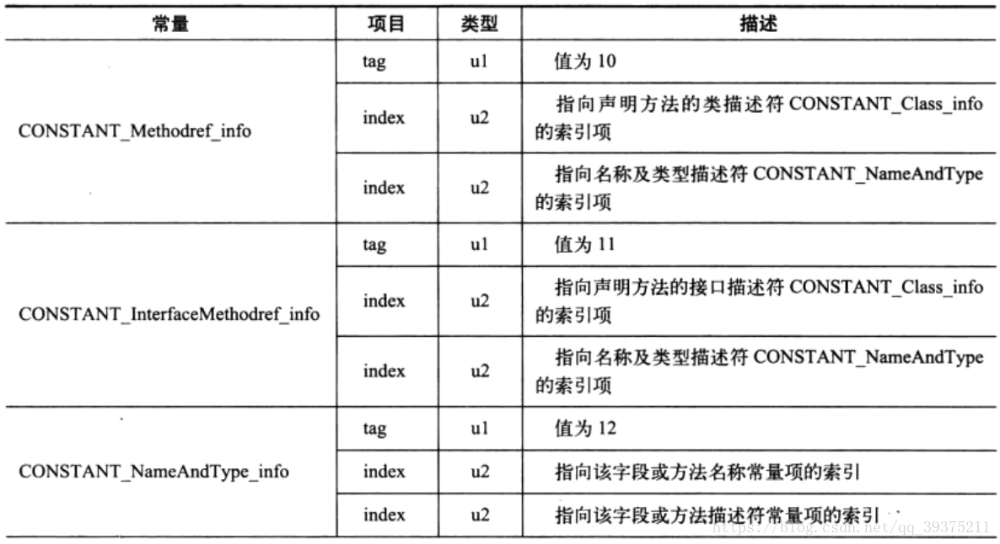

<h1>深入理解JVM</h1>
## JVM课程介绍

- JVM介绍
- HotSpot虚拟机讲解
- 垃圾收集方式讲解
- 垃圾收集算法详解
- 垃圾收集器详解
- 分代垃圾收集机制详解
- 新生代讲解
- 老年代讲解
- G1收集器分析与实例
- 常见且重要虚拟机参数示例
- 栈
- 方法区
- 线程共享内存区
- 根搜索算法
- Serial收集器
- ParNew收集器
- 类加载机制详解
- 类加载的双亲委托机制
- 字节码文件生成与分析
- 魔数
- 常量池与方法表
- 各种指令详解
- 锁详解
- 线程安全
- 偏向锁、自旋锁、轻量级锁
- JIT编译器
- GC日志生成与分析
- 虚拟机监控工具详解
- jConsole方法详解
- 何为逃逸与逃逸分析
- 方法内联
- 虚拟机内存模型详解

练习使用jConsole、jvisualvm、jmap

## 类加载

java代码中，类型的**加载**、**连接**与**初始化**过程都是在程序运行期间完成的。加载、连接与初始化的过程不一定按顺序进行。

- 加载最常见的形式是将class文件加载到内存中。

- 类加载提供了更大的灵活性，增加了更多的可能性。

类加载器：将字节码文件加载到JVM中的执行者。

JVM结束生命周期：执行System.exit()方法；程序正常执行结束；异常或错误导致终止；操作系统错误导致JVM进程终止

类的生命周期：==加载==、==连接==、==初始化==、==使用==、==卸载==

1、加载：查找并加载类的二进制数据。类的加载的最终产品是位于内存中的Class对象，Class对象封装了类在方法区内的数据结构，并且提供了访问方法区内数据结构的接口。

- 类加载器并不需要等到某个类被”首次主动使用“时再加载它
- JVM规范允许类加载器在预料某个类将要被使用时就==预先加载==它，如果在预先加载的过程中遇到了.class文件缺失或存在错误，类加载器必须在==程序主动使用==该类时才报告错误（LinkageError错误）
- 如果这个类一直没有被程序主动使用，那么类加载器就不会报告错误。

2、连接：连接就是将已经读入到内存的类的二进制数据合并到虚拟机的运行时环境中去

- 验证：被加载类的正确性，类的验证主要包括类文件的结构检查、语义检查、字节码检查、二进制兼容性的验证
- 准备：为类的静态变量分配内存，并赋予默认值
- 解析：把类中符号引用转换为直接引用

3、初始化：执行类的初始化语句，为类的静态变量赋予正确的初始值

- 类的初始化时机：只有当程序访问的静态变量或静态方法确实在当前类或当前接口中定义时，才可以认为是对类或接口的主动使用。
- 调用ClassLoader类的loadClass方法加载一个类并不是对类的主动使用，不会导致类的初始化。
- 类加载器：类加载器用来把类加载到JVM中，从JDK1.2开始采用双亲委托机制。除了根加载器，其余加载器都有一个父加载器。当Java程序请求加载器加载某一个类时，加载器会首先委托父加载器进行加载，只有父加载器不能完成加载任务，才由加载器本身加载。

- 类的初始化步骤：一、假如这个类还没有加载和连接，那就先进行加载和连接，那就先进行加载和连接。二、假如类存在直接父类，并且这个父类还没有被初始化，那就先初始化直接父类。三、假如类中存在初始化语句，那就依次执行这些初始化语句。

4、类的实例化和使用：为新的对象==分配内存==，为实例变量赋予==默认值==，为实例变量赋予正确的==初始值==，java编译器为它编译的每一个类都至少生成一个==实例初始化方法==，在java的class文件中，这个实例化方法被称为`<init>`。针对源代码中每一个类的构造方法，java编译器都产生一个`<init>`方法。

5、类的卸载：


Java对类的使用方法分为两种：主动使用、被动使用

所有的java虚拟机的实现必须在每个类或接口被Java程序==首次主动使用==时才初始化它们

主动使用：

- 创建类的实例

- 访问某个类或接口的静态变量，或者对该静态变量赋值。（助记符：getstatic、putstatic）

- 调用类的静态方法。（助记符：invokestatic）

- 反射，如Class.forName方法

  > 使用ClassLoader的loadClass方法能够加载类但并不是对类的主动使用，不会引起类的初始化；而Class的forName方法是对类的主动使用，会引起类的初始化。

- 初始化一个类的子类

  > 初始化一个接口的子接口或实现类时，不要求父接口也完成初始化，注意是针对的初始化而不是加载和连接过程

- JVM启动时被标明为启动类的类

- JDK 1.7开始提供的动态语言支持：java.lang.invoke.MethodHandle实例的解析结果REF_getStatic，REF_putStatic，REF_invokeStatic句柄对应的类没有初始化，则初始化

> 访问一个静态字段，只有直接定义了该字段的类才会被初始化。如果只是通过子类访问超类的静态字段，则子类不会被初始化。但如果是访问子类的静态字段，那么子类被初始化，同时超类也会被初始化
>
> `-XX:+TraceClassLoading`    用于追踪类的加载信息并打印出来
> `-XX:+TraceClassUnloading`    用于追踪类的卸载信息并打印出来
>
> `-XX:+<option>`    表示开启option选项
> `-XX:-<option>`    表示关闭option选项
> `-XX:<option>=<value>`    表示设置option选项的值

被动使用：除了上面七种情况，其它使用java类的方式都被看作是对类的被动使用，都不会导致类的==初始化==

类的加载：将类的.class文件中的二进制数据读入到内存中，将其放在运行时数据区的方法区内，然后在内存中创建一个java.lang.Class对象,用来封装类在方法区内的数据结构。

> 规范并没有说明Class对象究竟放在哪里，Java SE 6放在方法区中，Java SE 7放在堆中，Java SE 8放在元空间中

加载.class文件的方式：

- 从本地系统直接加载
- 通过网络下载.class文件
- 从zip、jar等归档文件中加载.class文件
- 从专有数据库中提取.class文件
- ==将Java源文件动态编译为.class文件==，这种情况出现在动态代理、Web开发等情况中

常量的本质：

- 编译器常量：在编译期就能确定其值的常量。常量会被添加到==调用这个常量的类==的常量池中，本质上，调用常量的类并没有直接引用==定义常量的这个类==，因此并不会触发定义常量的这个类的初始化，甚至可以直接删除定义常量的这个类的字节码文件。
- 运行时常量：在运行期才能确定其值的常量。运行期常量的值不会被放到调用类的常量池中，在程序运行时，会导致主动使用这个常量所在的类，显然会触发初始化。

助记符：

- ldc：表示将int、float或String类型的常量值从常量池中推送到栈顶
- bipush：表示将单字节的常量值推送到栈顶
- sipush：表示将单字（2字节）常量值推送到栈顶
- iconst_0：将常量值0推送至栈顶，类似的用法还包括1、2、3、4、5
- iconst_m1：将常量-1推送至栈顶
- anewarray：表示创建一个引用类型的（如类、接口、数组）数组，并将其引用值压入栈顶
- newarray：表示创建一个原始类型的数组，并将其引用值压入栈顶

初始化顺序：

```java
public class Main{
    public static void main(String[] args) {
        Singleton s = Singleton.getInstance();
        System.out.println("Singleton.counter1 = " + Singleton.counter1);
        System.out.println("Singleton.counter2 = " + Singleton.counter2);
    }
}

class Singleton{
    public static int counter1;//Step1，默认初始化为0
    private static Singleton singleton = new Singleton();//Step2，调用构造方法创建一个实例，counter1和counter2都是1
    public static int counter2 = 0;//Step3，覆盖counter2的旧值1，变为新值0
    private Singleton(){
        counter1++;
        counter2++;
    }
    public static Singleton getInstance() {
        return singleton;
    }
}
```

类加载过程


常见的类加载器：

- Java虚拟机自带的加载器
  - 根类（启动）加载器（Bootstrap）
  - 扩展类加载器（Extension）
  - 系统（应用）类加载器（System）
- 用户自定义的类加载器
  - java.lang.ClassLoader的子类
  - 用户可以定制类的加载方式

JVM自带了以下几种加载器：

- 根类加载器：没有父加载器，负责加载JVM的核心类库，从系统属性sun.boot.class.path所指定的目录中加载类库。根类加载器的实现依赖于底层操作系统，属于虚拟机的实现的一部分，它并没有继承ClassLoader类
- 扩展类加载器：扩展类加载器的父加载器为根加载器，从java.ext.dirs系统属性所指定的目录中加载类库，或者从jdk的安装目录jre\lib\ext子目录中加载类库。扩展类加载器是纯Java类，是ClassLoader的子类。
- 系统类加载器：也称为应用类加载器，它的父加载器为扩展类加载器，从环境变量classpath或者系统属性java.class.path所指定的目录中加载类，是用户自定义类加载器的默认父加载器，系统类加载器是纯Java类，是ClassLoader类的子类。

类加载器的双亲委托机制：

- 逻辑上的树形结构，除了根加载器，其余加载器都有且只有一个父加载器

- 加载器loader加载类Sample时，loader会先委托给父加载器加载，父加载器会委托给祖父加载器，以此类推直到根加载器。根加载器如果能够加载，加载之，否则交给子加载器；子加载器如果能够加载，加载之，否则交给孙加载器……以此类推，直到加载成功或者加载失败。

- 双亲委托机制是hotspot虚拟机的默认加载机制

- ==定义类加载器==：如果有一个类加载器能够成功加载，那么这个类加载器被称为定义类加载器

- ==初始类加载器==：所有能够返回Class对象引用的类加载器（包括定义类加载器）

  

常见的获得类加载器的方式：

- 获得当前类的类加载器：`clazz.getClassLoader()`
- 获得线程上下文的类加载器：`Thread.currentThread().getContextClassLoader()`
- 获得系统类加载器：`ClassLoader.getSystemClassLoader()`
- 获得调用者的类加载器：`DriverManager.getCallerClassLoader()`

ClassLoader类分析：

- 抽象类

- 给定类的二进制名称能够定位类或生成类的定义的数据，一种典型的策略是将二进制名称转换为文件系统路径

- 每一个Class对象都包含对应类加载器的引用

- 数组的类加载器由java运行时自动创建，表示为[Lxxx，对于数组来说，JavaDoc经常将构成数组的元素为Component，实际上就是数组降低一个维度后的类型。数组类型的Class对象的getClassLoader方法返回的是数据元素类型的类加载器；如果数组的元素类型是基本类型（原始类型），那么数组没有类加载器。

- ClassLoader使用==双亲委托机制==完成类的加载，每一个类加载器的实例都含有父加载器的引用，除了启动类加载器（启动类加载器）

- 类加载器支持并发，称为并发类加载器。并发类加载器要求在初始化阶段调用ClassLoader的registerAsParallelCapable方法，ClassLoader类默认就是并发类加载器，但是自定义类加载器需要进行手动的注册。不是严格按照委托模型加载的环境下，非并发的类加载器容易导致死锁。

- 使用==defineClass==方法，给方法将byte数组转换成一个Class实例，通过反射可以完成类的创建。使用Class实例的newInstance 方法创建类的实例。

- 对象初始化时会引用其它类型，为了定义引用的类型，JVM会调用本类的类加载器的loadClass方法加载引用的其它类型

- loadClass方法：1、`findLoadedClass`；2、`parent.loadClass`和`findBootstrapClassOrNull`；3、`findClass`

  ```java
  import java.io.IOException;
  import java.lang.reflect.Constructor;
  import java.nio.file.Files;
  import java.nio.file.Paths;
  
  /**
   * 自定义类加载器
   */
  class ClassLoaderEx extends ClassLoader{
      private String classpath;
      private final String fileExtension = ".class";//类字节码文件扩展名
  
      public ClassLoaderEx(ClassLoader parent, String classpath) {
          super(parent);//指定父加载器
          this.classpath = classpath;
      }
  
      public ClassLoaderEx(String classpath) {
          super();//系统类加载器作为父加载器
          this.classpath = classpath;
      }
  
      @Override
      protected Class<?> findClass(String name) throws ClassNotFoundException {
          byte[] data = loadClassData(name);
          return defineClass(name,data,0,data.length);//将一个字节数组转换为一个Class类的实例
      }
  
      private byte[] loadClassData(String name) {
          name = name.replace(".", "/")+fileExtension;//将类的二进制名转换为文件系统路径，并加上扩展名
          byte[] data = null;
          try {
              data = Files.readAllBytes(Paths.get(classpath,name));//将文件读取到byte数组中
          } catch (IOException e) {
              e.printStackTrace();
          }
          return data;
      }
  }
  
  public class Main{
      public static void main(String[] args) throws Exception{
          ClassLoader loader = new ClassLoaderEx(String.class.getClassLoader(),"C:/Users/lenovo/Desktop");
          Class<?> userClass = loader.loadClass("User");
          Constructor<?> ctor = userClass.getConstructor(String.class,String.class,String.class);
          ctor.setAccessible(true);
          Object obj = ctor.newInstance("JoJo","123","UK");
          System.out.println(obj);
      }
  }
  ```

- getSystemClassLoader：返回委托的系统类加载器，是ClassLoader实例的默认父加载器，一般用来启动应用。运行时启动序列第一个被调用，负责创建系统类加载器，设置为调用线程的==上下文类加载器==。默认类加载器是ClassLoader的实现类的实例。如果定义了`java.system.class.loader`系统属性，那么调用该方法将返回指定的加载器作为系统类加载器。==自定义的系统类加载器==使用==默认系统类加载器（应用类加载器）==并且必须定义单个参数的公有构造器，这个参数是父加载器的引用，自定义系统类加载器实例化时会调用这个构造器并将默认系统类加载器（应用类加载器）作为父加载器参数传入。

类加载器的命名空间：

- 每个类加载器都有自己的命名空间，命名空间由==该类加载器及所有父类加载器所加载的类==组成
- 在同一命名空间中，不会出现类的完整名字（包括类的包名）相同的两个类
- 在不同的命名空间中，有可能会出现类的完整名字（包括类的包名）相同的两个类

- 如果在类的初始化过程中使用了其他类型，那么其他类型加载时会从==当前类的类加载器==开始使用双亲委托机制完成其他类型的加载

- ==父加载器加载的类不能访问子加载器加载的类，子加载器加载的类能够访问父加载器加载的类==

- ==不同定义类加载器实例加载的类型不同，位于不同的命名空间。==如果两个加载器之间没有直接或间接的父子关系，那么这两个类加载器加载的类互不可见。

  > 在运行期，一个Java类是由该类的完全限定名（二进制名）和用于加载该类的定义类加载器共同决定的。如果相同名字的类是由两个不同的类加载器实例所加载的，那么这些类就是不同的，即便class文件的字节码完全一样并且位置完全相同也是如此。

  


类的卸载：

- Class对象不再被引用，即不可触及的时候，Class对象就会结束生命周期，类的实例在方法区内的数据也会被卸载，从而结束类实例的生命周期。
- ==一个类何时结束生命周期，取决于代表它的Class对象何时结束生命周期==
- JVM自带的类加载器（根加载器、扩展类加载器、系统加载器）始终不会被卸载，JVM会始终引用这些类；由用户自定义的类加载器会被卸载

双亲委托机制的好处：

- 确保java核心库的类型安全：所有的Java应用都至少会引用Object类，在运行期，Object类会被加载到JVM中；如果这一加载过程是由自定义类加载器完成的，就有可能导致JVM中出现多个版本的相互不兼容、不可见的Object类。借助于双亲委托机制，核心类库中的类都是由根类加载器完成的，确保核心类库是唯一的。
- 确保Java核心类库所提供的类不会被自定义的类所替代
- 不同的类加载器可以为相同二进制名称的类创建额外的命名空间，相同二进制名称的类可以并存在Java虚拟机中，只需要用到不同的类加载器来加载他们即可，不同的类加载器之间是不兼容的，这就相当于在Java虚拟机内部创建了一个又一个相互隔离的类空间，这项技术在很多框架中得到了实际应用。

类加载器详解：

- 扩展类加载器和系统类加载器都是由启动类加载器加载的，启动类加载器则是JVM的一部分：
- 内建于JVM中的启动类加载器会加载其他类加载器及供jre正常运行所需要的基本组件（包括util与lang包中的类）
- 当JVM启动时，一块特殊的代码会运行，它会加载扩展类加载器与系统类加载器，这块特殊的机器码叫做启动类加载器（Bootstrap）。
- 启动类不是Java类，是特定于平台的机器码，其他类加载器都是Java类。
- 使用-Djava.system.class.loader=ClassLoaderEx可以指定系统类加载器。
- 扩展类加载器一般不能加载class文件，只能加载jar包
- 在Oracle中的hotspot实现中，系统属性sun.boot.class.path如果修改错了就会导致JVM启动失败，报出NoClassDefFoundError错误
- 常见的修改类加载器系统属性：`sun.boot.class.path`、`java.ext.dirs`、`java.class.path`，使用-D命令可以修改，IDEA也会对命名空间进行修改

Launcher与ClassLoader源码分析：

- Launcher构造器：
  1. 创建扩展类加载器：`ExtClassLoader->URLClassLoader->SecureClassLoader->ClassLoader`。使用静态方法`getExtClassLoader`方法获得扩展类加载器。首先调用`getExtDirs`方法，获得`java.ext.dirs`系统属性值并封装成File数组。调用`AccessController.doPrivileged`方法，传入一个`PrivilegedExceptionAction`对象，进行访问权限的检查。`PrivilegedExceptionAction`的run方法返回扩展类加载器。
  2. 创建启动应用的类加载器：使用静态方法`getAppClassLoader`，传入扩展类加载器的引用，获得应用类加载器。首先调用`java.class.path`系统属性值并封装成File数组。同样进行访问权限检查，返回一个`AppClassLoader`，并将扩展类加载器作为父加载器传入其构造器中。将应用类加载器的引用赋给Launcher的实例域loader。
  3. 设置上下文类加载器：把应用类加载器设置为线程上下文类加载器
  4. 安装一个安全管理器如果需要的话
- 初始化系统类加载器时，如果没有指定系统类加载器，就会调用getLaunch方法创建一个Launcher实例，调用getClassLoader方法获得Launcher的实例域loader（也就是应用类加载器），赋给ClassLoader的静态成员scl作为系统类加载器。接着执行`scl = AccessController.doPrivileged(new SystemClassLoaderAction(scl));`，如果用户指定了系统类加载器就将其赋值给scl，同时将其父加载器指定为应用类加载器，并设置为线程上下文类加载器。
- forName源码分析：有三个参数，类型名、是否初始化、给定类加载器。如果只传入一个类型名，那么就相当于第二个参数为true，第三个参数传入的是forName调用类的类加载器。

线程上下文类加载器：

- 当前类加载器：每一个类都会使用自己的类加载器加载其他类

- 线程上下文类加载器是从JDK 1.2开始引入的，类Thread中的getContextClassLoader与setContextClassLoader分别用来获取和设置上下文类加载器。

- 如果没有设置线程上下文类加载器，线程将继承其父线程的上下文类加载器，Java应用运行时的初始线程的上下文类加载器是系统类加载器。在线程中运行的代码可以通过该类加载器来加载类与资源。

- 意义：在双亲委托机制中，父加载器加载的类不能够访问子加载器加载的类，为了弥补这种缺陷，==使用线程上下文类加载器。父加载器加载的类能够使用当前线程的上下文类加载器加载的类==。对于SPI来说，有些接口是Java核心库提供的，而Java核心库是由启动类加载器来加载的；而这些接口的实现却来自不同的jar包（厂商提供），Java的启动类加载器是不会加载其他来源的Jar包，这样传统的双亲委托模型就无法满足SPI的要求。而通过给当前线程设置上下文类加载器，就可以由设置的上下文类加载器来实现对于接口实现类的加载。总之，上下文类加载器的作用就是为了破坏Java的类加载委托机制。

- 线程上下文加载器的一般使用模式（获取--使用--还原）：

  ```java
  ClassLoader ccl = Thread.currentThread().getContextClassLoader();
  try{
      Thread.currentThread().setContextClassLoader(targetLoader);
      myMethod();
  }
  finally{
      Thread.currentThread().setContextClassLoader(ccl)
  }
  ```

- 当高层提供了统一的接口让底层去实现，同时又要在高层加载（或实例化）底层的类时，就必须通过线程上下文类加载器来帮助高层的类加载器找到并加载底层的类。

ServiceLoader分析：

- 一个简单的Service Provider加载设施

- Service是接口/抽象类集合，SP则是对Service的具体实现。SP可以以扩展的形式安装到Java平台中，也可以添加到应用的类路径或者其它平台相关的手段。

- 一种Service一般代表一种类型，而一个SP一般包含很多具体类，因此一个SP类通常不是SP本身而是一个代理。SP是高度Service相关的。对SP仅有的要求是提供==无参构造器==以便加载时初始化。

- SP通过在资源路径`META-INF/services`下放置==SP配置文件==被识别，文件名是Service的全限定二进制名，每行放置一个，空白被忽略，#表示行注释，文件编码为UTF-8。如果SP重复出现将被忽略。SP和SP配置文件必须被同一个类加载器访问到，但是不必在同一个jar包或发布单元中。

- SP是==延迟定位和实例化==的。一个Service Loader维护一个被加载SP的缓存（providers），每一次调用`iterator`方法都会返回一个以实例化顺序遍历该缓存的迭代器，然后延迟定位和实例化剩余的SP并逐个加入缓存。缓存可以通过`reload`方法被清空。

- ==线程不安全==

- Example：

  ```java
  import java.sql.Driver;
  import java.util.Iterator;
  import java.util.ServiceLoader;
  
  public class Main {
      public static void main(String[] args) {
          ServiceLoader<Driver> loader = ServiceLoader.load(Driver.class);
          Iterator<Driver> iterator = loader.iterator();
          while (iterator.hasNext()) {
              Driver driver = iterator.next();
              System.out.println("driver: " + driver.getClass() + ", loader: " + driver.getClass().getClassLoader());
          }
          System.out.println("The context class loader of current thread: " + Thread.currentThread().getContextClassLoader());
          System.out.println("The class loader of ServiceLoader: " + ServiceLoader.class.getClassLoader());
      }
  }
  ```

- load方法：创建一个给定服务类型的服务加载器，使用当前线程的上下文加载器。

  ```java
  //下面这两种调用方式是等价的
  ServiceLoader.load(service);
  ServiceLoader.load(service,Thread.currentThread().getContextClassLoader());
  ```

## 字节码

1. 使用javap -verbose命令分析一个字节码文件时，将会分析该字节码文件的魔数、版本号、常量池、类信息、类的构造器、类中的方法信息、类变量与成员变量等信息。

2. 魔数：所有的.class字节码文件的前4个字节都是魔数，魔数值为固定值：0xcafebabe

3. 版本信息：共4个字节，前两个字节是次版本号（miner version），后两个字节是主版本号（主版本号）。其中主版本号52对应java 1.8，次版本号为0，所以最终的版本号为java 1.8.0。通过java -version来验证这一点。

4. 常量池：一个Java类中定义的很多信息都是由常量池维护和描述的。可以将常量池看作是class文件的一个资源仓库，包括Java类中定义的方法与变量信息，都是存储在常量池中。常量池中主要存储两类常量：字面量和符号引用。字面量如文本字符串、Java中声明为final的常量值等，而符号引用如类和接口的全局限定名、字段的名称和描述符、方法的名称和描述符等。
   
> 常量池不一定只有常量，变量也有可能存放到常量池中
   
5. 

5. 常量池的总体结构：

   - Java类所对应的常量池主要由==常量池数量==与==常量池数组==这两部分共同组成。

   - 常量池数量紧跟在主版本号后面，占据2个字节
   - 常量池数组紧跟在常量池数量之后，常量池数组与一般数组的不同之处在于，常量池数组中不同元素的类型、结构都是不同的，长度当然也就不同；但是，每一种元素的第一个数据都是一个u1类型，该字节是个标志位，占据1个字节。JVM在解析常量池时，会根据这个u1类型获取元素的具体类型。
   - 值得注意的是，==常量池数组中的元素个数 = 常量池数 - 1==（其中0暂时不使用），目的是满足某些常量池索引值的数据在特定情况下需要表达”不引用任何一个常量池“的含义，根本原因在于索引为0也是一个常量（保留常量），只不过它不位于常量表中，这个常量就对应null值。==所以常量池的索引从1而非0开始==。

6. class文件结构中常量池中11种数据类型的结构总表：

   

   


范例：

```txt
ca fe ba be  魔数
00 00 00 34  版本号
00 18  常量池数量24
```

