参考图书：汤小丹  《计算机操作系统（第四版）》

<h1>计算机操作系统</h1>
[TOC]

## 操作系统引论

### 操作系统的发展过程

单道批处理系统：作业以脱机方式输入到磁带中，并在系统中配上监督程序。在监督程序的控制下，使这个作业一个接一个地连续处理。监督程序负责将作业调入内存，然后交出运行控制权，作业完成后控制权由交回监督程序。

多道批处理系统：从位于外存的后备队列中选择若干个作业调入内存，共享CPU和系统中的各种资源。利用运行程序执行IO操作的空档，调度新的作业，使多道作业交替运行。

分时系统：实现人机交互和共享主机，一台主机连接多个终端，主机周期性扫描各终端，从命令缓存区中读取命令，显示处理结果。作业直接进入内存，采用时间片轮转的方式运行。分时系统具有多路、独立、及时、交互的特性。

实时系统：

- 系统的正确性由逻辑计算的结果和产生结果的时间决定。
- 周期性实时任务和非周期性实时任务：外设周期性发送激励信号，周期性实时任务按指定周期循环执行，以便周期性控制外设；非周期性实时任务必须联系截止时间，分为开始截止时间和完成截止时间
- 硬实时任务和软实时任务：主要区别在于实时性要求的高低，硬实时任务超出截止时间会产生巨大影响
- 分时系统的特点：多路性，分时系统周期性多路采集现场信息和多对象多控制机构控制，分时系统则是分时为多终端服务；独立性；及时性；交互性；可靠性

微机操作系统：单用户单任务操作系统、单用户多任务操作系统、多用户多任务操作系统

### 操作系统的基本特性

操作系统的基本特性：并发、共享、虚拟、异步

并行与并发：并行是指同时发生，并发是指同一时间间隔内发生。

进程：系统中能独立运行并作为资源分配最基本的单位

共享：资源供内存中多个并发执行的进程共同使用。这里既限定了时间为进程在内存期间，又限定了地点是内存。

资源共享的方式：互斥共享方式、同时访问方式。

- 互斥共享方式：同一时间只允许一个进程访问资源（称为临界资源）
- 同时访问方式：允许在一段时间内由多个进程“同时”访问

虚拟：通过某种技术将一个物理实体变为若干逻辑上的对应物功能称为“虚拟”。把用于实现虚拟的技术称为虚拟技术。OS中利用时分复用和空吩咐用实现“虚拟”的

时分复用技术：虚拟处理机技术，利用多道程序设计技术，为每道程序建立至少一个进程，让多道程序并发执行。通过分时复用技术，让一台处理机为多个用户服务，让每一个用户感觉有一台专用的处理机为自己服务，这种逻辑上的处理机称为虚拟处理机。虚拟设备技术则是将一台外设虚拟多个虚拟设备为多用户服务。

空分复用技术：通信中采用频分复用方式提高信道利用率，计算机中利用存储器的空闲空间分区域存放和运行其它的多道程序。

同步与异步：多个进程按照某种顺序依次执行称为同步，多个进程没有先后顺序并发或并行执行称为异步

### 操作系统的主要功能

操作系统的主要功能：

- 处理机管理：
  - 进程控制：为作业创建、撤销已结束的进程，控制进程在运行过程中状态转换
  - 进程同步：为多个进程的运行提供协调，常用的协调方式包括进程互斥和进程同步
  - 进程通信：进程之间传递数据的方式，如果是同一台主机的进程可以采用消息队列的方式进行进程通信
  - 调度：包括作业调度和进程调度两步。作业调度是指从后备队列中选择若干作业，分配资源，调入内存，建立进程，插入就绪队列。进程调度是指从就绪队列中选择进程，分配处理机资源，设置运行现场，投入执行。
- 存储器管理：
  - 内存分配：内存分配、提高存储器利用率、附加内存申请，采用静态分配和静态分配两种方式
  - 内存保护：维护各道程序内存空间的独立性、禁止用户程序访问OS程序和数据
  - 地址映射：将逻辑地址映射为物理地址
  - 内存扩充：采用虚拟技术扩充逻辑地址表示的存储空间，为此，系统设置内存扩充机制实现请求调入和置换功能
- 设备管理
  - 缓冲管理：管理IO设备和CPU之间的缓冲，常见的缓冲机制有单缓冲、双缓冲、公用缓冲池
  - 设备分配：根据用户进程的IO请求、系统资源状况和特定设备分配策略完成设备分配
  - 设备处理：又叫设备驱动，实现CPU和设备控制器之间的通信。
- 文件管理：
  - 文件存储空间管理
  - 目录管理
  - 文件读写管理与保护
- 用户接口
  - 用户接口：联机用户接口、脱机用户接口、图形用户接口
  - 程序接口：为用户程序提供系统调用

传统操作系统结构：无结构、模块化结构、分层式结构

现代操作系统结构：微内核结构。

- 将OS划分为两大部分，微内核和多个服务器。将操作系统最核心的部分放在微内核中，将具体功能作为各个服务器供微内核进行调用。
- 微内核OS特点：内核足够小、C/S架构、机制与策略分离、面向对象。
- 基本功能：进程（线程）管理、低级存储器管理、中断和陷入处理
- 优点：高可扩展、高可靠、强移植、分布式系统支持、面向对象

## 进程的描述与控制

### 前趋图与程序执行

前趋图：有向无环图（DAG），结点表示进程，有向边表示前趋关系。

程序的顺序执行：

- 顺序性：严格按照规定的先后顺序执行
- 封闭性：环境封闭、独占资源、执行结果不受外界影响
- 可再现性：只要初始环境和初始条件相同，重复执行一定能够获得相同的结果

程序的并发执行：

- 间断性
- 失去封闭性
- 不可再现性

### 进程的描述

进程的定义：

- 进程是程序的动态执行
- 进程是程序和数据在处理机上顺序执行时所发生的活动
- 进程是具有独立功能的程序在一个数据集合上运行的过程，是系统进行资源分配和调度的一个独立单位
- 进程是进程实体的运行过程，是系统进行资源分配和调度和一个独立单位

进程的特征：

- 动态性：进程的实质是进程实体的动态执行过程
- 并发性：内存中的多个进程在一段时间内同时并发运行
- 独立性：进程实体是一个能独立运行、独立获得资源和独立接受调度的基本单位
- 异步性：进程按异步方式执行，按各自独立的、不可预知的速度向前推进

进程的状态（其中就绪、执行、阻塞是基本状态）

- 就绪状态：进程已经完成资源分配，万事俱备，只欠东风。就绪状态的进程存放在就绪队列中。
- 执行状态：进程获得处理机资源，处于正在执行状态
- 阻塞状态：进程由于发生某事件（IO请求、申请缓冲区失败）暂时无法继续执行时的状态。阻塞状态的进程存放在阻塞队列中。

- 创建状态：申请空白PCB、填写进程控制和管理信息、分配资源、转为就绪状态
- 终止状态：PCB清零和释放空间

进程状态的转换：

- 正在创建的进程处于创建状态，创建完成后进程状态转换为就绪状态，插入就绪队列。
- 调度程序从就绪队列中选择一个进程获得处理机资源转换为执行状态
- 执行的进程时间片用完后又转换为就绪状态重新插入就绪队列
- 发生IO或其它事件后，正在执行的进程被剥夺CPU控制权转为阻塞态并插入阻塞队列
- 阻塞的线程在发生IO完成或其它事件后被唤醒转为就绪态重新进入就绪队列中。
- 当一个进程到达了自然结束点，或是出现了致命错误，或是被操作系统终结，进程将进入终止状态


挂起操作：被挂起的进程处于静止状态，如果进程正在执行，它将暂停执行。如原本处于就绪状态，则该进程此时暂不接受调度。与挂起操作对应的操作是激活操作。

引入挂起原语操作后进程状态的转换：

- 活动就绪→静止就绪，活动就绪进程挂起后进入静止就绪状态，禁止就绪状态的进程不能被调度
- 活动阻塞→静止阻塞，活动阻塞进程挂起后进入静止阻塞状态，静止阻塞状态被唤醒后进入静止就绪状态
- 静止就绪→活动就绪，处于静止就绪状态的进程被激活后进入活动就绪状态
- 静止阻塞→活动阻塞，处于静止阻塞状态的进程被激活后进入活动阻塞状态
- NULL→创建，一个新进程产生时，进程处于创建状态
- 创建→活动就绪，在当前系统性能和内存的容量均允许的情况下，完成创建的必要操作之后，相应的系统进程将进程状态转换为活动就绪状态
- 创建→静止就绪，考虑到系统当前资源状况和性能的要求，不分配给新建进程所需资源，主要是主存，相应的系统将进程状态转为静止就绪状态，被安置在外存，不参与调度，此时的进程创建工作尚未完成。
- 执行→终止，当一个进程已完成任务时，或是出现了无法克服的错误，或是被OS或者其它进程所终结，此时将进程的状态转换为终止状态。

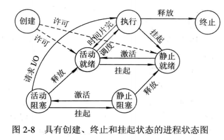

OS中用于管理控制的数据结构：内存表、设备表、文件表、进程表

进程控制块（PCB）：

- PCB的作用是使一个在多道程序环境下不能独立运行的程序（含数据）称为一个能独立运行的基本单位，一个能与其它进程并发执行的进程。
- 作为独立运行基本单位的标志，是进程被感知的唯一标志
- 实现间断性运行的基础，现场保护信息存放在PCB中，使得程序运行的可再现性得到保证
- 提供进程管理所需要的信息
- 提供进程调度所需要的信息
- 实现与其它进程同步和通信的基础，PCB中具有用于实现进程同步的信号量和实现进程通信的区域或者通信队列指针等

PCB中的信息：

- 进程标识符：
  - 外部标识符：为了方便用户（进程）对进程的访问，必须为每一个进程设置一个外部标识，同时还要设置父进程标识、子进程标识、用户标识
  - 内部标识符：为了方便系统对进程的使用，设置唯一的数字标识符。
- 处理机状态：又称为处理机的上下文，主要是由处理机的各种寄存器中的内容组成的。这些寄存器包括通用寄存器、指令计数器、程序状态字PSW、用户栈指针
- 进程调度信息：OS进行调度必须了解进程的状态及有关进程调度的信息，这些信息包括进程状态、进程优先级、进程调度所需的其它信息、事件等
- 进程控制信息：包括程序和数据的地址、进程同步和通信机制、资源清单、链接指针

进程控制块的组织方式：

- 线性方式：使用PCB线性表
- 链接方式：把具有相同进程状态的进程的PCB通过PCB中链接字连接起来，形成所谓的就绪队列、阻塞队列和空白队列
- 索引方式：系统根据所有进程状态的不同，建立几张索引表，如就绪索引表、阻塞索引表等

### 进程控制

OS内核：将与硬件相关的模块、各种常用设备的驱动程序以及运行频率较高的模块都安排在紧靠硬件的软件层次中，将它们常驻内存，即通常称为的OS内核。目的是防止其他程序的破坏和提高OS运行的效率。

系统态：又称为管态、内核态，具有较高的特权，能够执行一切指令，访问所有寄存器和存储区，传统的OS都在系统态运行。

用户态：又称为目态，具有较低特权的执行状态，仅能执行最低特权的指令，访问指定的寄存器和存储区。一般情况下，应用程序只能在用户态运行，不能去执行OS指令及访问OS区域，这样可以防止应用程序对OS的破坏

OS内核的功能：

- 支撑功能：中断处理、时钟管理、原语操作
- 资源管理：进程管理、存储器管理、设备管理

进程的层次结构：创建进程的进程称为父进程，所有进程构成树结构

引起创建进程的事件：用户登录、作业调度、提供服务、应用请求

进程的创建：

- 申请空白PCB
- 为新进程分配资源
- 初始化进程控制块
- 如果进程就绪队列能够接纳新进程就将其插入就绪队列

引起进程终止的事件：

- 正常结束
- 异常错误
  - 越界访问
  - 保护错，访问不允许访问的资源
  - 非法指令
  - 特权指令错
  - 运行超时
  - 等待超时
  - 算术运算错
  - IO故障
- 外界干预
  - 操作员或OS干预
  - 父进程请求

进程的终止：

- 检索PCB，读取进程状态
- 若进程处于执行状态，中止执行，重新调度
- 终止该进程的子孙进程
- 释放资源归还父进程或操作系统
- 将终止进程从队列中移除

引起进程阻塞和唤醒的事件：

- 请求资源失败
- 等待某种操作
- 等待新数据
- 等待新任务

进程阻塞过程：

- 发生引起阻塞的事件后，进程调用阻塞原语block将自己阻塞
- 立即停止执行，并将进程状态修改为阻塞
- 将阻塞进程PCB插入对应的阻塞队列中
- 重新调度，保留阻塞进程的处理机状态，按新进程的PCB中的处理机状态设置CPU的环境

进程的挂起过程：利用Suspend原语将指定进程或处于阻塞状态的进程挂起

- 检查活动阻塞状态的进程
  - 若为活动就绪，改为静止就绪
  - 若为活动阻塞，改为静止阻塞
  - 复制PCB到内存指定区域
- 若挂起的进程正在执行，则转向调度程序重新调度

进程的激活过程：使用激活原语active，将指定进程激活

- 首先将进程从外存调入内存，检查现行进程的运行状态
  - 若为静止就绪，改为活动就绪
  - 若为静止阻塞，改为活动阻塞
- 假如采用的是抢占调度策略，每当激活一个高优先级进程，就立即抢夺处理机的控制权

### 进程同步

进程同步机制：协调多进程按照某种规则（次序）共享系统资源，并能很好合作，使得程序的执行具有可再现性、

两种相互制约关系：

- 间接：共享系统资源导致进程相互制约
- 直接：通过阻塞-唤醒原语直接形成制约关系

临界资源：被多进程共享的某种资源称为临界资源

临界区：每个进程中访问临界资源的那段代码称为临界区，为了实现临界资源的互斥访问。

进入区：检查临界资源访问状态、添加访问标志

退出区：重置临界资源访问状态

临界资源循环进程：

```txt
while(TRUE){
	进入区
	临界区
	退出区
	剩余区
}
```

同步机制应遵循的原则：

- 空闲让进
- 忙则等待
- 有限等待，避免“死等”
- 让权等待，进程不能获得临界资源时应当立即释放处理机，以免进入“忙等”状态

硬件同步机制：使用硬件锁机制，进入临界区需要测试和关锁（如果锁已关则等待），离开临界区需要开锁

- 关中断：进入锁测试之前关闭中断，完成锁测试并上锁后才能打开中断

- 利用Test-and-Set指令实现互斥。

  ```
  //TS指令的一般性描述如下，原子操作
  boolean TS(boolean *lock){
  	boolean old;
  	old = *lock;
  	*lock = TRUE;//上锁
	return old;//返回锁的旧值
  }
  
  //利用TS指令实现互斥的循环进程结构描述如下
  do{
  	...
  	while TS(&lock);//尝试上锁
  	critical section;
  	lock := FALSE;//释放锁
  	remainder section;
  }while(TRUE);
  ```
  
- 利用swap指令实现进程互斥：

  ```
  //swap指令的一般性描述，原子操作
  void swap(boolean *a,boolean *b){
  	boolean temp;
  	temp = *a;
  	*a = *b;
  	*b = temp;
  }
  
  //swap指令实现互斥的循环进程结构可描述如下
  do{
  	key = TRUE;
  	do{
  		swap(&lock,&key);//其中lock是全局布尔型变量，初始值为FALSE
  	}while(key != FALSE);//如果lock是TRUE就相当于没有交换，key还是TRUE
  	临界区操作;
  	lock = FALSE;//释放锁
  	...
  }while(TRUE);
  ```

信号量机制：

- 整型信号量：

  ```
  wait(S){
  	while (S<=0);
  	S--;
  }
  
  signal(S){
  	S++;
  }
  ```

- 记录型信号量：

  ```
  //信号量类型的定义
  typedef struct{
  	int value;
  	struct process_control_block *list;
  } semaphore;
  
  //wait(S)和signal(S)操作可描述如下
  wait(semaphore *S){
  	S->value--;
  	if(S->value < 0) block(S->list);
  }
  signal(sempahore *S){
  	S->value++;
  	if(S->value<=0) wakeup(S->list);
  }
  ```

- AND型信号量：使用PV操作进行进程同步时，如果资源分配的顺序是相反的，就容易导致死锁问题。AND同步机制的基本思想是，将进程在整个运行过程中需要的所有资源，一次性全部分配给进程，待进程使用完后再一起释放。只要尚有一个进程未能分配给进程，其它所有可能为之分配的资源也不分配。

- 信号量集：对N个信号量进行统一的wait或signal操作。进程申请某类临界资源时，在每次分配之前，都必须测试资源的数量，判断是否大于可分配的下限值，决定是否予以分配。

信号量的应用：

- 利用信号量实现进程互斥：使用临界资源时先加上互斥锁，使用完毕后解锁
- 利用信号量实现前驱关系：信号量初始化为0，前驱进程执行完毕后后执行唤醒操作，后继进程开始执行时先进行等待

管程机制：

- 定义：代表共享资源的数据结构以及由对该共享数据结构实施操作的一组过程所组成的资源管理程序共同构成了一个操作系统的资源管理模块，我们称之为管程。管程被请求和释放资源的进程所调用。

- 管程的构成：1、管程的名称；2、局部于管程的共享数据结构说明；3、对该数据结构进行操作的一组过程；4、对局部于管程的共享数据设置初始值的语句

  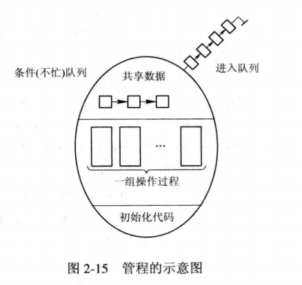

- 特点：模块化、抽象数据类型、信息隐蔽
- 管程与进程的区别：进程PCB是私有的，管程定义的是公共数据结构；进程是由顺序程序执行有关操作，管程主要进行同步和初始化操作；进程是为了实现并发，管程是为了实现互斥；进程是主动工作方式，管程是被动工作方式；进程之间能够并发执行，管程与其调用者之间不能并发；进程具有动态性，管程供进程调用。
- 条件变量：条件变量必须先声明，操作仅限于wait和signal，因此条件变量也属于抽象数据类型。每个条件变量都维护一个阻塞队列，同时提供的两个操作表示为x.wait和x.signal。
  - x.wait：正在调用管程的进程因x条件需要被阻塞或者挂起，则调用x.wait将自己插入到x条件的等待队列上，并释放管程，直到x条件变化。此时其它进程可以使用该管程。
  - x.signal：正在调用管程的进程发现x条件发生了变化，则调用x.signal，重新启动任意一个因x条件而阻塞或挂起的进程。

经典进程的同步问题：

- 生产者消费者问题

  - 利用记录型信号量：设置mutex、empty、full三个信号量，mutex进行临界资源的互斥访问，empty和full进行同步操作，即仓库未满才能生产，仓库未空才能消费。注意请求资源的顺序，否则就容易发生死锁。

    ```c
    int in = 0, out = 0;
    item buffer[n];
    semaphore mutex=1,empty=n,full=0;
    void producer(){
        do{
            produce an item nextp;
            //...
            wait(empty);
            wait(mutex);
            buffer[in]=nextp;
            in = (in+1) % n;
            signal(mutex);
            signal(full);
        }while(1);
    }
    
    void consumer(){
        do{
            wait(full);
            wait(mutex);
            nextc = buffer[out];
            out = (out + 1) % n;
            signal(mutex);
            signal(empty);
            consume the item in nextc;
            //...
        }while(1);
    }
    
    int main(){
        cobegin
            producer();consumer();
        coend
    }
    ```

  - 利用AND信号量：同时分配mutex和empty、mutex和full

    ```c
    int in=0,out=0;
    item buffer[n];
    semaphore mutex=1,empty=n,full=0;
    void producer(){
        do{
            produce an item nextp;
            //...
            Swait(empty,mutex);
            buffer[n] = nextp;
            in = (in+1)%n;
            Ssignal(mutex,full);
        }while(1);
    }
    
    void consumer(){
        do{
            Swait(full,mutex);
            nextc = buffer[out];
            out = (out+1)%n;
            Ssignal(mutex,empty);
            consume the item in nextc;
            //...
        }while(1);
    }
    ```

  - 管程：使用两个条件变量notfull和notempty，生产者进程如果满足notfull条件就执行管程上的过程put(x)，生产产品x放到仓库中；消费者进程如果满足notempty条件就执行管程上的过程get(x)，从仓库中中消费产品x。

    ```c
    void producer(){
        item x;
        while(1){
            //...
            produce an item in nextp;
            PC.put(x);
        }
    }
    
    void consumer(){
        item x;
        while(1){
            PC.get(x);
            consume the item in nextc;
            //...
        }
    }
    int main(){
        cobegin
            producer();consumer();
        coend
    }
    ```

- 哲学家进餐问题：哲学家围成一桌，相邻两个哲学家之间有一支筷子，哲学家必须获得左边和右边的筷子才能进食。为了避免发生死锁问题，解决方法有先竞争奇数号筷子、AND信号量

- 读者写者问题：一个文件可以被进程读或写，允许多个进程读，但一个进程写时不允许其它进程读或写。设置一个读者计数器readcount，对readcount进行修改时要使用rmutex进行互斥操作。进程读或写时要获得wmutex“锁”。

### 进程通信

低级进程通信：进程的互斥与同步，需要在进程之间交换一定信息，所以一些学者将其归为进程通信，称为低级进程通信。之所以低级，是因为效率低、通信对用户不透明。

进程通信：相对于低级进程通信，进程通信能够传递大量数据，使用比较方便。

进程通信的类型：

- 共享存储器系统：基于共享数据结构，程序员负责公用数据结构的设置和进程间同步的处理，OS提供共享存储器；基于共享存储区，数据的形式甚至访问控制由进程负责。
- 管道通信系统：管道是指连接一个读进程和一个写进程以及实现它们之间通信的一个共享文件，又名pipe文件。为了协调双方的通信，管道机制必须提供三方面的协调能力，互斥、同步、确定对方是否存在。
- 消息传递系统：不借助任何共享存储区或数据结构，而是以格式化的消息为单位，将通信的数据封装在消息中，利用OS提供的一组通信命令（原语），在进程间进行消息传递，完成进程间的数据交换。分为直接通信方式、间接通信方式，前者是指利用OS所提供的发送原语直接将消息发送给目标进程，后者是指发送和接收进程通过共享中间实体（称为邮箱）的方式进行消息的发送和接收。
- 客户机-服务器系统：三种实现方式，套接字、远程过程调用（RPC）、远程方法调用（RMI）

直接消息传递系统：

- 直接通信原语：对称寻址方式，要求发送进程与接收进程都必须以显示方式对方的标识符，直接把消息发送给目标进程；非对称寻址方式，接收进程与多个发送进程通信，无法事先指定发送进程，只给出发送进程的id或名字。
- 消息的格式：定长和变长的消息格式
- 进程的同步方式：发送与接收进程均阻塞、只有接收进程阻塞、发送与接收进程均不阻塞
- 通信链路：两种方式，三次握手和四次挥手建立和释放连接、系统自动建立链路；按照通信方式不同，分为单向通信链路和双向通信链路。

 信箱通信：

- 信箱的结构：信箱头、信箱体

  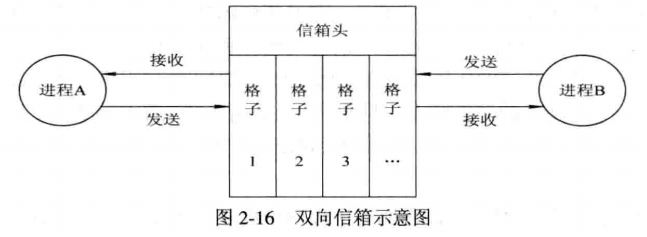

- 信箱通信原语：信箱的创建和撤销原语、消息的发送和接收原语
- 信箱的类型：私用信箱、公用信箱、共享信箱

### 线程

进程与线程的比较：

- 线程是独立调度和分派的基本单位
- 多进程和多线程都能并发执行
- 进程是资源分配的基本单位，一个进程的多个线程共享进程的资源
- 进程之间相互独立，同一个进程的多个线程之间独立性削弱
- 创建进程的开销大于创建线程
- 单线程进程只能在单处理机上执行，多线程进程能够在多处理机上执行

线程运行的三个状态：执行、就绪、阻塞

线程控制块TCB

多线程OS中的进程属性：

- 进程是一个可拥有资源的基本单位
- 多个线程可并发执行
- 进程已经不是可执行的实体，多线程OS中进程作为独立运行（独立调度）的基本单位

线程的实现方式：

- 内核支持线程KST：线程在内核的支持下运行，线程的创建、阻塞、撤销、切换都在内核中进行，内核空间中为每个线程设置一个TCB，TCB是内核感知线程的唯一标志。优点，多线程并行；内核调度线程占有处理机；支持线程具有小数据结构和退栈，线程切换快，开销小；内核本身采用多线程技术提高系统执行速度和效率
- 用户级线程ULT：用户空间实现线程，内核不知道线程的存在，仍然按照线程进行调度。优点，无需内核支持，进程专用调度算法，用户级线程的实现与OS平台无关。缺点，系统调用的阻塞问题，无法实现线程的多处理机并行。
- 组合方式

线程的创建与终止：

- 创建：进程完成主线程的创建，主线程创建其他线程
- 终止：正常结束、异常终止。dispatch和join。

## 处理机调度与死锁

### 处理机调度的层次与调度算法的目标

处理机调度的层次：

- 高级调度：长程调度、作业调度，决策将后备队列上的某些作业调入内存，并创建进程、分配资源、就绪队列排队。用于多道批处理系统，分时和实时系统中并不设置。
- 低级调度：进程调度、短程调度，决策将处理机分配给就绪队列中某个进程或内核级线程，必须配置。
- 中级调度：内存调度，将暂时不运行的进程调至外存等待，此时进程处于就绪驻外存状态（挂起状态）。当其具备运行条件或内存稍有空闲时，中级调度决策某个就绪驻外存进程重新调入内存。

处理机调度算法的目标:

- 共同目标：
  - 资源利用率：CPU有效工作时间的占比
  - 公平性：指处理机资源的公平使用
  - 平衡性：指系统资源的平衡使用
  - 策略强制执行
- 批处理系统的目标：
  - 平均周转时间：**周转时间 = 作业完成  - 作业提交**，平均周转时间是大量周转时间的样本均值，带权平均周转时间是带权的样本均值，权重 = 周转时间 / 服务时间。
  - 系统吞吐量 = 完成作业数 / 处理时间
  - 处理机利用率
- 分时系统的目标：
  - 响应时间快
  - 均衡性：系统响应时间适应请求服务的复杂度
- 实时系统的目标：
  - 截止时间的保证
  - 可预测性

### 作业与作业调度

作业 = 程序 + 数据 + 作业说明书

作业步：构成作业的相对独立、相互关联的加工步骤

作业控制块JCB：保存系统对作业进行管理和调度所需的全部信息，是作业存在的标志。JCB包含内容，作业标识、用户名称、用户账号、作业类型、作业状态、调度信息、资源需求、资源使用情况

作业运行三阶段和三种状态

| 阶段     | 状态     | 描述                                                         |
| -------- | -------- | ------------------------------------------------------------ |
| 收容阶段 | 后备状态 | 用户提交的作业通过某种输入方式或SPOOLing系统输入到硬盘上，建立JCB，后备队列排队 |
| 运行阶段 | 运行状态 | 作业调度选中，分配资源与建立进程，就绪队列排队               |
| 完成阶段 | 完成状态 | 作业正常或因故结束时，终止作业程序回收资源、JCB、资源，结果输出 |

作业调度的主要任务：资源按需分配检查、从后备队列中决策调入内存的作业、资源分配与创建进程、就绪队列排队。决策 = 接纳多少作业、接纳哪些作业

作业调度算法：

| 调度算法          | 描述                                                         |
| ----------------- | ------------------------------------------------------------ |
| 先来先服务FCFS    | 用于作业调度/进程调度，先来先服务                            |
| 短作业优先SJF     | 短作业优先，难以预知作业运行时间，长作业饥饿现象，无法实现人机交互，难以保证紧迫性作业及时处理 |
| 优先级调度算法PSA | 高优先级先调度                                               |
| 高响应比优先HRRN  | 响应比 = 响应时间 / 服务时间，响应时间 = 等待时间 + 服务时间，综合了FCFS与SJF |

> 周转时间 = 

### 进程调度

进程调度的任务：保护现场，决策进程占有处理机

进程调度机制：

- 排队器：按照某种策略排列就绪队列

- 分派器：从就绪队列中取出选中进程，进行从分派器到新选出进程间的上下文切换，分配处理机

- 上下文切换器：第一对上下文切换，处理机寄存器内存保存至PCB，装入分派程序上下文，以便运行分派程序；第二对上下文切换，移除分配程序的上下文，将新选进程的现场信息装入处理机寄存器，以便新选进程的运行。

  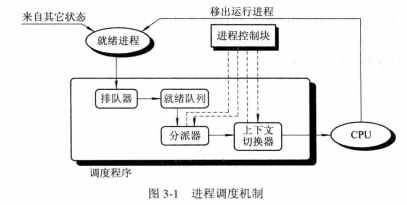

进程调度方式：

- 非抢占方式：占有处理机的进程只能主动放弃占有权
- 抢占方式：允许调度程序暂停正在执行的进程，将已分配的处理机重新分配给另一个进程
  - 抢占的原则：抢占不是抢劫，要讲原则。主要原则有优先权原则、短进程优先原则、时间片原则

轮转调度算法（RR）：

- 基本原理：周期性产生中断，激活调度程序执行调度，将处理机分配给队首进程，这个周期称为时间片
- 进程切换时机：进程完成或时间片用完
- 时间片的选择：短时间片RR退化为短时间优先（SF），长时间片RR退化为FCFS

优先级调度算法：

- 优先级调度算法的类型：非抢占式、抢占式
- 优先级类型：
  - 静态优先级：创建进程时确定，恒定不变，整数。确定进程优先级的依据，进程类型、进程对资源的需求、用户要求。
  - 动态优先级：与静态优先级相对。

多队列调度算法：

- 设置多个优先级队列，将不同性质或类型的进程分配到不同的队列中，不同队列本身也设置优先级，这样就可以针对不同类型的进程设置不同的调度策略。

多级反馈队列调度算法：

- 调度机制
  - 设置多个就绪队列，并为队列本身设置优先级，相邻优先级就绪队列分配的时间片相差一倍
  - 每个就绪队列内部采用FCFS调度算法。被选中的进程在时间片内完成则撤离系统，否则在下一级就绪队列排队，直至第n级队列采用RR方式运行
  - 按队列优先级调度。只有高优先级队列空时才从本队列进行调度。
- 调度算法的性能：
  - 终端型用户：交互性作业较小，能够在第一队列时间片中完成即可
  - 短批处理作业用户：第二、三队列时间片内完成，周转时间较短
  - 长批处理作业用户：不会发生长作业饥饿的现象

基于公平原则的调度算法：

- 保证调度算法：跟踪进程处理时间，计算样本均值，计算进程获得处理机时间的比率 = 进程处理时间 / 样本均值，比较该比率，调度程序应该选择比率最小的进程分配处理机直至超过最接近它的进程比率为止。
- 公平分享调度算法：使得所有用户获得要求比例的处理机时间

### 实时调度

实现实时调度的基本条件：

- 提供必要的信息：就绪时间、开始和完成截止时间、处理时间、资源要求、优先级
- 系统处理能力强：假定系统中有m个周期性硬实时任务HRT，它们的处理时间可表示为C<sub>i</sub>，周期时间表示为P<sub>i</sub>，则在N处理机情况下，必须满足$\sum_{i=1}^m \frac {C_i} {P_i} \leqslant N$  才是可调度的
- 采用抢占式调度机制
- 具有快速切换机制：对中断的快速响应能力，快速的任务分派能力

实时调度算法的分类：

- 非抢占式调度算法：非抢占式轮转调度算法、非抢占式优先调度算法
- 抢占式调度算法：基于时钟中断的抢占式优先级调度算法、立即抢占的优先级调度算法

最早截止时间优先EDF算法：

- 调度原则：任务的截止时间越早，优先级愈高
- 非抢占式调度方式用于非周期实时任务
- 抢占式调度方式用于周期实时任务

最低松弛度优先LLF（Least Laxity First）：

- 调度原则：根据任务的紧急（或松弛）程度确定任务的优先级，任务紧急程度愈高，赋予该任务的优先级就愈高，以使之优先执行。例如，令松弛程度 = 完成截止时间 - 任务执行时间。
- 该算法主要用于可抢占调度方式中

优先级倒置：

- 举例：三个进程P1、P2、P3优先级依次降低。P3先执行并获得锁，P2抢占P3的处理机控制权，P1又抢占P2的处理机控制权，但是P1无法获得锁而阻塞，P2执行。P2执行结束后P3开始执行，然后释放锁，接着P1被唤醒然后执行。此时，就发生了所谓的
- 解决方法一：进程在进入临界区之后就不允许被抢占处理机控制权，但是如果临界区较长效果就不好
- 解决方法二：在动态优先级继承的基础上，如果P1要使用资源，且P3正在使用资源，P1一方面被阻塞，另一方面P3继承P1的优先级，并且一直保持到P3退出临界区

### 死锁

资源分为可重用性资源和消耗性资源

可重用性资源：

- 定义：可供用户重复使用的多次的资源
- 进程独占可重用性资源中单元
- 使用可重用性资源必须遵循一定的顺序：1、请求资源，失败则阻塞或忙等；2、使用资源；3、释放资源
- 系统中每一类可重用性资源中的单元数目是相对固定的，进程在运行期间既不能创建也不能删除它
- 对资源的请求通常使用系统调用来实现，设备——request/release，文件——open/close，需要互斥访问的资源——wait/signal

可消耗性资源：

- 定义：临时性资源，在进程运行期间，由进程动态地创建和消耗的
- 每一类可消耗性资源的单元数目在进程运行期间是可以不断变化的
- 进程运行过程中，可以不断创造可消耗性资源的单元，将它们放入该资源的缓冲区中，以增加该资源类的单元数目
- 进程在运行过程中，可以请求若干个可消耗性资源单元，用于进程自己的消耗，不再将它们返回给该资源类中
- 可消耗性资源通常是由生产者进程创建，由消费者进程消耗，最典型的可消耗性资源就是用于进程间通信的消息等。

资源也可以分成可抢占性资源和不可抢占性资源

死锁的起因：

- 竞争不可抢占性资源引起死锁，例如对共享文件的读写
- 竞争可消耗资源引起死锁
- 进程推进顺序不当引起死锁，例如进程1先请求资源1再请求资源2，进程2先请求资源2再请求资源1

死锁：如果一组进程中的每一个进程都在等待仅由该组进程中其它进程才能引发的事件，那么该组进程是死锁的。

产生死锁的必要条件：

- 互斥条件
- 请求和保持条件
- 不可抢占条件
- 循环等待条件

处理死锁的方法：

- 预防死锁：设置限制条件破坏死锁的必要条件
- 避免死锁：资源动态分配过程中采取某些方法防止系统进入不安全状态
- 检测死锁：进程运行过程中检测死锁，然后解除死锁
- 解除死锁：死锁后采取补救措施解除死锁状态

### 预防死锁

破坏请求和保持条件：

- 第一种协议：进程开始运行之前必须一次性分配所需的全部资源，缺点是降低资源利用率和加剧进程饥饿现象
- 第二种协议：允许一个进程获得运行初期所需的资源便开始运行，运行过程中释放已分配的、已用毕的全部资源，然后再请求新的全部资源

破坏不可抢占条件：进程不能获得新的资源时，必须放弃已经获得的资源，这种方法不切实际

破坏循环等待条件：对所有资源进行线性排序，分配资源时只能按增序请求资源。缺点是排序依据不好确定、使用资源的顺序与资源排序矛盾、对用户编程产生了限制

### 避免死锁

安全状态：假设有三个进程P1、P2、P3，最大需求分别为10、4、9，已分配资源数为5、2、2，可用资源数为3。按照P2、P1、P3的顺序，先给P2分配2个资源，P2完成后释放出4个资源；再给P1分配5个资源，完成后释放出5个资源；最后给P3分配7个资源。如果能够找到像这样一个序列，能够满足每个进程对资源的最大需求，就是安全状态

银行家算法：

- 银行家算法中的数据结构：

  - 可利用资源向量：$Available_{1× m}$
  - 最大需求矩阵：$Max_{n×m}$
  - 分配矩阵：$Allocation_{n×m}$
  - 需求矩阵：$Need_{n×m}$
  - $Need = Max - Allocation$

- 银行家算法：设$P_{i}$的请求向量为$Request_{i 1×m}$，伪代码如下

  ```python
  def banker():
      for r,n in zip(Request[i],Need[i]):
          if r > n:
              raise Exception("所需要的资源已经超过所宣布的最大值")
      for r,a in zip(Request[i],Available):
          if r > a:
              raise Exception("尚无足够资源，需等待")
      for j in len(Request[i]):
          Available[j] = Available[j] - Request[i][j]
          Allocation[i][j] = Allocation[i][j] + Request[i][j]
          Need[i][j] = Need[i][j] - Request[i][j]
      
      # 检测安全性，如果不安全撤回分配
      if not checkSecurity():
          Available[j] = Available[j] + Request[i][j]
          Allolcation[i][j] = Allocation[i][j] - Request[i][j]
          Need[i][j] = Need[i][j] + Request[i][j]
  ```

- 安全性算法：

  ```python
  def checkSecurity():
      Work = Available
      Finish = [False for _ in n]
      for _ in len(Finish):
          # 查找满足Finish[i] == False 且 Need[i][j] <= Work[j]的进程
          isFound = False # 查找成功的标志
          for i in len(Finish):
              # 条件一
              if Finish[i]:
                  continue
              
              # 条件二
              flag = True
              for j in len(Work):
                  flag = flag and Need[i][j] <= Work[j]
                  
              # 查找到满足两个条件的进程
              if flag:
                  for j in len(Work):
                      Work[j] = Work[j] + Allocation[i][j]
                  Finish[i] = True
                  isFound = True  # 设置查找成功的标志
                  break
          # 如果所有的进程都不满足条件说明不安全
          if not isFound:
              return False
      return True
  ```

### 死锁的检测与解除

资源分配图：结点和有向边构成的有向图，结点分为进程结点和资源结点，资源结点中包含1至多个资源（用〇表示），资源结点指向进程结点的边表示已分配资源，进程结点指向资源结点的边表示请求资源

死锁定理：找到一个进程结点，没有因为请求资源而处于阻塞状态（指向的资源结点资源数小于等于入度和出度之和），将该结点的出边和入边删除。重复这一过程，如果最终能够删除所有的边，则证明没有发生死锁。

死锁的解除：

- 常见的解除死锁的方法：抢占资源、终止进程
- 终止进程的方法：终止所有死锁进程、逐个终止进程直至死锁解除
- 付出代价最小的死锁解除算法：穷尽所有解除死锁的可能，计算代价，选择最小代价的终止进程的顺序

## 存储器

### 存储器的层次结构

三层结构的存储器系统：

- CPU寄存器
- 主存：高速缓存、主存储器、磁盘缓存
- 辅存：固定磁盘、可移动存储介质

可执行存储器：寄存器与主存储器又被称为可执行存储器，计算机可以通过load/store指令访问可执行存储器，但对辅存的访问则需要通过IO设备来实现

主存储器：简称内存或主存，处理机能够直接访问的存储器，可以保存程序和数据，一般是随机存储器

寄存器：能够匹配处理机运行速度的存储器，通常置于CPU内部，存储容量很小，但访问速度很快

高速缓存：介于寄存器和存储器之间的存储器，用于解决主存与CPU速度差异问题，基于程序执行的局部性原理。CPU一般不直接访问内存，而是访问高速缓存，如果缓存没有命中，才访问主存并更新缓存。可以设置多级缓存加快访问速度。

磁盘缓存：用于解决主存与IO速度之间的矛盾，缓存经常访问的外存数据。不存在物理上的实体，只是主存中划定的一部分空间

### 程序的装入和链接

程序在系统中运行的步骤：

- 编译：源程序通过编译程序编译成若干个目标模块
- 链接：链接程序将多个目标模块以及调用的库函数链接在一起，形成一个完整的可装入模块
- 装入：由装入程序将可装入模块装入内存

三种装入模式：

- 绝对装入方式：单道系统中已知用户程序驻留位置，按照装入模块中的地址从该位置向上扩展即可
- 可重定位装入方式：又称静态重定位，多道系统中，装入模块中的地址与实际驻留的地址不同，需要进行地址的重定位，将逻辑地址转换为物理地址。
- 动态运行时的装入方式：允许程序在运行时在内存中移动位置，所以重定向只能在运行时完成，运行时重定向需要重定位寄存器的支持

程序的链接：

- 静态链接方式：程序运行之前将目标模块和调用的库链接成一个完整的装配模块，以后不再拆开。
  - 对相对地址进行修改：将各个模块的相对地址改为完整链接模块的相对地址
  - 变换外部调用符号：将外部调用各个模块的地址改为调用完整链接模块的地址
- 装入时动态链接：将一组目标模块采用边装入边链接的方式。即再装入一个模块时，若发生一个外部调用模块调用事件，将引起装入程序寻找相应的外部目标模块并装入内存。
  - 便于修改和更新：静态链接如果要修改其中某个模块就要将链接推倒重来，而装入时动态链接则不必如此
  - 便于实现对目标模块的共享：采用静态链接方式，每个应用模块都要拷贝其目标模块，但装入时动态链接则可以实现目标模块的共享。
- 运行时动态链接：程序运行之前不知道要调用哪些目标模块，所以只能把可能用到的目标模块全部装入。而运行时动态链接就能够实现运行时装入目标模块，从而避免装入没有用到的模块。

### 连续分配存储管理方式

连续分配存储管理方式：为用户程序分配连续的内存空间，程序代码或数据的逻辑地址相邻体现在内存空间分配时物理地址的相邻。

- 连续分配方式的分类：单一连续分配、固定分区分配、动态分区分配、动态可重定位分配

1、单一连续分配：单道程序环境中，把内存分为系统区和用户区两部分。系统区提供给OS使用，通常放在的内存的低址部分；用户区内存中，仅装有一道用户程序。这样额存储器分配方式称为单一连续分配方式

2、固定分区分配：多道系统中，将用户区内存分为若干分区，每个分区可以存放一道作业，各个分区互不干扰。

- 划分分区的方法：
  - 分区大小相等：缺乏灵活性，程序太小时造成浪费，程序太大又装不进去
  - 分区大小不等：小作业装入小的分区，大作业装入大的分区
- 内存分配：
  - 分区使用表：按大小排列，包括分区号、大小、起始地址、分配状态等属性
  - 分配：查找分区使用表，选择合适大小的没有分配的分区

3、动态分区分配：根据进程的实际需要，动态地为之分配内存空间。动态分配内存时，将涉及到分区分配中所用的数据结构、分区分配算法和分区分配算法和分区的分配与回收操作这样三方面的问题

- 数据结构：
  - 空闲分区表：包括分区号、分区大小、分区起始地址、分配状态等数据项
  - 空闲分区链：利用空闲分区的起始和末尾部位设置前向和后向指针，构造空闲分区的双向链表。为了检索方便在起始和末尾还重复设置分配状态位和分区大小属性
- 动态分区分配算法
- 分区分配操作：
  - 分配内存：如果选中的分区用不完，剩余部分超过某个阈值，就要执行分割，把没用完的部分作为一个独立的分区重新插入空闲分区表或空闲分区链
  - 回收内存：进行分区的回收时，要将相邻的空闲分区合并

基于顺序搜索的动态分区分配算法：

- 首次适应算法（FF）：从低地址到高地址顺序查找，优先利用低地址部分，保留高地址大空闲区，但是会导致低地址部分出现很多外碎片
- 循环首次适应算法（NF）：从上一次查找的位置开始新一轮循环顺序查找，失去了FF算法的优点和缺点
- 最佳适应算法（BF）：按照容量增序构建空闲分区链，每次分配大小最合适的空闲分区，但是无法避免外碎片的问题
- 最坏适应算法（WF）：按照容量增序构建空闲分区链，每次分配最大的空闲区，减少了外碎片，但导致大空闲分区的缺乏

基于索引搜索的动态分区分配算法：

- 快速适应算法：
  - 按照2KB、4KB、8KB等进程常用的大小对空闲分区进行分类，单独设立空闲分区链表，再通过管理索引表记录分区类型和空闲分区链表的头指针。对于其他大小的分区，可以放在前面的空闲分区链表中，也可以单独设置特殊的空闲区链表。
  - 分配空闲分区时分两步，先查找能容纳进程的最小空闲分区链表，然后从链表中取出一块进行分配即可。
  - 主要缺点是分区归还主存时算法比较复杂，开销大。分区专属于进程，或多或少存在浪费问题。
- 伙伴系统：
  - 分区大小固定为2的k次幂（1≤k≤m），通常$2^m$是整个可分配内存的大小。系统开始时整个内存是一个$2^m$大小的空闲分区，随着分区不断的划分，形成若干不连续分区，将其按照大小进行分类，每种类型设置一个空闲分区双向链表。
  - 分配过程：
    - 进程需要长度为n的存储空间时，计算 $i = \lceil log_2 n \rceil$
    - 在空闲分区大小为$2^i$的空闲分区链表中查找。若找到，即把该空闲分区分配给进程。否则，表明长度为$2^i$的空闲分区已经耗尽，进行下一步。
    - 在分区大小为$2^{i+1}$的空闲分区链表中查找。若查找到，则将分区进行拆分，一份分配给进程，另一份插入长度$2^i$的空闲分区链表中。若没查找到则进行下一步
    - 在分区大小$2^{i+2}$的空闲分区链表中查找。若查找到，将空闲分区分成两份，一份插入长度为$2^{i+1}$的空闲分区链表中；另一份再分成两份，一份分配给进程，另一份插入长度为$2^i$的空闲分区链表中。若没查找到则进入下一步
    - ……
    - 如果最后一个空闲分区链表中也没有空闲分区，则失败
  - 伙伴块：长度相同、位置相邻、合并后字节对齐
  - 回收过程：分配的逆过程，将伙伴块合并，类似于“手游2048”
- 哈希算法：利用某种散列函数直接将空闲分区大小映射为空闲分区的地址

4、动态可重定位分区分配：

- 紧凑：消除碎片的方法。当碎片过多时，应当进行紧凑操作，将碎片移动然后合并成可以利用的空间；移动程序或数据时，还要对程序的地址进行修改，否则程序将无法执行
- 动态重定位：将相对地址转换为物理地址的地址转换过程延迟到运行时，为了保证指令的执行速度不受影响，必须有硬件变换机构的支持，即须在系统中设置一个重定向寄存器，用来存放程序（数据）在内存中的起始地址。程序执行的时候，真正的地址是相对地址和重定向寄存器中的地址相加的结果。
- 动态重定向分区分配算法：与动态分区分配算法基本上相同，差别仅在于添加了紧凑的功能。一旦没有足够大的空闲分区，就执行紧凑操作。

### 对换

对换：将内存中暂时没有使用的作业调至外存存放，同时从后备队列中将一个新的作业调入内存，这种操作称为对换

对换的类型：

- 整体对换：处理机的中级调度实际上就是存储器的对换功能，这种对换以进程为单位，又称之为“进程对换”或者“整体对换”
- 页面（分段）对换：对换是以一个“页面”或者“分段”为单位进行的，则分别称为“页面对换”或者“分段对换”，又统称“部分对换”。这种对换是实现请求分页和请求分段式管理的基础，目的是支持虚拟存储系统。

为了实现进程对换必须实现三方面的功能：对换空间的管理、进程的换出、进程的换入

对换空间的管理：

- 对换空间的目标：将磁盘空间划分为文件区和对换区
  - 对文件区管理的主要目标：主要目标是提高文件存储空间的利用率，其次才是文件的访问速度。对文件区空间的管理采用离散分配方式
  - 对对换空间管理的主要目标：提高进程换入和换出的速度，其次才是文件存储空间的利用率。对对换空间的管理采用连续分配方式
- 对换区空闲盘块管理中的数据结构：空闲分区表或空闲分区链，在空闲分区表中的每个表目中应包含两项，对换区的首址（盘块号）及其大小（盘块数）
- 对换空间的分配与回收：采用连续分配方式，对换空间的分配与回收与动态分区方式时的内存分配和回收方法雷同。

进程的换出：

- 选择被换出的进程：先从阻塞或睡眠的进程中选择，再从就绪的进程中选择，考虑进程的优先级和内存驻留时间
- 进程换出过程：只能换出非共享的程序和数据段，不能换出共享的程序和数据段。进行换出时，应该先申请对换空间，然后将程序和数据写入磁盘对换区，如果传输正常就回收内存空间修改PCB和内存分配表。如果还有可换出的进程就继续执行换出。

进程的换入：

- 进程换入过程：从PCB集合中查找已换出就绪进程，选择外存驻留时间最长的进程，申请内存空间（空间不足执行进程换出）并调入内存。如果还有可以换入的进程继续换入。

### 分页存储管理方式

离散分配方式的种类：

- 分页存储管理方式
- 分段存储管理方式
- 段页式存储管理方式

分页存储管理的基本方法：

- 页面和物理块：将逻辑地址空间分成若干页面，将物理地址空间分成若干块，将逻辑上相邻的页面映射为物理上分散的块。进程的最后一页一般不能填满块，造成“内碎片”。适当设定页面大小，兼顾页面数量和内碎片数量限制。
- 地址结构：页号+偏移量
- 页表：将逻辑页号映射为物理块号的映射表，表项包括页号、块号、存取控制字段

地址变换机构：

- 基本的地址变换机构：

  - 页表寄存器：存放页表指针和页表长度

  - 有效地址 → 页号 + 页内地址，页号越界检查，页表始址 + 页号 → 块号，块号 + 页内地址 → 物理地址

    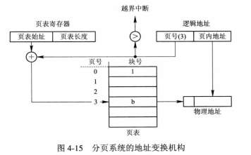

- 具有块表的地址变换机构：在上面的基础上设置缓冲寄存器存放页表项，称为联想寄存器或快表。先查块表，再查页表。

  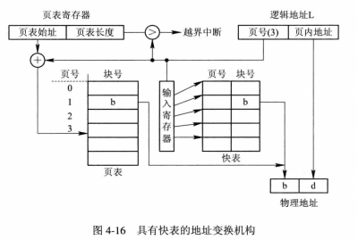

- 内存有效访问时间（EAT）：设τ是一次内存访问时间，λ是一次访问快表的时间，a是快表命中率，则命中时时间为2τ，没有命中时时间为τ+λ，EAT是数学期望

两级和多级页表：

- 两级页表：将页表本身分成多个页面进行存储，再设置外层页表管理页表的各个页面。简言之，外层页表始址 + 外层页号 → 页表分页地址，页表分页地址 + 外层页内地址 → 块号，块号 + 页内地址 → 目的内存单元
- 外层页表寄存器：存放外层页表的始址
- 为了减少页表所占用的空间，可以只将需要的页表分页调入内存，将不需要的页表分页调入外存。在外层页表中设置标志位表示页表分页是否调入内存。
- 多级页表：采用更多级页表以便支持更大的内存。64位计算机中采用三级页表和可寻址空间减少至45位长度相结合的措施，避免页表级数过多。

反置页表：

- 反置页表：通常的页表按照页号排序，存放的是块号。反置页表按照块号排序，存放的进程标识符和页号
- 地址变换：采用顺序查找法查找反置页表，查找失败说明页没有调入内存。
- 有效减少页表占用的内存，但需要为每个进程建立外部页表，以便访问没有调入内存的页时使用。
- 还可以采用hash算法取代顺序查找法

### 分段存储管理方式

引入分段存储管理方式：1、方便编程；2、信息共享；3、信息保护；4、动态增长；5、动态链接；

分段存储管理的基本方法：

- 分段：作业的地址空间被人为划分为若干个段，如主程序段（MAIN）、子程序段（X）、数据段（D）、栈段（S）。段必须满足字节对齐，长度自定，但不能超过最大段长。
- 分段地址 = 段号 + 段内地址。
- 段表 = 段号 + 段长 + 基址，段表按照段号排序。

地址变换机构：

- 段表寄存器：存放段标始址和段表长度

- 有效地址 → 段号 + 段内地址，段号越界检查，段内地址越界检查，段表始址 + 段号 → 基址，基址 + 段内地址 → 目的内存单元

  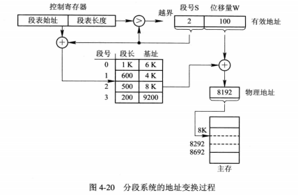

分页和分段的区别：

- 页是信息的物理单位，是面向系统的；分段是信息的逻辑单位，是面向用户的。
- 页的大小固定并且由系统决定，段长不固定且由用户决定
- 分页的逻辑地址仍然是一维的，分段的逻辑地址是二维的

信息共享：

- 分页系统中对程序和数据的共享：每个进程都需要将共享区的页表项拷贝一遍
- 分段系统中程序和数据的共享：设置共享段，只需在在每个进程中引用共享段即可

段页式存储管理方式：

- 基本原理：分段与分页相结合，用户程序分段，分段再分页，段长不固定，页长固定，逻辑上分段，物理上分页。

- 段页式地址 = 段号 + 段内页号 + 页内地址

- 段表：在段页式管理中，段表存放的是段号、页表大小、页表始址、状态。其中页表始址指向一个页表。

- 页表：包含页号、物理块号、状态等字段，其中物理块号指向物理块

- 段表寄存器：存放段表始址

- 地址变换：有效地址 → 段号 + 段内页号 +页内地址，段号越界检查，段表始址 + 段号 → 页表始址，页表始址 + 段内页号 → 块号，块号 + 页内地址 → 目的内存单元

  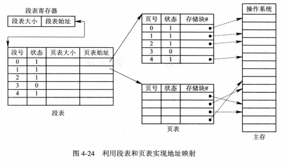

## 虚拟存储器

### 概述

常规存储器管理方式的特征：

- 一次性：作业必须一次性全部装入内存后才能运行
- 驻留性：作业被装入内存后一直驻留在内存中

程序运行的局部性原理：

- 程序运行的局部性现象：顺序执行为主；过程内部运行为主；循环结构多次调用；数组访问局限性
- 时间局部性原理：指令或数据被访问后再次被访问的可能性高
- 空间局限性原理：某个内存单元被访问后，附近的内存单元被访问的可能性高

虚拟存储器基本工作情况：不必将程序全部装入内存，只将当前运行页面或段调入内存，利用缺页中断调入新的页面或段，并将不使用的页面或段调出。

虚拟存储器：具有请求调入功能和置换功能，能从逻辑上对内存进行容量进行扩充的一种存储器系统。逻辑容量 = 内存 + 外存。

虚拟存储器的特征：

- 多次性：多次调入和置换
- 对换性：正在使用的数据调入内存，暂时不用的数据被调出
- 虚拟性：逻辑内存空间 > 物理内存空间

虚拟存储器的实现：

- 建立在离散分配存储管理方式的基础上
- 硬件支持：请求分页（段）的页（段）表机制、缺页（段）中断机构、地址变换机构
- 软件支持：实现请求调页（段）的软件和实现页（段）置换的软件
- 分类：请求分页系统、请求分段系统

### 请求分页的存储管理方式

请求分页中的硬件支持：内存和外存、请求页表机制、缺页中断机构和地址变换机构

请求页表机制：

- 请求页表字段：页号、物理块号、状态位P、访问字段A、修改位M、外存地址
- 状态位：指示页面是否调入内存
- 访问字段：记录本页在一段时间内的访问次数，或者本页最近有多长时间未被访问
- 修改位：记录本页在调入内存后是否被修改过
- 外存地址：指出该页在外存上的地址

缺页中断机构：

- 缺页中断具有中断的一般性：也要经过保护现场、分析中断原因、转入中断处理程序、中断处理、恢复环境等过程。
- 缺页中断具有特殊性：缺页中断是在指令执行的过程中产生的，而一般中断则是在指令执行完毕后检测和产生的。一条指令可以产生多个缺页中断，系统的硬件结构能够保存多次中断现场

地址变换机构：

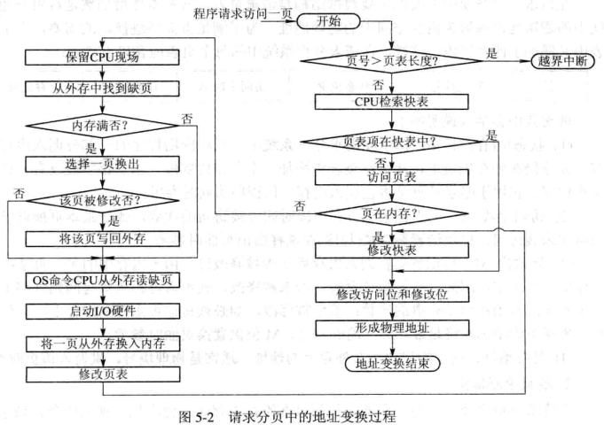

### 请求分页中的内存分配

最小物理块数：保证进程正常执行的最小物理块数，由指令系统决定

内存分配策略：

- 固定分配局部置换：固定分配是指为每个进程分配一组数目固定的物理块，并且在运行时不再改变。局部置换是指如果进程在运行过程中发现缺页，则只能从分配给该进程的n个页面中选出一页进行置换。固定分配局部置换策略根据进程类型和程序员的设定配置物理块数，难以化解CPU利用率和缺页率的矛盾。
- 可变分配全局置换：可变分配是指为进程分配的物理块数在运行时可以改变。全局置换是指进程在运行过程中一旦发生缺页中断，就从OS空闲物理块中选择一块，或者从所有进程的物理块中选择一块进行置换。可变分配全局置换策略最易于实现，一定程度上解决了CPU利用率与缺页率之间的矛盾。
- 可变分配局部置换：与可变分配全局置换的区别在于置换只能在本进程的物理块中进行。

物理块分配算法：

- 平均分配算法：权重=1
- 按比例分配算法：权重=进程大小
- 考虑优先权的分配算法：权重=优先级

页面调入策略：

- 何时调入页面：
  - 预调页策略：调入预测会被访问的页面进入内存，但目前预测率仅50%
  - 请求调页策略：需要访问页面时，请求调页，但开销较大、IO启动较频。
- 从何处调入页面：
  - 文件区与对换区：分别用于存放文件和用于对换的外存区域
  - 对换区足够：全部从对换区调入全部页面，进程运行前将相关文件从文件区复制到对换区
  - 对换区不够：从文件区调入或调出只读文件，从对换区调入或调出要修改的文件
  - UNIX方式：首次调入从文件区，调出或再次调入从对换区，允许页面共享，其他进程调入页面后不重复调入。
- 页面调入过程：发出缺页中断、保护现场、分析缺页中断原因、转入缺页中断处理程序、查找页表、（选出换出页面、若修改则写回内存）、启动磁盘IO调入页面、修改页表。
- 缺页率：内存命中页面次数/访问页面总次数。页面大小↓、分配物理块数↓、页面置换算法质量↓、程序编制局部化程度↓=>缺页率↑
- 缺页中断时间$t=\beta × t_a + (1-\beta)×t_b$，β是被置换页面被修改的概率，$t_a$、$t_b$是被置换页面被修改和违背修改的缺页中断处理时间。

### 页面置换算法

抖动现象：被调出的页面很快又被访问，又要重新调入，这样就会造成进程运行过程中花费大量时间进行页面的置换。

最佳置换算法：预先知道页面的访问序列，每次置换时换出不再访问或者再次访问时间最长的页面

先进先出（FIFO）页面置换算法：淘汰最先进入内存的页面，维护指针指向最老的页面

最近最久未使用（LRU）页面置换算法：淘汰上次访问时间最早的页面，需要硬件支持，使用寄存器保存内存中的页面使用情况，或者使用栈维护内存中使用的页面号。

最少使用（LFU）算法：又称最不经常使用算法，采用移位寄存器，每次访问页面时就将最高位置为1，周期性地执行向右移位操作，每次淘汰值最小的页面。

Clock置换算法：每个页面设置一个访问位，将所有页面链接成一个循环队列。当某页被访问时，访问位置1。淘汰页面时，只需检查页的访问位，如果访问位为0就换出，如果访问位为1就置为0并按FIFO检查下一个页面。该算法循环检查所有页面，故得名Clock算法，又因置换时是将没有使用的页面换出，故又名最近未用算法（NRU）。

改进型Clock算法：置换时不仅考虑访问位A，还考虑修改位M。如果A=1，则该页可能被再次访问。如果A=0且M=0（第一类页面），是最佳置换页，如果A=0且M=1（第二类页面），则换出时还要执行写入操作。step1：顺序查找第一类页面；step2：step1失败后顺序查找第二类页面；step3：所有访问位清零，重新执行算法，从头开始。

页面缓冲算法（PBA）：

- 影响页面换进换出效率的若干因素：页面置换算法、写回磁盘的频率、读入内存的频率。
- PBA算法：显著降低页面置换频率、使用FIFO算法无需硬件支持。
  - 空闲页面链表：从空闲链表的头部分配频繁缺页的进程，换出的页面暂时存放在空闲链表的尾部
  - 修改页面链表：修改过的页面并不立即换出，而是先缓存在修改页面链表中，满足一定规模后在进行IO操作。

访问内存的有效时间：

- 被访问页在内存中并且对应的页表项在快表中：$EAT = \lambda + t$，其中内存的有效访问时间（EAT）分为查找快表的时间（λ）和访问实际物理地址的时间t
- 被访问页在内存中并且对应的页表项不在快表中：$EAT = \lambda + t + \lambda +t = 2 \times (\lambda + t)$，内存的有效访问时间分为查找快表的时间、查找页表的时间、修改快表的时间、访问实际物理地址的时间
- 被访问页不在内存中：$EAT = \lambda + t + \epsilon + \lambda + t = \epsilon + 2 \times (\lambda + t)$，内存的有效访问时间分为查找快表的时间、查找页表的时间、处理缺页中断的时间、更新快表的时间、访问实际物理地址的时间
- 考虑命中率和缺页率的内存的有效访问时间：$EAT = \lambda + a \times t + (1 - a) \times [t + f \times (\epsilon + \lambda + t) + (1 - f) \times (\lambda + t)]$，a表示命中率，f表示缺页率

### 抖动与工作集

多道程序度与处理机的利用率：随着进程数目的增大，处理机利用率逐步增长，并达到一个峰值；而后抖动的因素开始起到主导作用，随着进程数目的增大，处理机利用率会加速下降

产生抖动的原因：同时在系统中运行的进程太多，由此分配给每一个进程的物理块太少，不能满足进程正常运行的要求，导致缺页率不断上升，频繁的页面置换降低了CPU的利用率。

工作集的引入：缺页率与分配的物理块数呈反相关，故引入工作集的概念。基于程序运行的局部性原理，程序在运行期间对页面的访问是不均匀的，在一段时间内局限于较少的一些页面（称为活跃页面）。通过预知访问页面并提前调入内存，就能够降低缺页率。

工作集：在某段时间间隔Δ内，进程实际所要访问的页面集合。把某进程在时间t的工作集记为w(t, Δ)，其中变量Δ称为工作集的“窗口尺寸”，由此可将工作集定义为进程在时间间隔(t-Δ, t)中引用页面的集合。工作集w(t, Δ)是二元函数，即在不同时间t的工作集大小不同，所含的页面数也不同；工作集与窗口尺寸Δ有关，是窗口尺寸Δ的非降函数，即$w(t,\Delta) \subseteq w(t,\Delta + 1)$。

抖动的预防方法：

- 采取局部置换策略：将抖动局限于一个进程，缺点是导致磁盘IO等待队列长度增加，间接导致缺页中断处理时间延长。
- 把工作集算法融入到处理机调度中：执行作业调度时，如果不会大幅加剧抖动则执行调度，否则增加物理块以降低进程缺页率。
- “L=S”准则：L指的是缺页之间的平均时间，S是平均缺页服务时间。如果L>>S，表明缺页率低，磁盘利用率低； 如果L<S，表明缺页率高，磁盘过载；L=S，说明磁盘和处理机都达到最大利用率。
- 选择暂停的进程

### 请求分段存储管理方式

请求分段中的硬件支持：

- 请求段表机制：
  - 请求段表的字段：段名、段长、段基址、存取方式、访问字段A、修改位M、存在位P、增补位、外存始址
  - 存取方式：只执行、只读、读写等
  - 访问字段A：记录被访问的频繁程度
  - 修改位M：记录段是否被修改过
  - 存在位P：指示本段是否已经调入内存
  - 增补位：本段在运行过程中是否经历过动态增长
  - 外存始址：指示本段在外存中的起始地址，即起始盘块号
  
- 缺段中断机构：采用请求调段策略，缺段时，由缺段中断机构产生缺段中断信号，进入OS后，由缺段中断处理程序将所需的段调入内存。一条指令执行期间可以产生和处理多次缺段中断。处理缺段中断的步骤，必要时执行空闲区合并、段淘汰，再调入段。

  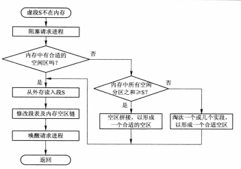

- 地址变换机构：分段越界检查、分段保护、缺段检查、修改访问字、得到物理地址、访问内存。

  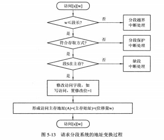

分段共享与保护：

- 共享段表：共享段表中记录的段表项被所有进程共享，共享段表的字段包括段号、段长、内存始址、状态位、外存始址、共享计数等信息。
  - 共享进程计数：段被多少进程共享，若为0则执行内存回收
  - 存取控制字段：为不同的进程赋予不同的存取权限，如只读、只执行、读写等
  - 段号：不同进程按照不同的段号访问共享段
- 共享段的分配与回收：
  - 共享段的分配：由第一个请求段的进程执行段的调入，并创建共享段表项。其它进程请求共享段时，不再执行段的调入，只修改段表。
  - 共享段的回收：修改段表和共享段表，如果共享计数降为0，执行内存回收
- 分段保护：
  - 越界检查：段号不能越段表的界，段内地址不能越段长界。
  - 存取控制检查：段表访问控制字段规定了进程访问段的方式
  - 环保护机构：内环可以访问外环数据，外环可以调用内环服务，同环可以相互访问数据和调用服务。

## 输入输出系统

### IO系统的功能模型和接口

IO系统的基本功能：

- 方便用户使用IO设备：
  - 隐藏物理设备的细节：直接面向硬件设备编程是困难的，但将设备抽象化则方便了开发人员面向设备编程
  - 与设备的无关性：使用抽象的IO命令和逻辑设备名操作IO设备、提高OS的可移植性和易适应性
- 提高CPU和IO设备的利用率：
  - 提高处理机和IO设备的利用率：尽可能让CPU和IO设备都能并行处理
  - 对IO设备进行控制：驱动程序用来控制IO设备，四种控制方式为轮询可编程IO方式、中断可编程IO方式、直接存储器访问方式、IO通道方式
- 方便用户共享设备：
  - 确保对设备的正确共享：IO设备可分为独占设备和共享设备，共享设备可以被多个进程共享
  - 错误处理：错误分为临时性错误和持久性错误，通过重试解决临时错误，向上报告持久性错误

IO系统的层次结构和模型：

- 四层模型：

  - 用户层IO软件：实现与用户交互的接口
  - 设备独立性软件：实现用户程序与设备驱动器的统一接口、设备命名、设备保护、设备的分配与释放等，同时为设备管理和数据传送提供必要的存储空间
  - 设备驱动程序：与硬件直接相关
  - 中断处理程序：保护现场、转入中断处理程序、恢复现场

  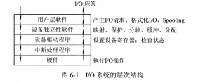

- IO系统中各种模块之间的层次视图：

  - IO系统的上下接口：

    - IO系统接口：IO系统与上层系统之间的接口，向上层提供对设备进行操作的抽象IO命令，方便高层对IO设备的使用
    - 软件/硬件（RW/HW）接口：上面是中断处理程序和用于不同设备的设备驱动程序，下面是各种设备的控制器（网卡、显卡、声卡等）
    - 在IO系统接口与软件/硬件接口之间的则是IO系统

    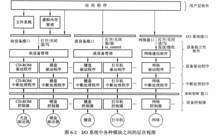

  - IO系统的分层：

    - 中断处理程序：直接与硬件进行交互
    - 设备驱动程序：抽象IO命令与具体IO控制命令和参数之间的和转换
    - 设备独立性软件：IO软件独立于具体使用的IO设备

IO系统接口：

- 块设备接口：
  - 块设备：数据存取和传输以块为单位，磁盘是典型的块设备。块设备的特征是高传输速率和可寻址
  - 隐藏了磁盘的二维结构——扇区、磁道
  - 将抽象命令映射为底层操作
- 流设备接口（字符设备接口）：
  - 字符设备：数据测存储和传输是以字符为单位的设备，如键盘、打印机。基本特征是传输速率较低、不可寻址
  - get和put操作：建立缓冲区，IO字符流顺序进入缓冲区（输入缓冲），或从缓冲区顺序进入IO设备（输出缓冲）。用户程序使用get和put方法完成输入和输出
  - in-control指令：以统一的指令处理IO请求
  - 大多数流设备都属于独占设备，必须采取互斥方式实现共享。流设备接口提供了打开和关闭操作。
- 网络通信接口

### IO设备和设备控制器

IO设备的类型：

- 块设备、字符设备
- 独占设备、共享设备
- 存储设备、IO设备
- 高速设备、中速共享设备、高速共享设备

设备与控制器之间的接口：

- 数据信号线：设备<----数据信号线---->设备控制器，通常会设置缓冲
- 控制信号线：设备控制器向设备发出控制信号
- 状态信号线：表明设备当前处于正在读（写）、已读（写）等状态

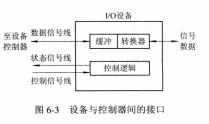

设备控制器的基本功能：

- 接受和识别CPU命令
- 数据交换
- 标识和报告设备的状态
- 地址识别
- 数据缓冲区
- 差错控制

设备控制器的组成：

- 设备控制器与处理机的接口（硬件端口）：CPU与设备控制器通信，三类信号线（数据线、地址线、控制线），数据线通常与数据寄存器和控制状态寄存器相连接。
- 设备控制器与设备的接口：一个设备通过多个接口与多个设备连接，每个接口都存在数据、控制、状态三种类型的信号，控制器根据CPU发出的地址信号选择一个设备
- IO逻辑：实现对设备的控制，CPU通过控制线启动IO逻辑，通过地址线传送地址信号，IO逻辑选择正确的设备

内存映像IO：

- 利用特定的IO指令：为每个控制存储器分配一个IO端口，设置特殊的IO指令进行IO操作
- 内存映像IO：将设备映射为逻辑内存空间的一部分

IO通道：

- IO通道的引入：为了减少IO操作对处理机资源的占用，引入IO通道独立地处理IO操作，使CPU从繁杂的IO操作中解脱出来。实质上，IO通道是一种能够执行IO指令的处理机（只能处理IO指令，不能访问内存）

- 通道类型：

  - 字节多路通道：每个设备的控制器连接一条子通道，多个子通道通过时间片轮转共享主通道
  - 数组选择通道：适用于高速设备，每条通道只能被一个设备独占
  - 数组多路通道：将数组选择通道的高传输速率与字节多路通道的分时特性相结合

- “瓶颈”问题：通道价格昂贵，只能设置有限个，故成为IO系统的瓶颈。解决办法是增加设备到主机间的通路而不增加通道。

  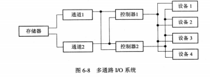

### 中断机构和中断处理程序

中断和陷入：中断（外中断）是指CPU对IO设备发来的中断信号的一种响应，CPU中断当前程序的执行，转而执行IO设备的中断处理程序，最后再继续原来的程序。陷入（内中断）是CPU内部事件引起的中断。中断和陷入的根本区别是中断的来源。

中断向量表：记录不同中断程序的始址，并指定中断号。发生中断时，由中断控制器确定中断号，查找中断向量表，得到中断处理程序的始址，再转入执行中断处理程序。

中断优先级：在遇到多个中断请求时根据优先级进行决策 

多中断源的处理方式：

- 屏蔽（禁止）中断：
- 嵌套中断：高优先级中断先响应，高优先级中断抢占正在运行低优先级中断的处理机。

中断处理程序：

- 每执行一条指令，测定是否有未响应的中断信号
- 保护被中断进程的CPU环境。通常将处理机状态字PSW和程序计数器PC的值压入中断保留栈中
- 转入相应的设备处理程序。确定引起本次中断的设备，并向提供中断信号的设备发送确认信号，该设备收到确认信号后，就立即取消它所发出的中断请求信号，然后将中断处理程序的第一条指令的地址装入程序计数器中
- 中断处理。从设备控制器中读出设备状态，如果本次中断正常结束，中断程序作结束处理；如果本次中断异常结束，则根据异常的原因执行相应的处理。
- 恢复CPU的现场并退出中断，如果屏蔽了中断则返回被中断的程序，如果是嵌套中断，返回上一级中断处理程序


### 设备驱动程序

设备驱动程序的功能：实现IO系统的高层与设备控制器之间通信

-  接收由与设备无关的软件发来的命令与参数，并将命令中的抽象要求转换为与设备相关的底层操作序列
- 检查用户IO请求的合法性，了解IO设备的工作状态，传递与IO设备操作有关的参数，设置设备的工作方式
- 发出IO命令，如果设备空闲，便立即启动IO设备，完成指定的IO操作；如果设备忙碌，则将请求者的请求块挂在设备队列上等待。
- 及时响应由设备控制器发来的中断请求，并根据其中断类型，调用相应的中断处理程序进行处理

设备驱动程序的特点：

- 实现在与设备无关的软件和设备控制器之间通信和转换的程序
- 驱动程序与设备控制器以及IO设备的硬件特性紧密相关，对于不同类型的设备应当配置不同的驱动程序，但可以为相同的多个终端配置一个终端驱动程序。
- 驱动程序与IO设备所采用的IO控制方式紧密相关，常用的IO控制方式是中断驱动和DMA方式
- 通常采用汇编语言编写完成，并且很多驱动程序的基本部分已经固化在ROM中
- 驱动程序应当允许可重入，一个正在运行的驱动程序常会在一次调用完成前被再次调用

设备处理方式：

- 设置专属于设备的IO处理进程
- 设置独立的IO进程（或一个输入进程，一个输出进程），专门用来处理所有设备的IO操作
- 不设置专门的设备处理进程，只配备设备驱动程序，供用户或系统进程调用

设备驱动程序的处理过程：

- 将抽象要求转化为具体要求
- 对服务请求进行校验
- 检查设备的状态
- 传送必要的参数
- 启动IO设备

对IO设备的控制方式：

- 使用轮询的可编程IO方式：当处理机向控制器发出一条IO指令，启动输入设备输入数据时，同时把状态寄存器中的忙闲标志busy置为1。然后便不断循环测试busy，当busy=1时，表示输入尚未完成，继续进行测试；直到busy=0，表明设=输入机已经将输入数据送入控制器的数据寄存器中。于是处理机将数据寄存器中的数据取出，送入内存的指定单元中，这样便完成了一个字符的IO。接着读取下一个数据。
- 使用中断的可编程IO方式：CPU发出IO命令后，立即返回执行原来的任务，CPU和IO设备并行工作。IO完成之后，由IO设备发出中断请求，在中断处理程序中执行输入的操作。
- 直接存储器访问方式（Direct Memory Access，DMA方式）：中断IO方式以字节为单位，效率较低，引入DMA方式。
  - DMA方式的特点：数据传输的基本单位是数据块、直接访问内存、只在传输开始和结束才需要CPU干预
  - DMA控制器的组成：主机与DMA控制器的接口、DMA控制器与块设备的接口、IO控制逻辑
  - 主机与DMA控制器之间的接口：为了实现主机与DMA控制器之间数据块的交互，必须在DMA控制器中设置四类寄存器
    - 命令/状态寄存器CR：接收IO命令、控制信息、设备状态
    - 内存地址寄存器AR：源地址（内存/设备）
    - 数据寄存器DR：暂存传输的数据
    - 数据计数器DC：存放传输数据的数量
  - DMA的工作过程：将CPU发出的读命令放入CR，目的地址送入内存地址寄存器MAR，将读取数据的字节数送入DC，源地址送入DMA控制器的IO逻辑中，然后启动DMA控制器进行数据传输，CPU将管理权移交给DMA控制器。当DMA控制器从磁盘中读入一个数据到DR中后，再挪用一个存储器周期将数据又传送到MAR指示的内存单元中。然后MAR++，DC--，如果DC不为0，重复这一过程。
- IO通道控制方式：对DMA方式的改进，将CPU针对数据块的干预变为针对多个数据块组的干预，真正将IO任务从CPU中分离出去。
  - 通道程序：通道是通过执行通道程序和设备控制器共同实现对IO设备的控制的，通道程序是由一系列通道指令所构成的，通道指令与一般的机器指令不同，在它的每条指令中都包含操作码、内存地址、计数、通道程序结束位P、记录结束标志R

### 与设备无关的IO软件

与设备无关软件的基本概念：

- 以物理设备名使用设备：设备名不能共享，设备不能变动，耦合度很强
- 引入逻辑设备名：逻辑设备名可以对应不同的设备，还能够实现IO的重定向
- 逻辑设备名到物理设备名的转换：系统中维护逻辑设备名到物理设备名的映射表

与设备无关的软件：

- 设备驱动程序的统一接口：每个设备驱动程序与OS有着相同或相似的接口，将抽象的设备名映射到适当的驱动程序上，对设备进行保护。
- 缓冲管理：字符设备与块设备的访问速度都远远低于CPU的速度，因此通常都会设置缓冲区，如单缓冲区、双缓冲区、循环缓冲区和公用缓冲池等。
- 差错控制：暂时性错误通过重试解决、持久性错误可以进行上报或者由操作系统进行处理
- 对独立设备的分配与回收：由OS统一分配独占设备
- 独立于设备的逻辑数据块：不同类型的设备的数据交换的单位是不同的，并且同一类型的设备的数据交换的单位也有差异，设备独立性软件能够隐藏这些差异而被逻辑设备使用。

设备分配：

- 设备分配中的数据结构：

  - 设备控制表DCT：记录设备类型type、设备标识符、设备状态、指向控制器表的指针、重复执行次数或时间、设备请求队列的队首指针
  - 控制器控制表COCT：记录控制器的情况和状态
  - 通道控制表CHCT：记录通道状态和通道队列指针
  - 系统设备表SDT：记录系统中全部设备的情况

- 设备分配时应考虑的因素：

  - 设备的固有属性：对于独占设备、共享设备、虚拟设备采用不同的策略
  - 设备分配算法：先来先服务（FCFS）、高优先级算法（PSA）
  - 设备分配中的安全性：安全分配方式——同步IO请求；不安全的分配方式——异步IO请求，可能造成死锁

- 独占设备的分配程序：

  - 基本的设备分配程序：

    - 分配设备

      ```python
      根据IO请求中的物理设备名查找SDT得到DCT
      if 设备忙:
          将请求IO的进程PCB挂在设备队列上
      else:
          计算设备分配的安全性
          if 设备分配安全:
              执行设备分配
          else:
              将请求IO进程插入设备等待队列
      ```

    - 分配控制器

      ```python
      从DCT中得到COCT
      if 忙:
          将IO请求进程的PCB挂在控制器的等待队列上
      else:
          执行控制器分配
      ```

    - 分配通道

      ```python
      从COCT得到CHCT
      if 忙:
          将IO请求进程的PCB挂在通道的等待队列上
      else:
          执行通道分配
      ```

    - 只有设备、控制器、通道都分配成功，设备分配才算成功，才能启动设备执行IO操作

  - 设备分配程序的改进：采用物理设备名查找设备、控制器、通道，不具有设备无关性，改为逻辑设备名

逻辑设备名到物理设备名映射的实现：

- 逻辑设备表LUT：每个表目包含逻辑设备名、物理设备名、设备驱动程序的入口地址。当进程用逻辑设备名请求分配IO设备时，系统根据当时的具体情况，分配一台物理设备，并在逻辑设备表中建立一个表目。
- 逻辑设备表的设置问题：
  - 第一种方式：整个系统中仅设置一张LUT，要求所有逻辑设备名不能重复
  - 第二种方式：为每个用户设置一张LUT，要求同一用户的逻辑设备名不能重复

### 用户层的IO软件

系统调用：

- 引入系统调用：禁止用户应用直接调用运行在核心态的OS过程，应用进程运行时，通过系统调用取得OS提供的IO操作服务。
- 系统调用的实现方法：OS捕获系统调用，CPU从用户态转向核心态，然后转向操作系统中的相应过程完成IO操作，最后系统从核心态切换为用户态，返回应用程序继续执行。
- 系统调用是应用程序取得OS服务的唯一途径，系统调用通常以汇编语言或C语言库函数的形式提供、

库函数：UNIX系统中系统调用与库函数一一对应，WIN32系统中利用API获得OS服务

假脱机（Spooling）系统：将一台物理设备虚拟为多态逻辑设备

- 脱机输入输出技术：利用专门的外围控制机，先将低速IO设备上的数据传送到高速磁盘上，这样当处理机需要输入数据的时候便可直接从磁盘中读取数据。输出时正好相反。

- 假脱机技术：多道系统中，利用一道程序模拟外围机输入的功能，把低速IO设备上的数据传送到磁盘上；利用另一道程序模拟外围机输出的功能，把磁盘上的数据传送到低速IO设备上。此时的外围操作与CPU对数据的处理同时进行，把这种在联机状态下实现的同时外围操作的技术称为SPOOLing技术，或者称为假脱机技术

- SPOOLing的组成：

  - 输入井和输出井：磁盘上开辟出来的两个存储区域，输入井模拟脱机输入时的磁盘，输出井模拟脱机输出时的磁盘。输入输出井中的数据通常以文件的形式组织管理，这些文件称为井文件。一个文件仅存放一个进程的输入或输出文件，所有进程的输入输出文件链接成输入队列和输出队列。
  - 输入缓冲区和输出缓冲区：内存中开辟出的两个缓冲区，用于缓和CPU和磁盘之间速度不匹配的矛盾。输入缓冲区用于缓冲输入设备中的数据，之后被传送到输入井中；输出缓冲区用于暂存输出井中的数据，之后被传送到输出设备中。
  - 输入进程和输出进程：输入进程也称为预输入进程，模拟脱机输入时的外围机，将用户要求的数据从输入设备传送到输入缓冲区，再存放到输入井中。当CPU需要输入设备时，直接从输入井读入内存。输出进程的功能是类似的。
  - 井管理程序：用于控制作业与磁盘井之间信息的交换，当作业执行过程中向某台设备发出启动输入或输出操作请求时，由OS调用井管理程序，由其控制从输入井读取信息或者将信息输出至输出井中。

  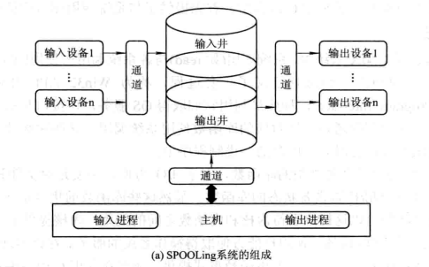

- SPOOLing系统的特点：
  - 提高了IO的速度：对低速设备的IO操作转换为对输入输出井的IO操作，提高了IO的速度
  - 将独占设备改造为共享设备：在假脱机打印系统中，并没有为任何进程分配设备，而只是在磁盘缓冲区中为进程分配了一个空闲盘块和建立一张IO请求表。这样，便把独占设备改造为共享设备。
  - 实现了虚拟设备的功能：宏观上多个进程使用的是同一台设备，但是对于每一个进程而言，它都以为自己使用的设备是独占设备，从而实现了将独占设备虚拟化的功能。
- 假脱机打印机系统：
  - 组成：
    - 磁盘缓冲区：暂存用户的输入数据
    - 打印缓冲区：缓和CPU与磁盘之间速度不匹配的矛盾
    - 假脱机管理进程和假脱机打印进程：假脱机管理进程为每个要求打印的用户数据建立一个假脱机文件，并放入假脱机文件队列中，由假脱机打印进程依次对假脱机文件队列中的文件进行打印。
  - 工作流程：
    - 用户进程发出打印输出请求
    - 假脱机管理进程完成两项工作：在磁盘缓冲区申请一个空闲盘块，并将要打印的数据送入其中暂存；为用户进程申请一张空白的用户请求打印表，并将用户的打印要求填入其中，挂到假脱机文件队列上。
    - 对于用户进程来说，打印输出任务已经完成
    - 假脱机打印进程从假脱机文件队列中取出一张请求打印表，根据表中的要求将要打印的数据由输出井传送到内存缓冲区，再交付打印机进行打印
- 守护进程：
  - 取消假脱机管理进程，为打印机建立守护进程，执行一部分假脱机管理进程的功能，另一部分功能由请求进程自己完成。
  - 每个要求打印的进程首先生成一份要求打印的文件，其中包含对打印要求和指向装有打印输出数据盘块的指针等信息，然后将用户请求打印文件放入假脱机文件队列中。
  - 守护进程是唯一允许使用打印机的进程，所有需要使用打印机的进程只能将任务转交给守护进程完成。
  - 除了打印机守护进程，还有服务器守护进程，网络守护进程等。

### 缓冲区管理

缓冲的引入：

- 缓和CPU和IO设备间速度不匹配的矛盾
- 减少对CPU的中断频率，放宽对CPU中断响应时间的限制
- 解决数据粒度不匹配的问题
- 提高CPU和IO设备的并行性

单缓冲区和双缓冲区：

- 单缓冲区：每当用户进程发出一IO请求时，OS便在主存中为之分配一个缓冲区。块设备输入时，T=块数据从磁盘传送到缓冲区的时间，M=块数据从缓冲区传送到用户区的时间，C=CPU处理块数据的时间，则系统处理块数据的时间为Max（C，T）+ M。字符设备输入时，缓冲区用于暂存用户输入的一行数据，在输入期间，用户进程被挂起等待输入；输出时，用户进程将一行数据输出到缓冲区后继续及进行处理，如果用户进程已经有第二行输出，但第一行数据还没有处理完，用户进程将被阻塞。
- 双缓冲区：设备输入时，先将数据送入第一缓冲区，装满后便转向第二缓冲区，此时操作系统可以先对第一缓冲区中的数据进行处理。对于字符设备，若采用行输入方式，采用双缓冲能够消除用户的等待时间。两台机器之间通信时，通常会设置发送缓冲和接收缓冲，以便实现全双工通信。

环形缓冲区：

- 环形缓冲区的组成：多个缓冲区，分为空缓冲区R、满缓冲区G、现行工作缓冲区C。多个指针，分为计算进程下一个处理的缓冲区Nextg、输入进程下一个可用的空缓冲区Nexti、计算进程正在使用的缓冲区指针Current。
- 环形缓冲区的使用：getbuf过程，Current=Nextg，Nextg=下一个处理的G缓冲区；或者Current=Nexti，Nexti=下一个处理的R缓冲区。Releasebuf过程，释放缓冲区C，改为R缓冲区或G缓冲区。
- 进程之间的同步问题：Nexti赶上Nextg，输入进程阻塞；Nextg赶上Nexti，计算进程阻塞。

缓冲池：为了提高缓冲区的利用率，建立缓冲池，由缓冲池完成缓冲区的创建、分配和回收。

- 缓冲池的组成：缓冲首部+缓冲体，缓冲首部=缓冲区号+设备号+设备上的数据块号+同步信号量+队列链接指针。相同类型的缓冲区链接成缓冲队列，形成空白缓冲队列、输入队列和输出队列。

- Getbuf过程和Putbuf过程：

  ```c
  void Getbuf(unsigned type){
      Wait(RS(type));//实现同步
      Wait(MS(type));//实现互斥访问
      B(number)=Takebuf(type);
      Signal(MS(type));//实现互斥访问
  }
  
  void Putbuf(type, number){
      Wait(MS(type));//实现互斥访问
      Addbuf(type,number);
      Signal(MS(type));//实现互斥访问
      Signal(RS(type));//实现同步
  }
  ```

- 缓冲区的工作方式：

  - 收容输入：从空缓冲队列中摘取一个空缓冲区，作为收入输入工作缓冲区，输入数据，插入输入队列
  - 提取输入：从输入队列中摘取一个输入缓冲区，作为提取输入工作缓冲区，计算进程从中提取数据，计算完成后再插入空缓冲队列
  - 收容输出：从空缓冲队列中摘取一个空缓冲区，作为收容输出工作缓冲区，当其中装满输出数据后，插入输出队列中
  - 提取输出：从输出队列中摘取一个输出缓冲区，作为提取输出工作缓冲区，从中提取数据，数据提取完成后，插入空缓冲队列中

### 磁盘存储器的性能和调度

改善磁盘系统性能的途径：1、选择好的磁盘调度算法，减少磁盘寻道时间；2、提高磁盘IO速度，以提高对文件的访问速度；3、采取冗余技术，提高磁盘的可靠性，建立高度可靠的文件系统。

磁盘性能简述：

- 数据的组织与格式：磁盘由多个物理盘片组成，每个物理盘片分一至两个盘面，每个盘面上有若干同心圆称为磁道，每条磁道由若干扇区组成，每个扇区称为一个盘块，存储一个数据块。现代磁盘内外道的扇区数不相等，但为OS提供的虚拟几何磁盘扇区数是一致的。
- 温切斯特盘格式化：1磁道=30扇区，1扇区=88字节控制信息+512字节数据。每个扇区包括两个字段：1、标识符字段：其中一个字节的SYNCH作为字段的定界符，利用磁道号、磁头号、扇区号标识一个扇区，CRC字段用于段检验；2、数据字段512字节。磁盘的一个盘面的不同磁道之间，同一磁道的不同扇区之间通常会添加若干字节的间隙，方便磁头寻道。
- 磁盘分区：逻辑上，每个分区就是一个逻辑上的磁盘。每个分区的起始扇区和大小都记录在磁盘0扇区的主引导记录分区表所包含的分区表中。分区表中必须有一个分区被标记为活动的，保证能够从磁盘中引导系统。
- 磁盘类型：固定头磁盘、移动头磁盘
- 磁盘访问时间：
  - 寻道时间$T_s = m \times n + s$，m表示磁头移动的速度常量、n是磁头移动的磁道数，s是启动磁头的时间
  - 旋转延迟时间$T_\tau$，指定扇区移动到磁头下面所经历的时间，是转速的倒数的一半
  - 传输时间$T_t = \frac b {rN}$，r是磁盘转速，N是一条磁道上的字节数，b是每次读写的字节数
  - 磁盘访问时间$T_a = T_s + \frac 1 {2r} + \frac b {rN}$

磁盘调度算法：

- 先来先服务（FCFS）
- 最短寻道时间优先（SSTF）
- 扫描（SCAN）算法：又名电梯算法
- 循环扫描（CSCAN）算法：到达最外磁道后立即返回最里磁道
- NStepSCAN算法：将磁盘请求队列划分为若干子队列，队列之间采用FCFS算法，队列内部采用SCAN算法
- FSCAN算法：只分成两个队列，一个队列是由当前所有请求磁盘IO的进程组成的，另一个是由扫描期间新出现的所有请求磁盘IO的进程组成的，第二个队列的请求被留到下一次处理。

## 文件管理

### 文件和文件系统

数据项：基本数据项=字段，组合数据项=由基本数据项直接组成的数据项

记录：一组相关数据项的集合

关键字：唯一标识一个数据记录的数据项

文件：

- 概念：由创建者所定义的、具有文件名的一组相关元素的集合

- 分类：有结构文件和无结构文件两种

- 文件属性：文件类型、文件长度、文件的物理位置、文件的建立时间
- 文件名：唯一标识一个文件的字符串
- 扩展名：添加在文件名称之后的若干个附加字符，指示文件的类型
- 文件类型：按照用途分类，系统文件、用户文件、库文件；按文件中的分类，源文件、目标文件、可执行文件；按存取控制属性区分，普通文件、目录文件、特殊文件

文件系统的层次结构：

-  对象及其属性：
  - 文件：文件管理的直接对象
  - 目录：方便用户对文件的检索，在文件系统中配置目录，目录项包含文件名、文件属性、文件所在的物理地址
  - 磁盘存储空间
- 对对象操纵和管理的软件集合：
  - 文件系统的功能：对文件存储空间的管理、对文件目录的管理、用于将文件的逻辑地址转换为物理地址的机制、对文件读和写的管理、对文件的共享与保护等功能
  - 文件系统相关软件的层次：IO控制层、基本文件系统层、基本IO管理程序、逻辑文件系统
- 文件系统的接口：命令接口、程序接口

文件操作：

- 最基本的文件操作：打开、关闭、读、写、设置文件的读写位置
- 文件的打开和关闭操作：所谓打开是指文件名和文件属性从外存读入内存的打开文件表目中，并将表目的编号返回给用户。关闭则是反向的操作。
- 其它文件操作：对文件属性的操作、目录的操作

### 文件的逻辑结构

文件的逻辑结构：用户观点出发所接触到的文件组织形式，即文件是由一系列逻辑记录组成的，是用户可以直接处理的数据及其结构，独立于文件的物理特性，又称为文件组织

文件的物理结构：又称为文件的存储结构，系统将文件存储在外存上所形成的一种存储组织形式，是用户不能看见的。文件的物理结构不仅与存储介质的存储性能有关，而且与所采用的外存分配方式有关。无论是文件的逻辑结构，还是其物理结构，都会影响对文件的检索速度。

文件逻辑结构的类型：

- 按文件是否有结构进行分类：有结构文件，如信息管理系统和数据库系统中使用的文件；无结构文件，流式文件
- 按文件的组织形式分类：顺序文件，一系列记录按照顺序排列所形成的文件；索引文件，为可变长记录文件建立一张索引表，加快对记录的检索速度；索引顺序文件，为一组可变长文件建立索引

顺序文件：

- 顺序文件的排列方式：串结构，按照文件存储时间的先后排序；顺序结构，按照记录的关键字排序。
- 顺序文件的优缺点：存储效率最高、支持顺序存储设备如磁带、查找性能差、增删元素困难

记录寻址：

- 隐式寻址方式：类似数组的寻址、对于变长记录顺序文件，需要获得之前记录的长度之和
- 显示寻址方式：对于定长记录顺序文件可以实现随机访问，对于变长记录顺序文件可以利用关键字进行查询。

索引文件：

- 按关键字建立索引：对于变长记录顺序文件，可以建立定长记录的索引表，从而加快变长记录顺序文件记录的查找
- 具有多个索引表的索引文件：根据查询属性的不同，可以建立多个索引表，根据需求选择不同的索引表

索引顺序文件：

- 索引顺序文件的特征：使用索引表进行随机访问，使用溢出文件记录新增加、删除、修改的记录
- 一级索引：使用索引表索引记录组
- 两级索引：在一级索引的基础上建立索引的索引

直接文件和哈希文件：

- 直接文件：使用散列函数直接将记录的关键字映射为物理地址
- 哈希文件：通过哈希函数将文件名映射为目录表的一个表目

### 文件目录

目录管理的要求：按文件名存储、提高目录的检索速度、文件共享、允许文件重名

文件控制块FCB：文件存在的根本凭据

- 基本信息类：文件名、文件的物理位置、文件的逻辑结构、文件的物理结构
- 存取控制信息类：文件主的存取权限、核准用户的存取权限、一般用户的存取权限
- 使用信息类：文件建立的日期时间、文件上一次修改的日期时间当前使用信息

索引结点：

- 索引结点的引入：检索文件时，只需要查询文件名，因此可以将文件名与文件的描述信息分开存放，将文件描述信息封装成索引结点的数据结构，简称i结点。
- 磁盘索引结点：文件主标识符、文件类型、文件的存取权限、文件的物理地址、文件长度、文件连接计数、文件的存取时间
- 内存索引结点：索引结点编号、状态、访问计数、文件所属文件系统的逻辑设备号、指向空闲链表和散列队列的链接指针

简单的文件目录：

- 单级文件目录：整个系统中只设置一张文件目标表，缺点是查找速度慢、不允许重名、不便于实现文件共享
- 两级文件目录：建立专属于用户的文件目录UFD，再建立主文件目录存储UFD的目录
- 树形结构目录：
  - 文件是叶节点，目录是内部节点。路径名是用“/”等分隔符链接的文件树的路径。
  - 相对路径名是相当于当前目录节点的子树的路径，绝对路径名是指相对于根节点的树的路径。
  - 目录操作：创建目录、删除空目录、递归删除目录、改变目录、移动目录、硬链接、查找

目录查找技术：

- 查找过程：根据文件名查找目录项，根据FCB或索引结点中记录的文件物理地址换算文件在磁盘上的物理地址，通过磁盘驱动程序将文件读入内存
- 线性检索法：就是所谓的顺序查找
- Hash方法：利用Hash将文件名映射为文件目录，再进行查找

### 文件共享

基于有向无环图实现文件共享

- 有向无环图DAG：在严格的树结构中，一个结点只能有最多一个双亲结点，所以不适合用于文件共享。但是，如果允许一个结点拥有超过1个双亲结点，虽然破坏了树的结构，但是用于文件共享却能够让不同用户使用对称的方式共享同一个文件。
- 利用索引结点：共享文件的物理地址出现在多个双亲的目录中，如果分别进行修改，则各自新增的部分将不能被共享。所以，引入索引结点，将文件的物理地址等文件属性存放在索引结点中，共享文件的双亲目录中填写索引结点的指针，修改共享文件时，通过指针找到索引结点，再进行修改，这样就能实现文件修改的共享。

利用符号链接实现文件共享：

- 利用符号链接的基本思想：文件可以进行共享，但只能有一个主父目录，其余几个父目录都通过符号链接的形式与主父目录链接。
- 利用符号链接实现文件共享的方式：引入特殊的LINK文件（如快捷方式等），存储被链接文件的路径名
- 利用符号链接实现文件共享的优点：当共享文件主删除文件后，不会留下野指针，只会留下无效的LINK文件。
- 利用符号链接实现文件共享的缺点：先要读取LINK文件找到共享文件的路径，第二步才能读取目标文件。需要给LINK文件也分配索引结点，造成空间上的一定开销。

### 文件保护

影响文件安全性的主要因素有：1、人为因素；2、系统因素，如出现某些故障；3、自然因素，随着时间的推移，存储在磁盘上的文件会消失。

确保文件系统的安全性所采取的措施：1、通过存取控制机制防止人为因素造成的文件不安全性；2、采取系统容错技术防止系统部分的故障所造成的文件不安全性；3、建立后备系统防止由自然因素所造成的文件不安全性。

保护域：

- 访问权：把一个进程能够对某个对象执行操作的权力称为访问权，可以用一个有序对（对象名，权集）来表示
- 保护域：进程对一组对象访问权的集合，进程只能在指定域中进行操作
- 进程和域之间的静态联系：进程和域之间可以一一对应，在进程的整个生命中，其可用资源是固定的，这种域称为静态域。这种情况下，会造成赋予进程的访问权超过了实际需要。
- 进程和域之间的动态联系的方式：进程和域之间也可以是一对多的关系，一个进程可以联系多个域，将进程的运行分为若干阶段，每个阶段联系着一个域，根据进程的实际需要来规定在进程运行的每个阶段中实际能够访问的对象。

访问矩阵：

- 基本的访问矩阵：行代表域，列代表对象，矩阵中的每一项表示在某个域中能否访问某个对象。
- 具有域切换权限的访问矩阵：将进程从一个保护域切换到另一个保护域视为一种权力，当进程有切换权时才能执行保护域的切换。因此，在访问矩阵中添加几列，表示是否允许切换到某个保护域。

访问矩阵的修改：

- 拷贝权：利用拷贝权将某个域中的访问权拷贝到其它域中，为进程在其它域中赋予相同的访问权。如果某项访问权允许拷贝，就加上*号，但是拷贝权本身不能传递。
- 所有权：利用所有权可以对访问权进行增加、修改和删除。
- 控制权：用于改变访问矩阵中同一行内的各项访问权，或者说用于改变在不同域中运行的进程对同一个对象的访问权。

访问矩阵的实现：将访问矩阵按照行或列划分为访问控制表或访问权力表

- 访问控制表：访问矩阵按列进行划分，删除访问矩阵中同一列的空项；域是一个抽象的概念，可以具体化为用户；还可以定义缺省的访问控制表，访问某个对象时先查找该表，在查找具体于对象的访问控制表。
- 访问权限表：把访问矩阵按照行进行划分，每一行构成一张访问控制表，表中一般有三个字段，分别是对象的类型、访问权、对象的指针。仅当访问权限表是安全的，它所保护的对象才是安全的。因此，访问权限表不能被用户直接访问，只有通过访问合法性检查通过的程序才能访问该表。
- 目前系统常采用的方式是同时使用访问控制表和访问权限表。

## 磁盘存储器的管理

### 外存的组织方式

常用的外存组织方式：

- 连续组织方式：为每一个文件分配连续的存储空间
- 连接组织方式：为文件分配不连续的存储空间，并使用链接指针连接起来。
- 索引组织方式：建立索引表，索引文件的所有数据块

连续组织方式：

- 逻辑存储顺序=物理存储顺序
- 主要优点：顺序访问容易、顺序访问速度快
- 主要缺点：要求连续的存储空间，产生大量外碎片；必须事先知道文件的大小，以便分配存储空间；不能灵活地进行添加和删除；难以存储大小动态增长的文件。

链接组织方式：

- 主要优点：消除了外碎片，提高了外存的利用率；对添加、删除、修改记录都非常容易；能适应文件的动态增长，无需事先确定文件的大小。
- 隐式链接：文件目录的每个目录项都含有链接文件的头指针和尾指针。隐式链接的主要问题是只适合顺序访问，不适合随机访问，如果某个数据块发生损坏，将导致后面的数据块不可见。
- 显式链接：类似于静态链表的数据结构，使用专门的文件分配表存储文件的链接信息。

FAT技术：

- 引入卷的概念，将一个物理磁盘分为若干逻辑磁盘，每个逻辑磁盘可以使用不同的文件组织方式。
- 早期的FAT12文件系统：每个分区中设置两张文件分配表FAT1和FAT2，将文件分配表中的头指针存放在文件的FCB中。FAT每个表项占12位，最多允许4096个表项，每个盘块的容量为512KB，因此相应每个逻辑磁盘的最大容量为8MB，但磁盘的容量很快就超过了8MB。
- 以簇为单位的FAT12文件系统：簇表示连续的一组盘块，FAT中使用簇代替盘块，能够增加磁盘的容量，但是也会造成簇内碎片的增加，通常只能将磁盘的容量增大至十几MB。
- FAT16：将FAT表项的位数扩展为16位，并且将簇的最大盘块数提升至64。
- FAT32：将FAT表项的位数扩展为32位，允许管理更多的簇，允许采用较小的簇。FAT32的缺点为，由于FAT长度的扩展，运行速度下降；不支持容量小于512MB的分区；单个文件的长度不能大于4GB；不能保持向下兼容。

NTFS文件组织方式：

- NTFS新特征：使用64位磁盘地址，支持长文件名，系统容错功能，数据一致性保证
- 磁盘组织：以簇作为磁盘空间分配和回收的基本单位，一个文件占用若干簇，一个簇只属于一个文件。卷上簇的大小称为卷因子，一般在磁盘格式化时就固定下来。默认簇的大小一般为4KB。使用逻辑簇号LCN和虚拟簇号VCN进行簇的定位，LCN相对于磁盘进行编号，VCN相对于文件进行编号，进行地址映射时，将LCN与卷因子相乘即可。
- 文件组织：在NTFS中，以卷为单位，将一个卷中的所有文件信息、目录信息以及可用的未分配的空间信息，都以文件记录的方式记录在一张文件主控表MFT中，该表是NTFS卷结构的中心。从逻辑上讲，卷中的每个文件作为一条记录，在MFT表中占有一行，其中还包括MFT本身所占一行。每行固定大小1KB，每行称为该行所对应文件的元数据或文件控制字。在MFT表中，每个元数据都将所对应文件的全部信息（包括文件的内容）组织在所对应文件的一组属性中。当文件较小时，可以直接将其记录在元数据中；否则，将其余属性哦记录在卷中的其它簇中，并按所记录文件的属性进行分类，分别链接成多个队列，并将指针存放在元数据中。

索引组织方式：

- 单级索引组织方式：

  - 链接组织方式的缺点：不能支持高效的直接存取；FAT需占用较大的内存空间
  - 单级索引组织方式：为每个文件建立一个索引块，把分配给该文件的盘块号都记录在索引块中，将索引块的指针存放在目录项中。
  - 主要优点：支持直接访问，不会产生外部碎片
  - 主要缺点：对于小型文件，仍然需要分配索引块，空间开销较大。

- 多级索引组织方式：

  - 当某个文件的盘块数过多时，一个索引块装不下，需要多个索引块。
  - 多级索引：索引的索引，将索引块的盘块号记录在二级索引表中
  - 多级索引的优缺点：主要优点是，大大加快了对大型文件的查找速度；主要缺点是，在访问一个盘块时，启动磁盘的次数随着索引级数的增大而增大，即使对于小文件亦是如此。

- 增量式索引组织方式：

  - 基本思想：兼顾不同大小的作业，多元化组织方式构成文件的物理结构。

    1、对于小文件，直接将盘块地址放入文件控制块FCB中；

    2、对于中等文件，采用单级索引组织方式；

    3、对于大型和特大型文件，采用多级索引组织方式。

  - UNIX System V组织方式：在UNIX System V的索引结点中设有13个地址项目，即i.addr(0)~i.addr(12)

    - 直接地址：在索引结点中可以设置10个直接地址项，即用i.addr(0)~i.addr(9)来存放直接地址，也称为直接盘块号。
    - 一次间接地址：对于大中型文件，再利用索引结点中的地址项i.addr(10)来提供一次间接地址，实质是一级索引分配方式。
    - 多次间接地址：当文件长度大于4MB+40KB时，采用二次间址分配方式，这时，使用i.addr(11)提供的二次间接地址，该方式的实质是两级索引分配方式。采用二次间接地址，文件最大长度可以是4GB。同时，i.addr(12)作为三次间接地址，文件最大长度可以是4TB。

### 文件存储空间的管理

文件存储空间的管理：设置磁盘分配表，记录可供分配的存储空间情况；提供对盘块进行分配和回收的手段。

空闲表法：

- 空闲表：空闲表法属于连续分配方式，与内存的动态分配方式雷同，为文件分配连续的存储空间。建立空闲表，每个空闲区对应一个表项，其中包括表项序号、该空闲区的第一个盘块号、该区的空闲盘块数等信息。再将所有空闲区按起始盘块号递增的次序排列，形成空闲盘块表。
- 存储空间的分配与回收：与内存空间的分配与回收类似，同样是采用首次适应算法或最佳适应算法在系统为新创建的文件分配空闲盘块时，采用顺序查找法查找第一个适合的盘块，修改空闲表；系统回收盘块时，修改空闲表，并且将相邻的空闲盘块进行合并。

空闲链表法：

- 将所有空闲盘区拉成一条空闲链，根据构成链所用元素的不同，可以把链表分为两种形式：空闲盘块链和空闲盘区链。
- 空闲盘块链：每个盘块都设置后继指针，链接成空闲盘块链。
- 空闲盘区链：每个空闲盘区都设置后继指针，链接成空闲盘区链。

位示图法：利用一位二进制位表示盘块的使用与否，分配和回收盘块时直接对位示图进行修改

成组链接法：

- 空闲盘块的组织：

  - 空闲盘块号栈：存放当前可用一组空闲盘块的盘块号（最多含100个号），以及栈中尚有的空闲盘块(号)数N。顺便指出，N还兼作栈顶指针用。栈是临界资源，每次只允许一个进程去访问，故系统为栈设置了一把锁。其中S.free(0)为栈底，S.free(99)为栈顶。

    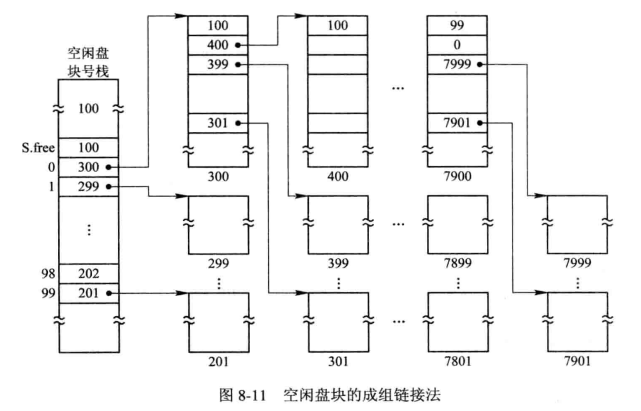

  - 文件区中的所有空闲盘块被分成若干组

  - 将每一组含有的盘块总数N和该组所有盘块号j记入前一组的第一个盘块的S.free(0)~S.free(99)中，各组的第一个盘块可以链接成一条链。

  - 将第一组的盘块总数和所有盘块号记入空闲盘块号栈中，作为当前可供分配的空闲盘块号。最末一组只有99个盘块，其盘块号分别记入前一组第一个盘块的S.free(1)~S.free(99)中，S.free(0)中则存放0。

- 空闲盘块的分配与回收：分配盘块时，调用盘块分配过程来完成。首先获得空闲盘块号栈的锁，从栈顶取出一个空闲盘块号，将对应的盘块分配给用户。如果该盘块号已经是栈中最后一个元素，把下一组第一个盘块中存储的空闲盘块号和空闲盘块数拷贝过来作为新的空闲盘块号栈的内容，然后把被拷贝的盘块分配给用户。回收时正好相反。

### 提高磁盘IO速度的途径

提高磁盘IO速度的途径：

- 改进文件的目录结构以及检索目录的方法来减少对目录的查找时间
- 选取好的文件存储结构，以提高对文件的访问速度
- 提高磁盘的IO速度，能将文件中的数据快速地从磁盘传送到内存中

磁盘高速缓存：

- 在内存中为磁盘设置的缓冲区，保存外存中某些盘块的副本。当出现对外存的访问请求时，先查看磁盘缓存中有没有需要的盘块，如果没有再去启动磁盘。
- 数据交付方式：数据交付就是将缓冲区中的数据交付给请求进程。有两种交付方式，一种是数据交付，直接进行内存的拷贝；另一种是指针交付，不拷贝数据，只传送指针。
- 置换算法：读取磁盘之后，如果缓冲区的数据已满，就要执行置换算法，覆盖不用的盘块数据。
  - 较常用的算法是，最近最久未使用算法LRU、最近未使用算法NRU、最少使用算法LFU。
  - 系统在设计高速缓冲的算法时，需要的考虑的因素有，最近最久未使用、访问频率、可预见性、数据的一致性
- 周期性地写回磁盘：根据LRU算法，经常被使用的盘块数据一直滞留在高速缓冲中，没有被写回。为了解决这一问题，UNIX系统中增设了一个修改程序，在后台运行，该程序周期性地调用一个系统调用SYNC，强制性地将高速缓冲中的数据同步到磁盘中，同步周期一般定为30s。

提高磁盘IO的其他方法：

- 提前读：如果采用顺序访问方式对文件进行访问，便可以预知下一次要读的盘块，此时就可以将下一次要访问的盘块预先读入缓冲区，从而减少读数据的时间。
- 延迟写：缓冲区中的数据本来应该立即写入磁盘，但是考虑到数据不久之后会被本进程或其他进程访问，因此并不立即执行写磁盘，而是挂在空闲缓冲区的末尾，当该缓冲区被再次使用的时候，再将里面的数据写入磁盘中。
- 优化物理块的分布：在采用链接和索引方式组织文件的时候，为了减少磁头的移动距离，尽量将同一个文件的所有盘块集中放置，减少此磁头移动的距离。
- 虚拟盘：由于访问内存的速度明显高于访问磁盘的速度，因此考虑将内存的一部分空间虚拟为磁盘,，形成所谓的虚拟盘，又称RAM盘。设备的驱动程序可以接受任何标准的磁盘操作，但是实际操作的却是内存。但是虚拟盘的存储介质是内存介质，断电后数据就会丢失，通常仅用于存储临时文件和目标程序。虚拟盘和缓冲的区别在于，虚拟盘是直接受用户控制的，而缓冲区是完全受OS控制的。

廉价磁盘冗余阵列（RAID）：

- 冗余思想：如果一个组件对性能的改进受到了很大的限制，那么可以通过使用多个相同的组件来获得性能的大幅度提高。
- RAID原理：利用一台磁盘阵列控制器统一管理和控制一组磁盘驱动器，组成一个大型磁盘系统，RAID不仅增大了磁盘的容量，同时也极大地提高了磁盘的IO速度和整个磁盘系统的可靠性。
- 并行交叉存取：例如，将数据块按照ABCDABCD...的方式并行存放在四个磁盘中
- RAID分级：
  - 0级：提供并行交叉存储
  - 1级：在0级的基础上提供了磁盘镜像的功能
  - 3级：具有并行传输功能，利用一台奇偶校验盘进行校验
  - 5级：具有独立传送功能的磁盘阵列，每个驱动器都有各自独立的数据通路，独立地进行读写，无需专门的校验盘，用来进行校验的信息以螺旋方式散布在所有数据盘上。
  - 6级和7级：强化了的RAID，在6级中设置了一个专用的、可快速访问的异步校验盘，该盘具有独立的数据访问通路。7级是对6级的改进，在该阵列中的所有磁盘都具有较高的传输速度和优异的性能。
- RAID的优点：可靠性高、磁盘IO速度高、性能/价格比高

### 提高磁盘可靠性的技术

第一级容错技术SFT-Ⅰ

- 双份目录和双份文件分配表：在不同的磁盘或者磁盘的不同区域备份文件目录和文件分配表
- 热修复重定向和写后读校验：热修复重定向是指系统将磁盘的一小部分作为热修复重定向区，存放当磁盘有缺陷时的待写数据，并对写入该区的数据进行登记，以便后续访问。写后读校验是指向磁盘写入数据后，立即读出送入另一缓冲区，并与内存缓冲区中的数据进行比对。

第二级容错技术SFT-Ⅱ：防止由磁盘驱动器或者磁盘控制器发生故障造成的系统不能正常工作

- 磁盘镜像：在同一磁盘控制下建立镜像磁盘，每次写入时都进行同步处理
- 磁盘双工：将两台磁盘驱动器接到两个磁盘控制器上，使这两个磁盘机镜像成对

基于集群技术的容错功能：

- 集群：由一组互连的计算机组成统一的计算机系统，形成一个逻辑上的整体
- 集群系统的主要工作方式：热备份模式、互为备份模式、公用磁盘模式
- 双机热备份模式：主从服务器，主服务器宕机后，从服务器称为新的主服务器，宕机的主服务器修复成功后作为新的从服务器。使用镜像服务器链路和网卡将主从服务器连接在一起。此外，设置某种机制完成主从服务器的数据同步。
- 双机互为备份模式：平时两台服务器均为在线服务器，完成不同的功能。为了实现两者互为备份的功能，在两台服务器之间，通过某种专线将其连接起来。为了存储备份的数据，每台服务器最好配置两台硬盘，一台自用，一台用于存储备份数据作为镜像盘。正常情况下，本地用户不能访问镜像盘。一旦其中某台服务器发生了宕机，另一台服务器通过专线验证是否发生宕机。如果故障被证实，备份服务器向故障服务器的客户发出广播信息，执行服务器的切换。这样，客户机无需重新登录就能够使用备份服务器提供的服务，只是网络服务的速度稍微慢一些。
- 公用磁盘模式：将多台计算机连接到一台公共磁盘系统上，该公共磁盘被划分为若干卷，每台计算机使用一个卷。如果某台计算机发生故障，后备计算机替代故障计算机提供服务，接管故障计算机所拥有的卷。

后备系统：

- 后备系统：一个完整的系统中后备系统是必须的，一方面磁盘的容量是有限的，因而不得不将暂时不用但仍然有用的数据存放到后备系统中。
- 磁带机：只适合存储顺序文件，容量可以很大，存取速度较慢
- 移动磁盘：携带方便，速度快，保存时间较长，但是费用比较贵
- 固定硬盘驱动器：在一个系统中配置两个硬盘，每个硬盘划分为数据区和备份区，每天定时将数据区中的数据拷贝至另一个硬盘的备份区。
- 光盘驱动器：只读光盘驱动器CD-ROM和DVD-ROM只能播放，不能写入，所以难以作为后备设备。可读写光盘驱动机，又称为刻录机，可读可写，可以作为后备设备。

### 数据一致性控制

事务：

- 用于访问和修改数据项的一个程序单位，也可以被看成是一组相关的读和写操作。只有对分布在不同位置的同一数据所进行的读和写操作全部完成，才能提交事务。但是，只要这些操作中有一个读、写或修改操作失败，便必须执行回滚操作。
- 事务的ACID属性：
  - 原子性：事务所执行的操作要么全部成功，要么全部失败
  - 一致性：事务在完成时，必须使所有的数据都保持一致状态
  - 隔离性：一个事务对数据的修改，必须与其他任何与之并发的事务保持隔离
  - 持久性：事务完成之后，对于系统的影响是永久性的
- 事务记录：存放在稳定存储器中，记录事务在运行期间数据项修改的全部信息，故又称为运行记录。记录中包括以下字段，事务名、数据项名、旧值、新值。
- 恢复算法：$undo<T_i>$，该过程把所有事务$T_i$修改过的数据恢复为修改前的值。$redo<T_i>$，该过程能把所有被事务$T_i$修改过的数据设置位新值。如果系统发生故障，系统会对以前发生的事务进行清理。通过查找事务表，可以把尚未清理的事务分为两类，一类是包含的各类操作都已经完成的事务，这类事务中，已经调用了commit方法完成事务的提交；另一类是其所包含的各个操作并未全部完成的事务，在这类事务中，没有调用commit方法完成事务的提交。对于前者，系统利用redo方法将所有修改的数据设置为新值；对于后者，系统利用undo方法将所有修改的数据恢复为修改之前的值。

检查点：

- 检查点的作用：事务记录清理工作常态化，周期性执行。
  - 首先将驻留在内存或易失性存储器中的当前事务记录表中的所有记录输出到稳定存储器中
  - 其次是将驻留在内存或易失性存储器中的所有已修改数据输出到稳定存储器中
  - 然后是将事务记录表中的（检查点）记录输出到稳定存储器中
  - 最后是每出现一个（检查点）记录时，系统便执行恢复操作。
- 新的恢复算法：不需要对事务记录表中的所有事务进行处理，只需要对最后一个检查点之后的事务记录进行处理。

并发控制：

- 把用于实现事务顺序性的技术称为并发控制。
- 利用互斥锁实现顺序性：
- 利用互斥锁和共享锁实现顺序性：共享锁实际上就是所谓的读写锁

重复数据的一致性问题：

- 重复文件的一致性问题：修改文件后，查找文件目录，得到文件副本的索引结点，施加相同的修改；为新修改的文件建立新的副本。
- 链接一致性检查：索引结点中的链接计数与共享文件的实际链接计数要保持一致。执行链接一致性检查时，对文件系统树进行遍历，得到实际的链接技术，与索引结点中的链接计数进行比对。

## 操作系统接口

### 用户接口

字符显示式联机用户接口：就是所谓的“黑窗口”，采用命令行和批处理文件的形式输入命令。

图形化联机用户接口：X-Window、WIndows等GUI

联机命令的类型：系统访问类、文件操作命令、目录操作命令、输入输出重定向命令、管道连接命令、过滤命令、批处理命令等

### Shell命令语言（略）

### 联机命令接口的实现

键盘终端处理程序：接受用户从终端上打入的字符、字符缓冲用于暂存所接收的字符、回送显示、屏幕编辑、特殊字符的处理等

### 系统调用的概念和类型

程序接口是OS专门为用户程序设计，提供给应用程序开发人员在编程时使用，是用户程序取得OS服务的唯一途径，由一组系统调用构成。

系统调用的基本概念：

- 系统态和用户态：计算机系统分为系统态和用户态，相应地，将指令分为特权指令和非特权指令。特权指令是指在系统态运行的指令，具有最高权限，只允许OS使用，不允许应用程序使用，以免引起系统混乱。非特权指令是指在系统态运行的指令，只能完成一般性的操作和任务，不能对系统中的硬件和软件直接进行访问，堆内存的访问范围也局限于用户空间。
- 系统调用：使应用程序可以通过它间接调用OS中的相关过程，并取得相应的服务。系统调用本质上是请求OS内核完成某功能时的一种过程调用，但是与一般的过程调用还是有一定的区别。
  - 运行在不同的系统状态：调用程序运行在用户态，被调用程序运行在系统态
  - 状态的转换：通过软中断机制，先由用户态切换为系统态，经内核分析后，才能转向相应的系统调用处理子程序。
  - 返回问题：在采用抢占式调度方式的系统中，在被调用过程执行完后，要对系统中所有要求运行的进程做优先权分析。当调用进程具有最高优先级时，才返回到调用进程继续执行；否则，将引起重新调度，以便让高优先级进程优先执行，此时，把调用进程放入就绪队列。
  - 嵌套调用：系统调用的嵌套深度是有限的。
- 中断机制：系统调用是通过中断机制实现的，并且一个操作系统中的所有系统调用都是采用同一个中断入口实现的。对于拥有保护机制的操作系统，中断机制本身也是受保护的，只有授权给应用程序保护等级的中断号，才能被应用程序调用。

系统调用的类型：

- 进程控制类系统调用：
  - 创建和终止进程的系统调用：
  - 获得和设置系统进程属性的系统调用：
  - 等待某事件出现的系统调用：
- 文件操纵类系统调用：
  - 创建和删除文件
  - 打开和关闭文件的系统调用：
  - 读和写文件的系统调用
- 进程通信类系统调用：
  - 采用消息传递方式通信时，应用源进程发出打开连接的系统调用，目标进程利用接受连接的系统调用表示同意进行通信；然后进程之间可以通过发出和接收消息的系统调用进行通信；通信结束之后，利用关闭连接的系统调用结束通信。
  - 利用共享存储区进行通信时，通过系统调用建立共享存储区，再利用建立连接的系统调用将共享存储区连接到进程自身的虚地址空间上，然后便可利用读写共享存储区的系统调用进行通信。
- 其它常见的系统调用：设备管理类系统调用、信息维护类系统调用

POSIX标准：

- 定义标准应用程序接口
- 定义了一组过程，是构造系统调用所必须的，通过调用这些过程所提供的服务，确定了一系列系统调用的功能。

### UNIX系统调用（略）

### 系统调用的实现

系统调用的实现方法：

- 系统调用号：系统调用号是系统调用的唯一标识符。在系统调用中把系统调用号传递给中断和陷入机制的方法有很多，如直接嵌入系统调用（陷入）指令中，或者将系统调用号放在指定寄存器或者内存单元中。
- 参数的设置：将参数传递给陷入处理机构和系统内部的子程序，常用的实现方式有：
  - 陷入指令自带方式
  - 直接将参数送入相应的寄存器中
  - 参数表方式
- 系统调用的处理步骤：
  - 将处理机状态由用户态切换为系统态；之后，由硬件和内核程序进行系统调用的一般性处理，即首先保护被中断进程的CPU环境，将处理机状态字PSW、程序计数器PC、系统调用号、用户栈指针以及通用寄存器内容压入堆栈；然后将用户定义的参数传送到指定的地址并保存起来。
  - 分析系统调用类型，转入相应的系统调用处理子程序，系统调用入口表中的每一项都对应一条系统调用，其中包含该系统调用参数的个数、系统调用处理子程序的人口地址等。因此，核心可利用系统调用号查找该表，找到相应系统调用处理子程序的入口并转而执行它。
  - 在系统调用处理子程序执行完毕后，恢复被中断或设置新进程的CPU环境，然后返回被中断进程或新进程，继续执行。

UNIX、LINUX、Windows系统调用的实现（略）