<h1>计算机网络复习</h1>
[TOC]

## 计算机网络概述

网络：网络把若干计算机连接在一起

互连网：互连网把若干网络连接在一起

主机：与网络连接的计算机

互联网：又名因特网（Internet），是当今世界最大的互连网

互联网的发展过程：

- 1969年美国国防部ARPNET
- 1983年TCP/IP协议诞生，互联网诞生元年
- 1985~1993年，NSFNET，三级结构互联网，分为主干网、地区网、校园（企业）网
- 1993~，多层次ISP结构互联网。ISP=Internet Service Provider，如电信、移动、联通、广电

IXP：Internet Exchange Point，允许两个网络直接相连并交换分组，不再需要第三个网络转发分组

万维网：存储在互联网计算机中、数量巨大的超文本文档的集合，超文本文档可以描述超媒体，超链接可以超文本文档

互联网的组成：

- 边缘部分：连接在互联网上的主机组成，用户直接使用
- 核心部分：网络和路由器组成，为边缘部分提供服务

计算机通信：主机A上的某个进程与主机B上某个进程通信

计算机通信方式：C/S方式、P2P对等连接

数据交换方式：==电路交换、报文交换、分组交换==

- 电路交换：整个报文的比特流连续地从源点直达终点，在专用的物理通路中传送数据，经过建立连接、数据传送、连接释放三个过程
- 报文交换：整个报文先全部传到相邻结点，全部存储下来后查找转发表，转发到下一个结点
- 分组交换：将报文分为若干分组，单个分组传送到相邻结点，存储下来后查找转发表，转发到下一个结点

计算机网络的分类：

- 按照网络的作用范围：广域网（WAN）、城域网（MAN）、局域网（LAN）、个人区域网（PAN）
- 按照网络的使用者：公用网、专用网
- 用来吧用户接入互联网的网络：接入网（AN），又称为本地接入网或居民接入网

计算机网络的性能：

- 数据率（比特率）：bps、Mbps、Gbps，注意使用十进制

  > 计算机领域采用二进制，网络、通信领域采用十进制

- 通信带宽：某个信号具有的频带宽度，单位是hz

- 网络带宽：网络中某个通道传送数据的能力，网络带宽表示信道数据率的极限，单位是bps

- 吞吐量：单位时间通过某个网络的实际的数据率

- 时延：特定数据从网络的一端传送到另一端所需的时间。

  - **发送时延**：把全部数据发送到链路上的时间，与信号传送的距离无关
  - **传播时延**：已经发送到链路上的数据传播一定的距离需要花费的时间，与信号的发送速率无关
  - 处理时延：主机或路由器收到分组后进行处理的时间
  - 排队时延：路由器具有输入队列和输出队列，分组进出路由器的排队时间就是排队时延，队列溢出会导致排队时延无穷大
  - 总时延 = 发送时延 + 传播时延 + 处理延迟 + 排队延迟

- 时延带宽积 = 传播时延 × 网络带宽

- **往返时间（Round-Trip Time，RTT）**：已经发送到链路上的信息由发送端传送到接收端，接收端发送确认信息并传送到接收端的时间。RTT主要包括传播时延、中间结点和接收端发送确认的发送时延、处理时延、排队时延

- 有效数据率 = 数据长度 / （发送时间 + RTT）

- 利用率：

  - 信道利用率：某信道有百分之几的时间是被利用的
  - 网络利用率：全网络信道利用率的加权平均值

网络协议：

1、定义：规定了计算机网络数据交换的格式以及同步问题而建立起来的规则、标准或约定。

2、网络协议三要素：语法、语义、同步

分层的目的：模块化，高内聚松耦合，不同层级处理不同问题，下层为上层提供服务

计算机网络体系结构：计算机网络各层及其协议的集合，计算机网络及其构件所应完成的功能的精确定义

1、开放系统互连基本参考模型**OSI/RM**（Open System Interconnection Reference Model）：**应用层、表示层、会话层、传输层、网络层、数据链路层、物理层**

2、**TCP/IP**四层协议：**应用层、运输层、网际层、网络接口层**，IP over everthing，Everything over IP

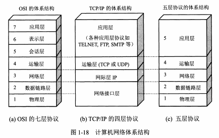

计算机网络五层协议：

1、应用层：定义应用进程通信和交互的规则，通过应用进程之间的交互来完成特定网络应用，常见的应用层协议有DNS、HTTP、SMTP，数据单元是报文

2、传输层：负责为主机通信提供通用数据传输服务，主要使用TCP和UDP协议，数据单元分别是报文段和数据报

3、网络层：负责为分组交换网上的不同主机提供通信服务，选择合适的路由。网络层运行IP协议，数据分组又称为IP数据报。

4、数据链路层：封装成帧、透明传输、差错检测

5、物理层：电气特性、硬件相关特性

实体：任何可以发送和接收信息的硬件或软件进程

协议数据单元PDU：对等层之间传送数据的单位

协议：对等层之间进行通信的约定和规则，协议是水平的

服务访问点SAP：相邻两层的实体进行交互（即交换信息）的地方

服务数据单元SDU：层与层之间交换的数据单位

服务：下层为上层提供的，可供上层调用的服务

## 物理层

信号的分类：模拟信号、数字信号

信息交互方式：单工通信、半双工通信、全双工通信

基带调制（编码）：仅仅对基带信号的波形进行变换，使它能够与信道特性相适应。由于这种基带调制是把数字信号转换为另一种形式的数字信号，因此这种过程又称为编码。

带通调制：使用载波进行调制，把基带信号的频率的范围搬移到较高的频段，并转换为模拟信号。经过载波调制后信号称为带通信号（仅在一定频率范围内能够通过信号）

常见的编码方式：

- **不归零制**：正电平和负电平
- **归零制**：正负脉冲
- **曼彻斯特**：位周期中心向上和向下跳变
- **差分曼彻斯特**：位中心处始终都有跳变，位开始边界有跳变代表0，位开始边界没有跳变代表1

基本的带通调制方式：

- 调幅AM：载波的振幅随基带数字信号而变化
- 调频FM：载波的频率随基带数字信号而变化
- 调相PM：载波的初相随基带数字信号而变化
- 正交振幅调制QAM：振幅、相位混合调制方式

奈奎斯特准则：任何信道中码元传输的速率是有上限的，传输速率超过此上限，就会出现严重的码间串扰的问题，使接收端对码元的判决成为不可能

信噪比：dB = 10 lg(S/N)，S=signal，N=noise

**香农公式**：信道的极限信息传输速率：C=Wlog<sub>2</sub>(1+S/N)，C=capacity，W=width，S=signal，N=noise

传输媒介：双绞线、同轴电缆、短波通信、地面微波接力通信、卫星通信

信道复用技术：频分复用、时分复用、统计时分复用

- **频分复用FDM**：按照频率范围划分多个频带
- **时分复用TDM**：将一个周期划分为多个时段
- **统计时分复用STDM**：划分时段小于用户数，不固定分配时隙
- **波分复用WDM**：光的频分复用
- **码分复用CDM**：更常用的名称是码分多址CDMA，每一个比特时间再划分为若干码片，使用不同的码片序列表示不同用户的0和1。码分复用要进行扩频通信。码片序列中，使用1表示1，使用-1表示0

## 数据链路层

数据链路层的信道：点对点信道、广播信道

### 使用点对点信道的数据链路层

数据链路：链路以及实现通信协议的软件与硬件构成了数据链路。网络适配器（网卡）一般都包括物理层与数据链路层的功能

点对点信道的数据链路层的PDU是帧

三个基本问题：

- 封装成帧：将IP数据报作为帧数据部分，添加首部和尾部进行帧定界，封装成帧。数据链路层协议规定了帧的数据部分长度上限——最大传送单元MTU。帧定界符SOH位于首部的开始，EOT位于尾部的结束，不完整的帧直接丢弃。
- 透明传输：如果帧定界符EOT出现在帧的数据部分，就要进行转义，才能实现透明传输。使用在数据部分中添加转义字符ESC跳过其中的控制符，转义字符通过自身进行转义。这种方法称为字节填充法。
- 差错检测：循环冗余检验（CRC）方法，差错检测只能保证无差错接受，但没有提供可靠传输服务，无法应对帧丢失、帧重复、帧失序等传输差错。

**循环冗余检验（CRC）**：数据划分成组，每组数据M长度为k比特，在M后添加n个0，除数P为事前商定的n+1位比特序列，进行模2除法（加减时不进位），得到的余数作为冗余码，添加到数据M之后。接收时，进行同样的除法，可以整除，然后去除冗余码得到数据。生成多项式，例如1101表示为X<sub>3</sub>+X<sub>2</sub>+1。

### 点对点协议PPP

组成部分：

（1）一个将IP数据报封装到串行链路的方法

（2）一个用来建立、配置和测试数据链路的链路控制协议LCP

（3）一套网络控制协议NCP

帧格式：

<table>
    <tr>
        <td colspan=4>首部</td>
        <td rowspan=2>信息部分（IP数据报）</td>
        <td colspan=2>尾部</td>
    </tr>
    <tr>
    	<td>F<br>7E</td>
        <td>A<br>FF</td>
        <td>C<br>03</td>
        <td>协议</td>
        <td>FCS(使用CRC)</td>
        <td>F<br>7E</td>
    </tr>
    <tr>
    	<td>1</td>
        <td>1</td>
        <td>1</td>
        <td>2</td>
        <td>可变长度，不超过1500字节</td>
        <td>2</td>
        <td>1</td>
    </tr>
</table>

字节填充：7E->7D5E    7D->7D7D    控制符->7D修改后的编码

零比特填充：只要发现有连续5个1，发送时就立即填入一个0，还原时立即删除一个0

PPP协议的工作状态：

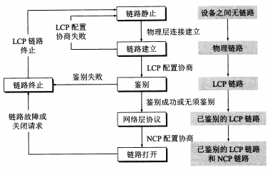

LCP配置协商：发送LCP配置请求帧，协议字段置为LCP对应代码，信息字段包含特定的配置请求。链路另一端可以发送以下几种响应中的一种：配置确认帧、配置否认帧、配置拒绝帧。LCP配置选项主要包括链路上的最大帧长、鉴别协议的规约、禁用PPP帧中的地址和控制字段

鉴别状态：只允许传送LCP协议、鉴别协议、监测链路质量的分组。可以使用PAP、CHAP鉴别协议

网络层协议状态：链路两端的网络控制协议NCP根据网络层的不同协议互相交换网络层特定的网络控制分组。如果网络层运行的是IP协议，则对链路的每一端配置IP协议模块时就要使用NCP中支持IP的协议——IP控制协议IPCP

### 使用广播信道的数据链路层

局域网的优点：具有广播功能、便于系统的扩展和逐渐演变、提高了系统可靠性、可用性和生存性

分类：星形网、环形网、总线网

注意，局域网工作的层次跨越了物理层和数据链路层

共享信道技术：

（1）静态划分信道，使用各种复用技术

（2）动态媒体接入控制，又称多点接入，特点是信道并非在用户通信时固定分配给用户

- 随机接入：要解决碰撞问题
- 受控接入：接入受到控制，典型代表是分散控制的令牌环网和集中控制的多点线路探询（轮询）

以太网的分类：传统以太网、100BASE-T以太网、吉比特以太网、10GE以太网

以太网的两个标准：DIX Ethernet V2与IEEE 802.3

> 802.3 以太网    802.4 令牌总线网  802.5令牌环网

以太网的两个子层：逻辑链路控制LLC、媒体接入控制MAC，但是因为以太网已经成为局域网事实上的标准所以作用已经消失了

网络适配器：

- 计算机外界局域网的连接是通过网络适配器进行的，适配器与局域网通过电缆或者双绞线串行传输，适配器与计算机则通过I/O总线进行并行传输。
- 适配器的作用包括串行传输与并行传输的转换、缓存数据、安装驱动程序。
- 注意适配器是跨越物理层与链路层的设备。
- 适配独立于CPU工作，丢弃有差错的帧，使用中断通知计算机并将正确的帧交付网络层，发送数据时网络层把IP数据包交给适配器封装成帧然后发送。
- 计算机的软件地址是IP地址，存放在计算机的存储器中；计算机硬件地址是MAC地址，存放在网络适配器的ROM中
- 适配器有过滤功能，适配器每收到一个MAC帧，首先检查目的地址，如果是发往本站的帧则收下，然后再进行其他的处理；否则就丢弃帧。发往本站的帧包括单播帧、广播帧、多播帧（可选）三种帧
- 混杂方式：只要监听到有帧在以太网上传输就悄悄接受下来，而不管这些帧发往哪个站。黑客工具嗅探器就是利用混杂方式工作的。

以太网简便通信的两种措施：

（1）以太网采用无连接的工作方式，数据帧不编号也不要求确认，所以以太网提供不可靠的交付，差错帧不重传直接丢弃。

（2）以太网发送的数据都采用曼彻斯特编码

CSMA/CD协议：全称载波监听多点接入/碰撞检测，多点接入说明是总线型网络，协议的实质是载波监听和碰撞检测，载波监听是指始终检测信道，碰撞检测是指边发送边监听，检测是否冲突。

> 电磁波在1km的电缆的传播时延是5μs

碰撞检测：A、B两端单程端到端传播时延为τ，最迟2τ时间内便可判断冲突是否发生。使用CSMA/CD的是半双工通信，不能同时进行发送和接收，因此这段时间称为争用期或碰撞窗口。争用期内没有收到冲突消息就一定不会发生冲突，否则使用截断二进制指数退避算法确定重传时间。根据该算法，任何长度小于64字节的帧都是由于冲突而异常中止的无效帧，应当立即丢弃。

截断二进制指数退避算法：

（1）协议规定争用期为51.2μs，对于10Base-T以太网，争用期可发送512bit，即512比特时间。

（2）从[0,2<sup>k</sup>-1]中随机选取一个整数记为r，重传应推后的时间就是r倍的争用期，其中k=min{重传次数, 10}

（3）重传次数超过16次仍不成功，丢弃该帧并向高层报告

强化碰撞：数据发送者一旦发现发生了碰撞，立即停止发送数据，然后继续发送32bit或者48bit的人为干扰信号。T<sub>B</sub>表示从发送数据开始到发现碰撞并停止发送的时间间隔，T<sub>J</sub>表示强化碰撞信号的发送时延，τ表示传播时延，总时延为T<sub>B</sub>+T<sub>J</sub>+τ

帧间最小间隔：以太网规定帧间最小间隔为9.6μs，目的是使得接收者清理缓存准备接收新的帧

CSMA/CD协议要要点：

（1）准备发送：封装成帧，放入适配器缓存

（2）检测信道：如果96比特时间内信道保持空闲就发送这个帧

（3）边发送边监听：如果发生碰撞，立即停止发送数据，发送人为干扰信号，执行截断二进制指数退避算法。已发送帧要暂时存储，以便可能的重传。

以太网信道利用率：

- 定义参数a：a=τ/T<sub>0</sub>，表示以太网单程端对端时延与发送时延的比值
- a->0表示一发生碰撞就立即可以检测出来，并立即停止发送，因而信道利用率很高
- a越大，表明争用期所占比例增大，每发生一次碰撞就浪费许多信道资源，使得信道利用率明显降低
- 极限信道利用率：S<sub>max</sub>=T<sub>0</sub>/(T<sub>0</sub>+τ)=1/(1+a)

MAC层的硬件地址：

- 硬件地址又称为物理地址或MAC地址，是一种48位的全球地址是指局域网上的每一台计算机中固化在适配器的ROM中的地址，实际上就是适配器地址或适配器标识符。
- 公司标识符，正式名称是组织唯一标识符OUI，是MAC地址的前三个字节。
- 扩展标识符是MAC地址的后三个字节，由公司指派。
- 地址字段的第一字节的最低位为I/G位，该位为0时表示单个站地址，该位为1时表示组地址，用于多播
- 地址字节的第一字节的最低二位是G/L位，该位为0时是全球管理，该位为1时表示本地管理

MAC帧的格式：目的地址、源地址、类型字段、数据字段、帧检验序列，MAC帧向下传送给物理层时还要在帧的前面插入8字节，前7个字节是前同步码，最后一个字节是帧开始定界符。以太网不需要使用帧结束定界符，也不需要使用字节插入来保证透明传输。

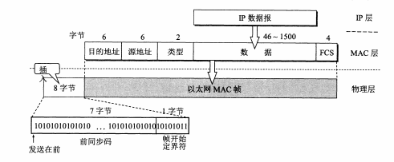

IEEE 802.3规定的MAC帧的第三个字节是“长度/类型”，当这个字段的值大于0x0600时就表示“类型”，字段值小于0x0600时，数据字段必须装入LLC子层的LLC帧

无效的MAC帧：

（1）帧的长度不是整数个字节

（2）用收到的帧检验序列FCS查出有差错

（3）收到帧的MAC客户数据字段的长度不在46\~1500字节之间，MAC帧首部与尾部的长度共有18个字节，所以有效帧的长度是64\~1518字节

### 扩展的以太网

使用集线器扩展局域网：集线器是在物理层扩展局域网，能够扩大碰撞域，但是不能增大吞吐量。集线器收到什么就转发什么，不进行碰撞检测

使用网桥扩展局域网：网桥是在链路层扩展局域网，能够将MAC帧转发到其它碰撞域中，扩大了广播域，但是没有扩大碰撞域。网桥可以实现MAC帧在不同链路上的传输，例如802.11无线网与802.3以太网的连通。但是要注意到不同局域网帧格式、数据率、最大帧长、加密支持的情况也不同。网桥只适合用户数不太多和通信量不太大的局域网，否则有时会因为传播过多的广播信息而产生网络拥塞，这就是所谓的广播风暴。

网桥的内部结构：若干个对外接口、MAC帧缓存、接口管理软件、网桥协议实体、存储站地址和接口映射关系的站表

网桥自学习和转发帧的步骤：

- 自学习：网桥每接收到一个帧就将帧首部的源地址、进入网桥的接口和帧进入该网桥的时间记录到转发表中，保存时间是为了适应站点的变动。
- 转发帧：查找转发表中与收到帧的目的地址有无相匹配的项目。
  - 如果没有，通过其他所有接口进行转化
  - 如果有，转发表中给出的接口进行转发
  - 如果转发表接口等于该帧进入网桥的接口，丢弃帧

透明网桥：局域网上的站点不知道所发送的帧将经过哪几个网桥，透明网桥是一种即插即用设备，其标准是IEEE 802.1D。透明网桥使用生成树算法避免转发帧在网络中兜圈子。

源路由网桥：源站通过广播的形式向目的站发送一个发现帧，每个发现帧都记录所经过的路由。到达目的站后，发现帧再原路返回。源站向目的站发送帧时，选择最佳路由，放入帧的首部中。

以太网交换机：背板上可插入若干个模块，每个模块上有4-8个RJ-45的端口，构成一个规模较小的局域网。同一个模块是同一个碰撞域，不同模块属于同一个广播域。以太网交换机不使用共享总线，没有碰撞问题，以全双工方式工作，不使用CSMA/CD协议，但仍然采用以太网的帧结构。以太网交换机出现实现了星形以太网，取代了总线以太网的地位。

虚拟局域网（VLAN）：

- IEEE 802.1Q标准中定义VLAN为，由一些局域网网段构成的与物理位置无关的逻辑组，而这些网段具有某些共同的需求。每一个VLAN帧都有一个明确的标识符，指明发送这个帧的计算机属于哪一个VLAN。
- 虚拟局域网是逻辑上划分的局域网，是一种服务，能够将物理上分属不同局域网的主机连接成同一虚拟局域网之中。
- IEEE 802.3ac标准中定义了以太网帧格式的扩展，允许在以太网的帧格式中插入一个4字节的标识符称为VLAN标记。

高速以太网：

- 仍使用CSMA/CD协议，能够自动识别10Mbps和100Mbps，1995年正式定为IEEE 802.3u标准。
- 不支持同轴电缆，因此细缆以太网升级到快速以太网的用户必须重新布线
- 保持最短帧长不变，争用期缩短为5.12μs，帧间最小间隔为0.96μs，网段最大长度要小于争用期与传播速率的乘积，因此也会缩小至1/10。

吉比特以太网：

- 1000BASE-X标准为IEEE 802.3z，1000BASE-T标准为IEEE 802.3ab
- 允许半双工和全双工工作方式，半双工方式使用CSMA/CD协议
- 载波延伸：最短帧长仍为64字节（为了兼容），争用期扩展为512字节时间，如果帧长在64\~512字节，使用特殊字符填充至512字节再发送，网段最大长度不变。
- 分组突发：当有很多短帧要发送的时候，第一个短帧进行载波延伸，后面的短帧一个接一个发送，只需要保留必要的帧间最小间隔。
- 迟冲突不重发：发生在扩展位的冲突被认为是一次迟冲突，IEEE 802.3z规定迟冲突不重发。
- 当吉比特以太网工作在全双工方式时，不使用载波延伸和分组突发

10吉比特以太网：

- 保留以太网帧格式、最小帧长、最大帧长
- 只工作在全双工方式，不存在争用问题，不使用CSMA/CD协议
- 10GBASE-R使用IEEE 802.3ae协议，10GBASE-CX4使用IEEE 802.3ak协议，10GBASE-T使用IEEE 802.3an协议

宽带接入技术：

- PPPoE：PPP over Ethernet，PPP帧中含有用户字段，而以太网帧格式中没有，把数据链路层的两个协议联系起来，光纤接入FTTx都使用PPPoE方式进行。
- 用户连接的第一个交换机到上一级交换机的宽带是共享的，如果上网用户过多就会使得每一个用户享受到的带宽减少。

## 网络层

网络层向上只提供简单灵活的、无连接的、尽最大努力交付的数据报服务。

网络层不提供服务质量的承诺，分组可能出现出错、丢失、重复和失序的情况

虚电路服务与数据报服务的对比：

| 对比的方面                 | 虚电路服务                                   | 数据报服务                                         |
| -------------------------- | -------------------------------------------- | -------------------------------------------------- |
| 思路                       | 可靠通信应当由网络层提供                     | 可靠通信应当由用户主机来保证                       |
| 连接的建立                 | 必须有                                       | 不需要                                             |
| 终点地址                   | 仅在连接阶段使用，每个分组使用短的虚电路号   | 每个分组都有终点的完整地址                         |
| 分组的转发                 | 属于同一条虚电路的分组均按照同一路由进行转发 | 每个分组独立选择路由进行转发                       |
| 当结点出现故障时           | 所有通过出故障结点的虚电路均不能工作         | 出故障的结点可能会丢失分组，一些路由可能会发生变化 |
| 分组的顺序                 | 总是按照发送顺序到达终点                     | 到达终点的时间不一定按照发送顺序                   |
| 端到端的差错处理和流量控制 | 可以由网络负责，也可以由用户主机负责         | 由用户主机负责                                     |

### 网际协议IP

IP协议的配套协议：

- 地址解析协议ARP
- 网际控制报文协议ICMP
- 网际组管理协议IGMP
- 逆地址解析协议RARP（已经被淘汰）

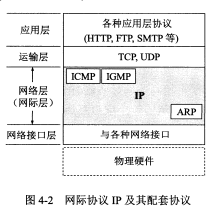

中间设备：将网络互连起来

（1）物理层使用的中间设备称为转发器

（2）数据链路层使用的中间设备称为网桥或者桥接器

（3）网络层使用的中间设备叫做路由器

（4）在网络层以上使用的中间设备叫做路由器

虚拟互连网络：通过IP协议将异构网络连接起来构成的网络就是虚拟互连网络，简称为IP网

IP数据报的发送过程：查看路由表，如果目的主机在本网络，直接交付；否则将数据报发送给其它路由器进行间接交付。重复上述过程直到将数据报直接交付。在数据报传递过程中，可以经过任意类型的网络，因此互联网可以由多种异构网络互联组成。

IP地址的编址方法：分类IP、子网划分、构造超网

分类IP：

- `IP地址 ::= {<网络号>, <主机号>}`
- A、B、C、D、E类IP地址

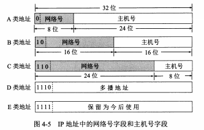

- 点分十进制

- 一般不使用的特殊地址

  | 网络号  | 主机号             | 源地址使用 | 目的地址使用 | 代表的意思                           |
  | ------- | ------------------ | ---------- | ------------ | ------------------------------------ |
  | 0       | 0                  | 可以       | 不可         | 在本网络上的本主机（参见DHCP协议）   |
  | 0       | host-id            | 可以       | 不可         | 在本网络上的某台主机                 |
  | 全1     | 全1                | 不可       | 可以         | 只在本网络上广播（各路由器均不转发） |
  | net-id  | 0                  | 不可       | 不可         | 指向net-id网络本身                   |
  | net-id  | 全1                | 不可       | 可以         | 对net-id上的所有主机进行广播         |
  | 127     | 非全0或全1的任何数 | 可以       | 可以         | 用于本地软件环回测试                 |
  | 128.0   | 任何数             | 不可       | 不可         | 不指派                               |
  | 192.0.0 | 任何数             | 不可       | 不可         | 不指派                               |

- RFC1918定义了私有IP地址范围：
  - 10.0.0.0/8
  - 172.16.0.0/12
  - 192.168.0.0/16
- 具有不同网络号的局域网必须用路由器连接
- 同一个局域网上的主机或路由器的IP地址中的网络号必须一致，路由器总是具有两个以上的IP地址
- 无编号网络：两个路由器直接相连时，一般不分配IP地址，这样的网络称为无名网络或者无编号网络

IP地址与硬件地址的区别：物理地址是数据链路层和物理层使用的地址，IP地址是网络层和以上各层使用的地址，是一种逻辑地址。在IP层抽象的互联网上只能看到IP数据报，路由器只根据目的站的IP地址的网络号进行路由选择；在局域网的链路层只能看见MAC帧。IP层抽象的互联网屏蔽了下层复杂的细节，只要在网络层上讨论问题，就能够使用统一的、抽象的IP地址研究主机和主机或路由器之间的通信。

地址解析协议ARP：

- 作用：IP地址->MAC地址
- ARP高速缓存：存储本局域网上的各主机和路由器的IP地址到硬件地址的映射表，主机要发送IP数据报时，如果ARP缓存中保存了IP地址到MAC地址的映射，就直接封装成帧；否则主机自动运行ARP，查找目的主机的地址。
- 查找目的主机的方法：
  - 本局域网广播ARP请求分组，请求某IP地址对应MAC地址
  - 目的主机如果存在，则接受ARP请求分组，记录发送者IP到MAC的映射，回复本机IP到MAC地址的映射
  - 发送者收到ARP响应分组后做同样的记录
- ARP对缓存中的映射地址项目设置了生存期，超时的记录会被移除

IP数据报的格式：

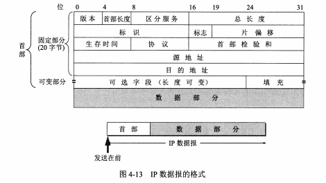

说明：

- 版本

- 首部长度：长度单位是DWORD（32位），如何首部长度不是32位的整数倍，需要利用填充字段进行填充

- 区分服务：使用区分服务时才起作用

- 总长度：首部和数据之和的长度，单位是字节，占据16位，因此IP数据报最大长度是65535字节。较长的数据报需要分片才能封装成帧，分片时总长度是指所有分片首部长度和数据长度的总和。

- 标识：相同标识的分片被认为来自同一个数据报

- 标志：占三位，目前只有两位有意义。最低位记为MF表示“后面是否还有分片”，中间一位记为DF表示“是否禁用分片”

- 片偏移：占13位，单位是QWORD（8字节），分片数据部分相对总的数据的位置。

- 生存时间TTL：跳数限制，表示数据报最多能够经过多少个路由器

- 协议：占8位，表明协议的种类

- 首部检验和：16位，将首部检验和首先置为全零，然后将首部按WORD（2字节）进行划分，反码算术运算求和，取反码得到首部检验和。检验时使用同样的算法，得到的结果是0则说说明验证没有问题。

  > 反码算数运算：0加0是0，0加1是1，1加1是0但产生进位，若最高位相加后产生进位而最后的结果加1

- 源地址和目的地址各占32位
- 可变部分：添加额外功能

IP层转发分组的流程：

- 路由表：每一条路由的信息包括目的网络地址、下一跳地址和其它信息。
- 基于目的主机所在的网络：找到目的主机所在的网络，经过多次间接交付；只有到达最后一个路由时，才试图向目的主机进行直接交付
- 特定主机路由：对特定的目的主机指明一个路由
- 默认路由：如果路由表中查找不到结果就转发至默认路由

分组转发算法：

- 提取目的主机IP地址D，得出目的网络地址N
- 如果N是与此路由器直接相连的某个网络地址，则进行直接交付；否则执行间接交付
- 特定主机路由、默认路由
- 转发分组错误

### 划分子网和构造超网

划分子网：

- 记法：`IP地址 ::= {<网络号>, <子网号>, <主机号>}`
- 外网看不见内网的子网，内网对外仍然表现为一个网络
- 划分子网后，IP地址变成了三级结构

子网掩码：用于从目的主机IP中分离出子网号和主机号，子网掩码与目的IP地址相与后得到子网的网络地址，主机号被清零。子网掩码一般由连续的1和连续的0两部分组成

默认子网掩码：对于没有划分子网的IP地址使用默认子网掩码，A、B、C类地址的默认子网掩码分别为255.0.0.0、255.255.0.0、255.255.255.0

划分子网情况下的路由表：目的网络地址、子网掩码、下一跳地址、其他信息

划分子网情况下的分组转发算法：

- 提取目的地址D
- 路由器直接相连的网络的子网掩码与D相与，看是否与相应的网络匹配。若匹配直接交付，否则间接交付
- 特定主机路由
- 路由表中的每一项，子网掩码与D相与的结果N，如果N与该行的目的网络地址匹配，则转发至指明的下一跳路由器
- 默认路由
- 报告转发分组错误

无分类编址CIDR（构造超网）：

- 消除了传统的A、B、C类地址以及划分子网的概念，将IP地址记为：

  `IP地址 ::= {<网络前缀>,<主机号>}`

  使用斜线记法，例如128.14.35.7/20表示网络前缀为20位，主机号为12位

- 网络前缀相同的连续IP地址组成一个“CIDR地址块”

- 地址掩码：32位，仍可称为子网掩码

- 路由聚合：一个CIDR地址块中包含很多地址，可以通过一个CIDR查找目的网络，这种地址的聚合称为路由聚合

- 地址聚合：如果一个网络包含很多分类地址，如果不采用CIDR技术就会造成路由表的项目过多。采用CIDR技术，可将这些地址用一个聚合后的地址表示，这就是地址聚合的概念。

- 最长前缀匹配：查找路由表时，如果查找到了多个匹配项，选择具有最长网络前缀的路由，称为最长匹配或最佳匹配

- 二叉线索查找路由表：使用二叉搜索树数据结构加快路由表的查找

### 网际控制报文协议ICMP

ICMP报文的格式：

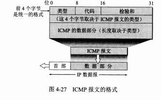

ICMP报文前四个字节是统一的，分别为类型、代码、检验和，接下来的4个字节和ICMP报文的类型有关，最后是数据部分，长度与类型相关。

常用的ICMP报文类型：

<table>
    <tr>
    	<th>ICMP报文种类</th>
        <th>类型的值</th>
        <th>ICMP报文的类型</th>
        <th>描述</th>
    </tr>
    <tr>
    	<td rowspan=4>差错报告报文</td>
        <td>3</td>
        <td>终点不可达</td>
        <td>路由器或主机不能交付数据报</td>
    </tr>
    <tr>
    	<td>11</td>
        <td>时间超过</td>
        <td>路由器收到TTL数据报，终点接受数据报片超时</td>
    </tr>
    <tr>
    	<td>12</td>
        <td>参数问题</td>
        <td>终点收到数据报首部参数不正确</td>
    </tr>
    <tr>
    	<td>5</td>
        <td>改变路由</td>
        <td>通知主机把数据报发送到另外的路由器</td>
    </tr>
    <tr>
        <td rowspan=2>询问报文</td>
    	<td>8或0</td>
        <td>回送请求或回答</td>
        <td>用来确认目的主机可达性</td>
    </tr>
    <tr>
    	<td>13或14</td>
        <td>时间戳请求或回答</td>
        <td>请求主机回答当前时间，用于时钟同步、时间测量</td>
    </tr>
</table>

不再发送ICMP报文的情况：

- 对ICMP差错报告报文
- 对第一个分片的数据报片的所有后续数据报片
- 对具有多播地址的数据报
- 具有特殊地址的数据报，如0.0.0.0、127.0.0.0

ICMP应用示例：

- 分组网间探测PING
- 探测路径TRACEROUTE（Windows下是tracert命令）：逐个发送TTL为1、2、3 …… 的封装了无法交付的UDP用户数据报，等待中间结点发送ICMP时间超过报文，等待终点发送ICMP终点不可达报文。

### 互联网的路由选择协议

路由算法的分类：

- 静态路由选择策略：又称为非自适应路由选择，特点是简单和开销较小，但不能适应网络状态的改变。适用于简单的小网络，可以采用人工配置每一条路由的方式。
- 动态路由选择策略：特点是复杂和开销大，能够适应网络状态的改变。适用于复杂的大网络。

自治系统AS：在单一技术管理下的一组路由器，使用自治系统内部的路由选择协议和共同的度量。一个AS对其它AS表现单一和一致的路由选择策略

路由选择协议的分类：

- 内部网关协议（IGP，Internal Gateway Protocol）：RIP、OSPF等
- 外部网关协议（EGP，External Gateway Protocol）：BGP

#### 内部网关协议RIP

距离（跳数）：从一个路由器到直接相连的网络距离为1，从一个路由器到非直接相连的网络的距离等于经过的路由器的数量加1。RIP只允许一条路径包含15个路由器，距离等于16时相当于不可达。所以RIP只适用小型互联网

距离向量：网络中的每一个路由器都要维护一个距离向量，保存本路由器到其它每一个目的网络的距离记录

RIP协议的特点：

- 仅和相邻的路由器交换信息
- 交换的信息是当前本路由器所知道的全部信息，即路由表
- 按固定的时间间隔交换路由信息
- 好消息传得快，坏消息传得慢：这是因为发生故障的路由器只有经过3分钟才能被认定为不可达

收敛：自治系统中全部结点都得到正确的路由选择信息的过程

距离向量算法：

```python
rip = recv_rip(src=X,timeout=180)
if rip:
    for item in rip[路由表]:
        item[下一跳地址] = X
        item[距离]++  # Y到本路由器的距离 = Y到X距离 + X到本路由器的距离（也就是1）
        N = item[目的地址]
        item_0 = 路由表.get(N)
        if not item_0 \  # 新加入的目的网络
            or item_0[下一跳地址] != item[下一跳地址] \  # 对原来的路由进行更新
            or item_0[距离] > item[距离]:  # 找到距离更近的路由
            路由表.set(N,item)
else:
	路由表.set(X,Item(目的地址=X,距离=16,下一跳地址=None))  # 没有收到相邻路由器的报文，说明不可达
```

RIP协议报文格式：

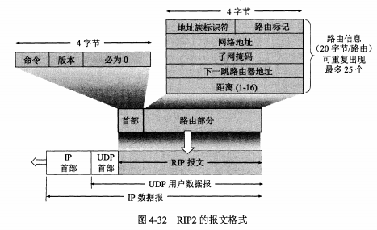


- RIP报文由首部和路由部分组成

- 首部共4个字节，命令部分指明报文的意义，后面的“必为0”用于字节对齐

- 路由部分由若干路由信息组成，每个路由信息20字节，包括地址族标识符、路由标记、网络地址、子网掩码、下一跳路由器地址、距离等字段。其中地址族标识符表明采用的地址类型，如果是IP地址则为2。路由标记填入自治系统号ASN。一个RIP报文最多支持25个路由信息，超过的分多次传送。
- 具有简单的鉴别能力。将第一个路由信息的位置用作鉴别，地址族标识符置为全1，路由标记填入鉴别类型，剩下的16个字节用于鉴别数据

#### 内部网关协议OSPF

OSPF = Open Shortest Path First，开放最短路径优先，使用了Dijkstra提出的最短路径算法SPF，OSPF2成为互联网标准

OSPF特点：

- 使用洪泛法向本自治系统中所有的路由器发送信息，其中洪泛法就是广度优先遍历
- 发送的信息是与本路由器相邻的所有路由器的链路状态，链路状态就是本路由器的拓朴关系以及链路的度量（权重、代价）
- 只有链路状态发生变化时，路由器才使用洪泛法发送此信息
- 链路状态更新快，所以OSPF更新过程收敛得快
- 允许给路由指定权重（代价）。也就是说RIP是无权图，OSPF是有权图。
- 支持代价相同的多路径负载平衡
- 鉴别功能
- 支持VLSM和CIDR
- 每一个链路状态都带有序号，表明版本的新旧

链路状态数据库：各路由器之间频繁交换链路状态信息，因此最终所有的路由器都能够建立一个链路状态数据库，这个数据库就是全网的拓朴结构图并且在全网范围内是一致的（链路状态数据库的同步）。每一个路由器都能由此获得全网的结点与结点之间的关系，再使用最短路径算法构造自己的路由表。

区域：为了将OSPF应用于更大的网络，将自治系统再划分为若干区域，把利用洪泛法交换链路状态信息的范围局限在区域内，减少网络的通信量

层次结构的区域划分：为了区域之间进行通信，使用层次结构的区域划分。在上层的区域叫做主干区域，作用是连通其它在下层的区域，连接不同区域的路由器称为区域边界路由器，在主干区域中路由器称为主干路由器，连接不同自治系统的路由器称为自治系统边界路由器。

OSPF分组的格式：

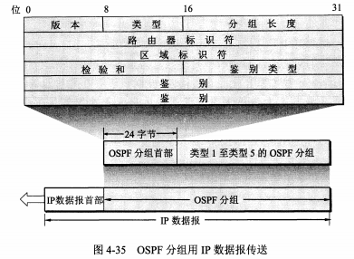

分组长度是包含首部在内的分组长度，单位是字节。路由器标识符是发送该分组的路由器IP地址。鉴别类型：0=禁用鉴别，1=启用鉴别。鉴别 = QWORD长度的口令 。其它不解释。

五种分组类型：

- 类型1：问候（Hello）
- 类型2：数据库描述（Database Description），链路状态数据库中所有链路状态项目的摘要信息
- 类型3：链路状态请求（Link State Request），请求某些链路状态项目的详细信息
- 类型4：链路状态更新（Link State Update），使用洪泛法全网更新链路状态
- 类型5：链路状态确认（Link State Acknowledgment），对链路状态更新分组的确认

相邻路由器每10秒发送一次问候分组确认可达性，超过40秒无响应就认定为不可达。其余四种分组都是用来实现链路状态数据库的同步，两个完全同步的路由器叫做完全邻接的路由器。

OSPF基本操作：

（1）确定可达性：通过问候分组获得相邻路由器的可达性以及将数据发往邻近路由器的代价

（2）数据库同步：相邻路由器交换数据库描述分组，摘要信息包括本数据库有哪些路由器的链路状态信息

（3）新情况下的同步：相邻路由器查看数据库缺少哪些链路状态信息，使用链路状态请求分组从相邻路由器获得链路状态的详细信息

（4）使用可靠的洪泛法（收到更新分组后确认，重复更新分组只确认一次）遍历全网结点，父结点与子结点执行上述（1）、（2）、（3）步骤

（5）每隔30分钟刷新一次链路状态数据库

（6）如果有多个路由器连接在一个以太网上，那么需要一个指定的路由器，减少广播的信息

#### 外部网关协议BGP

BGP协议的特点：

- BGP协议选择的是一条可达的且不兜圈子的路由，而不是最佳路由
- 交换路由信息的结点数量的数量级是自治系统个数数量级
- 支持VLSM和CIDR

BGP发言人：每个自治系统管理员指定一个路由器作为BGP发言人，一般是BGP边界路由器（当然也可以不是）

BGP协议的工作过程： 

- 交换路由信息：建立TCP连接，交换BGP报文以建立BGP会话，利用BGP会话添加新的路由，移除过时路由，报告错误信息。使用TCP连接交换路由信息的两个BGP发言人彼此成为对方的邻站或对等站
- BGP发言人根据各自的策略选择适合的路由

BGP报文类型：

- OPEN打开报文：与其它BGP发言人建立关系，通信初始化。
- UPDATE更新报文：通告某条路由的信息，撤销多条路由。
- KEEPALIVE保活报文：周期性证实邻站的连通性。
- NOTIFICATION通知报文：用来发送检测到的差错。

BGP报文格式：

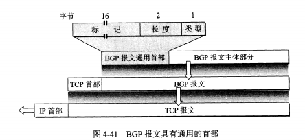

#### 路由器的构成

路由器的结构：


两大部分：路由选择、分组转发

路由选择部分：控制部分，核心构件是路由选择处理机，功能是根据路由选择协议构造、更新、维护路由表

分组转发部分：由交换结构、输入端口和输出端口三部分组成（这里的端口是硬件端口，不是传输层的端口）。

- 交换结构：根据转发表，将分组从一个输入端口转发到指定的输出端口。三种常见的交换方法分别是通过存储器、通过总线、通过互连网络。

  > 转发路由选择是不同的概念，路由选择需要考虑全局，转发仅涉及一个路由器

- 输入输出端口：包含物理层、数据链路层、网络层的处理模块。为了使交换功能分散化，将复制的转发表放到每一个输入端口上，称为影子副本。输入输出端口的网络层处理模块中，设置了缓存队列。

### IPv6

IPv6仍支持无连接的传送，但PDU不再称为数据报，而是分组

IPv6所引进的变化：

- 更大的地址空间：32位->128位
- 扩展的地址层次结构
- 灵活的首部格式
- 改进的选项：首部长度固定，选项放在有效载荷中
- 允许协议扩展
- 即插即用
- 支持资源的预分配
- 首部改为8字节对齐

IPv6数据报格式：


基本首部格式：

（1）版本

（2）通信量类：区分不同IPv6数据报的类别和优先级

（3）流标号：支持资源预分配，首提“流”的概念。同一个流有相同的流标号，常用于音视频传输。

（4）有效载荷长度：有效载荷部分的字节数

（5）下一个首部：相当于IPv4的协议字段或者可选字段

- 没有扩展首部时和IPv4的协议字段一样
- 有扩展首部时和标识后面第一个扩展首部的类型

（6）跳数限制：最大为255

（7）源地址和目的地址：各占128位

扩展首部：属于有效载荷的一部分，定义了6种选项，分别为逐跳选项、路由选择、分片、鉴别、封装安全有效载荷、目的站选项

地址基本类型：单播、多播、任播

地址记法：

- 冒分16进制
- 允许零压缩：指可以用双冒号表示中间连续的0
- 兼容IPv4地址：例如::192.168.1.1

特殊地址：

| 地址                   | 含义                                                         |
| ---------------------- | ------------------------------------------------------------ |
| ::                     | 未知指明地址，只能作为某台主机的源地址，条件是这台主机还没有配置到一个标准的IP地址 |
| ::1                    | 环回地址                                                     |
| FF00::/8               | 多播地址                                                     |
| FE80::/10              | 本地链路单播地址                                             |
| 除了上述地址的其他地址 | 全球单播地址                                                 |

单播地址的几种划分方法：


IPv4向IPv6的过渡：双协议栈、隧道技术

### IP多播

IP多播：

- 将一个IP数据报发送到多个目的地址。IP多播需要在网络层使用多播路由器，而数据链路层本来就支持硬件多播

- 多播地址只能用于目的地址，不能用于源地址，PING一个多播地址是无效的
- IP多播需要两种协议：网际组管理协议（IGMP）、多播路由选择协议

- IGMP不知道多播组包含的成员数和分布情况，只是让连接在局域网上的多播路由器知道本局域网上是否有主机参加或退出了某个多播组
- 多播转发必须动态地适应多播组成员的变化（网络拓扑不一定发生变化）
- 多播路由器在转发多播数据报时，不能仅仅根据多播数据报中的目的地址
- 多播数据报可以由没有加入多播组的主机发出，也可以通过没有组成员加入的网络

IGMP协议工作过程可以分为两个阶段：

- 当某台主机加入新的多播地址时，该主机应向多播组的多播地址发送一个IGMP报文，声明自己要成为该组的成员。本地的多播路由器收到IGMP报文后，还要利用多播选择协议把这种组成员关系转发给互联网上的其它多播路由器。
- 组成员关系是动态的。本地多播路由器要周期性地探询本地局域网上的主机，以便知道这些主机是否还是多播组的成员。如果没有一台主机响应，就认为主机退出多播组，不再转发组成员关系给其它多播路由器

IGMP控制网络信息量的措施：

- 主机和多播路由器之间使用IP多播，携带IGMP报文的数据报采用硬件多播，支持硬件多播的网络上，没有参加硬件多播不会受到IGMP报文
- 探询组成员关系时，对所有组发送一个请求报文
- 一个网络连接多个多播路由器能够迅速、有效地选择其中一个来探询主机的成员关系
- IGMP询问报文中包含最长响应时间N，收到询问时，从0到N之间选择发送响应的时延，如果参加多个组，对应于最小时延的响应最先发送
- 同组的主机监听响应，只要其他主机先发送了响应本机就不再发送

多播转发树：根节点为源主机，叶节点为参与多播的主机，内部节点是多播路由器。

多播路由选择协议转发多播数据报时使用以下三种方法：

- 洪泛和剪除：采用反向路径广播策略，即每一个路由器收到一个多播数据报时，先检查数据报是否从源点经最短路径传送来，寻找最短路径使用Dijkstra或其它算法。若是，向其他方向转发；否，丢弃不转发。如果路由器连接的网络中已经没有组成员，就剪除。
- 隧道技术：在不支持多播的网络中，将多播数据报再封装到单播数据报中，就好像一条“隧道”。
- 基于核心的发现技术：为每个组指定核心路由器，给出IP单播地址，核心路由器创建多播转发树。如果某个路由器向核心路由器发送数据报，途径路由器都进行检查。如果途径路由器是组员，再进行以下操作：如果是多播数据报，转发给其他组员；如果是入组请求，将发送者添加到该组员的路由中，向新组员转发多播数据报的副本。

常见的多播路由协议：DVMRP、CBT、MOSPF、PIM-SM、PIM-DM

### 虚拟专用网VPN和网络地址转换NAT

本地地址和全球地址：本地地址用于“内网”，全球地址用于“外网”。

专用地址（私有地址）：10.0.0.0/8、172.16.0.0/12、192.168.0.0/16

VPN：长安大学有好多校区，这些校区要使用一个内网。租用专用的线路很贵，所以只能使用公网创建VPN，形成一个逻辑上的网络。

隧道技术实现VPN：渭水校区有一个网关A，雁塔校区有一个网关B，在网关A、B处将离开内网的加密过的内部数据报封装到普通IP数据报上，将进入的内部数据报从普通IP数据报中拆卸下来并解密。

内联网：使用专用地址的主机和路由器构成的网络

外联网：使用全球地址的主机和路由器构成的网络

互联网 = 内联网 + 外联网

网络地址转换NAT：内网访问外网，需要将内网地址和外网地址进行转换

网络地址与端口号转换NAPT：将内网地址映射为外网地址和端口号的组合，NAPT跨越了网络层和传输层

### 多协议标记交换（MPLS）

MPLS：多协议表示MPLS上层可以使用多种协议，此外还综合了标记交换TAG、IP交换等。利用面向连接技术，每个分组携带小整数标记，当分组到达分组交换路由器时使用标记检索分组转发表。

MPLS特点：（1）支持面向连接的服务质量（2）支持流量工程，平衡网络负载（3）有效支持虚拟专用网VPN

基本工作过程：

- MPLS域中的标记交换路由器LSR使用专门的标记分配协议LDP交换报文，找出特定于标记的路径，即标记交换路径LSP
- 当IP数据报进入MPLS域时，在入口结点出打上标记，并转发至下一个LSR。打上标记的过程称为分类，严格的第三层分类只使用网络层的源IP和目的IP，多数实现了第四层，有些实现了第五层
- 标记仅在两个LSR之间才有意义，分组经过LSR，LSR转发并对换标记（入标记转换为出标记）
- 当IP数据报离开MPLS时，LSR去除标记

转发等价类FEC：按照同样方式对待IP数据报的集合，即从同样接口转发到同样的下一跳地址，并且具有同样服务类型和同样丢弃优先级等。使用FEC能够实现负载均衡。

MPLS首部：在网络层和数据链路层之间插入MPLS首部，包含4个字段：标记值、试验、栈S、生存时间TTL

## 传输层

### 传输层协议概述

计算机通信的实质是端对端进程的通信，传输层提供应用进程之间的逻辑通信

复用与分用：主机不同进程共享网络层协议，传输层剥去报文首部后能够将数据交付不同进程

传输层对收到的报文进行差错检测，根据需求的不同主要有两种协议TCP协议和UDP协议，对应的信道称为可靠信道和不可靠信道

端口：进行网络通信时特定于主机进程的整数（2字节）标识符

熟知端口号（系统端口号）：0\~1023

| 应用程序   | FTP  | TELNET | SMTP | DNS  | TFTP | HTTP | SNMP | SNMP(trap) | HTTPS |
| ---------- | ---- | ------ | ---- | ---- | ---- | ---- | ---- | ---------- | ----- |
| 熟知端口号 | 21   | 23     | 25   | 53   | 69   | 80   | 161  | 162        | 443   |

登记端口号：1024\~49151

客户端使用的端口号（短暂端口号）：49152\~65535

### 用户数据报协议UDP

特点：无连接、尽最大努力交付、面向报文、没有拥塞控制、支持多对多交互通信、首部开销小

首部格式：源端口、目的端口、长度、检验和

伪首部格式：源IP地址、目的IP地址、全0、IP首部中协议字段值、UDP长度

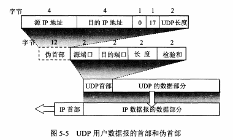

计算检验和：伪首部只在计算检验和时有用，首部和数据部分一起检验，检验和填入全0，按2字节对齐（如果不对齐末尾填充不发送的全0字节），按2字节划分，二进制反码运算求和，取反码

### 传输控制协议TCP

特点：面向连接、点对点、可靠交付、全双工通信、面向字节流

套接字 ::= (host:port)

TCP连接 ::= {套接字1，套接字2}

区别：socket API、socket方法、socket描述符、调用socket方法的端点、socket的操作系统实现

停止等待协议：分组编号，发送——确认，暂存已发送分组超时重传，超时重传应当大于RTT，无视迟到确认，又称为自动重传请求ARQ

连续ARQ协议：发送窗口内的分组连续发出，每收到一个确认窗口滑动一个分组。累计确认，只有编号靠前的分组都到达了才确认

TCP报文段首部格式：

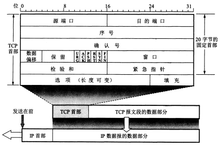

- 源端口和目的端口

- 序号

- 确认号：期望收到对方下一个分组的编号，表明之前分组都已经收到

- 数据偏移：数据部分在整个TCP报文段的偏移位置

- 保留

- 6个控制位

  | 控制位          | URG          | ACK        | PSH                | SYN                                                | RST            | FIN      |
  | ------ | ------ | ------ | ------ | ------ | ------ | ------ |
  | 含义（置为1时） | 启用紧急字段 | 启用确认号 | 催促接收者向上交付 | ACK为0时表明这是一个连接请求，否则表示同意连接请求 | 重置连接或拒绝 | 释放连接 |

- 窗口：发送者的接收窗口，从确认号算起的接收数据的能力，单位为字节

- 检验和：也要加上伪首部（协议字段改为6），计算检验和方法相同

- 紧急指针：启用紧急字段后指出紧急数据的字节数，紧急数据传输不考虑窗口

- 选项：最大报文段长度MSS，表示数据字段最大长度。窗口扩大选项，用于定义更大的窗口值，占3个字节，其中一个字节是移位值S，最大允许值为14，表示窗口值增加的位数。时间戳选项，用来计算RTT和防止序号绕回

滑动窗口协议：

- 以字节为单位

  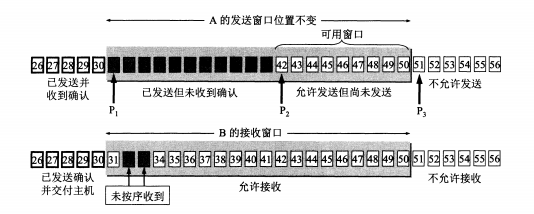

- 发送窗口：窗口内数据允许连续发送。每收到一个确认，滑动窗口，使得窗口后沿位于“期望收到的序号”之后。窗口前沿一般向前移动，也可能不动，但是官方不赞成收缩。窗口内的发出的数据要缓存，直到退出窗口，窗口内未发送的数据范围称为可用窗口。如果超时没有收到确认，那么窗口内已经发送的数据都要重传。

- 接收窗口：窗口内数据允许接收。如果某个编号之前的数据都没有差错并且已经接收，就可以交付主机并发送确认，滑动窗口，直至窗口后沿位于已发送确认部分之前。如果未按序收到，不能发送确认。窗口内的数据要缓存，直到退出窗口。TCP要求采用累计确认，也就是只针对最高编号进行确认（确认号要在此基础上加1表示期待接收的下一个编号）。

超时重传时间的选择：

- 平滑的往返时间 ：新的RTT<sub>S</sub> = (1-α) × 旧的RTT<sub>S</sub> + α × 新的RTT样本，α推荐值为1/8
- RTT偏差的加权平均值：新的RTT<sub>D</sub> = (1-β) × 旧的RTT<sub>D</sub> + β × |RTT<sub>S</sub> - 新的RTT样本|，β推荐值为1/4
- 超时重传时间：RTO = RTT<sub>S</sub> + 4 × RTT<sub>D</sub>
- Karn算法：计算超时重传时间时跳过重传的RTT样本
- Karn算法的修正：每重传一次，RTO翻倍，不重传时再按照上面的算法

选择确认SACK：设置允许SACK，然后选择确认已经收到的范围，那么重传时将不再发送这些已经收到的数据。

### TCP的流量控制

利用滑动窗口实现流量控制：

- 发送方的发送窗口不能超过接收方的接收窗口
- 零窗口死锁问题：零窗口情况下，如果改变窗口大小的报文丢失，发送者处于零窗口状态无法发送报文段，接收者等待接收，出现了死锁问题
- 化解零窗口死锁问题：发送者处于零窗口状态时，超时发送零窗口探测报文段，接受方收到零窗口探测报文段后发出确认，给出当前接收窗口大小，从而使得发送者打破零窗口状态

控制TCP报文段的发送时机：

- 缓存中的字节数超过最大报文段长度MSS之后就发送
- 推送操作，应用进程指明要求发送报文段
- 设置计时器，一旦超时就发送报文段

Nagle算法：

- 先发送缓存中的一个字节，收到确认后将缓存中全部数据组装成一个报文段发出去，重复这一步操作直至发送完毕，另外规定缓存字节超过窗口大小的一半或者MSS就立即发送。

- 糊涂窗口综合征：接收方缓存已满，应用进程只从缓存中读取一个字节，空出一个字节的位置，接收方设置窗口大小为1，向发送方发送确认，发送方设置窗口也为1，这样就会导致网络中出现大量41字节的IP数据报。
- Nagle算法应对糊涂窗口综合征：让接收方等到接收缓存有足够的时间容纳一个最长的报文段或者接收缓存空闲一半，再发出确认。发送方也不要发送过小的报文段。

### TCP拥塞控制

拥塞控制：防止过多的数据注入到网络中，使得路由器和链路不致过载，拥塞控制以网络能够承受的负荷为前提。拥塞控制是一个全局性的过程，涉及到网络中所有的主机和链路。

流量控制：点对点通信量的控制，是个端对端的问题。

TCP拥塞控制的方法：慢开始、拥塞避免、快重传、快恢复

拥塞窗口：TCP拥塞控制是基于窗口的，发送方维护一个变量cwnd，表示拥塞窗口。拥塞窗口取决于网络的拥塞程度，并且动态变化，发送者让自己的发送窗口等于拥塞窗口。

判断出现拥塞的依据：出现了超时

初始化拥塞窗口的规定：SMSS = Sender Maximum Segment Size，发送方最大报文段。SMSS ≤ 1095，cwnd = 4 × SMSS且不超过4个报文段；SMSS > 1095 且 SMSS ≤ 2190，cwnd = 3 × SMSS且不超过3个报文段；SMSS ＞2190，cwnd = 2 × SMSS且不超过2个报文段。

**慢开始**：每收到一个报文段的确认，拥塞窗口最多增加一个SMSS的值。设N是刚收到的确认报文段所确认的字节数，则具体增加值为min{N，SMSS}。使用慢开始算法，cwnd值会随着传输轮次的增长指数增大。为防止cwnd值过大导致拥塞，设置慢开始门限值ssthresh，当cwnd达到sshresh值的时候，停止使用慢开始算法，转而使用拥塞避免算法。

**拥塞避免**：每经过一个往返时间RTT，拥塞窗口最多增加一个SMSS的值。使用拥塞避免算法，cwnd值会随着传输轮次的增长线性增大，称为“加法增大”。如果发生了超时，表明发生了网络拥塞，将门限值ssthresh置为cwnd值的一半，cwnd置为1个SMSS，并立即执行慢启动算法。

**快重传**：使用快重传算法时，首先要求不要捎带确认，而是立即确认。如果接收者已经发出了M2的确认，但却没有收到M3，却收到了M4，立即发出对M2的重复确认，这时又收到了M5、M6，那么继续发送对M2的重复确认。发送者一连收到三次重复确认后，立即进行重传。

**快恢复**：发生3-ACK时，说明丢失了个别报文段，此时执行快恢复算法，把ssthresh调整为cwnd的一半，cwnd调整为与ssthresh相等，称为“乘法减小”。

AIMD算法 = 加法增大 + 乘法减小

综合流量控制与拥塞控制可知：发送方窗口的上限值 = min{cwnd，rwnd}，其中rwnd是接收方的窗口大小，网络的拥塞程度和接收方的接受能力共同限制了发送方的窗口上限值

主动队列管理AQM：路由器的缓存队列是有限的，采用尾部丢弃策略。路由器的尾部丢弃策略会导致一连串分组的丢失，造成超时重传，使TCP进入慢开始阶段。网络中通常有很多TCP连接，多个TCP都会出现超时重传，造成许多TCP连接在同一时间进入慢开始状态，称为“全局同步”。全局同步造成网络通信量突然减小，网络恢复后又出现突然增大的现象。主动队列管理是指不等到缓存队列满就丢弃分组，以便减轻拥塞程度。AQM最常见的实现是随机早期检测RED。

### TCP传输连接管理

传输连接三阶段：连接建立、数据传送、连接释放

三次握手：

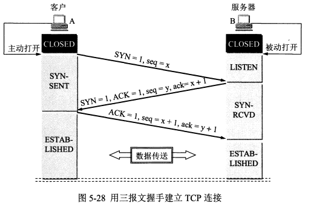

- 第一次握手：客户端发送连接请求，置SYN=1，ACK=0，不携带数据但消耗一个序号。此时，客户端进入同步已发送阶段。
- 第二次握手：服务端接收请求，发送确认报文段，置SYN=1，ACK=1，ack=x+1，不携带数据但消耗一个序号。此时，服务端进入同步已收到状态。
- 第三次握手：客户端收到服务端的确认后，发送确认报文段，置ACK=1，ack=y+1。此时，客户端进入连接建立阶段，服务端在收到确认后也进入连接建立阶段。

为什么要进行第三次握手：A向B发送连接请求报文段，但在某个结点长时间滞留。A重传成功并建立TCP连接，传输数据，最后释放连接。这之后，滞留的连接请求到达B，B发出连接确认，但A显然不会理睬，而B却要等待一段时间，从而造成资源的浪费。而三次握手使得B收不到确认，自然就知道A没有同意连接。

四次挥手：

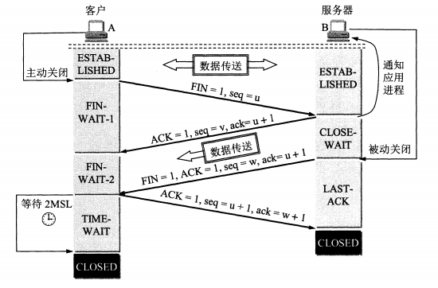

- 第一次挥手：客户端主动关闭，发送释放连接报文段，置FIN=1，进入终止等待1状态
- 第二次挥手：服务端收到释放连接报文段，通知应用进程，发送确认报文段，置ACK=1。此时，TCP连接半关闭，客户端不能向服务端发送数据，但是服务端还可以向客户端发送数据，服务端进入关闭等待状态
- 第三次挥手：服务端发送数据完毕，向客户端发送释放连接报文段，置FIN=1，确认号等于第二次挥手的确认号。此时，服务端进入最后确认阶段
- 第四次挥手：客户端收到释放连接报文段，发送确认报文段，等待2MSL后彻底关闭。服务端收到确认后彻底关闭。

为什么要等待2MSL：最后一个确认可能会丢失，此时就要重传；等待2MSL后就可以使本连接过程中发送的所有报文从网络中消失，从而使新的报文段中不会出现旧的报文段。

保活计时器：如果经过若干时间TCP某一端没有响应，就应该关闭连接并释放资源

## 应用层

应用层的功能：通过不同主机之间进程的通信完成特定的功能

客户服务器模式：客户是服务请求方，服务器是服务提供者

### 域名系统DNS

DNS产生的背景：IP地址便于计算机处理，但是记忆困难

DNS服务器：访问某个站点时，应用进程首先访问DNS服务器，将域名放到UDP请求报文中，发送给DNS服务器。DNS服务器查找域名对应的IP地址，并放入回答报文中。应用进程获得站点的IP地址后，就可以进行网络通信。将域名转换为IP地址的过程称为域名解析。

域：名字空间中一个可被管理的划分

域名：

- 任何一个连接在互联网上的主机或路由器，都有一个唯一的层级结构，称为域名

- 顶级域名、二级域名、三级域名
- 域名由标号和小数点组成，每个标号不超过63个字符，不区分大小写，完整域名不超过255个字符
- 国家顶级域名、通用顶级域名、基础结构域名（只有一个，反向域名）
- 域名只是一个逻辑概念，并不代表计算机所在的物理地点

域名树：根节点没有名称，根节点的子节点是顶级域名，顶级域名的子节点是二级域名，二级域名的子节点是三级域名，以此类推。

区与域：域是划分域名层级结构的逻辑概念，区是DNS服务器实际管理的范围。每个区设置权限域名服务器，存储域名到IP地址的映射。区可能小于或等于域，但一定不能大于域。

域名服务器：

- 根域名服务器：13个IP地址，有很多镜像站点，采用任播技术使得每个DNS客户都能查找到最近的根域名服务器
- 顶级域名服务器：
- 权限域名服务器：负责一个区的域名管理
- 根域名服务器、顶级域名服务器、权限域名服务器构成域名服务器树（森林）结构
- 本地域名服务器：并不属于域名服务器树（森林）结构，又称为默认域名服务器。本地DNS距离用户很近，可以先访问本地DNS，然后再访问域名服务器树。
- 主域名服务器和辅助域名服务器：辅助域名服务器作为主域名服务器的备份，定期拷贝数据，如果主域名服务器故障，辅助域名服务器立刻可以工作。

域名解析过程：

- 递归查询：主机进程访问某个站点时，先访问本地DNS，本地DNS再访问其他DNS。其他DNS把响应发送给本地DNS，本地DNS再把响应发送给主机进程。
- 迭代查询：本地DNS首先访问根DNS，根DNS指出下一步查询哪个顶级DNS；本地DNS访问顶级DNS，顶级DNS指出下一步访问哪个权限DNS；本地DNS访问权限DNS，权限DNS返回IP地址。
- DNS服务器中广泛采用高速缓存，以便减轻顶级DNS、顶级DNS的访问压力。

### 文件传送协议

文件传送协议：普遍使用的文件传送协议，提供交互式的访问，允许指定文件类型与格式，支持文件存取权限。屏蔽计算机系统细节，适合异构网络中任意计算机文件的传输。存取文件必须先获得副本，再将修改过的副本传回原节点。

文件随机访问协议：允许多个程序对文件进行存取，直接由操作系统对远地文件进行存取，提供共享文件的透明存取，属于文件随机访问协议的有NFS

文件共享协议：文件传送协议和文件随机访问协议统称为文件共享协议

FTP服务器的工作过程：

- 主进程：打开端口21并进行监听，接受客户连接请求，启动从属进程，继续回到等待状态
- 从属进程：处理每一个客户请求，并发送响应。从属进程一般包含两个TCP连接，分别是控制连接和数据连接，控制连接用于传送控制命令，数据连接用于实际传送数据，数据传送完毕后关闭。

简单文件传送协议TFTP：C/S架构，使用UDP数据报，不支持交互，不支持LIST命令，不支持身份鉴别

网络文件系统NFS：允许应用进程打开一个远地文件，随机读写数据，不进行完整文件的拷贝，只复制文件的部分，网络只传送少量的数据。

### 远程终端协议

TELNET：将本地计算机的击键传送到远程计算机，并将远程计算机的输出传回到本地计算机，就好像键盘和显示器连接在远程计算机上一样。目前，TELNET协议已经不使用了。

### 万维网WWW

统一资源定位符：`<protocol>://<host>:<port>/<path>`

超文本传输协议HTTP：

- 面向事务的应用层协议
- 工作过程：建立TCP连接，发送HTTP请求，接收HTTP响应，释放连接
- 使用面向连接的TCP作为传输层协议
- HTTP协议本身是无连接的
- HTTP协议是无状态的
- HTTP协议是面向文本的
- 非持续连接（短连接）：HTTP从建立TCP连接到接收到HTTP响应需要2倍RTT时间，分别用来建立TCP连接和发送HTTP请求。由于HTTP协议是无连接的，所以接收完HTTP响应后，立即释放连接，这样做造成资源的浪费
- 持续连接（长连接）：HTTP1.1对此进行改进，接收完HTTP响应后并不立即释放连接。持续连接有两种工作方式，分别为非流水线方式和流水线方式。非流水方式中在接收到HTTP响应之前不发送新的HTTP请求，流水线方式中不等到接收到HTTP响应就立即发送新的HTTP请求，这样能够更好的利用TCP连接资源。

代理服务器：又称为万维网高速缓存，把最近的请求和响应暂存下来，当新请求到达的时候，如果发现代理服务器中有匹配项，直接把缓存的响应发送给用户。使用代理服务器能够减轻公共网络的通信量，使得网络通信局限于本地网络中

HTTP报文结构：

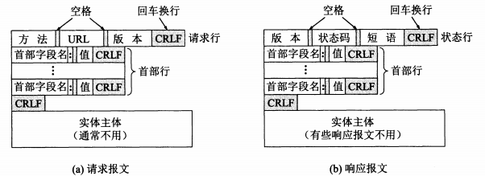

HTTP请求报文和响应报文结构主要分为三部分：

- 开始行：请求报文中的开始行叫做请求行，响应报文中的开始行叫做状态行，CRLF表示回车换行
- 首部行：描述浏览器、服务器、报文特性每一个首部行都由键值对、冒号、空格、CRLF组成
- 实体主体：

HTTP请求方法：

| 方法（操作） | 意义                          |
| ------------ | ----------------------------- |
| OPTION       | 请求一些选项的信息            |
| GET          | 请求读取由URL所标志的信息     |
| HEAD         | 请求读取由URL所标志信息的首部 |
| POST         | 给服务器添加信息、数据        |
| PUT          | 在指明的URL下存储一个文档     |
| DELETE       | 删除指明的URL所标志的资源     |
| TRACE        | 用来进行环回测试的报文        |
| CONNECT      | 用于代理服务器                |

HTTP状态码：

- 1xx：表示通知信息，请求收到了或正在进行处理
- 2xx：表示成功，如接受或知道了
- 3xx：表示重定向，如要完成请求还要采取进一步的行动
- 4xx：表示客户端的差错，如请求中有错误的语法或者不能完成
- 5xx：表示服务器的差错，如服务器失效无法完成请求

Cookie的使用：用户A向服务器B发送HTTP请求时，B随机生成一个唯一的标识符，并以此为索引在后端数据库中创建一个项目，并把在响应报文的首部中添加一个键值对，键名是”Set-cookie“，值是那个唯一的标识符。A在收到响应之后，将这个唯一的标识符写入Cookie文件中。下一次A向B发出请求时，就在请求的首部中添加键值对，键名是”Cookie“，值是那个唯一的标识符。这样，服务器就能进行会话的跟踪。

### 电子邮件

几个重要的标准：简单邮件传送协议SMTP、互联网文本报文格式、通用互联网邮件扩充MIME

电子邮件系统三个组成构件：用户代理、邮件服务器、邮件发送和读取协议

常见的邮件发送协议是SMTP协议，常见的邮件读取协议是POP3协议

用户代理UA：用户与电子邮件系统的接口，通常是运行在用户计算机中的一个程序，因此用户代理又称为电子邮件客户端软件。用户代理至少应该具有四个功能，撰写、显示、处理、通信

电子邮件工作过程：

- 发件人调用计算机中的用户代理编写邮件并点击发送
- 用户代理作为SMTP客户端，发送方邮件服务器作为SMTP服务端。用户代理使用SMTP协议将邮件发送给发送方邮件服务器
- 发送方邮件服务器将邮件存放在邮件缓存队列中，等待发送到接收方的邮件服务器
- 发送方邮件服务器作为SMTP客户端，接收方邮件服务器作为SMTP服务端。发送方将邮件发送到接收方。
- 接收方收到邮件后放入收件箱中，等待收件人进行读取
- 收件人收件时使用POP3协议，其中收件人用户代理是POP3客户端，接收方邮件服务器是POP3服务端。收件人向接收方邮件服务器发送收件请求，接收方邮件服务器将邮件传送给收件人用户代理

SMTP协议：

（1）连接建立：

- 客户端定时扫描邮件缓存，如果发现有邮件，客户端使用端口25与服务端建立TCP连接。

- 接收方：`220 Service ready`

- 发送方：`HELO  发送方主机名`

- 接收方：`250 OK` 或者 `421 Service not available`

- 不使用中间邮件服务器

（2）邮件传送

- 发送方：`MAIL FROM: <haotingsile@163.com>`
- 接收方：`250 OK` 或者错误代码
- 发送方：`RCPT TO: <zhangsan@163.com>`
- 接收方：`250 OK`或者`550 No such user here`
- 发送方：`DATA`
- 接收方：`354 Start mail input;end with<CRLF>.<CRLF>`或者错误代码
- 发送方：数据+`<CRLF>.<CRLF>`
- 接收方：`250 OK` 或者错误代码

（3）连接释放

- 发送方：`QUIT`
- 接收方：`221`

电子邮件的信息格式：信封、内容；内容中又分为首部、主体；首部分为To、Subject、Cc（抄送）、Bcc（暗送）、From、Date、Reply-To

POP3协议：

MIME：

- 主要包括三部分内容：新的首部字段、多媒体支持、传送编码
- 新的首部字段：MIME版本、内容描述、邮件ID、内容传送编码、内容类型
- 内容传送编码：ASCII、quoted-printable（使用十六进制字符串，再通过等号转义）、base64
- 内容类型：两部分——内容类型和子类型

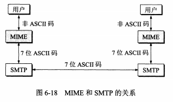

### 动态主机配置协议DHCP

需要IP地址的主机向DHCP服务器广播发送发现报文，源地址置为全零，目的地址位置全1，主机成为DHCP客户。

DHCP服务器在数据库中查找主机配置信息，如果查找成功返回之；否则，从IP地址池中分配一个地址给主机。DHCP的回答报文叫做提供报文。

为了减少DHCP服务器的数量，可以设置DHCP中继代理，将主机发送的广播报文转换为单播报文传送到DHCP服务器，再将结果转呈给主机

DHCP协议分配的地址是临时的，可以由DHCP服务器设置租用期

DHCP客户端使用UDP端口68，DHCP服务器使用UDP端口67

### Socket编程

TCP编程模式：

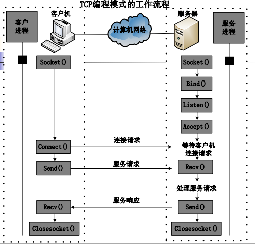

套接字的类型：流式套接字、数据报套接字、原始套接字
